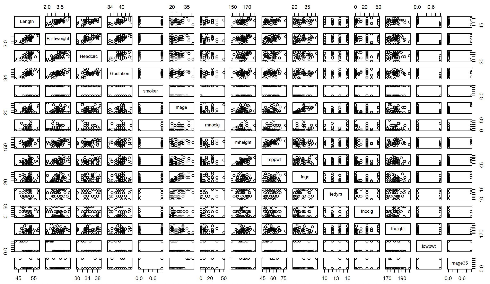
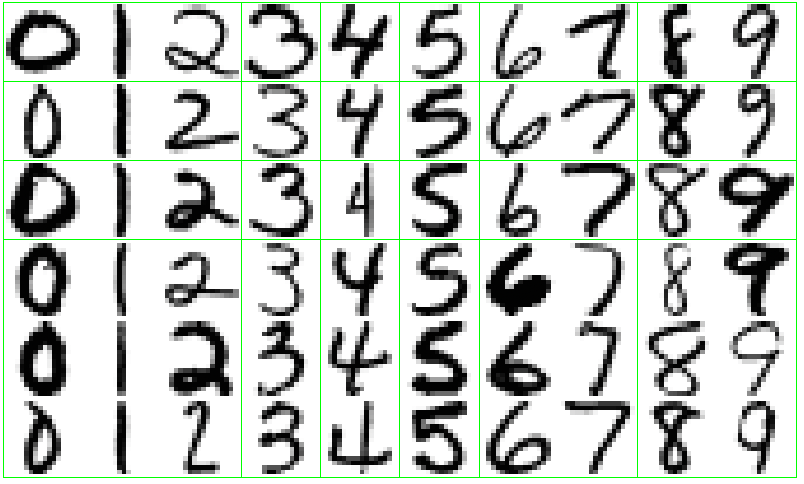
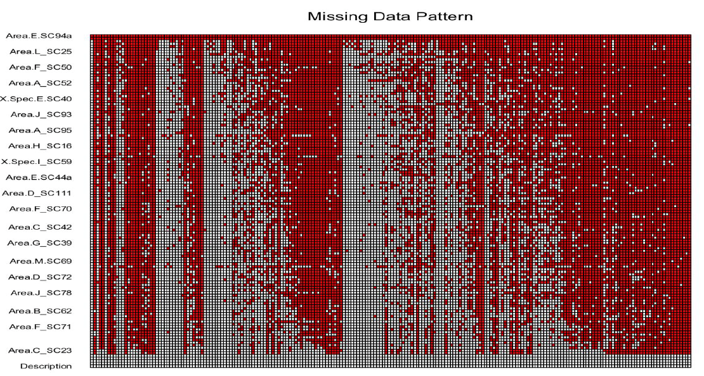
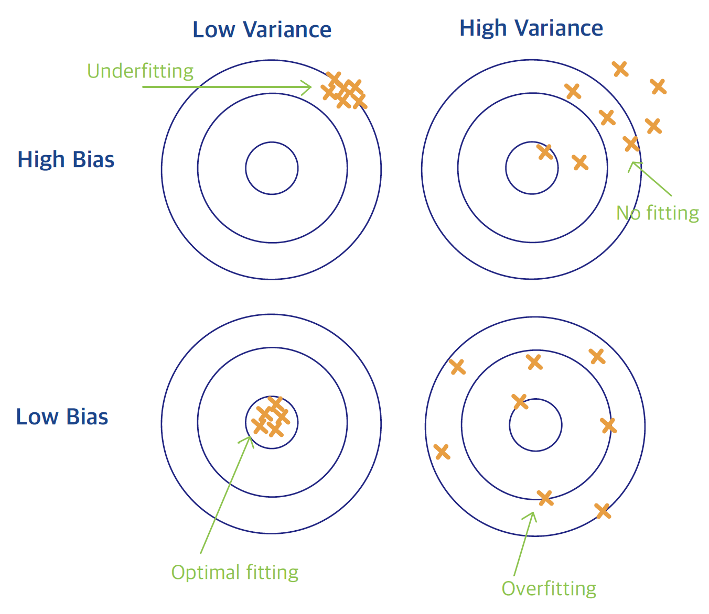
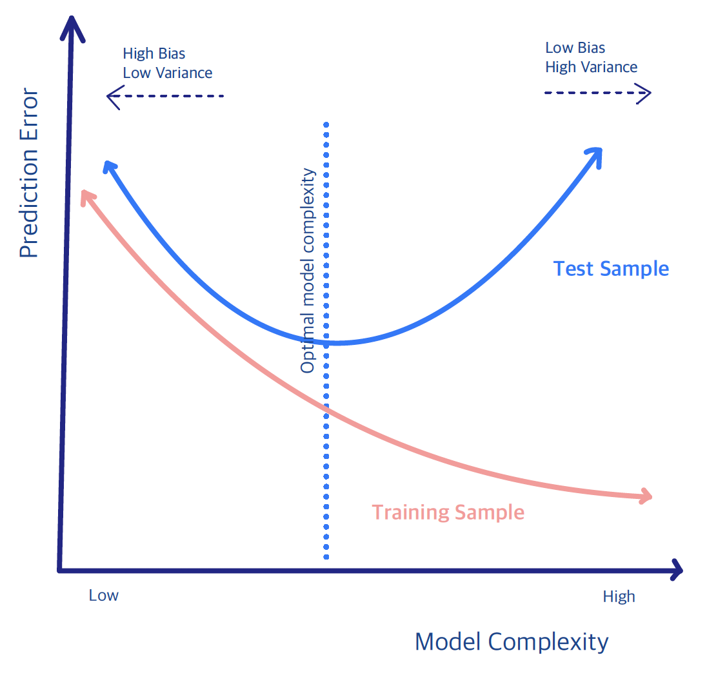
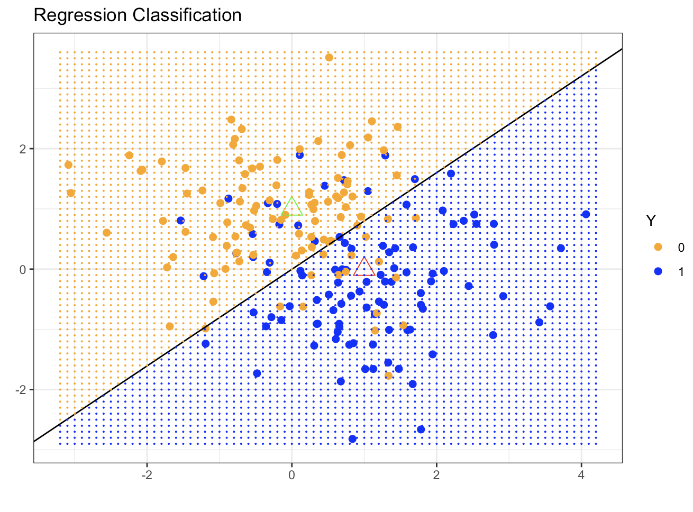
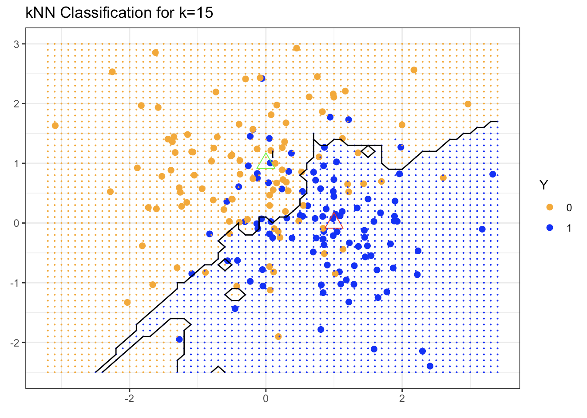
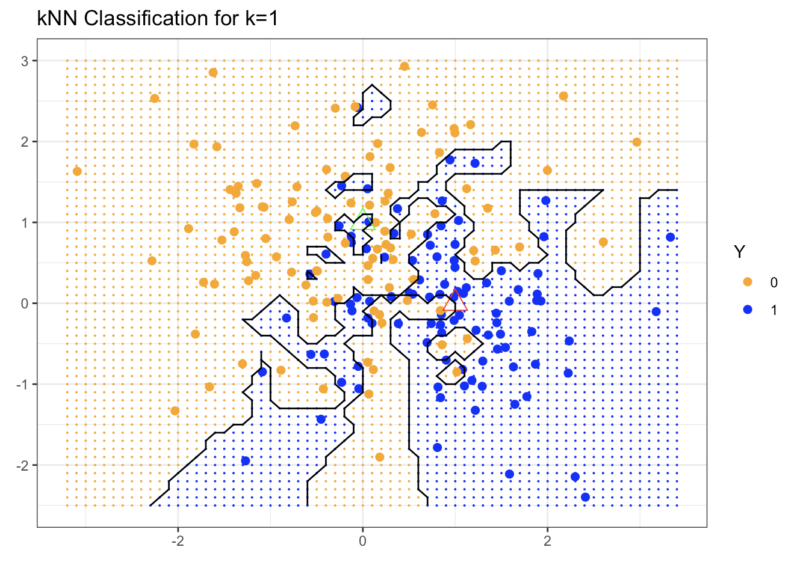
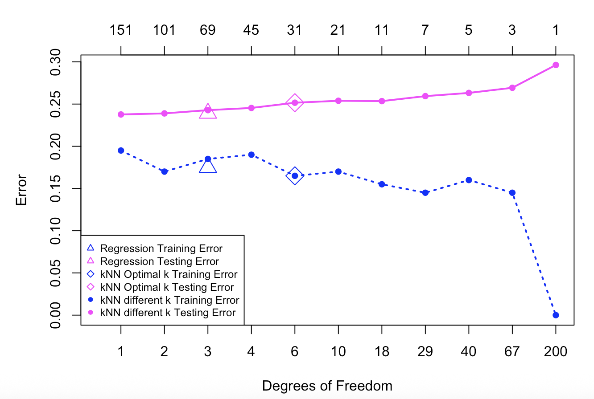

# Introduction to Statistical Learning


```{r, echo=FALSE}
knitr::opts_chunk$set(tidy=TRUE, tidy.opts=list(width.cutoff=60))
```


**Statistical Learning** is a field at the intersection of statistics, computer science, and data science that focuses on developing and understanding models that can _learn_ from data. While statistics has long dealt with model building, validation, and prediction, the dramatic growth in the volume, complexity, and dimensionality of data has strained many classical techniques. The introduction of sophisticated algorithms, data-management tools, and optimization methods from computer science has enabled more powerful approaches suited to modern data regimes.


In the supervised setting, learning from data typically means that, given an outcome (quantitative or categorical) and a (usually large) set of features, we construct a **prediction model** (also called a *learner*) that can accurately forecast the outcome for new, previously unseen observations.


&nbsp;

We can separate statistical learning problems in [_two types_]{.underline}:

- **Supervised Learning**: when an outcome variable is present to guide the learning process. The two primary examples are:
  - _Regression_: Response is quantitative (continuous or discrete numeric).
  - _Classification_: Response is categorical (binary or multi-class). 

- **Unsupervised Learning**:when an outcome variable is not present to guide the learning process. The goal is to discover latent structure or patterns in the data (e.g., clustering, association rules, hidden Markov models, etc.).


## Examples of Statistical Learning Problems

<p class="section-title"> Birthweight Data: A Regression Example </p>


This dataset comes from a study whose goal is to predict the birth weight of a newborn from a collection of baby and parental characteristics (gestation length, length, head circumference, mother’s and father’s height, mother’s weight, parental smoking status, etc.). The study focuses particularly on babies born prematurely (before 40 weeks of gestation).

The scatterplot matrix below shows the pairwise relationships among the variables in the dataset:

```{r ,echo=FALSE, message=FALSE, warning=FALSE, fig.align="center", out.width="100%"}

```

Note that three of the predictors (`smoker`, `lowbwt`, and `mage35`) are categorical.

This is a classic example of a supervised regression problem and a natural setting in which a multiple linear regression (MLR) model can be considered. If the MLR model fits well and the key assumptions are reasonably satisfied, it can provide useful predictions of birth weight for new observations.

&nbsp;


<p class="section-title"> Trees and Shrubs Data: A Binary Classification Example </p>

In this problem, the goal is to predict whether a woody plant common in the Black Forest region of southwestern Germany is a tree or a shrub (Lederer). A sample of the data is shown below:

```{r, echo = FALSE }
Name <- c('Silver Fir', 'European Beech', 'Common Hazel', 'Red Raspberry', 'European Spruce')
Height <- c(55.0, 40.0, 5.0, 1.5, 50.0)
Diameter <- c(1.50, 1.00, 0.10, 0.01, 1.20)
GrowthRate <- c(0.5, 0.5, 0.5, 0.4, 0.5)
Longevity <- c(500, 200, 70, 10, 600)
Type <- c('Tree', 'Tree', 'Shrub', 'Shrub', 'Tree')   # added response
TreesShrubs <- data.frame(Name, Height, Diameter, GrowthRate, Longevity, Type)
knitr::kable(TreesShrubs)
```


This is a binary classification problem in which we want to use  a set of characteristics to predict the class label (tree or shrub).


&nbsp;


<p class="section-title">  Handwritten Digits: A Multiclass Classification Example </p>

This is a classic multiclass classification problem in which the goal is to predict the handwritten digit $(0, \ldots, 9)$ appearing on a postal envelope, based on a 16 $\times$ 16 eight-bit grayscale image (ESL). The practical challenge is to keep the error rate sufficiently low so that mail is not misdirected.


```{r ,echo=FALSE, message=FALSE, warning=FALSE, fig.align="center", out.width="75%"}
 
```


&nbsp;


<p class="section-title">  Proteomics Data: A Clustering Example  </p>


Proteomics is the large-scale study of proteins. Data of this type are typically generated through laboratory processes such as protein purification or mass spectrometry (a technique that measures the mass-to-charge ratio of ions).

The figure below shows an expression matrix for 437 proteins, of which only 101 are of primary interest (Romanova et al.). A common challenge with such data is the large amount of missing values (shown as grey pixels). The goal is to cluster the proteins into coherent groups for further biological analysis.

```{r ,echo=FALSE, message=FALSE, warning=FALSE, fig.align="center", out.width="85%"}

```


&nbsp;

These examples illustrate the variety of problems that arise in statistical learning. The birthweight data is a typical supervised regression problem in which we aim to predict a quantitative outcome. The trees-and-shrubs data is a binary classification task, while the handwritten-digit data is a multiclass classification problem. Finally, the proteomics data is an unsupervised learning example whose goal is to uncover latent structure through clustering. Together they show how statistical learning methods can be applied across different types of outcomes and data structures, whether the aim is _prediction_ or the _discovery of patterns_.


## Supervised Learning Framework

In this class, our main focus is **supervised learning**. This means that we observe **target** (_outcome_, _response_) variable $Y$ that we wish to <font color="darkblue">predict</font> using a set of *features* (_predictors_), $X$. We assume that the relationship between the response $Y$ and the features is given by a  function $f$ that is known up to a parameter vector $w$:
<font color="darkblue">
\[\mathbf{Y} = f(\mathbf{X}, w) + varepsilon \]
</font>
When $f$ is fully known except for the value of $w$ (for example when $f$ is linear), then learning problem reduces to **estimating** $w$. To do so, we collect a **training sample** $\bigl\{\mathbf{x}_i, \mathbf{y}_i  \bigr\}_{i=1}^{n}$  and minimize an **objective** function_with respect to $w$:
<font color="darkblue">
\[F(w) = \sum_{i=1}^{n} loss \Bigl(y_i,\, f \bigl(\mathbf{x}_i, w \bigr) \Bigr)\]
</font>
The **loss** function measures the discrepancy between the model prediction $f(\mathbf{x}_i, w)$ and the observed outcome $\mathbf{y}_i$.  The choice of loss is made by the practitioner; the most common examples are:

- **Squared Error Loss**
<font color="darkblue">
\[\text{loss} = \Bigl[ y_i - f\bigl(x_i; w \bigr)\Bigr]^2\]
</font>

- **Absolute Error Loss**
<font color="darkblue">
\[\text{loss} = \Bigl| y_i - f\bigl(x_i; w \bigr)\Bigr|\]
</font>

- **Log  Loss** (binary classification)
<font color="darkblue">
\[\text{loss} = -y_i \log f(x_i; w) - (1-y_i)\log\bigl(1 - f(x_i; w)\bigr) \]
</font>

- **0-1 Loss**
<font color="darkblue">
\[\text{loss} =\mathbf{1}_{\{y_i \neq \hat{y}_i\}}
\quad\text{where}\quad
\hat{y}_i = f(x_i; w) \]
</font>


Depending on the chosen loss, the minimizer of $F(w)$ may or may not admit a closed-form expression. When a closed form is unavailable we resort to numerical optimization algorithms. In many cases gradient-based methods (in particular gradient descent and its variants) can be used to obtain a good solution.

&nbsp;

## Why Statistical Learning is Challenging

In the framework of the previous section we reduced the learning problem to the estimation of a parameter vector $w$, under the assumption that the true function $f$ is known up to this parameter. In practice, however, we rarely know the exact form of $f$. We must therefore _approximate_ it by some function $\hat{f}$. This approximation introduces an _additional source of error_.

Moreover, the objective function we minimize is computed on a *training* sample. While this quantifies how well the model fits the observed data, the real goal of statistical learning is good performance on **new**, **unseen** data. In other words, we aim to minimize the **test error** (also called generalization error), not the training error.


_Statistical learning is therefore challenging for several reasons_:

- The training error typically underestimates the test/generalization error.

- A model may perform well on the training data yet poorly on future data because of overfitting.
The number of parameters required to approximate $f$ can be large—sometimes larger than the number of available observations.

- As the number of model parameters grows, the test error often increases substantially.

&nbsp;

Two simple illustrations make these points concrete:

1. **Classification: 1-Nearest Neighbour**  
   The one-nearest-neighbour classifier achieves zero training error (it predicts every training point perfectly) but typically performs poorly on test data. An instructive demonstration of how increasing dimensionality affects the performance of linear classifiers can be found [here](https://www.visiondummy.com/2014/04/curse-dimensionality-affect-classification/).

2. **Regression: the $p$ versus $n$ problem**  
   Consider the linear model
   \[
   \mathbf{y}_{n\times 1} = \mathbf{X}_{n\times p}\mathbf{w}_{p\times 1} + \varepsilon,
   \]
   where $\mathbf{y}$ is the response vector, $\mathbf{X}$ is the design matrix with $p$ predictors, and $\mathbf{w}$ contains the coefficients to be estimated.

   - When $p < n$ we have more equations than parameters; classical regression methods usually work well.
   - When $p = n$ we have exactly as many equations as parameters and can achieve a perfect fit on the training data.
   - When $p > n$ we have fewer equations than parameters. In this high-dimensional regime classical methods break down and specialized techniques are required.


&nbsp;

In summary, statistical learning is challenging because we must approximate an unknown function $f$, control the gap between training and test error, and often operate in regimes where the number of parameters is large relative to the sample size. Successfully addressing these issues is essential for building models that generalize well to new data.


## Bias-Variance Trade-Off

We have already noted that _two sources of error_ affect the quality of our predictions. In statistical learning we must balance:

- **Bias**: the systematic difference between the average of our estimated function $\hat{f}$ and the true underlying function $f$. High bias typically leads to under-fitting and an inaccurate model.
- **Variance**: the amount by which $\hat{f}$ would change if we estimated it using a different training sample. High variance typically leads to over-fitting and an unreliable model.


A helpful analogy is to think of the learning problem as a **target** whose _center represents the true model_.


```{r, echo=FALSE, message=FALSE, warning=FALSE, fig.align="center", out.width="60%"}

```


How close the fitted values lie to the center is measured by bias. If the points systematically miss the center, the model is a poor approximation of $f$. Increasing the sample size will not correct a large bias.
The spread of the fitted values around their average is measured by variance. When the points are tightly clustered the variance is low; when they are widely scattered the variance is high.

Ideally we would like to reduce both bias and variance simultaneously. In practice this is not possible, so we must trade one against the other. Remembering that our ultimate goal is to minimize the generalization (test) error, not the training error, we observe the following typical behavior:

```{r ,echo=FALSE, message=FALSE, warning=FALSE, fig.align="center", out.width="50%"}

```

- When the model is highly complex (many parameters), the training error tends to decrease. However, the model often over-fits the training data and therefore exhibits high variance on new data, resulting in poor generalization.

- When the model is very simple (few parameters), it tends to under-fit the data. This produces large bias and, again, poor generalization performance.


&nbsp;


In this class we will discuss:

(i)  flexible modeling techniques that help reduce bias, and

(ii) practical strategies for achieving a good bias-variance trade-off.

&nbsp;

Two important approaches that we will study in detail are:

-  **Regularization**: constrain the parameters to a lower-dimensional space that is determined adaptively by the data.

- **Ensemble**: average many low-bias, high-variance models; the averaging step reduces variance while largely preserving the low bias.


## Two Toy Examples: $k$-NN vs. Linear Regression

Before we conclude this introductory chapter, we examine two simple supervised learning methods:

(i) $k$-Nearest Neighbors ($k$-NN)  
(ii) Linear regression

We will compare their behavior on simple examples and use them to illustrate the bias-variance trade-off.


&nbsp;


### $k$-Nearest Neighbors

In the **$k$-nearest neighbors** ($k$-NN) method we predict the response at a point $\mathbf{x}$ by using the $k$ training observations that are closest to $\mathbf{x}$. The $k$-NN fit is

<font color="darkblue">
\[\hat{\mathbf{y}}(\mathbf{x}) = \frac{1}{k} \sum_{x_i \in N_k(\mathbf{x})} y_i\]
</font>
where $N_k(\mathbf{x})$ denotes the neighborhood of $\mathbf{x}$ consisting of the $k$ nearest training points.  

- In **regression**, $\hat{y}(\mathbf{x})$ is a local average of the neighboring responses.  
- In **classification**, $\hat{y}(\mathbf{x})$ is the majority class (or the class probability) within the neighborhood.

Two practical challenges that arise are choosing the neighborhood size $k$ and choosing the distance metric that defines the neighborhood.

The value of $k$ directly controls model complexity, which is roughly proportional to $n/k$.  

- When $k=1$ the prediction at each training point $x_i$ is exactly $y_i$, yielding zero training error.  
- When $k=n$ every neighborhood contains the entire training sample, so the prediction is constant for all $\mathbf{x}$.

The "default" metric is Euclidean distance

<font color="darkblue">
\[d\bigl( \mathbf{x}, \tilde{\mathbf{x}} \bigr) = \sum_{j=1}^{p} w_j \bigl( x_j - \tilde{x}_j \bigr)^2,\]
</font>
where the weights $w_j$ may be learned from the data.

&nbsp;


### Linear Regression

Given an input vector $\mathbf{x}^\top = (x_1,\dots,x_p)$, we approximate the response by a linear function

<font color="darkblue">
\[f(\mathbf{x}) \approx \beta_0 + \sum_{j=1}^{p} x_j \beta_j\]
</font>

The coefficients $\beta_j$ are estimated by ordinary least squares (OLS), i.e., by minimizing the residual sum of squares (_objective function_)

<font color="darkblue">
\[\min_{\beta_0, \ldots, \beta_p} \sum_{i=1}^{n} \Bigl( y_i - \beta_0 - x_{i1}\beta_1 - \ldots - x_{ip} \beta_p \Bigr)^2\]
</font>

Under standard conditions the solution has a closed form, and the fitted value at the $i$-th observation is

<font color="darkblue">
\[\hat{y}_i = \hat{y}(x_i) = x_i^T \hat{\beta}\]
</font>

We postpone the algebraic details until Week 2.

#### Linear Regression in a Classification Setting {-}

Linear regression can also be applied to binary classification problems in which $Y\in\{0,1\}$. One simply predicts `class 1` when the fitted value $\hat{f}(\mathbf{x})$ exceeds 0.5 and `class 0` otherwise.  

This approach has well-known drawbacks: the squared-error loss is not a natural measure for binary outcomes, and a linear function can produce fitted values outside the interval $[0,1]$. For these reasons logistic regression is the preferred linear method for classification. It models the log-odds

\[\log \frac{p(\mathbf{x})}{1-p(\mathbf{x}) } \approx \beta_0 + \sum_{j=1}^{p} x_j \beta_j\]


We will return to logistic regression in Week 8.


&nbsp;


### A Simulated (Binary) Classification Example

Consider a response variable $G$ that takes two values (0 = BLUE or 1 = ORANGE). We generate 200 observations (100 in each class) and compare linear regression and $k$-nearest neighbors **as classifiers**. 

The code used to produce the simulation and all figures is available in <a href="./code/ch1_RCode.html" target="_blank">R</a> and  <a href="./code/ch1_PythonCode.html" target="_blank">Python</a>.


#### Linear Regression Classifier {-}

We first fit a linear regression model, treating the binary response as if it were continuous. The continuous fitted values $\hat{Y}$ are then converted to class predictions $\hat{G}$ by the simple rule
\[\hat{G} = \begin{cases}
& Blue, \text{ if } \hat{Y} > 0.5\\
& Orange, \text{ otherwise } \\
\end{cases} \]

Because the problem is two-dimensional, the decision boundary is a _straight line_.
 

```{r ,echo=FALSE, message=FALSE, warning=FALSE, fig.align="center", out.width="70%"}

```

 The fitted boundary (black line in the figure below) is the set of points satisfying $\mathbf{x}^\top\hat{\beta} = 0.5$. In the simulation the true blue region lies above this line and the orange region below it. Many points on both sides of the boundary are nevertheless misclassified. The linear decision boundary is smooth but rigid; it cannot adapt to local structure in the data.

#### $k$-Nearest-Neighbor Classifier {-}

We now apply $k$-nearest neighbors to the same data. Using $k=15$, $\hat{Y}(\mathbf{x})$ is the proportion of blue observations among the 15 nearest neighbors of $\mathbf{x}$. Class labels are again assigned by the 0.5 threshold:

\[\hat{G} = \begin{cases}
& Blue, \text{ if } \hat{Y} > 0.5\\
& Orange,\text{ otherwise } \\
\end{cases} \]
(The prediction is therefore a majority vote among the 15 neighbors.)

```{r ,echo=FALSE, message=FALSE, warning=FALSE, fig.align="center", out.width="70%"}

```

The resulting decision boundary is far more irregular and follows local clusters of blue and orange points. Consequently the number of misclassifications on the training data is smaller than with linear regression.
If we take the extreme case $k=1$, each point is classified by its single nearest neighbor:


```{r ,echo=FALSE, message=FALSE, warning=FALSE, fig.align="center", out.width="70%"}

```

The boundary becomes extremely rough and the training misclassification rate drops nearly to zero. Whether this is desirable, however, can be judged only by examining the _generalization error_.

#### Training versus Test Error {-}

Up to this point we have evaluated both methods on the same data that were used to fit them. A method such as 1-NN therefore appears to have zero error. Fair comparison requires an independent test set. The figure below shows misclassification error on a test set of 10,000 observations as a function of model degrees of freedom. Several $k$-NN fits (varying $k$) are compared with the linear regression fit.


```{r ,echo=FALSE, message=FALSE, warning=FALSE, fig.align="center", out.width="70%"}

```

The magenta curve is the test error and the blue curve is the training error of $k$-NN. A 5-fold cross-validation procedure selected the optimal $k$ (marked by a diamond). Linear regression results appear as the magenta and blue triangles at 3 degrees of freedom (the dimension of the fitted linear model).
Linear regression has only a few parameters and therefore relatively low variance, but the linearity assumption is restrictive for this problem and produces high bias.

In contrast, $k$-NN makes almost no assumption about the shape of the decision boundary (apart from a mild local-smoothness condition). This flexibility yields low bias but high variance; the extreme case $k=1$ corresponds to roughly $n$ parameters and severely overfits. It can be shown that $k$-NN is consistent when $k,n\to\infty$ with $k/n\to 0$. The price of that consistency is the high variance that appears when the effective number of parameters becomes large.

