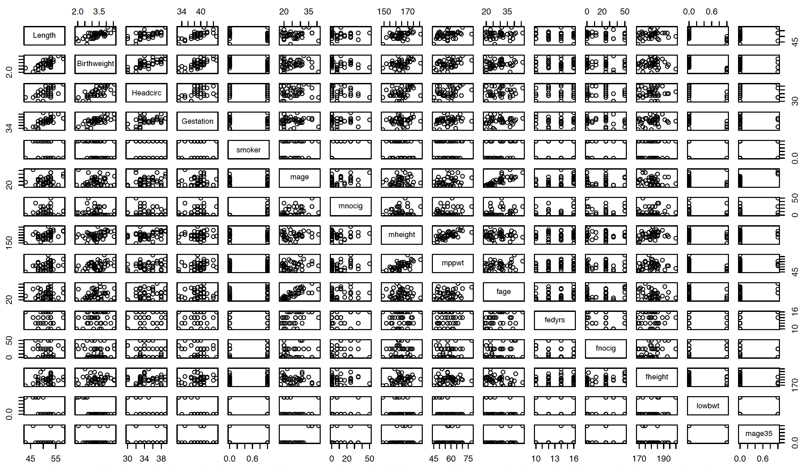
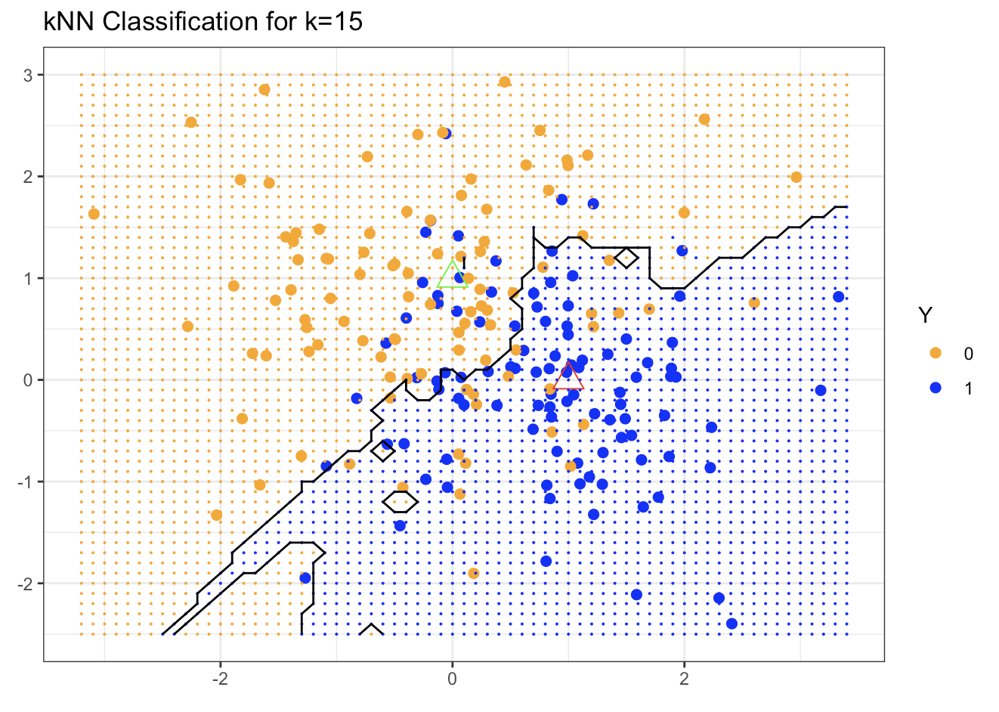
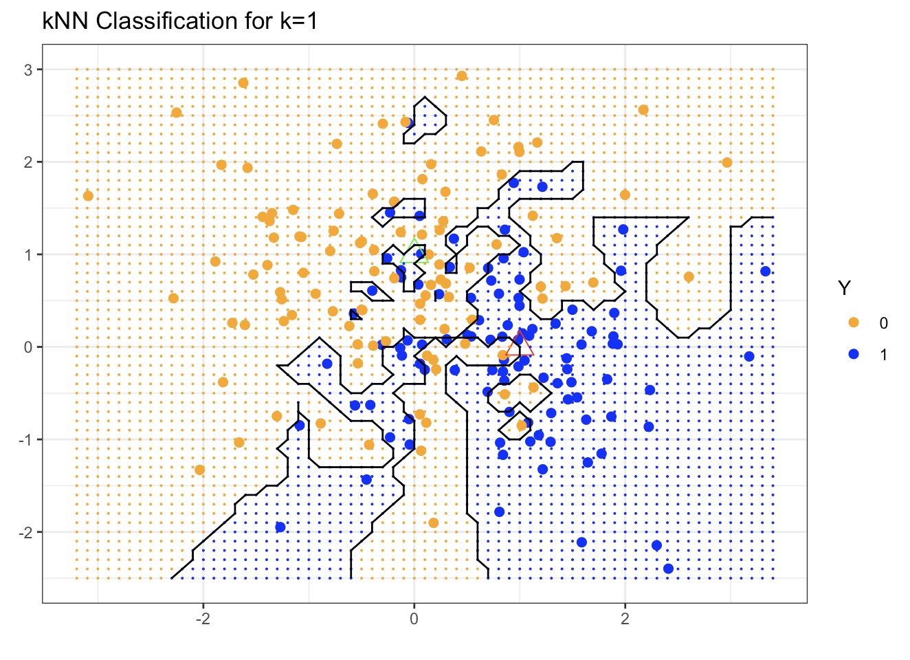

# Introduction to Statistical Learning

Statistical Learning is a realm in statistics, computer science, and data science focused on developing and understanding models that can _learn_ from the data. While Statistics  has long been dealing with model building, model validation, and prediction across a wide range of applications, the fairly recent increase in the volume, complexity and multidimensional nature of data has challenged traditional statistical techniques.

To this end, the introduction of sophisticated computer science algorithms,  data management tools and optimization techniques has enabled  us to design more powerful methods that are suited to handle  the ever expanding nature of modern data.

<br>
```{r, echo=FALSE}
knitr::opts_chunk$set(tidy=TRUE, tidy.opts=list(width.cutoff=60))
```

Typically, _learning from data_ means that given an  **outcome/measurement** variable that may be quantitative or categorical, we are interested in making **predictions** based on a  (typically large) set of features. More specifically, a   _learner_ or **prediction model** enables us to predict the outcome for **new unseen** objects.

<br>

We can separate statistical learning problems in two types:

* **Supervised Learning**: when an outcome variable is present to guide the learning process. Examples of supervised learning are:
  * _Regression_: Response is quantitative, i.e. a _number._
  * _Classification_: Response is qualitative, i.e. categorical, discrete, or a factor --  a _label_ (binary or multi-class).
<br>

* **Unsupervised Learning**: when an outcome variable is not present to guide the learning process. In this case, our goal is to identify latent structures in the data, e.g. clustering, association rules, HMM, etc.

<br>

## Examples of Statistical Learning Problems

####  <font color="darkblue"> Birthweight Data (Regression) </font>{-}


This is an example in which the researchers are interested in predicting the weight of a newborn based on a set of baby and parent characteristics, such as gestation period, length, head circumferance, mother's and father's height, mother's weight, parents' smoking habits, etc. The study particularly focuses on babies born prematurely, i.e. before 40 weeks of gestation.

The scatterplots below illustrate the pairwise relationship of each variable with the other variables in the data set:


```{r ,echo=FALSE, message=FALSE, warning=FALSE, fig.align="center", out.width="100%"}

```

Note in the plots that three of the predictors, `smoker`, `lowbwt`, and `mage35` are categorical.

This is a typical example where a multiple linear regression model is a good starting point. If the fit of the model is good and all key model assumptions are satisfied, then the predictive power of this model will be strong.

<br>


####  <font color="darkblue"> Trees and Shrubs Data (Binary Classification) </font> {-}

In this problem, the goal is to understand whether a specific woody plan, common in the Black Forest region in Southwestern Germany (Ref: Lederer) is a tree or a shrub. A sample of the data set is shown below:

```{r, echo = FALSE }
Name <- c('Silver Fir', 'European Beech', 'Common Hazel', 'Red Raspberry', 'European Spruce')
Height <- c (55.0, 40.0, 5.0, 1.5, 50.0)
Diameter <- c(1.50, 1.00, 0.10, 0.01, 1.20)
GrowthRate <- c(0.5, 0.5, 0.5, 0.4, 0.5)
Longevity <- c(500, 200, 70, 10, 600)
TreesShrubs <- data.frame(Name, Height, Diameter, GrowthRate, Longevity)
knitr::kable(TreesShrubs)
```


This is a binary classification problem in which we want to use to use a set of characteristics to predict whether a specific plant is a tree or a shrub. 


<br>


####  <font color="darkblue">  Handwritten Digits (Multiclass Classification) </font> {-}


This is a classic example of multiclass classification where the goal is to predict the handwritten digit $(0, \ldots, 9)$ from the envelope of a letter, based on a 16 $\times$ 16  eight-bit grayscale map (Ref: ESL). The challenge in this example is to keep the error rate below a desirable threshold to avoid misdirection of mail.

```{r ,echo=FALSE, message=FALSE, warning=FALSE, fig.align="center", out.width="75%"}
knitr::include_graphics("images/week1/SLEx_digits.png") 
```


<br>


####  <font color="darkblue">  Proteomics Data (Clustering)  </font> {-}


Proteomics is the field of biology and chemistry that is focused on studying proteins in large-scale. Typically, proteomics data sets are obtained as a result of an experiment and through specific processes, such as protein purification or through mass spectrometry, a technique that is used to measure mass-to-charge ratio of ions.

In the data set below, we show the expression matrix of 437 proteins only 101 of which are of interest (Ref: Romanova et al. -- STAT 427 dataset). The challenge in these data sets is the amount of missing data (grey pixels in the plot) and the goal is to cluster the observations into various protein groups for further analysis.


```{r ,echo=FALSE, message=FALSE, warning=FALSE, fig.align="center", out.width="85%"}
knitr::include_graphics("images/week1/chemistry.png")
```


<br><hr><br>

## Supervised Learning Framework

In this class, our main focus is _supervised learning_. This means that we have a **target**/**outcome**/**response** variable $Y$ that we need to <font color="darkblue">predict</font> using a set of *features*/*predictors*, $X$. We can  assume that the relationship between the response $Y$ and the set of features are linked via a _parametric_ function $f$ as follows
<font color="darkblue">
\[\mathbf{y} \longleftarrow f(\mathbf{x}, w) \]
</font>
If we know the function $f$ up to a parameter $w$, e.g. we know it is a linear, then our problem reduces to **learning** $w$.

For this reason, we collect (_training_) data $\bigl\{\mathbf{x}_i, \mathbf{y}_i  \bigr\}_{i=1}^{n}$ that will help us to _minimize an **objective** function_ with respect to $w$:
<font color="darkblue">
\[F(w) = \sum_{i=1}^{n} loss \Bigl(y_i,\, f \bigl(\mathbf{x}_i, w \bigr) \Bigr)\]
</font>
The $loss$ function quantifies the distance between the model, i.e. $f(\mathbf{x}_i, w)$ and the respective outcome $\mathbf{y}_i$.  It is up to the practitioner to choose the $loss$ function. The most popular examples are:

* the Squared Error Loss 
<font color="darkblue">
\[loss = \Bigl[ y_i - f\bigl(x_i; w \bigr)\Bigr]^2\]
</font>

* the Absolute Error Loss 
<font color="darkblue">
\[loss = \Bigl| y_i - f\bigl(x_i; w \bigr)\Bigr|\]
</font>

* the Log  Loss 
<font color="darkblue">
\[loss = \begin{cases} 
&-\log f \bigl(x_i; w \bigr), \,\, \text{ if } y_i=1\\
&-\log \Bigl(1- f\bigl(x_i; w \bigr) \Bigr),\,\, \text{ if } y_i=0
\end{cases} \]
</font>

* the 0-1 Loss
<font color="darkblue">
\[loss = \mathbf{1}_{ \left \{ y_i \neq f(x_i; w) \right\} } = \begin{cases} 
& 1, \,\, \text{ if } y_i \neq f\bigl(x_i; w \bigr) \\
& 0,\,\, \text{ if } y_i = f\bigl(x_i; w \bigr)
\end{cases} \]
</font>

<br>

Depending on the choice of $loss$ function, the minimizer of the objective function may or may not be in closed form. If not, we can try optimization algorithms that can guarantee  convergence to the global minimizer. In the worst case scenario, one can always use gradient descent.

<br><hr><br>

## Why is Statistical Learning is Challenging

In our framework, we reduced the problem of learning, to estimating a vector of parameters. However, we assumed that we already know the true function $f$ up to this   parameter. In practice, we typically need to estimate or better _approximate_ the function $f$. This approximation, denoted by $\hat{f}$ introduces an _additional source of error_.

Furthermore, in our framework we worked with a set of _training_ data that will be used to learn the model. The objective function quantifies the distance between the _true_ $f$ parametrized by $w$ and the observation in the training data set. However, to assess the actual performance and the predictive power of the fitted model, we need to _test_ it to new, unobserved data. Thus, in the statistical learning context, our goal is to minimize the **test** or **generalization error**, not the training error.

Therefore, statistical learning is a difficult task because

* the training error typically underestimates the test/generalization error. 

* the model performance might be good for training data, but poor for future (test) data due to overfitting.

* the number of parameters needed to learn the underlying  regression or classification function $f$ might be large; and in some cases larger than the available data.

* The test error increases significantly when the number of model parameters becomes larger.

<br>
Let's consider the following simple cases:

(1) In _classification_, the one-nearest-neighbor approach predicts perfectly on the training data, but poorly on testing data. An interesting illustration on how dimensionality changes the performance of linear classifiers can be found here: https://www.visiondummy.com/2014/04/curse-dimensionality-affect-classification/


(2) On the other hand, in _regression_, if we take $\mathbf{y}_{n\times 1}$ to be the regression vector, where $n$ is the sample size, and $\mathbf{X}_{n\times p}$ is the design matrix (i.e. matrix of predictors) with $p$  predictors. The underlying regression model is
\[\mathbf{y}_{n\times 1} = \mathbf{X}_{n\times p} \, w_{p\times 1} + error\]
where $w_{p\times 1}$ are the model coefficients (i.e. parameters to estimate). If

* $p<n$: we have $n$ (more) equations than the $p$ parameters; this is when typically  regression methods can be successful.

* $p=n$: we have $n$ equations and $n$ parameters; this leads to a perfect fit on training data.

* $p>n$:  we have fewer equations $n$ than parameters $p$: this is a scenario when classical regression methods do not perform well.


<br><hr><br>


## Bias-Variance Trade-Off

We mentioned before that we have **two sources of error** that affect the quality of the predictions we make. Specifically, we try to balance between:

* **Bias**: The bias is the difference between the estimated parameter or function and the true underlying parameter or function. High bias leads to under-fitting and an inaccurate  model. 

* **Variance** (of an estimated function): The variance quantifies the ability of the function to "adapt" to small changes in the data. High variance leads to over-fitting and an unreliable model. 

```{r ,echo=FALSE, message=FALSE, warning=FALSE, fig.align="center", out.width="60%"}
knitr::include_graphics("images/week1/tradeoff1.png")
```

In general, one can think of our learning problem as a **target** in which the true model lies in the center. _How close to the center the fitted values are  is captured by the bias_. If most of the points "miss" the target, then it means that our model does not approximate the true $f$. If the bias is large, then increasing the sample size will not help us to "hit the target".

On the other hand, _the spread of the data is measured by the variance_. If all data points are all close to each other, then the variance is low, while if they are widely spread, then the variance is high. 

Ideally, we would like to minimize both variance and bias at the same time. In our context, this is not feasible which means that we need to balance between the two. Keeping in mind that in statistical learning our goal is to _minimize the generalization error_ --not the training error--, we can say that:

```{r ,echo=FALSE, message=FALSE, warning=FALSE, fig.align="center", out.width="50%"}
knitr::include_graphics("images/week1/traintest2.png")
```

* When the number of model parameters is large, or in other words when the model is complex, the prediction error in the _training data_  tends to  **reduce**. However, when we overfit, we end up with a fitted model that follows precisely the pattern of the data and that won't generalize well, leading to a higher variance in the _testing data_.

* When the model is very simple, i.e. when we have very few parameters, then it is very likely that we underfit the data, leading to larger bias and a poor generalization error.

<br>


In this class, we will discuss:

(i)  Flexible modeling techniques to reduce bias.

(ii) Useful strategies to achieve the trade-off between bias and variance.


As an example, two successful approaches that balance the bias-variance trade-off that we will study are.

*  **Regularization**: Restrict the parameters to a low-dimensional space, which is adaptively determined by the data.

* **Ensemble**: Average many low-bias high-variance models $\longrightarrow$ averaging reduces variance.

<br><hr><br>


## Two Toy Examples: $k$NN vs. Linear Regression

Before we wrap up the introduction, we will review two simple supervised learning examples <br>
(i)  $k$-Nearest Neighbors ($k$NN) <br>
(ii) Linear Regression  
and will examine their performance and  understand the bias-variance trade-off.

<br>

### $k$-Nearest Neighbors

In the **$k$-Nearest Neighbors** ($k$NN) method, we use  observations in the training set that are closest to $\mathbf{x}$ to form $\mathbf{y}$. Specifically, the $k$-Nearest Neighbor fit for $\hat{y}$ is
<font color="darkblue">
\[\hat{\mathbf{y}}(\mathbf{x}) = \frac{1}{k} \sum_{x_i \in N_k(\mathbf{x})} y_i\]
</font>
where $N_k(\mathbf{x})$ is the neighborhood of $\mathbf{x}$ defined by the $k$ closest points $x_i$ in the training sample. In a regression context the $k$NN fitted $\mathbf{\hat{y}}$ predicts $\mathbf{y}$ via a **local average**, while in the classification context $k$NN returns the **majority vote** in $N_k(\mathbf{x})$ or a probability calculated on the frequencies in $N_k(\mathbf{x})$. What can be challenging in the $k$NN approach is _tuning_  $k$, the neighborhood size, and determining the metric to define the neighborhood.

* The choice of $k$ is directly linked to the complexity of the method which is roughly equal to $n/k$.

  * When $k=1$, the prediction at $x_i$ is **exactly** $y_i$ which means that we have zero training error.

  * When $k=n$, every neighborhood contains all the $n$ training samples, so the prediction is the same no matter $x$.

* The default metric to define the neighborhood is the _Euclidean distance_:
<font color="darkblue">
\[d\bigl( \mathbf{x}, \tilde{\mathbf{x}} \bigr) = \sum_{j=1}^{p} w_j \bigl( x_j - \tilde{x}_j \bigr)^2,\]
</font>
where we would like to learn the $w_j$'s from the data.


<br>

### Linear Regression 


Given a vector of inputs $\mathbf{x}^T = (x_1, x_2, \ldots, x_p)$, we **approximate** $Y$ via a _linear_ function
<font color="darkblue">
\[f(\mathbf{x}) \approx \beta_0 + \sum_{j=1}^{p} x_j \beta_j\]
</font>
Our goal is to _estimate_ the parameters $\beta_j$ using the Least-Squares (LS) method by minimizing the Residual Sum of Squares (_objective function_)
<font color="darkblue">
\[\min_{\beta_0, \ldots, \beta_p} \sum_{i=1}^{n} \Bigl( y_i - \beta_0 - x_{i1}\beta_1 - \ldots - x_{ip} \beta_p \Bigr)^2\]
</font>
The solution is easy to obtain  (both in R/Python and analytically under certain assumptions) and the fitted value for the $i$th input $x_i$ is given by
<font color="darkblue">
\[\hat{y}_i = \hat{y}(x_i) = x_i^T \hat{\beta}\]
</font>
We leave the details to be discussed in Week 2.

<br>


#### Linear Regression in a Classification Context {-}

We can apply linear regression on classification problems with $Y=0 \text{ or } 1$. In this case, we predict $Y$ to be 1 if the LS prediction $f(x)$ is bigger than 0.5, and 0 otherwise. This approach has drawbacks. First of all, the squared difference $p(\mathbf{x}) = \Bigl(y_i - f(\mathbf{x}_i) \Bigr)^2$ is not a good evaluation metric, since considering a linear function $f(\mathbf{x})$ may result in  values outside $[0,1]$. Therefore, when we are in this context a Logistic regression is the gold standard according to which
\[\log \frac{p(\mathbf{x})}{1-p(\mathbf{x}) } \approx \beta_0 + \sum_{j=1}^{p} x_j \beta_j\]

More on this in Week 8.
<br>


### Simulated Binary Classification Example

Consider a response variable $G$ that takes two values (0 -- BLUE or 1 -- ORANGE). In our simulation, we generate 200 such values; 100 in each class, and our goal is to use both regression and $k$NN to classify the data. The code behind the simulation and the plots can be found <a href="code/W1_kNNvsLR.html" target="_blank">here</a>.

We start by fitting a linear regression model to the simulated data. In a naive approach, we treat the response is a continuous variable. Hence, the continuous fitted values $\hat{Y}$ are converted to a fitted class variable $\hat{G}$ according to the following rule:
\[\hat{G} = \begin{cases}
& Blue, \text{ if } \hat{Y} > 0.5\\
& Orange, \text{ otherwise } \\
\end{cases} \]

Our classification example is in two dimensions which means that the decision boundary (the boundary that separates the orange from the blue region) is a straight line. 

```{r ,echo=FALSE, message=FALSE, warning=FALSE, fig.align="center", out.width="70%"}
knitr::include_graphics("images/week1/regclass.png")
```

Specifically, the fitted decision boundary is a straight line (the black line in the plot)  defined by $\mathbf{x}^T \hat{\beta} = 0.5$. Based on our simulation, we know that the blue region should be above the black fitted regression line, while the orange region should be below the black fitted regression line. We observe that there are many misclassifications on both sides of the decision boundary.

The regression line seems to be very smooth and too rigid when it comes to classifying the data. On the other end of the spectrum, we have the  $k$ Nearest-Neighbor approach. So, for the same simulated data, the nearest neighbor method will use the observations in the training set closest in input space to $X$ to form $\hat{Y}$. 

Using a 15-nearest-neighbor averaging of the binary coded response such that $\hat{Y}$ is the proportion of blue's in the neighborhood, then we assign
\[\hat{G} = \begin{cases}
& Blue, \text{ if } \hat{Y} > 0.5\\
& Orange,\text{ otherwise } \\
\end{cases} \]

In this case, the predicted class is chosen by majority vote amont the 15 nearest neighbors.

```{r ,echo=FALSE, message=FALSE, warning=FALSE, fig.align="center", out.width="70%"}

```

We observe that the decision boundary separating the blue from the orange region is far more irregular than before and  sensitive to local clusters of blue and orange dots. As a result, we have fewer misclassified observations than before. Remember that we can tune the neighborhood size. So, if we  take the extreme scenario in which $k=1$ and we only consider **one** neighbor, we have


```{r ,echo=FALSE, message=FALSE, warning=FALSE, fig.align="center", out.width="70%"}

```

This results in a much rougher decision boundary with hardly any misclassified data. However, is this the ideal choice? The answer is no, but in order to understand the reason we need to consider the _generalization error_.

Up to now, we have  used the same data for training and comparison purposes. As a result, a method like $k$NN has seemingly 0 error for $k=1$. In order to make fair comparisons, we should consider another data set, independent of the one used to fit the data, so that we can compute the test/generalization error for both methods.

In the plot below, we compare the misclassification error on the testing data set as a function of the degrees of freedom. In other words, we compare several $k$NN fits (for different $k$s) and the regression fit. The testing set here contains 10,000 observations.

```{r ,echo=FALSE, message=FALSE, warning=FALSE, fig.align="center", out.width="70%"}

```

The magenta curve is the test error and the blue curve is the training error for the $k$NN  classification for different $k$s.  In our simulated example, we used a 5-fold cross validation method to identify the optimal $k$. The results for the optimal $k$ in $k$NN are denoted with a diamond. The results for linear regression are the
 magenta and blue triangles at 3 DFs (the DFs were determined based on the dimension of the linear model we fitted).

The regression method has the advantage of it being linear with only $p=3$ parameters to estimate which means that it has a relatively _low variance_. However, the linearity assumption seems to be quite restrictive for the classification problem under consideration, which means that we expect to have high bias.

On the other hand, the $k$NN approach has no assumption of the shape of the underlying $f$, maybe except some local smoothness. This flexibility results in overfitting and a low bias (we saw that in the extreme case of $k=1$).It can be shown that as $k, n \rightarrow \infty$ such that $k/n \rightarrow 0$, $k$NN is consistent. At the same time, the method has higher variance with the extreme case of when the number of parameters for $k$NN is roughly $n=k$, which goes to $\infty$ in order to achieve consistency.

### Code for the Examples in the Lectures


We  replicate one of the examples in the ESL book to illustrate the differences between the two simplest prediction methods for binary outcomes: the *Regression method* and the *$k$-Nearest-Neighbors method*.

</br>

#### Simulation

* The _generated data_ consist of a **binary classification** with two classes, labeled as `0` and `1`.
* The _features_ are two-dimensional.
* `Class 1` data points are generated from a Gaussian distribution with mean $\mu_1$ and variance $\sigma^2$, i.e. $X_{1,1}, \ldots, X_{1,n_1} \sim \mathbb{N}\bigl( \mu_1, \sigma^2 \bigr)$.
* `Class 0` data points are  generated from a Gaussian distribution with mean $\mu_2$ and variance $\sigma^2$,i.e. $X_{01}, \ldots, X_{0n_2} \sim \mathbb{N}\bigl( \mu_0, \sigma^2 \bigr)$.
* In total, we  generate _200 training samples_ ($n=100$ for each class), and we  assign labels to the training data (100 `Class 1` and 100 `Class 0`).
* Similarly, we  generate _10,000 test samples_.


</br>

#### Code for the Simulation

Set the model parameters for the simulation:

```{r}
p = 2;           ## No. of parameters
sigma = 1;       ## St. Dev for the Normals (common)
mu1 = c(1, 0);   ## Vector of means for the first Normal
mu0 = c(0, 1);   ## Vector of means for the second Normal
```

<br>
Generate $n$ i.i.d. (independent and identically distributed) samples from each normal to create the _training_ data set.

<br>

```{r}
n = 100;         ## Training Sample Size for each Normal

## rnorm(2*n*p) generates 2*n*p  N(0,1) random variables.
## matrix(rnorm(2*n*p), 2*n, p)*sigma generates a 2n-by-p matrix of two N(0, sigma^2) each of length 2*n.
## Adding matrix(rep(mu1, n), nrow=n,byrow=TRUE) to each column of the previous matrix
##    shifts each of the columns to generate the Normals with means mu1 or mu0.
## Note that both mu0, mu1 are 2-dimensional.

traindata = matrix(rnorm(2*n*p), 2*n, p)*sigma + 
            rbind(matrix(rep(mu1, n), nrow=n,byrow=TRUE), 
            matrix(rep(mu0, n), nrow=n, byrow=TRUE))

# dim(traindata)

## We generate the 0 or 1 labels.
Ytrain = factor(c(rep(1,n), rep(0,n)))

```

<br>
Generate $N$ _test_ samples in a similar way:

<br>

```{r}
N=10000;  

testdata = matrix(rnorm(2*N*p), 2*N, p)*sigma+ 
           rbind(matrix(rep(mu1, N), nrow=N,byrow=TRUE), 
           matrix(rep(mu0, N), nrow=N, byrow=TRUE))

Ytest = factor(c(rep(1,N), rep(0,N)))
```

<br><hr><br>

#### Visualization of the Simulated Data

_This section also serves as a review of plotting in R._

<br> 

We  visualize the data we generated -- those in the `traindata` matrix. 
<br>

In the figure generated by the code below, points from two groups are colored in orange and blue, respectively; the two centers are plotted as +, and a legend is added to explain the association of each color.

<br>

#### Using the default R functions for plotting


```{r}
## Create an empty plotting area: The axes are the two vectors of normals generated, 
## each one saved in a column of the `traindata` matrix.
## The following line creates an empty plot, since we used the option type="n"
## We do this so that we can color-code the data.
plot(traindata[,1], traindata[,2], type="n", xlab="", ylab="");

# Add the "Class 1" points - in blue color.
points(traindata[1:n, 1], traindata[1:n,2], pch=16, col="blue");

# Add the "Class 0" points - in orange color
points(traindata[(n+1):(2*n),1], traindata[(n+1):(2*n),2], pch=16, col="orange"); 

# Add the  centers for class 1
points(mu1[1], mu1[2], pch=13, cex=1.5, col="green");    

# Add the  centers for class 0
points(mu0[1], mu0[2], pch=13, cex=1.5, col="red");   

legend("bottomright", pch = c(16,16), col = c("blue", "orange"), 
       legend = c("Class 1", "Class 0"))

```


#### Using the `ggplot2` R library 


In this section, we present an alternative way to construct the plot above via the `ggplot2` package. The `ggplot2` package allows us to create elaborate plots. More information can be found here:  http://ggplot2.org/

<br>

```{r}
# install.package("ggplot2")
library("ggplot2")

## The input in a `ggplot` function can only be a data.frame

## In our case the data is a matrix, so we convert them to data.frames here:
mytraindata = data.frame(X1=traindata[,1], X2=traindata[,2], Y=Ytrain)

## The ggplot output is an object which is saved in training.scatter.
## In this object, we can later add --and plot-- additional features.

training.scatter = ggplot(mytraindata, aes(X1, X2)) +  ## creates the empty plot
        geom_point(aes(colour=Y), size=2) + ## adds the points color-coded by the labels in Y
        scale_color_manual(values = c("orange", "blue")) +  ## change the default colors
        ## Use geom_point to add the centers (as before)
        geom_point(data=data.frame(X1=mu1[1], X2=mu1[2]), aes(X1, X2), colour="green", shape=2,size=5) +
        geom_point(data=data.frame(X1=mu0[1], X2=mu0[2]), aes(X1, X2), colour="red", shape=2, size=5) +
        ggtitle("Simulated Training Data")  + ## add a title 
        labs(x = "", y="")  ## remove axes labels
  
plot(training.scatter)
```


#### $k$ Nearest-Neighbors Method

<br>

To apply the $k$-NN method, we need to choose $k$. In the example below, we use the neighborhood sizes suggested from the textbook (ESL). We also apply and plot the results for $k=1$ and $k=15$.

<br>


```{r}
library("class") 

neighbor_size = c(151, 101, 69,  45, 31, 21, 11, 7, 5, 3, 1); ## These are different k's to try.
m = length(neighbor_size);  ## needed to run our for-loop below.

train.err.knn = rep(0,m);   ## vector to store training error
test.err.knn = rep(0, m);   ## vector to store testing error

## knn is the R function that runs the kNN method. Output is a factor.

for( j in 1:m){
  Ytrain.pred = knn(traindata, traindata, Ytrain, k=neighbor_size[j])   ## predictions for training data
  train.err.knn[j]= sum(Ytrain != Ytrain.pred)/(2*n)     ## mis-classification training error
  Ytest.pred = knn(traindata, testdata, Ytrain,k=neighbor_size[j])      ## predictions for testing data
  test.err.knn[j] = sum(Ytest != Ytest.pred)/(2*N)       ## mis-classification testing error
}

cbind(train.err.knn, test.err.knn)    ## matrix containing the train and test errors
```

<br>

#### 5-Fold Cross-Validation for Choosing optimal $k$

A systematic way to determine the _optimal_ value for the neighborhood size, $k$, in a range of values is the so-called 5-fold Cross-Validation (CV) method. Essentially, the method selects the $k$ value that minimizes the CV error.  In a nutshell, the 5-fold CV error for each $k$ is a _sum of 5 prediction errors_, one corresponding to each fold. 
<br>

In the code below, we have an outside loop from 1 to 5 (the folds), and an inside loop from 1 to $m$ (all possible values for $k$). Inside the loop, we use 80% (i.e., four folds) of the data as training and predict on the 20% (i.e., one fold) holdout set.


```{r}
## In this chunk of code, we use the same vector of k's as above - the neighbor_size vector of size m

## Initialize a vector cv.error to store the CV error for each k.
cv.error = rep(0,m);


id = sample(1:(2*n),(2*n), replace=FALSE);
fold = c(0,  40,  80, 120, 160, 200)

for(i in 1:5)
    for(j in 1:m){
      
      ## ith.fold = rows which are in the i-th fold
      ith.fold = id[(fold[i]+1):fold[i+1]];   
      tmp = knn(traindata[-ith.fold,], traindata[ith.fold,], Ytrain[-ith.fold], k=neighbor_size[j]);
      cv.error[j]=cv.error[j] + sum(tmp != Ytrain[ith.fold])
    }

## Find the optimal k value based 5-fold CV
k.optimal = neighbor_size[order(cv.error)[1]]  

## Error of KNN for the k is chosen by 5-fold CV
Ytrain.pred = knn(traindata, traindata, Ytrain, k=k.optimal)
train.err.knn.CV = sum(Ytrain != Ytrain.pred)/(2*n)
Ytest.pred = knn(traindata, testdata, Ytrain,k=k.optimal)
test.err.knn.CV = sum(Ytest != Ytest.pred)/(2*N)  
```


<br><hr><br>


#### Least Squares Method

<br>
We run a regression of `Ytrain` vs. the `traindata`, and we classify the results as follows:
\[\hat{Y} = \begin{cases} & 1, \text{ if } fitted(Y) > 0.5\\
                          & 0, \text{ if } fitted(Y) \leq 0.5
            \end{cases} \]

<br>

```{r}

## Run a regression using the lm function
## Ytrain is a factor, so we need to convert it to a numeric vector to run the lm
RegModel = lm(as.numeric(Ytrain)-1 ~ traindata)

## Compute the \hat{Y} for training 
Ytrain_pred_LS = as.numeric(RegModel$fitted > 0.5)

## Compute the predicted values for testing data and then the \hat{Y}
Ytest_pred_LS = RegModel$coef[1] + RegModel$coef[2] * testdata[,1] + RegModel$coef[3] * testdata[,2]
Ytest_pred_LS = as.numeric(Ytest_pred_LS > 0.5 )


## Cross-tab for training data and training error
table(Ytrain, Ytrain_pred_LS);   
train.err.LS = sum(Ytrain !=  Ytrain_pred_LS) / (2*n);  

## Cross-tab for test data and test error
table(Ytest, Ytest_pred_LS);     
test.err.LS = sum(Ytest !=  Ytest_pred_LS) / (2*N);
```


<br><hr><br>


#### Illustration of the Results

<br>
First, we illustrate the classification achieved by each method.

<br><br>


#### kNN Classification for two k's: k = 15 and k = 1

<br>

```{r}

## Grid Using kNN Classification: We first define the boundaries for the grid

x.min = round(min(mytraindata$X1), digits=1)-0.1
x.max = round(max(mytraindata$X1), digits=1)+0.1
y.min = round(min(mytraindata$X2), digits=1)-0.1
y.max = round(max(mytraindata$X2), digits=1)+0.1
x.range = seq(from=x.min, to=x.max, by=0.1)
y.range = seq(from=y.min, to=y.max, by=0.1)
x.new = expand.grid(x.range, y.range)
names(x.new) = names(mytraindata[,-3])

## Basic scatterplot (same as before): 
##   this is used as a base to add the boundary and shaded areas

grid.plot =  ggplot(mytraindata, aes(X1, X2)) +
            geom_point(aes(colour=Y), size=2) + 
            scale_color_manual(values = c("orange", "blue"))   +
            geom_point(data=data.frame(X1=mu1[1], X2=mu1[2]), aes(X1, X2), colour="red", shape=2,size=5) +
            geom_point(data=data.frame(X1=mu0[1], X2=mu0[2]), aes(X1, X2), colour="green", shape=2, size=5) +
            labs(x = "", y="")


## Plot for k=15

knn.yhat.15 = knn(traindata, x.new, Ytrain,  k=15) 
knn.pred.15 = ifelse(as.numeric(knn.yhat.15)>0.5,"1","0")

knn.plotdata.15 = as.data.frame(cbind(x.new, knn.yhat.15))


knn.plot.15 = grid.plot + 
            theme_bw() + #remove grey background
            geom_point(data=knn.plotdata.15, aes(x=X1, y=X2, colour=knn.yhat.15), size=0.05) +
            geom_contour(data=knn.plotdata.15, aes(x=X1, y=X2, z=as.numeric(knn.yhat.15)), bins=1, color="black")+
            ggtitle("kNN Classification for k=15") 

plot(knn.plot.15)


## Plot for k=1

knn.yhat.1 = knn(traindata, x.new, Ytrain,  k=1) 
knn.pred.1 = ifelse(as.numeric(knn.yhat.1)>0.5, "1", "0")

knn.plotdata.1 = as.data.frame(cbind(x.new, knn.yhat.1))


knn.plot.1 = grid.plot + 
            theme_bw() + 
            geom_point(data=knn.plotdata.1, aes(x=X1, y=X2, colour=knn.yhat.1), size=0.05) +
            geom_contour(data=knn.plotdata.1, aes(x=X1, y=X2, z=as.numeric(knn.yhat.1)), bins=1, color="black")+
            ggtitle("kNN Classification for k=1") 

plot(knn.plot.1)


```

<br><br>

#### Regression Classification
<br>


```{r}
## Grid Using Linear Model Classification

RegModel = lm(as.numeric(Ytrain)-1 ~ traindata)
beta.hat = coef(RegModel)

## We use the same ranges for the grid as before

Reg.yhat = as.matrix(cbind(rep(1, nrow(x.new)), x.new)) %*% beta.hat   ## predicted Y values
Reg.pred = ifelse(Reg.yhat > 0.5, "1", "0")   ## convert numeric Y to factor

Reg.plot.data = cbind(x.new, Reg.pred)

## Basic plot is same as before, so now we add the regression boundary and classiffication results
reg.plot = grid.plot + 
  theme_bw() + 
  geom_abline(slope=-beta.hat[2]/beta.hat[3], intercept=(.5-beta.hat[1])/beta.hat[3],color="black")  +
  geom_point(data = Reg.plot.data, aes(x=X1, y=X2, color=Reg.pred), size=0.05) +
  ggtitle("Regression Classification")

plot(reg.plot)
```

<br><br>

#### Plot the Performance and Compare the two Methods

<br>

Test errors are in `magenta` and training errors are in `blue`. The upper $x$-coordinate indicates the $k$ values, and the lower $x$-coordinate indicates the degrees-of-freedom of the $k$NN procedures so that the labels are reciprocally related to $k$.

<br>

The training and test errors for linear regression are plotted at $df = 3$ (corresponding to $k = (2n)/3$), since the linear model has 3 parameters, i.e., 3 dfs.

<br>

The training and test errors for KNN with $k$ chosen by CV are plotted at the chose $k$ values.

<br>

```{r}

plot(c(0.5,m), range(test.err.LS, train.err.LS, test.err.knn, train.err.knn),
                  type="n", xlab="Degrees of Freedom", ylab="Error", xaxt="n")

df = round((2*n)/neighbor_size)
axis(1, at=1:m, labels=df)
axis(3, at=1:m, labels=neighbor_size)

points(1:m, test.err.knn, col="magenta", pch=16)
lines(1:m, test.err.knn, col="magenta", lty=1, lwd=2)
points(1:m, train.err.knn, col="blue", pch=16)
lines(1:m, train.err.knn, col="blue", lty=3, lwd=2)

points(3, train.err.LS, pch=2, cex=2, col="blue")
points(3, test.err.LS, pch=2, cex=2, col="magenta")

points((1:m)[neighbor_size == k.optimal], train.err.knn.CV, col="blue", pch=5, cex=2)
points((1:m)[neighbor_size == k.optimal], test.err.knn.CV, col="magenta", pch=5, cex=2)

legend("bottomleft", pch = c(2, 2, 5, 5, 16, 16),  col = c("blue", "magenta"), 
       legend = c("Regression Training Error", "Regression Testing Error", "kNN Optimal k Training Error", "kNN Optimal k Testing Error", "kNN different k Training Error", "kNN different k Testing Error"), cex=0.75)

```


