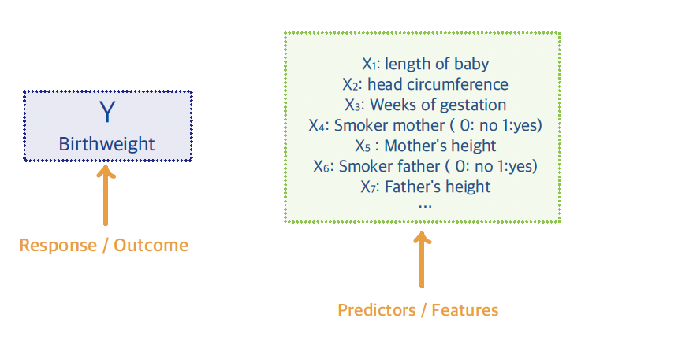
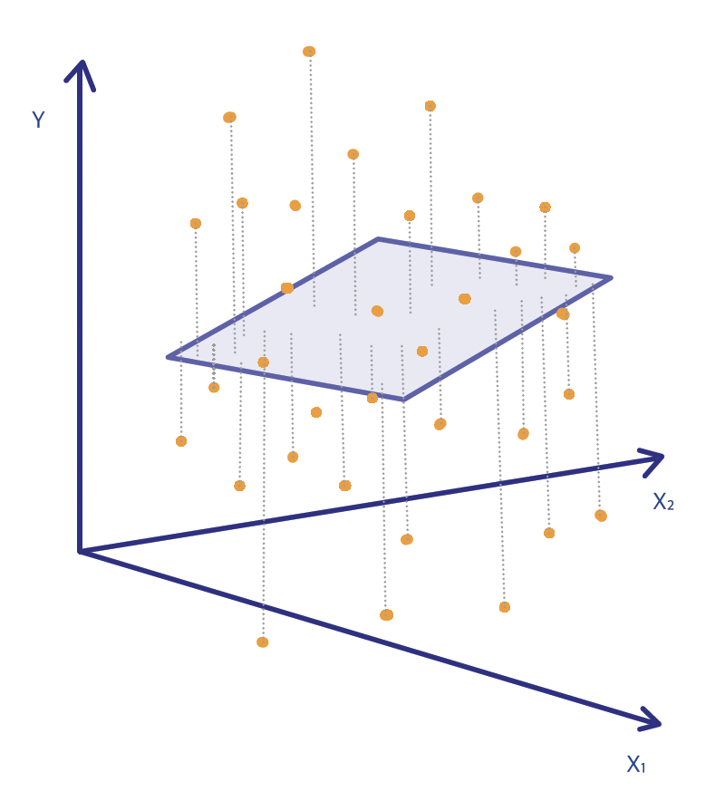
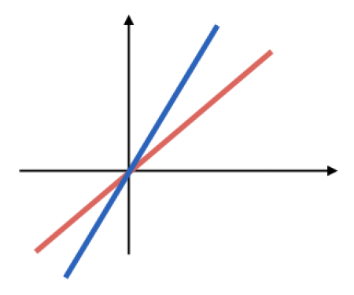
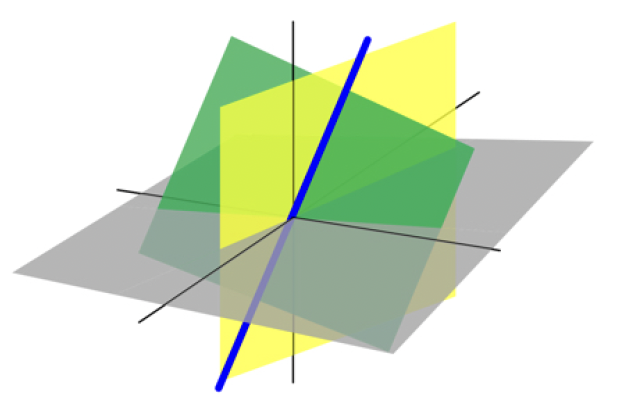
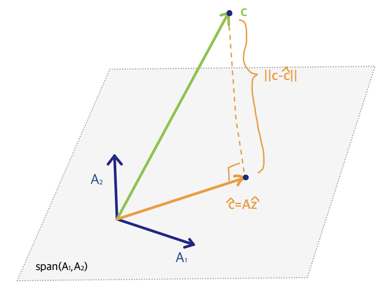
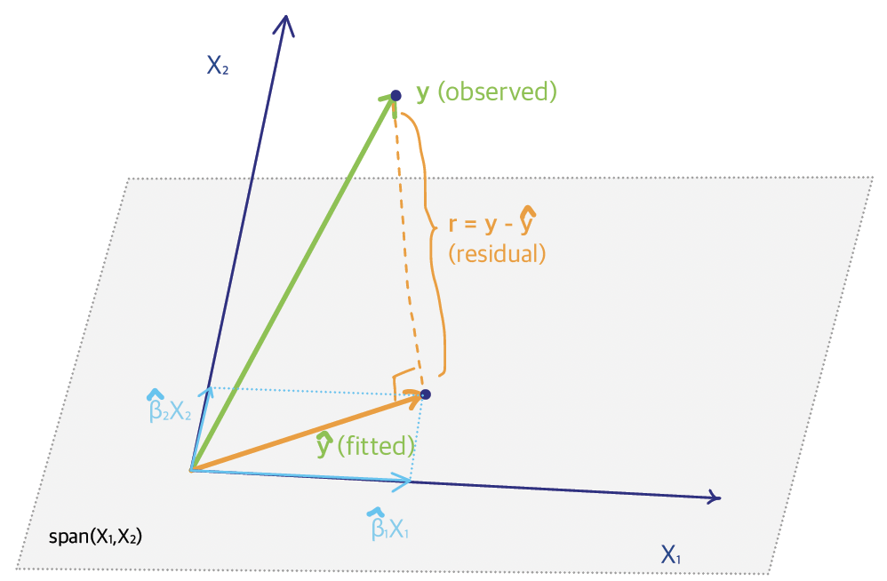
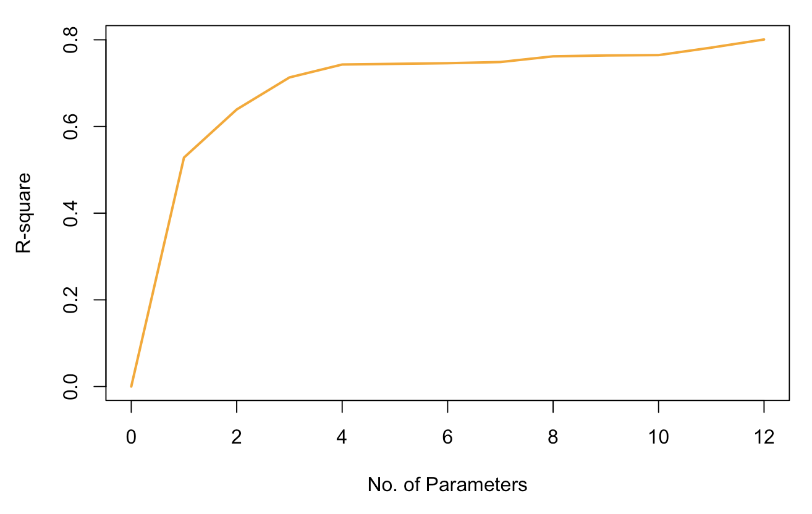
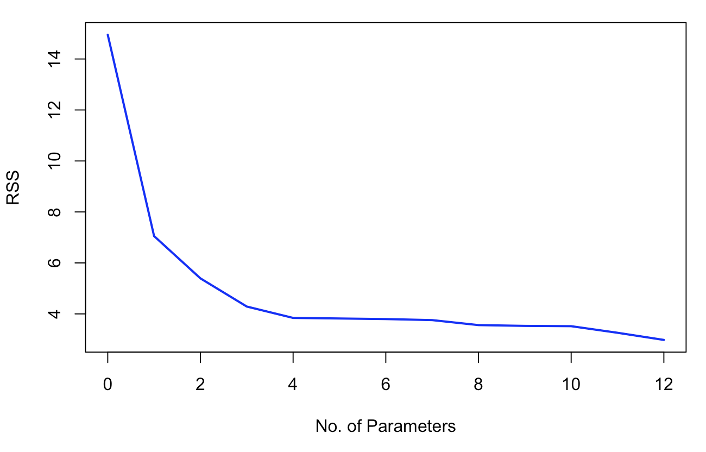
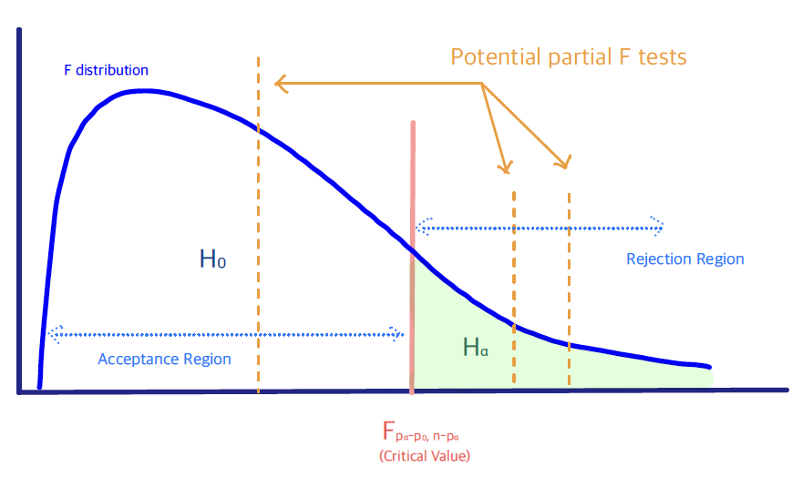

# Linear Regression Models

A regression model is a model for the <font color="darkblue">**conditional expectation** of the response/outcome variable</font> given a set of predictors/features. A linear regression model specifically assumes that $E(Y \mid \mathbf{X} = \mathbf{x})$ is a linear function of the inputs $X_1, X_2, \ldots, X_p$, i.e.,

<font color="darkblue">
\[E(Y|\mathbf{X}=\mathbf{x}) \sim \beta_0 + \beta_1 X_1 + \ldots + \beta_p X_p\]
</font>

To describe the properties and characteristics of the multiple linear regression (MLR) model, we introduce the `Birthweight` example.

&nbsp;
<div class="examplebox">
**Introduction to the `Birthweight` Example**

The goal of the birthweight study is to **predict** the birthweight (_response_/ _outcome_) of a newborn baby given a set of _predictors_/_features_, specifically for babies born prematurely. 

The features include baby-related characteristics, such as length, weight, head circumference, gestation period, and parent characteristics, such as mother's/father's height, smoking habits, mother's pre-pregnancy weight, mother's/father's age, etc.

```{r ,echo=FALSE, message=FALSE, warning=FALSE, fig.align="center", out.width="70%"}

```
</div>
&nbsp;


The **predictors** we consider may be:

- <font color="darkblue">quantitative</font>, such as length, weight, or gestation period;

- <font color="darkblue">qualitative/categorical</font>, such as smoking habits (yes/no); or

- <font color="darkblue">transformations of quantitative inputs</font>. Examples include power transformations (e.g., $X_3^3$), continuous functions of variables (e.g., $\log X_5$), polynomial expansions (e.g., $\sum_{k=1}^{n} c_k X_7^k$), and interactions (e.g., $X_1 \cdot X_2$).


## Multiple Linear Regression (MLR) Model

The model formulation is given by:
&nbsp;

<div class="motivationbox">
**Multiple Linear Regression Model**

<font color=darkblue>
  \[ Y = \beta_0 + \beta_1 X_1 + \ldots + \beta_p X_p + \varepsilon \]
</font>
where 

-  <font color=darkblue>$\beta_0$</font> is the intercept

-  <font color=darkblue>$\beta_j$</font> is the regression coefficient associated with predictor $X_j$

-  <font color=darkblue>$\varepsilon$</font> is the  error term <br>
The usual assumptions for the error terms are $\varepsilon \sim IID \bigl(0, \sigma^2 \mathbf{I} \bigr)$
</div>

  
&nbsp;

Given the **training data** <font color=darkblue>$\bigl\{ x_{i1},\; x_{i2}, \ldots, x_{ip};\, y_i\bigr\}_{i=1}^{n}$</font>, we can rewrite the model as
\[ y_i = \beta_0 + \beta_1 x_{i1} + \ldots + \beta_p x_{ip} + \varepsilon_i,\,\, i=1, \ldots, n\] 
where $n$ is the sample size. Using the  following matrix representation for the response and the features:
  \[
    \mathbf{y}=\left(\begin{array}{c} 
      y_{1} \\ y_{2} \\ \vdots \\ y_{n}
    \end{array}\right)
    \quad
    \mathbf{\varepsilon}=\left(\begin{array}{c} 
      \varepsilon_{1} \\ \varepsilon_{2} \\ \vdots \\ \varepsilon_{n}
    \end{array}\right)
    \quad
    \mathbf{\beta}=\left(\begin{array}{c} 
      \beta_{0} \\ \beta_{1} \\ \vdots \\ \beta_p
    \end{array}\right)\quad
    \mathbf{X}=\left(\begin{array}{cccc}
    1 & x_{11} & \cdots & x_{1p} \\
    1 & x_{21} & \cdots & x_{2p}   \\
      \vdots & \vdots & \ddots & \vdots\\
   1 & x_{n1} & \cdots & x_{np}  \\
    \end{array} \right)
  \]
the model equation can be written in as 
    \[\left(\begin{array}{c} 
      y_{1} \\ y_{2} \\ \vdots \\ y_{n}
    \end{array}\right) = \left(\begin{array}{ccccc}
   1&x_{11}& \cdots &x_{1p} \\
   1& x_{21}& \cdots&x_{2p}   \\
   \vdots & \vdots & \ddots & \vdots\\
  1 & x_{n1} & \cdots & x_{np}  \\
    \end{array} \right) \left(\begin{array}{c} 
      \beta_{0} \\ \beta_{1} \\ \vdots \\ \beta_p
    \end{array}\right)\quad + 
\left(\begin{array}{c} 
      \varepsilon_{1} \\ \varepsilon_{2} \\ \vdots \\ \varepsilon_{n}
    \end{array}\right)
  \]
which leads to the concise form
<div class="motivationbox">
\[
  \begin{array}{cccccc}
\mathbf{y}_{n\times 1} &=&\mathbf{X}_{n\times (p+1)}  &\mathbf{\beta}_{(p+1)\times 1}&+&\mathbf{\varepsilon}_{n\times 1}\\
\uparrow & & \uparrow & \uparrow & & \uparrow\\
\text{Response} &&\text{Design} & \text{Coefficients} & & \text{Error}\\
&&\text{Matrix} & && \text{Term}\\
\end{array}
\]
where  $n$ is the  sample size, and <font color=blue>$p+1$</font> is number of  columns of  $\mathbf{X}$ (the $p$ predictors plus the intercept).
</div>

&nbsp;


## MLR Model Fitting


Given the training data $\bigl\{ x_{i1},\; x_{i2}, \ldots, x_{ip};\, y_i\bigr\}_{i=1}^{n}$,  we want to estimate  $\mathbf{\beta}$ , i.e. express:
  \[
    \hat{\mathbf{\beta}} \;=\; 
      \left(\hat{\beta}_0,\hat{\beta}_1,\ldots,\hat{\beta}_p\right)^{T}
  \] 
as a **function of the data**.

The estimated regression coefficients $\hat{\beta}$ are obtained by minimizing the <font color="darkblue">_Residual Sum of  Squares_</font>  (RSS):
<font color="darkblue">
\[RSS \;\;=\;\; ||\mathbf{y} - \mathbf{X} \beta||^2 = (\mathbf{y} - \mathbf{X} \beta)^{T} (\mathbf{y} - \mathbf{X}\beta)\]
</font>
The RSS minimizes the (Euclidean) distance of the points from the regression surface:

```{r ,echo=FALSE, message=FALSE, warning=FALSE, fig.align="center", out.width="40%"}

```

This approach makes minimal assumptions, since it only requires that the pairs $(x_i, y_i)$ are _random draws from their population_. Specifically, it makes **no assumptions** about the underlying distribution of the response. It simply finds the **best linear fit**, without assuming that the model is valid. In fact, the true underlying  model does not even need to be linear for this method to produce estimators. Therefore, it often works well regardless of how the data were obtained. If a linear model provides a good approximation to a non-linear truth, then the regression surface can also be viewed as a measure **lack-of-fit**.

&nbsp;

#### Least-Squares Method {-}


We want to estimate the **vector** of  coefficients $\mathbf{\beta}$ by minimizing  the  _sum of  squared residuals_:
  \[RSS\;\;=\;\; ||y - \mathbf{X} \beta||^2 = (y - \mathbf{X} \beta)^{T} (y - \mathbf{X}\beta)\]
We take derivatives with respect to $\beta$ and set them equal to zero:
\begin{align*}
\frac{\partial RSS}{\partial \beta}  &= \mathbf{0}_{p\times 1} \,\, \Leftrightarrow \\
-2 \;\mathbf{X}^T_{p\times n} (y - \mathbf{X}\beta)_{n\times 1} &= \mathbf{0}_{p\times 1}
\end{align*}

This leads to the so-called <font color=blue>**Normal Equations**</font>
<font color=blue>\[\mathbf{X}^T (y - \mathbf{X}\beta) = \mathbf{0}\]</font>

Solving the Normal Equations 
\[(\mathbf{X}^T\mathbf{X})\;\beta  = \mathbf{X}^T\; y  \]
leads to the 
<div class="motivationbox">
**Least Squares Estimators in MLR**
\[\hat{\beta} = (\mathbf{X}^T\mathbf{X})^{-1} \mathbf{X}^T\; y\]
</div>


 We <u>assume</u> that **the rank of $\mathbf{X}$ is $p+1$**, i.e. no columns of $\mathbf{X}$ are a linear combinations of the other columns. _Since $\mathbf{X}$ has full column rank, the inverse of $(\mathbf{X}^T\mathbf{X})$ <u>exists</u>_.

&nbsp;


#### Fitted, Predicted Values & Residuals {-}


The <font color="darkblue">**fitted value**</font> of $y_i$ at $x_i = \bigl( x_{i1}, x_{i2}, \ldots , x_{ip}\bigr)$ is computed as:
\[\hat{y_{i}} = \hat{\beta}_0 + \hat{\beta}_1 x_{i1}+ \hat{\beta}_2 x_{i2} + \ldots + \hat{\beta}_p x_{ip}\]


More generally, using matrix formulation,  the **fitted values** of $\mathbf{y}$ are given by
\begin{align*}
\hat{\mathbf{y}}_{n\times 1} &= \mathbf{X}  \hat{\beta} \\
&= \mathbf{X}  (\mathbf{X}^T\mathbf{X})^{-1} \mathbf{X}^T\; y\\
&=  \mathbf{X}  (\mathbf{X}^T\mathbf{X})^{-1} \mathbf{X}^T\; y := \mathbf{H}_{n \times n} y_{n\times 1}
\end{align*}

where we define the _hat matrix_


<div class=motivationbox>
**The Hat Matrix**

\[ \mathbf{H}_{n \times n} =  \mathbf{X}  (\mathbf{X}^T\mathbf{X})^{-1} \mathbf{X}^T\]
It is called  the **hat matrix** because it produces the "_y-hat_" values: $\hat{y} = \mathbf{H} t$.
</div>


The <font color="darkblue">**predicted value**</font> of $y$ at a new point $x_i^* = \bigl( x_{i1}^*, x_{i2}^*, \ldots , x_{ip}^*\bigr)$ is 
\[\hat{\mathbf{y}}^* = \hat{\beta}_0 + \hat{\beta}_1 x_{i1}^* + \hat{\beta}_2 x_{i2}^* + \ldots + \hat{\beta}_p x_{ip}^*\]
In matrix form, the **predicted values** are
\[\hat{\mathbf{y}}^* = \mathbf{X}^* \hat{\beta}\]

> <u>Note:</u> The key difference between the fitted and predicted values is that the vector $\mathbf{x}$ belongs to the training data (it has already been observed), whereas $\mathbf{x}^*$ is an **unobserved** feature vector  that is **independent** of the training data. 

&nbsp;

The <font color="darkblue">**residual**</font> at observation $i$ is
\begin{align*}
r_{i} &= y_i - \hat{y}_i \\
&= y_i - \hat{\beta}_0 - \hat{\beta}_1 x_{i1} - \hat{\beta}_2 x_{i2} - \ldots - \hat{\beta}_p x_{ip}
\end{align*}

In matrix form the residual vector is
\begin{align*}
\mathbf{r}_{n\times 1} &= \mathbf{y} - \hat{\mathbf{y}} \\
&= \mathbf{y} - \mathbf{X}\hat{\beta} = \mathbf{y} - \mathbf{X} (\mathbf{X}^T\mathbf{X})^{-1} \mathbf{X}^T\;  y \\
&= \mathbf{y} - \mathbf{H} \mathbf{y} = (\mathbf{I} -\mathbf{H}) \mathbf{y}
\end{align*}

The residuals $\mathbf{r}$ are used to estimate the <font color=darkblue>**error variance**</font>:
\[\hat{\sigma}^2 = \frac{1}{n-p-1}\sum_i r_i^2 = \frac{RSS}{n-p-1}\]
The denominator $n-p-1$ is the _degrees of freedom of the residuals_ .

&nbsp;

#### Properties of the Residuals {-}

The least-squares estimator $\hat{\beta}$ satisfies the **normal equations**
\[\mathbf{X}^T (\mathbf{y} - \hat{\mathbf{y}}) = \mathbf{X}^T (\mathbf{y} - \mathbf{X}\hat{\beta}) = \mathbf{0}\]

From this we obtain the following properties of the residual vector $\mathbf{r}$:

- The residual vector is orthogonal to every column of $\mathbf{X}$:
\begin{align*}
\mathbf{X}^T\; \mathbf{r} &= \mathbf{X}^T (\mathbf{y}-\mathbf{X}\hat{\beta})\\
&= \mathbf{X}^T \mathbf{y} - \mathbf{X}^T\mathbf{X}\hat{\beta}\\
&= \mathbf{X}^T \mathbf{y} -  (\mathbf{X}^T \mathbf{X} )(\mathbf{X}^T\mathbf{X})^{-1} \mathbf{X}^T\; \mathbf{y} = \mathbf{0}
\end{align*}


- The residual vector is also orthogonal to the vector of fitted values:
\[\hat{\mathbf{y}}^T \;\mathbf{r} = \hat{\beta}^{T} \mathbf{X}^{T} \;\mathbf{r} = \mathbf{0}\]
Thus, the residual vector $\mathbf{r}$ is <font color="darkblue">**orthogonal to each column of $\mathbf{X}$ and to $\hat{\mathbf{y}}$**</font>.

&nbsp;

> When the model is used for prediction at a new point $\mathbf{x}^*$, two different interval estimates are commonly reported: (i) a confidence interval for the mean response $E(Y\mid\mathbf{x}^*)$, and (ii) a prediction interval for a new individual observation $Y^*$.
The prediction interval is wider because it must also account for the irreducible error variance $\sigma^2$.


## Least-Squares & Normal Equations

In this section, we focus on the system of linear equations that we solve to obtain the least-squares estimators for $\beta$. Recall, that we want to find a vector $\hat{\beta}$ that minimizes

\[\min_{\beta} ||\mathbf{y} - \mathbf{X} \beta||^2\] 
_Any vector that provides a minimum value of this expression is called a least-squares solution_.

The set of all least squares solutions is precisely the **set of solutions** to the normal equations
\[(\mathbf{X}^T \mathbf{X}) \beta = \mathbf{X}^T \mathbf{y}\]
There is a *unique*  solution **if and only if** $rank(\mathbf{X}) = p+1$ in which case $\bigl(\mathbf{X}^T \mathbf{X}\bigr)$ is invertible.

&nbsp;

### System of Linear Equations {.unlisted .unnumbered}
##### Linear Algebra Review {-}

Let us review a few facts from linear algebra related to solutions of a system of linear equations. For simplicity of notation, we  use the _generic_ system of equations:
\[\mathbf{A} z = c\]
where
\[ \mathbf{A}=\left(\begin{array}{cccc}
    a_{11} & a_{12} & \cdots & a_{1k} \\
    a_{21} & a_{22} & \cdots & a_{2k}   \\
      \vdots & \vdots & \ddots & \vdots\\
  a_{m1} & a_{m2} & \cdots & a_{mk}  \\
    \end{array} \right),\quad
    z =\left(\begin{array}{c}
    z_{1} \\
    z_{2}   \\
   \vdots\\
    z_{m}  \\
    \end{array} \right),\quad
    c =\left(\begin{array}{c}
    c_{1} \\
    c_{2}   \\
   \vdots\\
    c_{m}  \\
    \end{array} \right)
    \]

Denote by $\mathbf{A}_{i} = \bigl( a_{1i}, a_{2i}, \ldots, a_{mi}\bigr)^T$  the vector representing the $i$th *column* of $\mathbf{A}$. Then,  $\mathcal{C}(\mathbf{A})$ is the space generated by the columns of $\mathbf{A}$, i.e. the span of $\bigl\{\mathbf{A}_1, \mathbf{A}_2, \ldots, \mathbf{A}_{k}\bigr\}$.


<div class=learningbox>
**Definition**

The **span** of a collection of vectors $\bigl(\mathbf{A}_1, \mathbf{A}_2, \ldots, \mathbf{A}_{k}\bigr)$ is the set of all linear combinations of these vectors:
\begin{align*}
&span \bigl(\mathbf{A}_1, \mathbf{A}_2, \ldots, \mathbf{A}_{k}\bigr) \\
&= \Bigl\{ d_1 \mathbf{A}_1 + d_2 \mathbf{A}_2 + \ldots + d_k \mathbf{A}_{k}, \text{ for any constants } d_1, \ldots, d_k \in \mathbb{R}
\Bigr\}
\end{align*} 


</div>


The column space of $\mathbf{A}$, $\mathcal{C}(\mathbf{A})$, is a **subspace** in $\mathbb{R}^m$. A linear subspace of $\mathbb{R}^m$ can be thought of as a "flat"  surface within $\mathbb{R}^m$; it is a <font color="darkblue">collection of vectors that is closed under linear combinations</font>.  Illustrations of subspaces of $\mathbb{R}^n$ are shown below:
<center>
{width=35%} {width=35%}
</center>
&nbsp;

#### Solving the System of Equations  $\mathbf{A}z=c$ {-}


For the system $\mathbf{A} z = c$ to have a solution, $c$ must lie in the column space of  $\mathbf{A}$, i.e. $c \in \mathcal{C}(\mathbf{A})$.  This follows directly from the definition of matrix multiplication:
\[\mathbf{A} z = c \, \Leftrightarrow \, c = z_1 \mathbf{A}_1 + \ldots + z_k \mathbf{A}_k\]

When $c \notin \mathcal{C}(\mathbf{A})$, we instead seek the vector  $\hat{c} \in \mathcal{C}(\mathbf{A})$ that is closest to $c$. In that case, the equation $\mathbf{A} z = \hat{c}$ has a solution, and $\hat{c}$  comes as close as possible to the original vector $c$. 
To obtain $\hat{c}$ we **project**  $c$  **orthogonally** onto  $\mathcal{C}(\mathbf{A})$ by multiplying both sides  by  $\mathbf{A}^T$:



\[\mathbf{A}^T\mathbf{A} z = \mathbf{A}^T c\]
* These are the normal equations.


In the sketch to the right, $\mathcal{C}(\mathbf{A})$, the space spanned by the columns of $\mathbf{A}$, is a *flat* surface, and  $c$ is a point lying off that flat surface.  The **shortest distance** from the point $c$ to the plane $\mathcal{C}(\mathbf{A})$ is the line segment _orthogonal_ to the plane.  

The _normal equations_ locate the point in $\mathcal{C}\bigl(\mathbf{A}\Bigr)$ that is closest to $c$ by means of an orthogonal projection. 

&nbsp;


### Geometric Representation of LS {.unlisted .unnumbered}

Translating the preceding discussion into the linear-regression setting:

 

- <font color="darkblue">$\mathcal{C}(\mathbf{X})$ is the subspace _spanned_ by the columns of the design matrix</font>, i.e. by the predictors $X_1$,  $X_2$, $\ldots$, $X_p$. It is a _flat_ subspace of $\mathbb{R}^n$. 

- The response $\mathbf{y}$ is a vector lying  **off** this subspace, and the fitted value $\hat{\mathbf{y}}$ is the <font color="darkblue">orthogonal projection of $\mathbf{y}$ onto $\mathcal{C}(\mathbf{X})$</font>.

- The residual vector $\mathbf{r} = \mathbf{y} - \hat{\mathbf{y}}$ is **orthogonal** both to $\hat{\mathbf{y}}$ and to the entire subspace $\mathcal{C}\bigl( \mathbf{X} \bigr)$.

&nbsp;

In other words,  the least-squares method decomposes the data vector $\mathbf{y}$ into two orthogonal components:
<font color="darkblue">
\[\mathbf{y}_{n\times 1} = \hat{\mathbf{y}}_{n\times 1} + \mathbf{r}_{n\times 1}\]
</font>

&nbsp;


## Goodness-Of-Fit: $R$-Square


A measure of how well the model fits the data is the <font color="darkblue"> **$R$-square**</font> (also called <font color="darkblue">**coefficient of determination**</font> or the <font color="darkblue">_percentage of variance explained_</font>). It is defined as

\begin{align*}
R^2 &=  \frac{\sum_i (\hat{y}_i - \bar{y})^2}{\sum_i (y_i - \bar{y})^2}\quad = \frac{\text{distance of model from grand mean}}{\text{distance of observations from grand mean }}\\ 
& =  \frac{||\hat{\mathbf{y}} - \bar{\mathbf{y}}||^2}{||\mathbf{y} - \bar{\mathbf{y}}||^2} \\
&= \frac{||\mathbf{y} - \bar{\mathbf{y}}||^2 - ||\hat{\mathbf{y}} - \mathbf{y}||^2  }{||\mathbf{y} - \bar{\mathbf{y}}||^2} \\
&= 1 - \frac{||\hat{\mathbf{y}} - \mathbf{y}||^2 }{||\mathbf{y} - \bar{\mathbf{y}}||^2}\, := 1 - \frac{RSS}{TSS}
\end{align*}
The second-to-last equality follows from the orthogonal decomposition
\[\underbrace{||\mathbf{y} - \bar{\mathbf{y}}||^2}_{\substack{\text{ total}\\\text{ variation  }}} = \underbrace{||\hat{\mathbf{y}} - \bar{\mathbf{y}}||^2}_{\substack{\text{ model variation }\\ \text{ from mean }}} + \underbrace{|| \hat{\mathbf{y}} - \mathbf{y}||^2}_{\text{ error  }}\]

&nbsp;

##### <font color="blue">Properties of $R^2$ </font> {-}

- $0\leq R^2 \leq 1$

- $R^2$ is invariant of any location or scale change of $Y$ or of the predictors $X$.  

- $R^2$ alone does not  tell us much about the quality of the LS fit.

- A small $R^2$ does not necessarily imply that the LS model is poor.

- Adding a new predictor, even if it is randomly generated and completely unrelated to $Y$,  decreases the $RSS$ and therefore increases $R^2$. 

These relationships are illustrated in the two plots below:

```{r ,echo=FALSE, message=FALSE, warning=FALSE, fig.align="center", out.width="60%"}

```
 
```{r ,echo=FALSE, message=FALSE, warning=FALSE, fig.align="center", out.width="60%"}

```


&nbsp;


## Linear Transformations on $X$

Suppose we have a linear regression model of $Y$ on the predictors $X$. If we **scale** or **shift** a predictor, the fitted values $\hat{\mathbf{y}}$ and $R^2$ remain unchanged, but the LS estimators $\hat{\beta}$ change.

#### Some Examples {-}

- Scaling a predictor, i.e. $\tilde{x}_{i2} =  2 x_{i2}$ or $\tilde{x}_{i3} =  x_{i3}/4$, does not affect $\hat{\mathbf{y}}$ or $R^2$.  

- In the `birthweight` example, the length of a baby is recorded in cm. Converting the length column to inches by the transformation  $\tilde{X}_1 = X_1/2.54$ leaves the predicted values unchanged.


<div class=motivationbox>
These statements remain true, if we apply any linear transformation of the $p$ predictors **as long as the transformation does not change the rank of $\mathbf{X}$**.
</div>


## Rank deficiency
 
The design matrix $\mathbf{X}$ is an $n\times (p+1)$ matrix. If this matrix is **not of full rank** (i.e., its columns are not linearly independent), the matrix $\mathbf{X}^T \mathbf{X}$ cannot be inverted. This means that there is redundancy among the columns of $\mathbf{X}$: at least one column can be written as a linear combination of other columns. Consequently,  $\mathbf{X^T X}$ is _singular_ and the LS solution is not unique (an *identifiability problem*).
     
Nevertheless, the column space $\mathcal{C}(\mathbf{X})$ remains well-defined, so the fitted vector $\hat{y}$ is still well-defined and can be computed. `R` and `Python`  handle this situation, and the resulting model can still be used for prediction.
     
&nbsp;


## Hypothesis Testing in MLR


When fitting a regression model, we often want to understand which predictors are statistically significant, or which of two models (a larger one or a smaller one) is more appropriate --either for prediction or for estimation. 

Testing for the statistical significance of one or more predictors can be formulated either as a test that the corresponding coefficient(s) equal zero, or as a model-comparison test. In this course we summarize all such testing questions with the following hypothesis test:

<font color="darkblue">
\[
\begin{cases}
& H_0: \text{ Reduced Model with } p_0 \text{ coefficients}\\
& H_{\alpha}: \text{ Full (larger) Model with } p_{\alpha} \text{ coefficients}\\
\end{cases}
\]
</font>
Obviously, $p_{\alpha} > p_0$, since the reduced model is a special case of the full model. Consequently we expect the reduced model to have a larger residual sum of squares: $RSS_0 \geq RSS_{\alpha}$. The main tool for this comparison is the **partial $F$ test**:


<div class="motivationbox">
**Partial $F$ test**

_Hypothesis Test:_
\[
\begin{cases}
& H_0: \text{ Reduced Model with } p_0 \text{ coefficients}\\
& H_{\alpha}: \text{ Full/ Larger Model with } p_{\alpha} \text{ coefficients}\\
\end{cases}
\]

_Test Statistic:_
\[F=\frac{\bigl(RSS_0 - RSS_{\alpha}\bigr)/(p_{\alpha} - p_0)}{RSS_{\alpha}/ \bigl(n-p_{\alpha} \bigr)}\,  \sim \, F_{p_{\alpha} - p_0, n-p_{\alpha}}\]

_Decision Rule:_
Reject $H_0$, if the $F$ test statistic is large (or larger than $F_{p_{\alpha} - p_0, n-p_{\alpha}}$), i.e. the variation missed by the reduced model, when being compared with the error variance, is significantly large.
</div>

&nbsp;

  

&nbsp;
 
- The **numerator** in the partial $F$ test measures the extra variation in the data not explained by the reduced model, but explained by the full model. 

- The **denomimator** is the variation in the data not explained by the full model (i.e., not explained by either model), which is used to estimate the error variance.

   
&nbsp;

<div class="examplebox">
**Birthweight Example (cont'd)**

We wish to test whether the group of predictors that describe the father’s characteristics (i.e. variables $X_9$ -- $X_{12}$) is jointly significant. The hypotheses are 

 \[\begin{cases}
 &H_0: Y \sim  1+  \beta_{1} X_{1} + \ldots + \beta_{8}X_{8} \\
 & H_{\alpha}:  Y \sim  1+  \beta_1 X_1 + \ldots + \beta_{8}X_{8}+ \ldots + \beta_{12} X_{12} 
 \end{cases} 
 \]
Here $p_0 = 8+1$ (8 predictors plus intercept) and  $p_{\alpha}=12+1$ is the number of $\beta$'s in the full model. Extracting  $RSS_0$ and $RSS_{\alpha}$ in `R`/`Python` and computing the  partial $F$ test statistic yields $F = 0.7225$. Because this value is smaller than the critical value $  F_{4,\, n-13} \approx 2.7$ we do not reject $H_0$ and prefer the reduced model.
 
</div>

&nbsp;

####  <font color="blue">Partial $F$ Test: Special Cases </font> {-}

* **Test for a Single Predictor $\beta_j$**

 \[\begin{cases}
 & H_0: Y \sim  1+  \beta_1 X_1 + \ldots + \beta_{j-1}X_{j-1} + \qquad \quad \; \beta_{j+1} X_{j+1} + \ldots + \beta_p X_p \\
 & H_{\alpha}:  Y \sim  1+  \beta_1 X_1 + \ldots + \beta_{j-1}X_{j-1} +  \beta_{j} X_{j} + \beta_{j+1} X_{j+1} + \ldots + \beta_p X_p \\
 \end{cases} 
 \]
The partial $F$ test for a single coefficient $\beta_j$ is exactly equivalent to the usual $t$-test$
\[t_j = \frac{\hat{\beta}_j}{\widehat{\operatorname{se}}(\hat{\beta}_j)} \sim t_{n-p-1}\]
under $H_0: \beta_j = 0$. In practice most software reports the $t$-statistic and its $p$-value directly.


&nbsp;

* **Test for all Predictors**

 \[\begin{cases}
 &H_0: Y \sim  1 \qquad \text{[intercept-only model]} \\
 & H_{\alpha}:  Y \sim  1+  \beta_1 X_1 + \ldots + \beta_{j-1}X_{j-1} +  \beta_{j} X_{j} + \beta_{j+1} X_{j+1} + \ldots + \beta_p X_p \\
 \end{cases} 
 \]
This is the **overall $F$** test, which can be viewed as a <font color="darkblue">_goodness-of-fit test_</font> for the regression model.


&nbsp;


## Categorical Variables in MLR

As we discussed, some of the predictors may be _categorical_. Consider a categorical predictor  with $k$ levels.  When it is included in a linear regression model it is represented it is represented by binary indicator variables. Two common coding schemes are used:


**One-hot encoding** creates $k $ binary indicators, one for each level:
\[D_i =
\begin{cases}
1 & \text{if the observation belongs to level } i, \\
0 & \text{otherwise}.
\end{cases}\]


**Dummy coding** (the default in classical linear regression) creates only $  k-1  $ binary indicators and absorbs one level into the intercept. The indicators take the form
$$D_i =
\begin{cases}
0 & \text{if the observation is not at level } i, \\
1 & \text{if the observation is at level } i,
\end{cases}$$
where the omitted level is called the reference level.


<div class=examplebox>
**An Example with Categorical Variables**

Consider a categorical predictor with three levels ($a$, $b$, $c$). 


One-hot encoding produces $k = 3$ columns:
$$\begin{pmatrix}
a \\ a \\ b \\ b \\ b \\ c \\ c
\end{pmatrix}
\quad\Longrightarrow\quad
\begin{pmatrix}
1 & 0 & 0 \\
1 & 0 & 0 \\
0 & 1 & 0 \\
0 & 1 & 0 \\
0 & 1 & 0 \\
0 & 0 & 1 \\
0 & 0 & 1
\end{pmatrix}$$


Dummy coding (with level $c$ as the reference) produces $k-1 = 2$ columns:
$$\begin{pmatrix}
a \\ a \\ b \\ b \\ b \\ c \\ c
\end{pmatrix}
\quad\Longrightarrow\quad
\begin{pmatrix}
1 & 0 \\
1 & 0 \\
0 & 1 \\
0 & 1 \\
0 & 1 \\
0 & 0 \\
0 & 0
\end{pmatrix}$$

In the dummy-coding matrix, Column 1 is the indicator for level $a$ and Column 2 is the indicator for level $b$. Level $c$ is absorbed into the intercept.
</div>

&nbsp;

> In general any level may be chosen as the reference level; the choice is usually driven by subject-matter context rather than by statistical considerations. 


#### Dummy coding vs. One-hot encoding {-}

- Dummy coding uses $k-1$ indicators and keeps the design matrix full rank when an intercept is present. This is the standard approach in classical linear regression.

- One-hot encoding uses $k$ indicators. When an intercept is also included, the $k$ columns sum to the constant vector $\mathbf{1}$, creating perfect multicollinearity; $\mathbf{X}^T\mathbf{X}$ becomes singular and the ordinary least-squares estimator is no longer unique.

- Fitted and predicted values are identical under both codings. _Only the interpretation of the individual coefficients changes._ In practice, any level may be chosen as the reference; the choice is usually guided by subject-matter context rather than by statistical considerations.


&nbsp;


## Collinearity

In practice we often encounter data sets in which many of the predictors are highly correlated with one another. In such cases the fitted values and the sampling variances of the regression coefficients can depend heavily on which particular predictors are included in the model. The resulting estimators become sensitive and unreliable.

<font color="darkblue"> Possible *symptoms* of collinearity include </font>:

(i) high pairwise (sample) correlation among the predictors, 

(ii) a relatively large $R^2$, 

(iii) a statistically significant  overall $F$ test even though non of the individual predictors is statistically significant.

Specific diagnostic tests and metrics exist for quantifying the severity of collinearity, but they lie beyond the scope of this course.

The simplest remedy is to remove one or more predictors from each highly correlated group. More advanced approaches include principal-component analysis (PCA) and regularization methods based on penalized least squares.
    
&nbsp;


##  Model Diagnostics

We made several assumptions when defining the linear regression model
\[\mathbf{y} =  \mathbf{X}\beta + \varepsilon,\,\, \text{ where } \,\, \varepsilon \sim IID(0, \sigma^2)\] 

These assumptions are:

- <font color="darkblue">_Linearity_</font>: the conditional mean of $Y$ is a linear function of the predictors.

- <font color="darkblue">_Constant Variance_</font>(homoscedasticity): all responses share a common, constant variance $\sigma^2$.

- <font color="darkblue">_Uncorrelated errors_</font>: the errors $\varepsilon_i$ and $\varepsilon_j$ (and therefore $Y_i$ and $Y_j$) are uncorrelated for $i\neq j$.

- <font color="darkblue">_(Normality)_</font>: this is not required for the derivation of the least-squares estimators themselves. It becomes necessary, however, when we want exact finite-sample distributional results for the estimators, fitted values, and residuals, and it is especially important for hypothesis testing.

If the goal is to interpret the effects of the predictors on the response (rather than pure prediction), all of the above assumptions should be checked with diagnostic plots and tests, and appropriate remedial measures should be taken when they are violated.

Because the primary focus of this course is prediction, we refer students to a dedicated regression course or textbook for a thorough treatment of diagnostics and remedial measures in multiple linear regression.

&nbsp;


###  Outliers {.unlisted .unnumbered}


Outliers can be a concern in both large and small data sets. When the sample size is modest, it is advisable to test formally for outliers—for example, with tests based on the leave-one-out prediction error. In very large data sets such tests lose power and are less useful; one should instead adjust for multiple comparisons or adopt alternative strategies.


If outliers appear to be problematic, useful practical steps include:

(i) examining the range of each variable,

(ii) applying a log, square-root, or other suitable transformation to right-skewed predictors or to the response $Y$, and

(iii) using winsorization to limit the influence of extreme values.


## The `Birthweight` Example

&nbsp;

The `birthweight.csv` data set contains observations on 42 babies. The variables are:

* `ID`: Unique Identification number of a baby
* `Length`: Length of the baby at time of birth in cm ($X_1$)
* `Birthweight`: Weight of the baby at time of birth in kg ($Y$)
* `Headcirc`: Head circumference of the baby at time of birth in cm ($X_2$)
* `Gestation`: Completed weeks of gestation ($X_3$)
* `smoker`: Mother is/is not a smoker {0: No, 1: Yes} ($X_4$)
* `mage`: Mother's age at time of birth ($X_5$)
* `mnocig`: Mother's number of cigarettes smoked per day ($X_6$)
* `mheight`: Mother's height in cm ($X_7$)
* `mppwt`: Mother's pre-pregnancy weight ($X_8$)
* `fage`: Father's age at time of birth ($X_9$)
* `fedyrs`: Father's years of education ($X_{10}$)
* `fnocig`:  Father's number of cigarettes smoked per day ($X_{11}$)
* `fheight`: Father's height ($X_{12}$)

&nbsp;


You can download the data file here: <a href="data/week2/Birthweight.csv" download> Birthweight.csv </a>.

&nbsp;

The analysis of this data set  is available in <a href="code/ch2_RCode.html" target="_blank">R</a> and  <a href="code/ch2_PythonCode.html" target="_blank">Python</a>.

&nbsp;

The data analysis example also includes a highly correlated data set (`seatpos`) from  Faraway's book on "Linear Models in R". You can download this data here: <a href="data/week2/seatpos.csv" download>seatpos.csv</a> 

