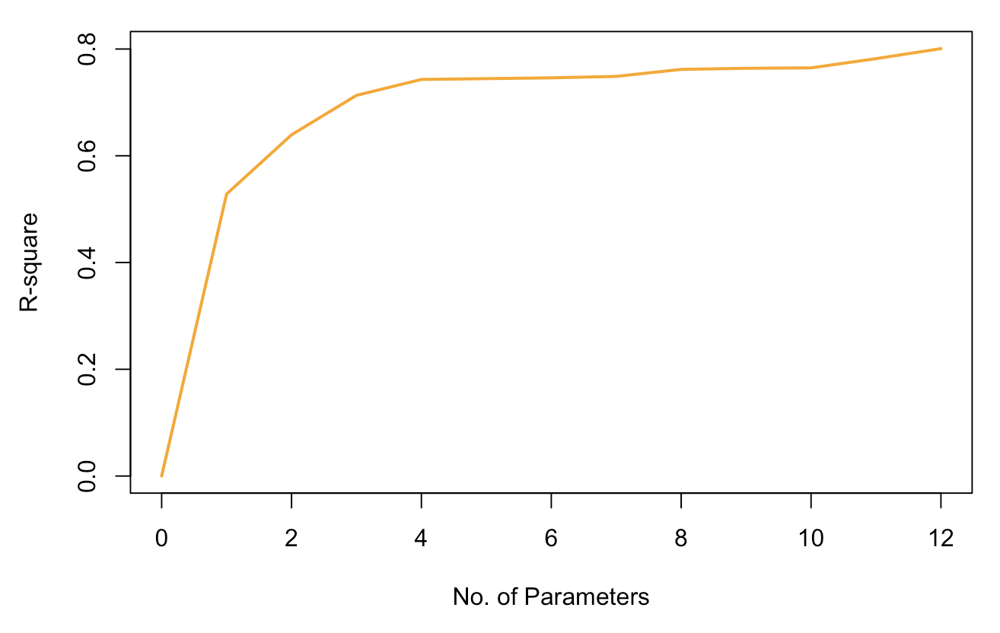

# Linear Regression Models

A regression model is a model for the <font color="darkblue">**conditional expectation** of the response/ outcome variable</font> given a set of predictors/features. A linear regression model specifically, is _assumes_ that $E(Y|\mathbf{X}=\mathbf{x})$ is a linear function of the inputs $X_1$, $X_2$, $\ldots$, $X_p$, i.e.
<font color="darkblue">
\[E(Y|\mathbf{X}=\mathbf{x}) \sim \beta_0 + \beta_1 X_1 + \ldots + \beta_p X_p\]
</font>

To describe the properties and characteristics of the MLR model, we introduce the `Birthweight` example.
<br>

<div class = examplebox>
**Introduction to the `Birthweight` Example**

The goal of the birthweight study is to **predict** the birthweight (_response_/ _outcome_) of a newborn baby given a set of _predictors_/_features_, specifically for babies born prematurely. 

The features include baby-related characteristics, such as length, weight, head circumference, gestation period, and parent characteristics, such as mother's/father's height, smoking habits, mother's pre-pregnancy weight, mother's/father's age, etc.

```{r ,echo=FALSE, message=FALSE, warning=FALSE, fig.align="center", out.width="70%"}
knitr::include_graphics("images/week2/birthweight1a.png")
```
</div>
<br>

The **predictors** we consider may be:

* <font color="darkblue">_quantitative_</font>, such as length, weight, gestation period, etc.

* <font color="darkblue">_qualitative/categorical_</font>, such as smoking habits (yes/no), or

* <font color="darkblue">_transformations of quantitative inputs_</font>: For example, power transformation of variables, e.g. $X_3^3$;  continuous functions of variables, e.g. $\log X_5$; basic expansions leading to a polynomial representation , e.g.  $\sum_{k=1}^{n} c_k X_{7k}$; interactions, e.g.  $X_1\cdot X_2$, etc.


## Multiple Linear Regression (MLR) Model

The model formulation is given by:
<br>

<div class=motivationbox>
**Multiple Linear Regression Model**

<font color=darkblue>
  \[ Y = \beta_0 + \beta_1 X_1 + \ldots + \beta_p X_p + \varepsilon \]
</font>
where 

*  <font color=darkblue>$\beta_0$</font> is the intercept

*  <font color=darkblue>$\beta_j$</font> is the regression coefficient associated with predictor $X_j$

*  <font color=darkblue>$\varepsilon$</font> is the  error term <br>
Usual assumptions for the error terms are $\varepsilon \sim IID \bigl(0, \sigma^2 \mathbf{I} \bigr)$
</div>

  
<br> 

Given the **training data** <font color=darkblue>$\bigl\{ x_{i1},\; x_{i2}, \ldots, x_{ip};\, y_i\bigr\}_{i=1}^{n}$</font>, we can re-write the model as
\[ y_i = \beta_0 + \beta_1 x_{i1} + \ldots + \beta_p x_{ip} + \varepsilon_i,\,\, i=1, \ldots, n\] 
where $n$ is the sample size. Using the  following matrix representation for the response and the features:
  \[
    \mathbf{y}=\left(\begin{array}{c} 
      y_{1} \\ y_{2} \\ \vdots \\ y_{n}
    \end{array}\right)
    \quad
    \mathbf{\varepsilon}=\left(\begin{array}{c} 
      \varepsilon_{1} \\ \varepsilon_{2} \\ \vdots \\ \varepsilon_{n}
    \end{array}\right)
    \quad
    \mathbf{\beta}=\left(\begin{array}{c} 
      \beta_{0} \\ \beta_{1} \\ \vdots \\ \beta_p
    \end{array}\right)\quad
    \mathbf{X}=\left(\begin{array}{cccc}
    1 & x_{11} & \cdots & x_{1p} \\
    1 & x_{21} & \cdots & x_{2p}   \\
      \vdots & \vdots & \ddots & \vdots\\
   1 & x_{n1} & \cdots & x_{np}  \\
    \end{array} \right)
  \]
the model equation can be written in as 
    \[\left(\begin{array}{c} 
      y_{1} \\ y_{2} \\ \vdots \\ y_{n}
    \end{array}\right) = \left(\begin{array}{ccccc}
   1&x_{11}& \cdots &x_{1p} \\
   1& x_{21}& \cdots&x_{2p}   \\
   \vdots & \vdots & \ddots & \vdots\\
  1 & x_{n1} & \cdots & x_{np}  \\
    \end{array} \right) \left(\begin{array}{c} 
      \beta_{0} \\ \beta_{1} \\ \vdots \\ \beta_p
    \end{array}\right)\quad + 
\left(\begin{array}{c} 
      \varepsilon_{1} \\ \varepsilon_{2} \\ \vdots \\ \varepsilon_{n}
    \end{array}\right)
  \]
which leads to the concise form
<div class=motivationbox>
\[
  \begin{array}{cccccc}
\mathbf{y}_{n\times 1} &=&\mathbf{X}_{n\times (p+1)}  &\mathbf{\beta}_{(p+1)\times 1}&+&\mathbf{\varepsilon}_{n\times 1}\\
\uparrow & & \uparrow & \uparrow & & \uparrow\\
\text{Response} &&\text{Design} & \text{Coefficients} & & \text{Error}\\
&&\text{Matrix} & && \text{Term}\\
\end{array}
\]
where  $n$ is the  sample size, and <font color=blue>$p+1$</font> is number of predictors or columns of  $\mathbf{X}$ plus the intercept (the "+1").
</div>

<br>

## MLR Model Fitting


Given the training data $\bigl\{ x_{i1},\; x_{i2}, \ldots, x_{ip};\, y_i\bigr\}_{i=1}^{n}$,  we want to estimate  $\mathbf{\beta}$ , i.e. express:
  \[
    \hat{\mathbf{\beta}} \;=\; 
      \left(\hat{\beta}_0,\hat{\beta}_1,\ldots,\hat{\beta}_p\right)^{T}
  \] 
as a **function of the data**.

The estimated regression coefficients $\beta$ are obtained by minimizing the <font color="darkblue">_Residual Sum of  Squares_</font>  (RSS):
<font color="darkblue">
\[RSS \;\;=\;\; ||\mathbf{y} - \mathbf{X} \beta||^2 = (\mathbf{y} - \mathbf{X} \beta)^{T} (\mathbf{y} - \mathbf{X}\beta)\]
</font>
The RSS minimizes the (Euclidean) distance of the points from the regression surface:

```{r ,echo=FALSE, message=FALSE, warning=FALSE, fig.align="center", out.width="40%"}

```

This approach makes minimal assumptions, since it only requires that $(x_i, y_i)$ are _random draws from their population_. Specifically, it makes **no assumptions** about the underlying distribution of the response. It simply finds the **best linear fit**, making no assumptions about model validity. In fact, the underlying (true) model does not even need to be linear for this approach to provide us with estimators. Therefore, it often gives good results, no matter how the data were obtained. If a linear model is a good approximation for the underlying non-linear (true) model, then the regression surface can also be thought as a criterion that measures the **lack-of-fit**.

<br>

#### Least-Squares Method {-}


We want to estimate the **vector** of $\mathbf{\beta}$ coefficients, by minimizing  the  _sum of  squared residuals_:
  \[RSS\;\;=\;\; ||y - \mathbf{X} \beta||^2 = (y - \mathbf{X} \beta)^{T} (y - \mathbf{X}\beta)\]
Therefore, we take derivatives with respect to $\beta$'s and set to zero:
\begin{align*}
\frac{\partial RSS}{\partial \beta}  &= \mathbf{0}_{p\times 1} \,\, \Leftrightarrow \\
-2 \;\mathbf{X}^T_{p\times n} (y - \mathbf{X}\beta)_{n\times 1} &= \mathbf{0}_{p\times 1}
\end{align*}

This leads to the so-called <font color=blue>**Normal Equations**</font>
<font color=blue>\[\mathbf{X}^T (y - \mathbf{X}\beta) = \mathbf{0}\]</font>

Solving the Normal Equations 
\[(\mathbf{X}^T\mathbf{X})\;\beta  = \mathbf{X}^T\; y  \]
leads to the 
<div class=motivationbox>
**Least Squares Estimators in MLR**
\[\hat{\beta} = (\mathbf{X}^T\mathbf{X})^{-1} \mathbf{X}^T\; y\]
</div>


 We <u>assume</u> that **the rank of $\mathbf{X}$ is $p+1$**, i.e. no columns of $\mathbf{X}$ are a linear combinations of the other columns of $\mathbf{X}$. _Since $\mathbf{X}$ has rank $p$, the inverse of $(\mathbf{X}^T\mathbf{X})$ <u>exists</u>_.

<br>


#### Fitted, Predicted Values & Residuals {-}


The <font color="darkblue">**fitted value**</font> of $y_i$ at $x_i = \bigl( x_{i1}, x_{i2}, \ldots , x_{ip}\bigr)$ is computed as:
\[\hat{y_{i}} = \hat{\beta}_0 + \hat{\beta}_1 x_{i1}+ \hat{\beta}_2 x_{i2} + \ldots + \hat{\beta}_p x_{ip}\]


More generally, using matrix formulation, we can compute the **fitted values** of $\mathbf{y}$ based on the model as follows:
\begin{align*}
\hat{\mathbf{y}}_{n\times 1} &= \mathbf{X}  \hat{\beta} \\
&= \mathbf{X}  (\mathbf{X}^T\mathbf{X})^{-1} \mathbf{X}^T\; y\\
&=  \mathbf{X}  (\mathbf{X}^T\mathbf{X})^{-1} \mathbf{X}^T\; y := \mathbf{H}_{n \times n} y_{n\times 1}
\end{align*}

<div class=motivationbox>
**The Hat Matrix**

We define
\[ \mathbf{H}_{n \times n} =  \mathbf{X}  (\mathbf{X}^T\mathbf{X})^{-1} \mathbf{X}^T\]
to be the **hat matrix**, since it returns the "_y-hat_" values.
</div>


The <font color="darkblue">**predicted**</font> value of $y_i$ at $x_i^* = \bigl( x_{i1}^*, x_{i2}^*, \ldots , x_{ip}^*\bigr)$ is given by
\[\hat{\mathbf{y}}^* = \hat{\beta}_0 + \hat{\beta}_1 x_{i1}^* + \hat{\beta}_2 x_{i2}^* + \ldots + \hat{\beta}_p x_{ip}^*\]
More generally, using matrix formulation, the **predicted values** of $\mathbf{y}$ are given by
\[\hat{\mathbf{y}}^* = \mathbf{X}^* \hat{\beta}\]

> Note that the difference between the fitted and predicted values is that the $\mathbf{x}$ is a vector of features that we have already observed (it is part of our training data), while $\mathbf{x}^*$ is an **unobserved** vector of features that is **independent** of the training data. 

<br>

The <font color="darkblue">**residual**</font> of  $y_i$ at $x_i = \bigl( x_{i1}, x_{i2}, \ldots , x_{ip}\bigr)$ is obtained by
\begin{align*}
r_{i} &= y_i - \hat{y}_i \\
&= y_i - \hat{\beta}_0 - \hat{\beta}_1 x_{i1} - \hat{\beta}_2 x_{i2} - \ldots - \hat{\beta}_p x_{ip}
\end{align*}


Using matrix formulation, the residuals can be computed as
\begin{align*}
\mathbf{r}_{n\times 1} &= \mathbf{y} - \hat{\mathbf{y}} \\
&= \mathbf{y} - \mathbf{X}\hat{\beta} = \mathbf{y} - \mathbf{X} (\mathbf{X}^T\mathbf{X})^{-1} \mathbf{X}^T\;  y \\
&= \mathbf{y} - \mathbf{H} \mathbf{y} = (\mathbf{I} -\mathbf{H}) \mathbf{y}
\end{align*}

The residuals $\mathbf{r}$ are used to estimate the <font color=darkblue>**error variance**</font>:
\[\hat{\sigma}^2 = \frac{1}{n-p-1}\sum_i r_i^2 = \frac{RSS}{n-p-1}\]
Note that the denominator in the formula is equal to the _degrees of freedom of the residuals_ $(n-p-1)$.

<br>

#### Properties of the Residuals {-}

The LS estimator is the $\beta$ vector that satisfies the **normal equations**, that is
\[\mathbf{X}^T (\mathbf{y} - \hat{\mathbf{y}}) = \mathbf{X}^T (\mathbf{y} - \mathbf{X}\hat{\beta}) = \mathbf{0}\]

Based on this, we can derive the following properties for the residuals $\mathbf{r}_{n\times 1}$:

* The cross-products between the residual vector $\mathbf{r}$ and _each column of $\mathbf{X}$_ are zero, i.e. 
\begin{align*}
\mathbf{X}^T\; \mathbf{r} &= \mathbf{X}^T (\mathbf{y}-\mathbf{X}\hat{\beta})\\
&= \mathbf{X}^T \mathbf{y} - \mathbf{X}^T\mathbf{X}\hat{\beta}\\
&= \mathbf{X}^T \mathbf{y} -  (\mathbf{X}^T \mathbf{X} )(\mathbf{X}^T\mathbf{X})^{-1} \mathbf{X}^T\; \mathbf{y} = \mathbf{0}
\end{align*}


*  The cross-product between the fitted value $\hat{y}$ and the residual vector $r$ is zero, i.e.
\[\hat{\mathbf{y}}^T \;\mathbf{r} = \hat{\beta}^{T} \mathbf{X}^{T} \;\mathbf{r} = \mathbf{0}\]
This implies that the residual vector $\mathbf{r}$ is <font color="darkblue">**orthogonal to each column of $\mathbf{X}$ and to $\hat{\mathbf{y}}$**</font>.

<br>


## Least-Squares & Normal Equations

In this section, we  focus on the system of linear equations that we solve to obtain the least squares estimators for $\beta$. Recall, that we want to find a  a vector $\hat{\beta}$ that minimizes:
\[\min_{\beta} ||\mathbf{y} - \mathbf{X} \beta||^2\] 
_Any vector that provides a minimum value for this expression is called a least-squares solution_.

The set of all least squares solutions is precisely the **set of solutions** to 
\[(\mathbf{X}^T \mathbf{X}) \beta = \mathbf{X}^T \mathbf{y}\]
There is a *unique*  solution **if and only if** $rank(\mathbf{X}) = p+1$ in which case $\bigl(\mathbf{X}^T \mathbf{X}\bigr)$ is invertible.

<br>

### System of Linear Equations {.unlisted .unnumbered}
##### Linear Algebra Review {-}

Let us review a few facts from linear algebra related to solutions to a system of linear equations. For simplicity in the notation, we  use the _generic_ system of equations:
\[\mathbf{A} z = c\]
where
\[ \mathbf{A}=\left(\begin{array}{cccc}
    a_{11} & a_{12} & \cdots & a_{1k} \\
    a_{21} & a_{22} & \cdots & a_{2k}   \\
      \vdots & \vdots & \ddots & \vdots\\
  a_{m1} & a_{m2} & \cdots & a_{mk}  \\
    \end{array} \right),\quad
    z =\left(\begin{array}{c}
    z_{1} \\
    z_{2}   \\
   \vdots\\
    z_{m}  \\
    \end{array} \right),\quad
    c =\left(\begin{array}{c}
    c_{1} \\
    c_{2}   \\
   \vdots\\
    c_{m}  \\
    \end{array} \right)
    \]

Denote by $\mathbf{A}_{i} = \bigl( a_{1i}, a_{2i}, \ldots, a_{mi}\bigr)^T$  the vector representing the *columns* of $\mathbf{A}$. Therefore,  $\mathcal{C}(\mathbf{A})$ is the space generated by the columns of $\mathbf{A}$, or in other words the  $span \bigl(\mathbf{A}_1, \mathbf{A}_2, \ldots, \mathbf{A}_{k}\bigr)$.


<div class=learningbox>
**Definition**

The **span** of a collection of vectors $\bigl(\mathbf{A}_1, \mathbf{A}_2, \ldots, \mathbf{A}_{k}\bigr)$ is the set of all linear combinations of these vectors:
\begin{align*}
&span \bigl(\mathbf{A}_1, \mathbf{A}_2, \ldots, \mathbf{A}_{k}\bigr) \\
&= \Bigl\{ d_1 \mathbf{A}_1 + d_2 \mathbf{A}_2 + \ldots + d_k \mathbf{A}_{k}, \text{ for any constants } d_1, \ldots, d_k \in \mathbb{R}
\Bigr\}
\end{align*} 


</div>


The column space of $\mathbf{A}$, $\mathcal{C}(\mathbf{A})$, is a **subspace** in $\mathbb{R}^n$. A linear subspace of $\mathbb{R}^n$ is thought of as a "flat"  surface within $\mathbb{R}^n$, and it is a <font color="darkblue">collection of vectors that is closed under linear combinations</font>.  Illustration of subspaces of $\mathbb{R}^n$ are shown below:
<center>
{width=35%} {width=35%}
</center>
<br>

#### Solving the System of Equations  $\mathbf{A}z=c$ {-}


For a system of equations, $\mathbf{A} z = c$, to have a solution, $c$ must be a linear combination of the columns of $\mathbf{A}$, i.e. $c \in \mathcal{C}(\mathbf{A})$.  This is simply obtained by the definition of _matrix multiplication_ and _equality_:
\[\mathbf{A} z = c \, \Leftrightarrow \, c = z_1 \mathbf{A}_1 + \ldots + z_k \mathbf{A}_k\]

When $c \notin \mathcal{C}(\mathbf{A})$, we need to **find  $\hat{c}$ living in $\mathcal{C}(\mathbf{A})$ that is closest to $c$**. If this is the case, $\mathbf{A} z = \hat{c}$ has a unique solution, and $\hat{c}$  comes as close to the original data as possible. 
To do so, we need to **project**  $c$  **orthogonally** onto  $\mathcal{C}(\mathbf{A})$, by multiplying both sides  by  $\mathbf{A}^T$:


\[\mathbf{A}^T\mathbf{A} z = \mathbf{A}^T c\]
* These are the normal equations.


In the sketch to the right, $\mathcal{C}(\mathbf{A})$, the space spanned by the columns of $\mathbf{A}$, is a *flat* surface, and  $c$ is a point that exists off of that flat surface.  The **shortest distance** from the point $c$ to the plane $\mathcal{C}(\mathbf{A})$ is the one _orthogonal_ to the plane.  

The _normal equations_ essentially help us find the closest point to $c$ that belongs $\mathcal{C}\bigl(\mathbf{A}\Bigr)$ by means of an orthogonal projection. 

<br>


### Geometric Representation of LS {.unlisted .unnumbered}

Taking  the previous discussion to the linear regression framework: 
 

* <font color="darkblue">$\mathcal{C}(\mathbf{X})$ is the space that is _spanned_ by the predictors $X_1$,  $X_2$, $\ldots$, $X_p$</font>, or in other words the columns of the design matrix. It is a _flat_ subspace of $\mathbb{R}^n$. 

* The response $\mathbf{y}$ is a vector **off** the subspace, and the fitted value $\hat{\mathbf{y}}$ is the <font color="darkblue">orthogonal projection of $\mathbf{y}$ onto $\mathcal{C}(\mathbf{X})$</font>.

* The residuals, on the other hand, $\mathbf{r} = \mathbf{y} - \hat{\mathbf{y}}$ are **orthogonal** to $\hat{\mathbf{y}}$ and to $\mathcal{C}\bigl( \mathbf{X} \bigr)$.

<br>

Essentially, what the least-squares method does is that it decomposes the data vector $\mathbf{y}$ into two orthogonal components:
<font color="darkblue">
\[\mathbf{y}_{n\times 1} = \hat{\mathbf{y}}_{n\times 1} + \mathbf{r}_{n\times 1}\]
</font>


<br>


## Goodness-Of-Fit: $R$-Square


A measure of how well the model fits the data is the <font color="darkblue"> **$R$-square**</font> or the so-called <font color="darkblue">**coefficient of determination**</font> or <font color="darkblue">_percentage of variance explained_</font>. It is defined as

\begin{align*}
R^2 &=  \frac{\sum_i (\hat{y}_i - \bar{y})^2}{\sum_i (y_i - \bar{y})^2}\quad = \frac{\text{distance of model from grand mean}}{\text{distance of observations from grand mean }}\\ 
& =  \frac{||\hat{\mathbf{y}} - \bar{\mathbf{y}}||^2}{||\mathbf{y} - \bar{\mathbf{y}}||^2} \\
&= \frac{||\mathbf{y} - \bar{\mathbf{y}}||^2 - ||\hat{\mathbf{y}} - \mathbf{y}||^2  }{||\mathbf{y} - \bar{\mathbf{y}}||^2} \\
&= 1 - \frac{||\hat{\mathbf{y}} - \mathbf{y}||^2 }{||\mathbf{y} - \bar{\mathbf{y}}||^2}\, := 1 - \frac{RSS}{TSS}
\end{align*}
where we used orthogonality to get  
\[\underbrace{||\mathbf{y} - \bar{\mathbf{y}}||^2}_{\substack{\text{ total}\\\text{ variation  }}} = \underbrace{||\hat{\mathbf{y}} - \bar{\mathbf{y}}||^2}_{\substack{\text{ model variation }\\ \text{ from mean }}} + \underbrace{|| \hat{\mathbf{y}} - \mathbf{y}||^2}_{\text{ error  }}\]

<br>

##### <font color="blue">Properties of $R^2$ </font> {-}

* $0\leq R^2 \leq 1$

* $R^2$ is invariant of any location and/or scale change of $Y$ or $X$.  

* $R^2$ alone does not  tell us much about the effectiveness of the LS method.

* A small $R^2$ does not imply that the LS model is bad.

* Adding a new predictor, even if it is randomly generated and has nothing to do with $Y$ will decrease $RSS$ and therefore increase $R^2$. These relationships are illustrated in the two plots below:

```{r ,echo=FALSE, message=FALSE, warning=FALSE, fig.align="center", out.width="60%"}

```
 
```{r ,echo=FALSE, message=FALSE, warning=FALSE, fig.align="center", out.width="60%"}

```


<br>

## Linear Transformations on $X$


Suppose we have a linear regression model of $Y$ on $X$. If we **scale** or **shift** a predictor, then 
the fitted values, $\hat{\mathbf{y}}$, and $R^2$ stay the same, but LS estimators, $\hat{\beta}$, change! 

##### Some Examples {-}

* As an example, consider scaling a predictor, i.e. $\tilde{x}_{i2} =  2 x_{i2}$ or $\tilde{x}_{i3} =  x_{i3}/4$. This transformation will not impact $\hat{\mathbf{y}}$, or $R^2$.  

* In the `birthweight` example, the length of a baby is given in cm. If we want to change the unit to inches by dividing by 2.54 the column that corresponds to length, i.e. $\tilde{X}_1 = X_1/2.54$, then this won't affect our predicted values.


<div class=motivationbox>
These statements hold true, if we apply any linear transformation on the $p$ predictors **as long as the transformation does not change the rank of $\mathbf{X}$**.
</div>


## Rank deficiency
 
The design matrix $\mathbf{X}$ is an $n\times p$ matrix. If this matrix is **not of full rank** (i.e., its columns are not linearly independent), the matrix $\mathbf{X}^T \mathbf{X}$ can not be inverted. This implies that there is some redundancy in the columns of $\mathbf{X}$, i.e. one column can be written as a linear combination of other columns. As a result, the matrix $\mathbf{X^T X}$ is _singular_ which means that the LS solution is not unique (*identifiability problem*).
     
However, $\mathcal{C}(\mathbf{X})$ is well defined and thus $\hat{y}$ is well-defined and can be computed. `R`/ `Python`  can cope well with this problem, and the returned model can be used for prediction.
     


<br>

## Hypothesis Testing in MLR


When fitting a regression model, we often want to understand which predictors are statistically significant or which model (a larger or a smaller) is more appropriate --either for prediction or for estimation purposes--. 

Testing for the statistical significance of one (or more) predictor(s), can be formulated as testing whether the corresponding $\beta$ is zero, or as a model comparison test.In this class, we summarize all testing questions as the following hypothesis test:

<font color="darkblue">
\[
\begin{cases}
& H_0: \text{ Reduced Model with } p_0 \text{ coefficients}\\
& H_{\alpha}: \text{ Full/ Larger Model with } p_{\alpha} \text{ coefficients}\\
\end{cases}
\]
</font>
Obviously, $p_{\alpha} > p_0$, since the reduced model is a subset/special case of the full model. Therefore, we expect the reduced model to have $RSS_0$  smaller  than $RSS_{\alpha}$, the full model's $RSS$, since $p_{\alpha} > p_0$. In this context, the main tool for testing is the so-called **partial $F$ test** and is formulated as follows:


<div class=motivationbox>
**Partial $F$ test**

_Hypothesis Test:_
\[
\begin{cases}
& H_0: \text{ Reduced Model with } p_0 \text{ coefficients}\\
& H_{\alpha}: \text{ Full/ Larger Model with } p_{\alpha} \text{ coefficients}\\
\end{cases}
\]

_Test Statistic:_
\[F=\frac{\bigl(RSS_0 - RSS_{\alpha}\bigr)/p_{\alpha} - p_0}{RSS_{\alpha}/ \bigl(n-p_{\alpha} \bigr)}\,  \sim \, F_{p_{\alpha} - p_0, n-p_{\alpha}}\]

_Decision Rule:_
Reject $H_0$, if the $F$ test statistic is large (or larger than $F_{p_{\alpha} - p_0, n-p_{\alpha}}$), i.e. the variation missed by the reduced model, when being compared with the error variance, is significantly large.
</div>
<br>

  
 <br>
 
* The **numerator** in the partial $F$ test quantifies the variation in the data not explained by the reduced model, but explained by the full model. 

* On the other hand, the **denomimator** is equal to the variation in the data not explained by the full model (i.e., not explained by either model), which is used to estimate the error variance.

   
<br>


<div class=examplebox>
**Birthweight Example (cont'd)**

We want to decide whether the group of the predictors that refer to  father's characteristics (i.e. variables $X_9$ -- $X_{12}$) are significant --as a group. 

The hypothesis test is formulated as
 \[\begin{cases}
 &H_0: Y \sim  1+  \beta_{1} X_{1} + \ldots + \beta_{8}X_{8} \\
 & H_{\alpha}:  Y \sim  1+  \beta_1 X_1 + \ldots + \beta_{8}X_{8}+ \ldots + \beta_{12} X_{12} 
 \end{cases} 
 \]
In this case $p_0 = 8+1$ is the number of $\beta$'s in the reduced model, and  $p_{\alpha}=12+1$ is the number of $\beta$'s in the full model. Using `R`/`Python`, we extract $RSS_0$, $RSS_{\alpha}$ to perform the partial $F$ test and make a decision.
 
It turns out that $F = 0.7225$  is smaller than $F_{p_{\alpha} - p_0, n-p_{\alpha}}=2.7$ meaning that the model under the null (reduced) is preferred.
</div>

<br>

####  <font color="blue">Partial $F$ Test: Special Cases </font> {-}

* **Test for a Single Predictor $\beta_j$**

 \[\begin{cases}
 & H_0: Y \sim  1+  \beta_1 X_1 + \ldots + \beta_{j-1}X_{j-1} + \qquad \quad \; \beta_{j+1} X_{j+1} + \ldots + \beta_p X_p \\
 & H_{\alpha}:  Y \sim  1+  \beta_1 X_1 + \ldots + \beta_{j-1}X_{j-1} +  \beta_{j} X_{j} + \beta_{j+1} X_{j+1} + \ldots + \beta_p X_p \\
 \end{cases} 
 \]
is equivalent to the so-called **$t$-test for each regression parameter**.
<br>


* **Test for all Predictors**

 \[\begin{cases}
 &H_0: Y \sim  1 \qquad \text{[intercept-only model]} \\
 & H_{\alpha}:  Y \sim  1+  \beta_1 X_1 + \ldots + \beta_{j-1}X_{j-1} +  \beta_{j} X_{j} + \beta_{j+1} X_{j+1} + \ldots + \beta_p X_p \\
 \end{cases} 
 \]
This is the **overall $F$** test that can be thought of as a <font color="darkblue">_goodness-of-fit test_</font>.


<br>

## Categorical Variables in MLR

As we discussed some of the predictors may be _categorical_. Assume a predictor that is categorical with $k$ levels. When added in a linear regression model, it is coded as _$k-1$ numerical predictors_. The default coding is of the form:
\[D_i=\left\{\begin{array}{cl}
            0, & \mbox{if not level $i$} \\
            1, & \mbox{if level $i$}
        \end{array}\right .\]
where Level $1$ is the _reference level_.  


<div class=examplebox>
**An Example with Categorical Variables**

Consider a categorical predictor with three levels ($a$, $b$, $c$):

\[\left(\begin{array}{c} 
      a \\ a \\ b \\ b \\ b \\ c \\ c
    \end{array}\right)
    \Longrightarrow 
    \left(\begin{array}{ccc} 
      1 & 0 & 0\\ 1 & 0 & 0\\ 0 & 1 & 0\\ 0 & 1 & 0 \\ 0 & 1 & 0\\ 0 & 0 & 0\\ 0& 0 & 0
    \end{array}\right)
    \]

In this setup, 

* Col 1 corresponds to level $a$, i.e. $X_1 = 1$ if in column 1, and $0$ otherwise.

* Col 2 corresponds to level $b$, i.e. $X_2 = 1$ if in column 2, and $0$ otherwise.

* Col 3 corresponds to level $c$:  this is the reference level, since its value is absorbed by the intercept.
</div>
<br>

> In general, any level can be chosen to be the reference level; this is more a choice that depends on the context rather than the statistics behind. There are also  alternative ways to code the variables. If we choose a different coding, then this will affect the estimated regression coefficients (and the interpretation), but it won't affect the predicted/fitted values.

<br>


## Collinearity

In practice, we often encounter problems in which many of the predictors are **highly correlated** with each other.  In such cases, the fitted values and sampling variance of the regression coefficients can be highly dependent on the particular predictors chosen for the model. This results in sensitive and unreliable estimators.

<font color="darkblue"> Possible *symptoms* of collinearity include </font>:

(i) high pair-wise (sample) correlation between predictors, 

(ii) relatively large $R^2$, 

(iii) statistically significant $F$ test without *any* statistically significant predictors.

There are also specific tests and metrics that allow us to assess the severity of collinearity in our model, but this is beyond the scope of this course.

The easiest way to **remedy** collinearity is to remove some predictors from highly correlated groups of predictors. Other (more advanced) approaches include PCA, or regularization using penalized Least Squares.
    

<br>


##  Model Diagnostics

We made several assumptions when defining the linear regression model:
\[\mathbf{y} =  \mathbf{X}\beta + \varepsilon,\,\, \text{ where } \,\, \varepsilon \sim IID(0, \sigma^2)\] 

This means that we assumed:

* <font color="darkblue">_Linearity_</font>, i.e. the model is linear with respect to the predictors.

* <font color="darkblue">_Constant Variance_</font>, i.e. all $Y$'s have common, constant variance.

* <font color="darkblue">_Uncorrelated errors_</font>, i.e. $Y_i$ and $Y_j$ are uncorrelated for $i\neq j$.

* <font color="darkblue">_(Normality)_</font>: this is not part of the assumptions above, and it is not required for the derivation of the least-squares estimators. However, it is needed when one wants to discuss statistical properties of the estimators and the fitted values and residuals. It is, in particular, one of the most critical assumptions when it comes to hypothesis testing.


If we are  interested in using the model for understanding the effect of the predictors on the response (i.e. not purely for prediction purposes), then we need to make sure that all assumptions are satisfied (via diagnostic test/plots), and if not take appropriate actions (remedial measures).

Since the focus of this class is prediction, we refer the students to a regression course or textbook to review diagnostics and remedial measures for a MLR model. As an example, you can refer to ...

<br>


###  Outliers {.unlisted .unnumbered}


Finally, outliers might be a concern both in large and smaller data sets. If the data set is not very large, it is suggested to test for outliers, e.g. using outlier tests based on the  leave-one-out prediction error. Otherwise, if the data set is really large,  then this test is not useful and it is suggested to adjust for multiple comparisons or consider alternative approaches.

If outliers seem to be an issue, then it is important to (i) know the range of each variable, (ii) apply log, square-root or other transformations on right skewed predictors  and $Y$, or (iii) apply winsorization to remove the effect of extreme values.


## The `Birthweight` Data Set Example


</br>

The `birthweight.csv` data set contains data from a study on the birth weight of  **42** babies. The variables in the data set are the following:

* `ID`: Unique Identification number of a baby
* `Length`: Length of the baby at time of birth in cm ($X_1$)
* `Birthweight`: Weight of the baby at time of birth in kg ($Y$)
* `Headcirc`: Head circumference of the baby at time of birth in cm ($X_2$)
* `Gestation`: Completed weeks of gestation ($X_3$)
* `smoker`: Mother is/is not a smoker {0: No, 1: Yes} ($X_4$)
* `mage`: Mother's age at time of birth ($X_5$)
* `mnocig`: Mother's number of cigarettes smoked per day ($X_6$)
* `mheight`: Mother's height in cm ($X_7$)
* `mppwt`: Mother's pre-pregnancy weight ($X_8$)
* `fage`: Father's age at time of birth ($X_9$)
* `fedyrs`: Father's years of education ($X_{10}$)
* `fnocig`:  Father's number of cigarettes smoked per day ($X_{11}$)
* `fheight`: Father's height ($X_{12}$)

<br>

```{r}
birthweight <- read.csv("data/week2/Birthweight.csv", header=TRUE)
dim(birthweight)
head(birthweight)
```

Since the `ID` variable is not of interest in our analysis, we won't use it in our analysis. For convenience can remove it from the data frame we are working with:

```{r}
birthweight = birthweight[,-1]
```

<br><br>


#### Fitting a Multiple Linear Regression


<br>

We start by fitting a linear regression model using all the predictors and we print the summary of the LS results:
<br>


```{r}
birthweight.mlr.full = lm(Birthweight~., data=birthweight)
summary(birthweight.mlr.full)
```

<br>
If we want to check the objects returned by `lm` and `summary(lm...)`: 

```{r}
names(birthweight.mlr.full)
names(summary(birthweight.mlr.full)) 
```


<br>
The design matrix in this example can be extracted using:
```{r}
design.birthweight = model.matrix(birthweight.mlr.full);
```


<br>
If we want to extract the Regression coefficients including the intercept, i.e. $\hat{\beta}$, we have

```{r}
birthweight.mlr.full$coef
```

<br>
The fitted values and residuals are obtained by:
```{r}
full.model.residuals = birthweight.mlr.full$resid
full.model.fitted = birthweight.mlr.full$fitted
```
<br>

Check the calculation for Residual standard error and Multiple R-squared in the summary output:


The residuals $\mathbf{r}$ are used to estimate the \textit{error variance}:
\[\hat{\sigma}^2 = \frac{1}{n-p-1}\sum_i r_i^2 = \frac{RSS}{n-p-1}\]
To obtain and estimator for $\hat{\sigma}$, we can either use the formula (from the notes):
<br>

```{r}
n = dim(birthweight)[1]
p = dim(birthweight)[2] - 1
sqrt(sum(birthweight.mlr.full$residuals^2)/(n- p - 1))
```
<br>
or we can extract it from the `lm` object:
```{r}
summary(birthweight.mlr.full)$sigma
```

<br><br>
The coefficient of determination computes as:
\[ \frac{\sum_i (\hat{y}_i - \bar{y})^2}{\sum_i (y_i - \bar{y})^2} = 1 - \frac{RSS}{TSS}\]
We can extract $R^2$ from the summary output or compute it:
<br>
```{r}
summary(birthweight.mlr.full)$r.squared

1 - sum(birthweight.mlr.full$residuals^2)/(var(birthweight$Birthweight)*(n-1))
1 - var(birthweight.mlr.full$residuals)/var(birthweight$Birthweight)
```

<br><br>

#### Invariance of $R^2$ & Fitted Values

We can also check the invariance property of $R^2$ by rescaling one of the variables:
<br>

```{r}
## Center the Length variable
birthweight.new = birthweight
birthweight.new$Length.new = birthweight.new$Length - rep(mean(birthweight.new$Length), 42)

## Model with original `Length`
summary(lm(Birthweight~., data=birthweight.new[-14]))$r.squared

## Model with centered `Length`
summary(lm(Birthweight~., data=birthweight.new[-1]))$r.squared
```
<br><br>


If we want, we can also check that the fitted values from both models are identical:
<br>
```{r}
## Difference in fitted values between Model w `Length` -  Model w `centered-Length`
### The values are added to make the output cleaner.

sum( fitted(lm(Birthweight~., data=birthweight.new[-14])) - fitted(lm(Birthweight~., data=birthweight.new[-1])) )
```
<br>
Note that the difference is not exactly 0, since there are rounding errors that accumulated when the various R functions are applied.

<br><br>

#### $R^2$ and $RSS$ behavior when adding more $X$s

We can also visualize how the $R^2$ and $RSS$ change as a function of the number of variables in the model to observe that adding a new predictor, even if it is randomly generated and has nothing to do with $Y$ will decrease $RSS$ and therefore increase $R^2$. 

So, start with the null model that contains only the intercept and then we add variables one at a time, keeping the $R^2$ and $RSS$ that we will plot in the end. We will also randomly generate a new variable `randomvar` to illustrate that even an unrelevant variable has an effect on both $R^2$ and $RSS$:
<br>

```{r}
birthweight.new = birthweight
birthweight.new$randomvar = rnorm(42)
```

```{r echo=FALSE}
rsq0 = summary( lm(Birthweight~1, data=birthweight.new) )$r.squared
rsq1 = summary( lm(Birthweight~ Length, data=birthweight.new) )$r.squared
rsq2 = summary( lm(Birthweight~ Length+Headcirc, data=birthweight.new) )$r.squared
rsq3 = summary( lm(Birthweight~ Length+Headcirc+Gestation, data=birthweight.new) )$r.squared 
rsq4 = summary( lm(Birthweight~ Length+Headcirc+Gestation+smoker, data=birthweight.new) )$r.squared
rsq5 = summary( lm(Birthweight~ Length+Headcirc+Gestation+smoker+mage, data=birthweight.new) )$r.squared
rsq6 = summary( lm(Birthweight~ Length+Headcirc+Gestation+smoker+mage+mnocig, data=birthweight.new) )$r.squared
rsq7 = summary( lm(Birthweight~ Length+Headcirc+Gestation+smoker+mage+mnocig+mheight, data=birthweight.new) )$r.squared
rsq8 = summary( lm(Birthweight~ Length+Headcirc+Gestation+smoker+mage+mnocig+mheight+mppwt, data=birthweight.new) )$r.squared
rsq9 = summary( lm(Birthweight~ Length+Headcirc+Gestation+smoker+mage+mnocig+mheight+mppwt+fedyrs, data=birthweight.new) )$r.squared
rsq10 = summary( lm(Birthweight~ Length+Headcirc+Gestation+smoker+mage+mnocig+mheight+mppwt+fedyrs+fnocig, data=birthweight.new) )$r.squared
rsq11 = summary( lm(Birthweight~ Length+Headcirc+Gestation+smoker+mage+mnocig+mheight+mppwt+fedyrs+fnocig+fheight, data=birthweight.new) )$r.squared
rsq12 = summary( lm(Birthweight~ Length+Headcirc+Gestation+smoker+mage+mnocig+mheight+mppwt+fedyrs+fnocig+fheight+randomvar, data=birthweight.new) )$r.squared

rsq = c(rsq0, rsq1, rsq2, rsq3, rsq4, rsq5, rsq6, rsq7, rsq8, rsq9, rsq10, rsq11, rsq12)

rss0 = deviance( lm(Birthweight~1, data=birthweight.new) ) 
rss1 = deviance( lm(Birthweight~ Length, data=birthweight.new)  ) 
rss2 = deviance( lm(Birthweight~ Length+Headcirc, data=birthweight.new) ) 
rss3 = deviance( lm(Birthweight~ Length+Headcirc+Gestation, data=birthweight.new) ) 
rss4 = deviance( lm(Birthweight~ Length+Headcirc+Gestation+smoker, data=birthweight.new)) 
rss5 = deviance( lm(Birthweight~ Length+Headcirc+Gestation+smoker+mage, data=birthweight.new)  )
rss6 = deviance( lm(Birthweight~ Length+Headcirc+Gestation+smoker+mage+mnocig, data=birthweight.new) ) 
rss7 = deviance( lm(Birthweight~ Length+Headcirc+Gestation+smoker+mage+mnocig+mheight, data=birthweight.new) ) 
rss8 = deviance( lm(Birthweight~ Length+Headcirc+Gestation+smoker+mage+mnocig+mheight+mppwt, data=birthweight.new) ) 
rss9 = deviance( lm(Birthweight~ Length+Headcirc+Gestation+smoker+mage+mnocig+mheight+mppwt+fedyrs, data=birthweight.new) ) 
rss10 = deviance( lm(Birthweight~ Length+Headcirc+Gestation+smoker+mage+mnocig+mheight+mppwt+fedyrs+fnocig, data=birthweight.new) ) 
rss11 = deviance( lm(Birthweight~ Length+Headcirc+Gestation+smoker+mage+mnocig+mheight+mppwt+fedyrs+fnocig+fheight, data=birthweight.new) ) 
rss12 = deviance( lm(Birthweight~ Length+Headcirc+Gestation+smoker+mage+mnocig+mheight+mppwt+fedyrs+fnocig+fheight+randomvar, data=birthweight.new) ) 

rss = c(rss0, rss1, rss2, rss3, rss4, rss5, rss6, rss7, rss8, rss9, rss10, rss11, rss12)
```

<br>
```{r}
no.var = 0:12
par(mfrow=c(1,2))
plot(no.var, rsq, xlab="No. of Parameters", ylab = "R-square", type='n');
lines(no.var, rsq, lwd=2, col="orange")
plot(no.var, rss, xlab="No. of Parameters", ylab = "RSS", type='n');
lines(no.var, rss, lwd=2, col="blue")
```

<br>
This is to illustrate why $R^2$ and $RSS$ are not good metrics when it comes to model selection. They are useful, because they helps us understand the quality of the model or $RSS$ is a key ingredient in constructing hypothesis tests, but they are never used for model selection.


<br><hr><br>


#### Rank Deficiency

We have rank deficiency when $\mathbf{X}$ is not of full rank which leads to the $(\mathbf{X}^T\mathbf{X})$ matrix not being invertible.

Here we illustrate a scenario where it is easy to identify the cause of the problem.

```{r}
## Create a new variable: the average height of both parents
birthweight.new = birthweight
birthweight.new$aveheight = (birthweight.new$mheight+birthweight.new$fheight)/2

## Regress birthweight against all predictors
summary(lm(Birthweight ~ ., data=birthweight.new))
```

As you see the $\beta_j$ that corresponds to the new variable cannot be calculated (hence the `NA`), since `aveheight` is  linearly dependent on both `mheight` and `fheight`. At the same time, although the matrix $\mathbf{X}$ is not of full rank, `R` produces solutions for the rest of the $\beta$s and the fitted model is valid for prediction purposes. The predictions derived from this model will align with those obtained from fitting a linear regression model excluding the columns with NA coefficient.

<br>

This issue can be easily fixed, by removing one or more variables. Which variable will be removed depends on the context. For example, we need to (conceptually) answer the question on whether we prefer to have the `aveheight` or each parent's height individually.
<br>

A harder issue to resolve is when two predictors are not exaclty linearly dependent, but approximately - this means that they are highly correlated, but not an exact function of one another. This is more challenging to deal with and we will discuss it later.

<br><hr><br>


#### Test for the Significance of Predictors

<br>
We use the partial $F$ test 
\[F=\frac{\bigl(RSS_0 - RSS_{\alpha}\bigr)/p_{\alpha} - p_0}{RSS_{\alpha}/ \bigl(n-p_{\alpha} \bigr)}\,  \sim \, F_{p_{\alpha} - p_0, n-p_{\alpha}}\]
to compare the full model with all available predictors versus the model that exclude father-related variables. That is, the hypothesis test is formulated as
 \[\begin{cases}
 &H_0: Y \sim  1+  \beta_{1} X_{1} + \ldots + \beta_{8}X_{8} \\
 & H_{\alpha}:  Y \sim  1+  \beta_1 X_1 + \ldots + \beta_{8}X_{8}+ \ldots + \beta_{12} X_{12} 
 \end{cases} 
 \]
 
 <br>
 
```{r}
## Full Model was fitted before 
## and is stored in birthweight.mlr.full

## Reduced Model 
birthweight.mlr.reduced1 = lm(Birthweight~ Length+Headcirc+Gestation+smoker+mage+mnocig+mheight+mppwt,  data=birthweight)
```
<br>
We can use one function to perform the test:
<br>
```{r}
anova(birthweight.mlr.reduced1, birthweight.mlr.full)
```
<br>
The $F$ statistic value is 0.7225, and the corresponding $p$-value is 0.5837 which means that we fail to reject the null and conclude that the model under the $H_0$ is preferred. In other words, we prefer the smaller model which implies that the father-related predictors can be removed from the model.<br>


We can also build the $F$ statistic, by extracting all necessary components:
<br>

```{r}
RSS0 = deviance(birthweight.mlr.reduced1)
RSS0
RSSalpha = deviance(birthweight.mlr.full)
RSSalpha

p0 =9;
palpha = 13;
n=42;

## Partial F test
F = ((RSS0 - RSSalpha)/(palpha-p0))/(RSSalpha/(n-palpha))
F

## Critical value use to compare with the F statistic.
qf(0.95, palpha-p0, n-palpha)
```

<br> 
the conclusion is the same since $F < F_{p_{\alpha}-p_0, n-p_{\alpha}}$.
<br><br>


#### Testing for a Single $\beta_j$ 

Let's test for the significance of variable `Length` ($X_1$), i.e.
 \[\begin{cases}
 &H_0: Y \sim  1 + \qquad \quad  \beta_2 X_2 + \ldots + \beta_{12}X_{12} \\
 & H_{\alpha}:  Y \sim  1+  \beta_1 X_1+  \beta_2 X_2 + \ldots + \beta_{12} X_{12} \\
 \end{cases} 
 \]

We fit the full model and then compare by means of the partial $F$ test:

```{r}
## Full Model was fitted before 
## and is stored in birthweight.mlr.full

## Reduced Model 
birthweight.mlr.reduced2 = lm(Birthweight~ Headcirc+Gestation+smoker+mage+mnocig+mheight+mppwt+fage+fedyrs+fnocig+fheight,  data=birthweight)

## Partial $F$ test
anova(birthweight.mlr.reduced2, birthweight.mlr.full)

## Compare the $F$ value above with the square of the $t$ test 
## for the length variable in the output below:
summary(birthweight.mlr.full)

## The square of the t-value is obtained by
summary(birthweight.mlr.full)$coefficients[2,3]^2
```
<br>


#### Testing for all the predictors

The $F$ test statistic and corresponding $p$-value in the `summary` output correspond to the following hypothesis:
 \[\begin{cases}
 &H_0: Y \sim  1 \\
 & H_{\alpha}:  Y \sim  1+  \beta_1 X_1 + \ldots + \beta_{j-1}X_{j-1} +  \beta_{j} X_{j} + \beta_{j+1} X_{j+1} + \ldots + \beta_p X_p \\
 \end{cases} 
 \]
 which is the so-called **overall $F$ test**.
 <br>
 
```{r}
summary(birthweight.mlr.full)$fstatistic
```

<br>
 In this case, the $F$ value is equal to 8.74 and it follows an $F_{12, 29}$ distribution.The corresponding $p$-value is equal to 1.011e-06 which is much less than $\alpha=0.05$. This implies that we reject the null and conclude that the model with all the predictors is more adequate compared to the intercept-only model.
 
 <br><hr><br>


#### Categorical Variables

<br>
In the `birthweight` data set we only have binary variables, so for illustration purposes, we will create a new categorical variable, `mage.group` with 3 levels: $a$=below 20, $b$=20-30, and $c$=above 30:
<br>
```{r}
birthweight.new = birthweight
birthweight.new$mage.group <- as.factor(ifelse(birthweight.new$mage <20, 'a', ifelse(birthweight.new$mage >30, 'c', 'b') ) )
```

<br>
Let's fit the model with the age group variable and look at the design matrix:
<br>
```{r}
birthweight.mlr.categorical = lm(Birthweight~., data=birthweight.new[,-6])
model.matrix(birthweight.mlr.categorical)
```
<br>
When fitting the regression model, `R` automatically converted the factor to the appropriate number of indicator/variables which were included in the design matrix. We observe that level $a$ is the baseline and the two generated columns are levels $b$ and $c$.<br>

In general, the reference level can be changed as well as the coding. Those changes will affect the estimated $\beta$ coefficients, but they will not affect the fitted or predicted values.


<br><hr><br>


#### Mean Response Estimation & Prediction

<br>
In practice, we have target values for which we need to estimate the mean response of values for which we want to do prediction.
<br>

Since this is not the case here, in order to illustrate both methods, we use as inputs the mean value of every predictor. This is done as follows:
<br>

```{r}
meanvalue = apply(birthweight[,-2], 2, mean)
```
<br>

Now, we create the $X$ `data.frame` to use as an *input* in the `predict()` function:
<br>

```{r}
x=data.frame(t(meanvalue))
```
<br>
Using the predict function we have:
<br>

```{r}
predict.lm(birthweight.mlr.full, x)
```


<br><hr><br>

#### Training vs. Testing Error

In this example, and in linear regression models, as we introduce more variables, training error (measured by $RSS$ or $MSE$) consistently decreases. However, this reduction in training error does not guarantee a corresponding decrease in test error, which measures prediction accuracy on independent test data. To demonstrate this, we randomly split our dataset into 60% training and 40% test portions, progressively adding predictors. This approach highlights how additional predictors can lower training error while test error may not follow the same trend!


<br>

```{r}
n = dim(birthweight)[1]     ## sample size
p = dim(birthweight)[2]-1   ## number of non-intercept predictors

ntrain =  round(n*0.6)
train.id = sample(1:n, ntrain)
train.id

train.MSE = rep(0, p)
test.MSE = rep(0, p)

train.Y = birthweight[train.id, 2]
train.Y
test.Y = birthweight[-train.id, 2]
test.Y
  
for(i in 1:p){
  myfit = lm( birthweight[train.id, 2]~., birthweight[ train.id, c(1:i, (p+1)) ] )

  train.Y.pred = myfit$fitted
  train.MSE[i] = mean((train.Y - train.Y.pred)^2)
  

  test.Y.pred = predict(myfit, newdata = birthweight[-train.id, ])
  test.MSE[i] = mean((test.Y - test.Y.pred)^2)
}

plot(c(1, p), range(train.MSE, test.MSE), type="n", xlab="# of variables", ylab="MSE")
points(train.MSE, col = "blue", pch = 5)
lines(train.MSE, col = "blue", pch = 5)
points(test.MSE, col = "red", pch = 16)
lines(test.MSE, col = "red", pch = 16)
```

In this example both errors are very small which makes it hard to illustrate the differences in the two errors, but feel free to use this code in other examples to observe more patterns between training/testing errors. 

In general, we expect that in each iteration, the blue line (representing the training error) consistently exhibits a monotonically decreasing trend, signifying the reduction of training error as more predictors are incorporated. On the other hand, the red line’s (testing error) trajectory may not uniformly decrease. 
<br><br>


#### Test for Outliers


In this example, we check the data set for unusual observations. Specifically, we will check for:


To identify outliers, we use the Bonferroni test. For that purpose, we need to compute the studentized residuals $t_{i}$ ( an externally standardized version of residuals ). Under the null hypothesis $H_{0}$, $t_{i} \sim t_{n-p}$, where $n$ is the sample size and $p$ is the number of predictors without the intercept. We perform this test for all $n$ observations testing  case  at level $\frac{\alpha}{n}$:

```{r}
## We work with the full model again.
n = dim(birthweight)[1]; 
p = length(variable.names(birthweight.mlr.full)); 
```

We first compute the studentized residuals using the `rstudent` R function and the Bonferroni critical value using Student's distribution:

```{r}
## Computing Studentized Residuals #
birthweight.resid = rstudent(birthweight.mlr.full); 

## Critical value WITH Bonferroni correction #
bonferroni_cv = qt(.05/(2*n), n-p-1) 
bonferroni_cv
```

Now, we need to find which (if any) studentized residuals exceed the Bonferroni critical value:
```{r}
## Sorting the residuals in descending order to find outliers (if any) 
birthweight.resid.sorted = sort(abs(birthweight.resid), decreasing=TRUE)[1:10]
print(birthweight.resid.sorted)
birthweight.outliers = birthweight.resid.sorted[abs(birthweight.resid.sorted) > abs(bonferroni_cv)]
print(birthweight.outliers)
```


Above, we computed a t-value of $|-3.61|$ at $\alpha=0.05$. If an observation's studentized residual is higher (in absolute value) than the critical value of the $T$ distribution with Bonferroni correction, then this observation will be considered an outlier. According to this criterion, we can see that **we don't have any outliers in the data set, since none of the studentized residuals is higher than $|-3.61|$.**


<br><hr><br>


#### Checking Model Assumptions


We  start by using  residual plots and specifically the residuals against fitted values:

```{r}
plot(birthweight.mlr.full, which=1)
```

The points on the plot are randomly scattered around the zero line, so we conclude that the constant variance assumption is satisfied.

We continue by checking the normality assumption:

```{r}
plot(birthweight.mlr.full, which=2)
hist(birthweight.mlr.full$residuals)
```

We seem to have some departures from the normality assumption in this case.


<br><hr><br>


#### Collinearity: Car Seat Position Data (a Faraway data set)


 Car drivers like to adjust the seat position for their own comfort.
 Car designers would find it helpful to know how different drivers
 will position the seat depending on their _size_ and _age._ Researchers
 at the HuMoSim laboratory at the University of Michigan collected the following data on **38** drivers:
 <ul>
<li>`Age`: Drivers age in years</li>
<li>`Weight`: Drivers weight in lbs</li>
<li>`HtShoes`: height with shoes in cm</li>
<li>`Ht`: height without shoes in cm</li>
<li>`Seated`: seated height in cm</li>
<li>`Arm`: lower arm length in cm</li>
<li>`Thigh`: thigh length in cm</li>
<li>`Leg`: lower leg length in cm</li>
<li>`hipcenter`: horizontal distance of the midpoint of the hips from a
 fixed location in the car in mm</li>
 </ul>
 
 <br>
 
To read the data we need to load the `faraway` library and then open the `seatpos` data set.
```{r}
library(faraway)
data(seatpos)
attach(seatpos)
```


Let's start by fitting the **full** model with `hipcenter` as a response and everything else as a predictor:
```{r}
# Fit the FULL model
position.full=lm(hipcenter ~ ., seatpos)
summary(position.full)
```

Note that the $p$-value of the overall $F$ test is very small (1.306e-05), which means that _at least one of the predictors is statistically significant_, but at the same time none of the predictors is statistically significant according to the individual $t$ tests. This is strange and definitely a *red flag* that we may have collinearity issues.

To investigate the presence of high correlated predictors as well as the linear correlation of the response with each of the predictors, we start by checking the **correlation matrix**:

```{r}
## We use the round function with 2 digits, to round the numbers in the output
## This only affects the printed numbers, not the ones R has stored.
round(cor(seatpos), dig=2)
```

We observe that the response is _highly correlated with most of the variables_ which justifies the low $p$-value in the overall $F$ test. However, we have **highly correlated predictors**  (e.g. Corr(`Leg`, `HtShoes`)=0.91) which means that we will  have _collinearity._


Let's look at the **condition number** of the $\mathbf{X}^T\mathbf{X}$ matrix. Recall that the condition number is _not scale invariant_. This implies that calculating it before standardizing the matrix might lead to incorrect conclusions. So, let's standardize it first:

```{r}
## Extract the design matrix and remove the column of 1s that corresponds to the intercept.
x = model.matrix(position.full)[,-1]

## Standardize the matrix
x = x - matrix(apply(x,2, mean), 38,8, byrow=TRUE)
x = x / matrix(apply(x, 2, sd), 38,8, byrow=TRUE)
apply(x,2,mean)
apply(x,2,var)
```

Compute the condition number using the standardized matrix:
```{r}
## Compute the eigenvalues of the matrix
eigenvalues.x = eigen(t(x) %*% x) 
eigenvalues.x$val

## Compute the condition number:
sqrt(eigenvalues.x$val[1]/eigenvalues.x$val[8])
```

The condition number is **59.77**, larger than 30, so we conclude that _collinearity is present_.


Let's also check the **Variance Inflation Factor (VIF)**:

```{r}
## Variance Inflation Factor (VIF)
round(vif(x), dig=2)
sqrt(307.43)
```

Note that the _standard error_ for the coefficient associated with `HtShoes` is **17.5 times larger** than it would have been without collinearity.
 <br>
 
The next step is to **investigate which variable to remove**. To do so, we study the _pairwise correlations_ and perform _partial $F$-tests_ as follows:
<br>

```{r}
cor(Seated+Thigh, Ht)
cor(Seated+Leg, Ht)
cor(Seated+Arm, Ht)

position.red1 = lm(hipcenter ~ Age + Weight + Ht + Seated, data=seatpos)
summary(position.red1)

position.red2 = lm(hipcenter ~ Ht, data=seatpos)
summary(position.red2)

anova(position.red2, position.red1)
```

Based on the $F$ test provided in the ANOVA table, we conclude that _the reduced model with `Ht` as the only variable is better than the model that includes `Age`, `Weight`, `Ht` and `Seated`_.


