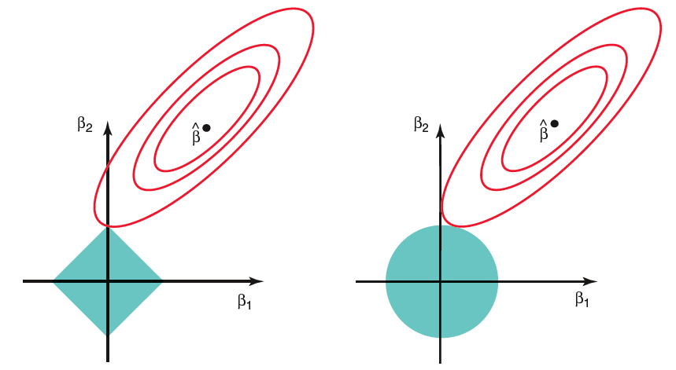

# Variable Selection & Regularization

Let's consider the multiple linear regression model with $p$ predictors **plus** the intercept, i.e.
<font color="darkblue">
\[Y \sim 1+ X_1+X_2+ \ldots+X_p\]
</font>

In many applications, the number of explanatory variables, i.e., $p$ is large while in some cases we could even have $p\gg n$. However, this does not necessarily mean that all the variables are relevant to the response $Y$. In fact, <font color="blue"> _only a small portion_ of the $p$ variables are believed to be relevant to $Y$</font>.

Our **goal** in this chapter is to develop methods that will allow us to efficiently identify the set of predictors that are useful in estimating or predicting the response. Since the least squares estimator $\hat{\mathbf{\beta}}$ is _unbiased_, this implies that irrelevant estimators  $\hat{\beta}_j$  will eventually go to zero. So, if  our task is to do well on prediction, _then we need to reflect on whether it is it important to remove unnecessary variables from the model_.

 <br>

To better understand the implications of unnecessary parameters in a MLR model, we  further discuss and quantify the  <font color="darkblue">**Training**</font> and  <font color="darkblue">**Testing Errors**</font> .

<br>

## Training vs. Testing Errors

Consider that we _split our data in two parts_:

* <font color="darkblue">**Training data**</font> $\{\mathbf{x}_i, y_i \}_{i=1}^n$ are used to fit our model

* <font color="darkblue">**Testing data**</font> $\{\mathbf{x}_i, y_i^* \}_{i=1}^n$  are an **independent** data set collected at   locations $\mathbf{x}_i$


<font color=orange>**Remark**</font>: In practice, we are given a full data set to analyze, which we then need to split it in two parts (typically in a random fashion) - a _training_ part and a _testing_ part with a higher percentage allocated to the training data (usually ~80%).

<br>


We assume that both _testing_ and _training_ data come from the <font color=blue>same population</font> or are collected at the same locations $\mathbf{x}_i$. Then, _statistically_ we can write both models as follows:

<div class=motivationbox>
  \[\mathbf{y}_{n\times 1},\,\,  \mathbf{y}^*_{n\times 1}  \sim^{iid} N_n(\mathbf{\mu},\sigma^2 \mathbf{I}_n) \text{ and } \mathbf{\mu}=\mathbf{X}\mathbf{\beta}\]
</div>

or equivalently,

<div class=motivationbox>
\[ \mathbf{y} = \mathbf{X}\mathbf{\beta} + \mathbf{\varepsilon},\, \mathbf{\varepsilon} \sim^{iid} \mathcal{N}_n(\mathbf{0},\sigma^2 \mathbf{I}_n) \quad \text{ and } \quad \mathbf{y}^* =\mathbf{X}\mathbf{\beta} + \mathbf{\varepsilon}^*,\, \mathbf{\varepsilon}^* \sim^{iid} \mathcal{N}_n(\mathbf{0},\sigma^2 \mathbf{I}_n) \]
\[ \text{ with }\,\, \mathbf{\varepsilon},  \mathbf{\varepsilon}^* \,\,  \text{ independent}.\]
</div>
<br>


Having these models in mind, we compute the <font color="darkblue">**MSE for train and testing data**</font>:<br>

Note that for simplicity in the calculations below, we have suppressed the intercept (so there is no $\beta_0$). If we have an intercept, then instead of $p$, we will have $p+1$.<br>


\begin{align*}
{\color{blue} {\mathbb{E}\bigl(\text{Train Error}\bigr)}} & =  \mathbb{E}\Bigl|\Bigl|\mathbf{y}-\hat{\mathbf{y}} \Bigr|\Bigr|^2=\mathbb{E}\Bigl|\Bigl|(\mathbf{I - H})\mathbf{y}\Bigr|\Bigr|^2\\
  &=tr \Bigl((\mathbf{I - H})Cov(\mathbf{y})(\mathbf{I - H})^T \Bigr)\\
  & = \sigma^2 tr\Bigl( (\mathbf{I - H}) \Bigr)=  (n-p) \sigma^2\\
  &= {\color{blue} {n\sigma^2 \mathbf{-} p \sigma^2}}\\
\end{align*}

<br>

\begin{align*}
{\color{blue} {\mathbb{E}\bigl(\text{Test Error} \bigr)}} & = \mathbb{E}\Bigl|\Bigl|\mathbf{y}^*-\mathbf{X}\hat{\mathbf{\beta}}\Bigr|\Bigr|^2\\
&= \mathbb{E}\Bigl|\Bigl|(\mathbf{y}^*- \mathbf{X} \mathbf{\beta})+(\mathbf{X} \mathbf{\beta}-\mathbf{X}\hat{\mathbf{\beta}})\Bigr|\Bigr|^2\\
&= \mathbb{E}\Bigl|\Bigl|\mathbf{y}^* -\mathbf{\mu}\Bigr|\Bigr|^2 + \mathbb{E}\Bigl|\Bigl|\mathbf{X} \mathbf{\beta}-\mathbf{X}\hat{\mathbf{\beta}}\Bigr|\Bigr|^2\\
&= \mathbb{E}||\mathbf{\varepsilon}^*||^2 + tr\Bigl(\mathbf{X}Cov(\hat{\mathbf{\beta}})\mathbf{X}^T \Bigr)\\
&= n \sigma^2 +\sigma^2 tr\mathbf{H}\\
&= {\color{blue} {n \sigma^2 \mathbf{+}  p \sigma^2}}\\
\end{align*}

<br>

From the previous equations we can conclude that:

* <font color="blue">the _training error  decreases with $p$_ </font>.
    
* <font color="blue">the _testing error increases with $p$_ </font>.

<br>


This implies that if our goal is _pure prediction_, adding more variables to matrix $\mathbf{X}$ is not the best option. But, _does this imply that  the intercept-only model with $p=0$, i.e. the one with the smallest expected test error is the best_? **No!**

<br>

The previous analysis is based on the following <font color="darkblue">**Assumptions**</font>:

1. The mean of $\mathbf{y}$, i.e. $E(\mathbf{Y}|\mathbf{X})$,  is in $\mathcal{C}(\mathbf{X})$, i.e., there exists some coefficient vector $\mathbf{\beta}$ such that $E(\mathbf{Y}|\mathbf{X}) = \mathbf{X}\mathbf{\beta}$.

2. The design matrix $\mathbf{X}$ above contains all available predictors.  But, when we run a linear regression model using only a **subset** of the columns of $\mathbf{X}$, there will be _an additional **Bias** term_.

<br>

Even more generally, we may have a _model_:
<font color="darkblue"> \[Y = f(X) + \varepsilon\]</font>
 in which $f$ is not even linear. In such cases, we approximate $f$ with a linear function $f^*$ which means that we introduce bias. (Intuitively, this means that usually when  we do not know the underlying true model, a linear approximation is often a good first step.) In the same spirit, even when the underlying function is truly linear, we may still introduce bias when we use a subset of the design matrix $\mathbf{X}$, i.e. when the model misses some relevant variables.

In such cases, the training and testing errors compute as:
<div class=motivationbox>
<font color="darkblue">
\begin{align*}
\mathbb{E}\bigl(\text{Test Error}\bigr)^2 &= n\sigma^2 + \color{blue}{p\sigma^2} + \color{orange}{Bias}\\
\mathbb{E}\bigl(\text{Training Error}\bigr)^2 &= n\sigma^2 - \color{blue}{p\sigma^2} + \color{orange}{Bias}
\end{align*}
</font>
where <font color="blue">$p\sigma^2$</font> is the unavoidable error -- the $\varepsilon$ -- and <font color="orange">Bias</font> is the model error.

* Bigger model (i.e., $p$ large) $\rightarrow$   small Bias, but  large Variance ($p\sigma^2$) 

* Smaller model (i.e., $p$ small) $\rightarrow$  large Bias, but small Variance ($p\sigma^2$).
</div>

To reduce the *test error* (i.e., prediction error), the key is to find the best <font color=blue>**trade-off** between Bias and Variance</font>.   

<br><br>


## Subset Selection

The idea behind _subset selection_ is to score each model according to an information criterion and then use a search algorithm to find the optimal model. In this way, we take into account
<div class=motivationbox>
\[\text{Training Error + Complexity Penalty}\]
</div>
In the context of linear regression models, the _complexity of a model increases with the number of predictor variables_ (i.e., $p$). 

* **Training Error**: an increasing function of $RSS$.

* **Complexity Penalty**: an increasing function of $p$.

<br>

> _Why don't we just use $R^2$ or $RSS$?_ The main reason is that $R^2$ always increases when we introduce variables in the model, while $RSS$ always reduces. Therefore, $R^2$ and $RSS$ do not penalize for introducing unnecessary variables in the model.

<br><br>


###  Information Criteria-based procedures


<font color=blue>**Akaike Information Criterion & Bayesian Information Criterion** </font>

$AIC$ and $BIC$   are defined as

\begin{align*}
AIC &= -2\cdot loglik  + 2\; p \\
BIC &= -2\cdot loglik  + \log(n)\; p
\end{align*}
where $p$ is the number of predictors included in model under consideration. $loglik$ denotes the log-likelihood of the model under consideration. For the <font color="darkblue">normal-error linear regression model</font>, the first term computes:
\[-2 \cdot  loglik = n\log \frac{RSS}{n} \]
which means that
<div class=motivationbox>
\begin{align*}
AIC &= n\log \frac{RSS}{n} + 2\; p\\
BIC &= n\log \frac{RSS}{n} + \log(n)\; p
\end{align*}
</div>

The **lower** the AIC/BIC the **better**. Note that when $n$ is large, _adding an additional predictor costs a lot more in BIC than AIC_. So, AIC tends to pick a bigger model than BIC.
<br><br>


<font color=blue>**Adjusted-$R^2$ for model with $p$ predictors**</font>

<div class=motivationbox>
\begin{align*}
R^2_a & = 1-\frac{RSS/(n-p-1)}{TSS/(n-1)}\\
& = 1- (1-R^2)\Bigl(\frac{n-1}{n-p-1}\Bigr)\\
& = {\color{blue}{1-\frac{\hat{\sigma}^2}{\hat{\sigma}^2_0}}}
\end{align*}
where $\hat{\sigma}$ is the estimated error variance for the current fitted model, and $\hat{\sigma}^2_0$ is the estimated error variance for the full fitted model.  
</div>
The **higher** the $R^2_a$ the **better**.
    
<br><br>
    
<font color=blue>**Mallow's $C_p$**</font>

<div class=motivationbox>
\[C_p = \frac{RSS_{\mathbf{p}}}{\hat{\sigma}_0^2} +2p-n\]
</div>
where $\hat{\sigma}_0^2$ is the estimate of the error variance for the full model.
Mallow’s $C_p$ behaves very similar to AIC and the **lower** the $C_p$ the **better**.

<br><br>

<div class=examplebox>
**Illustration of Complexity Criteria vs. $p$**<br>

As an illustration, the complexity penalties $R^2_{\text{adjusted}}$, Mallow's $C_p$, $AIC$, and $BIC$  are plotted as a function of $p$ (the number of parameters in the model) for the `student-grades` data set (the example in the last section):
<br>

```{r ,echo=FALSE, message=FALSE, warning=FALSE, fig.align="center", out.width="95%", fig.cap="Subset selection criteria vs. p."}
knitr::include_graphics("images/week3/criteria.png")
```
</div>

<br><hr><br>

### Search Algorithms

In the beginning of this section, we discussed that to select the optimal model, we need to penalize the models using the preferred penalty. If we have (in total) $p$ available predictors, then there are $2^p$ potential models. Ideally, we would like to search and score all of these models. If $p$ is large, then we need to employ systematic algorithms that search and score potential models.<br>

<br>

<font color="darkblue">**Level-wise search algorithms**</font>: These are algorithms  return the global optimal solution among *all possible models* and work only for less than *40* variables.
<br>

The idea is that they finds  $m$ different models (default $m$ in `R` is 8) of up to size $p$ with the smallest $RSS$ among all the models of the same size. Then, they evaluate the score on the $p$ models and report the optimal one. It is important to note that  the algorithm does not need to visit every model. For example, if we know that  $RSS(X1, X2) < RSS(X3, X4, X5, X6)$,  then it is not necessary to search any size 2 or 3 _sub-models_ of set $(X3, X4, X5, X6)$ meaning that these models may  be leaped over.
        
<br><br>


<font color="darkblue">**Greedy algorithms**</font>: These  algorithms  add and/or remove variables based on the score given by a criterion such as AIC/BIC. They can move :

* <font color=blue>*Backwards*</font>: start with the full model and sequentially delete predictors until the score does not improve.
         
* <font color=blue>*Forward*</font>: start with the null model and sequentially add predictors until the score does not improve.
         
* <font color=blue>*Stepwise*</font>: consider both deleting and adding one predictor at each stage.

These algorithms are computationally efficient, but they only return a _locally optimal_ solution which usually  good enough in practice.
<br>
     <br>

#### Some considerations {-}
 
In some cases, specially when $p\gg n$ starting with the full model and using the stepwise procedure is not feasible. Therefore, we need to screen some of the variables and remove them, before employing the search algorithms. A common variable screening approach is the following:

* Pick a _smaller initial model_ as a starting point by **ranking** the $p$ predictors by the absolute value of their (marginal) correlation with $Y$.

* Keep the **top** $K$ predictors (e.g., $K = n/3$). 
         
* Use the stepwise procedure so that you can add  removed variables back to the model.


<br><hr><br>


## Shrinkage Methods


The variable selection methods we already discussed work quite well in practice when it comes to data sets where we do not have too many predictors. For example, recall that the _level-wise_ algorithms are good when $p<40$. 

In this section, we are going to study two different methods we can use to <font color="darkblue">**shrink**</font> the number of predictors in order to select the optimal model that balances the _trade-off between model bias and prediction error (variance)_.


Let us then re-frame what we have been doing so far:

<br><br>

<font color="darkblue">**Regression with Penalization**</font>


\begin{align*}
\hat{\beta} &= \arg\min_{\beta} ||\mathbf{y} - \mathbf{X}\beta||^2 + \underbrace{\lambda \sum_{j=1}^{p} \mathbf{1}_{\beta_j \neq 0}}_{\text{penalty}}\\
&=  \arg\min_{\beta} ||\mathbf{y} - \mathbf{X}\beta||^2 + \underbrace{\lambda ||\beta||_0}_{\text{penalty}}
\end{align*}
where $||\beta||_0 = \sum_{j=1}^{p} \mathbf{1}_{\beta_j \neq 0}$. The *vector norm*   $||\beta||_0$ can be thought of as a function that decides whether a variable is **in** or **out** of the model. Then, the different criteria we discussed before rise by choosing $\lambda$ properly.
 
<br>
Taking this idea one step further (remembering our linear algebra tools), we can replace the _0-norm_ above with a different one, e.g. the $L^1$ or the $L^2$ norm. Exactly this observation, lead to two extremely popular _penalized regression_ methods:

* the  <font color="blue">**Ridge Regression**</font>
\[\hat{\beta} =  \arg\min_{\beta} ||\mathbf{y} - \mathbf{X}\beta||^2 + \underbrace{\lambda ||\beta||^2}_{\text{penalty}}, \text{ where } ||\beta||^2 = \sum_{j=1}^{p} \beta_j^2\]

* the <font color="blue">**Lasso Regression**</font>
\[\hat{\beta} =  \arg\min_{\beta} ||\mathbf{y} - \mathbf{X}\beta||^2 + \underbrace{\lambda |\beta|}_{\text{penalty}}, \text{ where }  |\beta| = \sum_{j=1}^{p} |\beta_j|\] 


<br>
In the next sections, we discuss the mathematics and the implementation of these methods. However, before proceeding, we need to make two consider the following:


<div class=learningbox>
**Implementation Considerations**

When the penalization norm changes, we observe that the penalty term that arises (in both cases) *is not location or scale invariant*.  This implies that if we re-scale a variable then the penalized $\beta$ estimators will be sensitive to these values. Therefore, it is suggested that we **center** and **scale** each column of the design matrix $\mathbf{X}$. Specifically, if $\mathbf{x}_{j}$, $j=1, \ldots, p$ is a column of $\mathbf{X}$, then
\[\tilde{\mathbf{x}}_{j} = \frac{ \mathbf{x}_{j} - \bar{\mathbf{x}}_{j} } { sd_{\mathbf{x}_{j}}} \] 
In addition to that we **center** $\mathbf{y}$ to _suppress the intercept_, i.e.  \[\mathbf{\tilde{y}}_i = \mathbf{y}_{i} - \bar{\mathbf{y}}\]


<br> After the model selection/fitting, we can always transform the variables back to their original values so that we continue with interpretation and/or prediction. We can also _estimate back the intercept_ as follows:

\[\hat{\beta}_0 = \bar{y} - \sum_{j=1}^{n} \hat{\beta}_j \bar{\mathbf{x}}_{j} \]

Note that in `R` tha `glmnet` package handles the centering and scaling (and transformation back to original) automatically.
</div>

<br><hr><br>

### Ridge Regression

Ridge regression assumes that after normalization, some of the regression coefficients should not be very large. Ridge regression is very useful when you have collinearity and the LS regression coefficients are unstable. In fact, it was initially introduced by A. Tikhonov to remedy multi-collinearity problems by adding a non-negative constant to the diagonal of the design matrix.

<br>

<div class=motivationbox>
**Ridge Regression**

The idea of the method is to add a **penalty** term to  the LS minimization problem :
\[\text{minimize}_{\beta}\,  (y-X \beta)^T(y-X \beta) + {\color{blue}{\lambda \sum_j \beta_j^2}}\]
for some $\lambda \ge 0$. The penalty term is $\sum_j \beta_j^2$.
</div>


As discussed before, for the method to be more effective, we prefer to _standardize_ the  predictors first (centered by their means and scaled by their standard deviations) and  center the response $y$. 


One of the main advantages of the ridge regression is that it provides us with closed-form solutions for the $\beta$ coefficients. Indeed, solving the minimization problem we obtain:
<font color="darkblue">
\[\hat{\beta}_{\text{Ridge}}=(X^T X+\underbrace{\lambda I}_{\text{ridge}})^{-1} X^T y\]
</font>

It is easy to see that when $\lambda=0$ the ridge regression estimation problem reduces to the standard least squares problem, while when $\lambda \rightarrow \infty$, the ridge coefficients $\hat{\beta} \rightarrow \mathbf{0}$. As a result, during implementation, one of the main considerations is how to choose $\lambda$. Choosing a very small (relatively speaking) value for $\lambda$ leads back to the usual LS estimators, while choosing a very large value for $\lambda$ makes most estimators zero.

To balance this trade-off in practice, a common approach is to use automated methods such as _Generalized Cross-Validation_ (GCV). The main _disadvantage_ of the ridge regression estimators is that they are **biased**, that is $\mathbb{E}(\hat{\beta}) = \beta + \text{ bias}$.

<br>
To better understand the structure of the ridge regression LS Coefficients, assume that $\mathbf{X}^T\mathbf{X} = \mathbf{I}_p$,  that is the columns of the design matrix are  orthogonal. Then, the general formula above reduces to
\[\hat{\beta}_{ridge} = \bigl(\mathbf{X}^T \mathbf{X} + \lambda I \bigr)^{-1} \mathbf{X}^T \mathbf{y} = \frac{1}{1+\lambda} \mathbf{X}^T \mathbf{y}\]
Similarly, the fitted values 
\[\hat{\mathbf{y}}_{ridge} = \mathbf{X} \hat{\beta}_{ridge} = \frac{1}{1+\lambda}\; \hat{\mathbf{y}}_{LS} \]


 If the columns of the design matrix are not orthogonal, then we can run the regression against an orthonormal version of $\mathbf{X}$, known as _principal components analysis_, or _singular value decomposition_.


<br>

#### Singular Value Decomposition (SVD) {-}

The Singular Value Decomposition (SVD) is one of the most important concepts in applied mathematics. It is used for a number of application including dimension reduction and data analysis. Principal Components Analysis (PCA) is also a special case of the SVD. 


<div class=motivationbox>
**SVD of $\mathbf{X}_{n\times p}$**

Consider the design matrix $\mathbf{X}_{n\times p}$. Then, $\mathbf{X}$ can be written as
\[\mathbf{X} = \mathbf{U}_{n\times p} \; \mathbf{D}_{p\times p}\, \mathbf{V}_{p\times p}^T\]

where

*  $\mathbf{U}_{n\times p}$ orthogonal matrix with columns that are spanning  $\mathcal{C}(\mathbf{X})$.

* $\mathbf{V}_{p\times p}$ orthogonal matrix with columns that are spanning $\mathbb{R}^p$.

* $\mathbf{D}_{p\times p}$ diagonal values with $d_1 \geq \ldots \geq d_p \geq 0$ the singular values of $\mathbf{X}$. If one or more $d_j = 0$, then $\mathbf{X}$ is singular, i.e. not full-rank.<br>

This factorization of the matrix $\mathbf{X}$ is called the **singular value decomposition of** $\mathbf{X}$, and the columns of  $\mathbf{U}$ and  $\mathbf{V}$ are called the left- and right-hand **singular vectors** of $\mathbf{X}$.
</div>

For simplicity in the discussion, let $n>p$ and  $rank(\mathbf{X}) = p$, which also implies that $d_p>0$.

<br>
**Some Useful Properties of the SVD**

1. The left-hand singular vectors are a set of orthonormal eigenvectors for $\mathbf{X}^T\mathbf{X}$, i.e. $\mathbf{U}^T\mathbf{U} = \mathbf{I}$.

2. The right-hand singular vectors are a set of orthonormal eigenvectors for $\mathbf{X}\mathbf{X}^T$, i.e. $\mathbf{V}^T\mathbf{V}=\mathbf{I}$.

3. The eigenvectors $\mathbf{v}_j$ are also called the *principal components directions* of the columns of $\mathbf{X}$. 

4. The first principal component direction $v_1$ has the property that $z_1 = \mathbf{X} \mathbf{v}_1 = \mathbf{u}_1 d_1$ has the largest sample variance among all normalized linear combinations of the columns of $\mathbf{X}$.

5. The singular values are the square roots of the eigenvalues for $\mathbf{X}^T\mathbf{X}$ and $\mathbf{X}\mathbf{X}^T$, since these matrices have the same eigenvalues.

6. The first singular value is equal to 
\[\sigma_1 = \max_{||x||=1} ||\mathbf{X}||_2\]


<br>


One of the goals of _principal components analysis_ is to find the new coordinates, or _scores_, of the data in the principal components basis. If the original (centered or standardized) data was contained in the matrix $\mathbf{X}$ and the eigenvectors of the covariance/correlation matrix $(\mathbf{X}^T\mathbf{X})$ were columns of a matrix $\mathbf{V}$, then to find the scores ($\mathbf{S}$ ) of the observations on the eigenvectors we can use the following equation:
\[\mathbf{X} = \mathbf{S} \mathbf{V}^T\]
where each columns of $\mathbf{S}_{n\times p} = \mathbf{U}\mathbf{D}$ is the
so-called **principal component** and each column of $V$ is the **principal
component direction** of $\mathbf{X}$.


<br>

#### SVD of Fitted Values: LS vs. Ridge {-}

To observe how the _ridge_ affects the structure of the fitted $\beta$, we have the following. 

* In _least-squares_ regression, the fitted values compute as:

\begin{align*}
{\color{blue}{\hat{\mathbf{y}}_{LS}}} &= \mathbf{X} \hat{\beta}_{LS}= \mathbf{X} \bigl(\mathbf{X}^T \mathbf{X} \bigr)^{-1} \mathbf{X}^T \mathbf{y}\\
&= \mathbf{U} \; \mathbf{D}\; \mathbf{V}^T \bigl(\mathbf{V}\; \mathbf{D}^2\; \mathbf{V}^T\bigr)^{-1} \mathbf{V}\; \mathbf{D}\;\mathbf{U}^T \mathbf{y}\\
&= \mathbf{U} \; \mathbf{D}\; \mathbf{V}^T \bigl( \mathbf{V}^T \bigl)^{-1}\; \mathbf{D}^{-2}\; \mathbf{V}^{-1} \mathbf{V}\; \mathbf{D}\;\mathbf{U}^T \mathbf{y}\\
&= \mathbf{U} \; \mathbf{D}\; \mathbf{D}^{-2}\mathbf{D}\;\mathbf{U}^T \mathbf{y}\\
&= {\color{blue}{\mathbf{U} \mathbf{U}^T \mathbf{y}}}\\
&= {\color{blue}{\sum_{j=1}^{p} \bigl(\mathbf{u}_j^T \mathbf{y} \bigr) \mathbf{u}_{j}}}
\end{align*}
where we used the facts that $\mathbf{U}^T \mathbf{U} =\mathbf{I}$, and that
\[\mathbf{X}^T \mathbf{X} = \mathbf{V}\; \mathbf{D}^T\;\mathbf{U}^T \mathbf{U} \; \mathbf{D}\; \mathbf{V}^T = \mathbf{V}\; \mathbf{D}^2\; \mathbf{V}^T\]
The last expression is the _eigen-decomposition of $\mathbf{X}^T \mathbf{X}$_. 
<br>

Similarly, for the ridge regression coefficients, we have:


\begin{align*}
{\color{blue}{\hat{\mathbf{y}}_{ridge}}} &= \mathbf{X} \hat{\beta}_{ridge}\\
&= \mathbf{X} \bigl(\mathbf{X}^T \mathbf{X} + \lambda \mathbf{I} \bigr)^{-1} \mathbf{X}^T \mathbf{y}\\
&= \mathbf{U}\;\mathbf{D}\;\mathbf{V}^T \bigl(  \mathbf{V}\; \mathbf{D}^2\; \mathbf{V}^T + \lambda \mathbf{I} \bigr)^{-1}\mathbf{V}\;\mathbf{D}\;\mathbf{U}^T  \mathbf{y}\\
&= \mathbf{U}\;\mathbf{D}\;\mathbf{V}^T \bigl(  \mathbf{V}\; \mathbf{D}^2\; \mathbf{V}^T + \lambda \mathbf{V}\mathbf{V}^T \bigr)^{-1}\mathbf{V}\;\mathbf{D}\;\mathbf{U}^T  \mathbf{y}\\
&= \mathbf{U}\;\mathbf{D}\;\mathbf{V}^T \bigl(  \mathbf{V}\; \bigl( \mathbf{D}^2 + \lambda \mathbf{I} \bigr)\;  \mathbf{V}^T \bigr)^{-1}\mathbf{V}\;\mathbf{D}\;\mathbf{U}^T  \mathbf{y}\\
&= \mathbf{U}\;\mathbf{D}\;\mathbf{V}^T (\mathbf{V}^T)^{-1}\; \bigl( \mathbf{D}^2 + \lambda \mathbf{I} \bigr)^{-1}\;  \mathbf{V}^{-1}\mathbf{V}\;\mathbf{D}\;\mathbf{U}^T  \mathbf{y}\\
&= {\color{blue}{\mathbf{U}\mathbf{D}\;\bigl( \mathbf{D}^2 + \lambda \mathbf{I} \bigr)^{-1}\; \mathbf{D}\mathbf{U}^T  \mathbf{y}}}
\end{align*}

In this last expression, note that 

* $\mathbf{D}\;\bigl( \mathbf{D}^2 + \lambda \mathbf{I} \bigr)^{-1}$ is a diagonal matrix with elements given by $\frac{d_j^2}{d_j^2 + \lambda}$.

* the vector $\mathbf{U}^T  \mathbf{y}$ is the coordinates of the vector $\mathbf{y}$ in the basis spanned by the $p$ columns of $\mathbf{U}$.

Therefore, $\hat{\mathbf{y}}_{ridge}$ simplifies to 
\[{\color{blue}{\hat{\mathbf{y}}_{ridge} = \sum_{j=1}^{p} \mathbf{u}_j \;  \frac{d_j^2}{d_j^2 + \lambda}  \; \mathbf{u}_j^T \mathbf{y}}}\]

As we can observe, the inner products $\mathbf{u}_j^T \mathbf{y}$ are scaled by the factors  $\frac{d_j^2}{d_j^2 + \lambda}$, or in other words the ridge estimate $\hat{\beta}_{ridge}$ <font color="darkblue">**shrinks  the LS estimate $\hat{\beta}_{LS}$ by a  factor of $\frac{d_j^2}{d_j^2 + \lambda}$**</font> where _the smaller the eigenvalues the more the shrinkage_. Essentially, ridge regression projects $\mathbf{y}$ onto the principal components, and then shrinks the coefficients of the low–variance components more than the high-variance components.


<br>


#### Complexity of Ridge Regression {-}

To quantify the complexity of a model, heuristically we need to understand the number of coefficients that need to be estimated. So, a linear regression model is a model with $p$ covariates and $p$ $\beta$ coefficients, so it has $p$ degrees of freedom. In ridge regression however, the estimated $\beta$s are still $p$-dimensional, however the method does not use all strength of the $p$ covariates due to shrinkage. If $\lambda$ is extremely large, there will be no effective covariates left in the model, meaning that they should all be close to zero. On the other hand, if $\lambda$ is 0, then we go back to linear regression with $p$ covariates and $p$ degrees of freedom. So, in the case of the ridge regression, the truth lies somewhere between 0 and $p$.

Let's formalize the intuition, by recalling that one method to compute the degrees of freedom of a model is to relate them to the correlation between the observed and fitted values as follows:
\[df = \sum_{i=1}^{n} Cor \bigl(y_i,\; \hat{y}_i \bigr)\]


* <font color="darkblue">**Linear regression**</font>:<br>
We have already shown that the fitted values can be expressed as $\hat{\mathbf{y}} = \mathbf{H} \mathbf{y}$,  in which case
\[df = \sum_{i=1}^{n} Cor \bigl(y_i,\; \hat{y}_i \bigr) = \sum_{i=1}^{n} H_{ii} = tr \bigl( \mathbf{H} \bigr) = p\]
where (recall) $\mathbf{H}$ is the hat (projection) matrix equal to $\mathbf{X} \bigl( \mathbf{X}^T \mathbf{X} \bigr)^{-1} \mathbf{X}^T \mathbf{y}$.

<br>

*  <font color="darkblue">**Ridge regression**</font>:<br>
We have shown that $\hat{y} = \underbrace{ \mathbf{X} \bigl(\mathbf{X}^T \mathbf{X} + \lambda \mathbf{I} \bigr)^{-1} \mathbf{X}^T}_{:= \mathbf{S}_{\lambda}} \mathbf{y} = \mathbf{S}_{\lambda}\mathbf{y}$.  So, the effective degrees of freedom of the ridge regression are

\begin{align*}
df(\lambda) &= \sum_{i=1}^{n} Cor \bigl(y_i,\; \hat{y}_i \bigr) = \sum_{i=1}^{n} [S_{\lambda}]_{ii}\\
&= tr(\mathbf{S}_{\lambda}) \\
&=  tr(\mathbf{X} \bigl(\mathbf{X}^T \mathbf{X} + \lambda \mathbf{I} \bigr)^{-1} \mathbf{X}^T)\\
&= tr\Biggl( \sum_{j=1}^{p} \frac{d_j^2}{d_j^2 + \lambda} \mathbf{u}_i \mathbf{u}_i^T\Biggr) =  \sum_{j=1}^{p} \frac{d_j^2}{d_j^2 + \lambda}   
\end{align*}
Based on the expression above, we can see that the degrees of freedom of the ridge regression are a _decreasing_ function of $\lambda$, and reduce to $p$ when $\lambda = 0$. One important consequence of this expression is that we can use it to determine the values of $\lambda$ to use when applying cross validation. This can be done by thinking $df(\lambda)$ as a function of $\lambda$ and then setting $df(\lambda)=k$, with $k=1, \ldots, p$ representing all possible dfs. Then, we can solve with respect to $\lambda$ using a numerical approach.


<br><hr><br>


### Lasso Regression


Lasso Regression is similar to the Ridge regression in the sense that it minimizes the least squares criterion _subject to a penalty term_. However, the penalty term is different in the case of lasso. 
<br>

<div class=motivationbox>
**Lasso Regression**

$\hat{\beta}_{\text{LASSO}}$ minimizes:
\[\text{minimize } (y-X \beta)^T (y-X\beta) + \lambda \sum_j |\beta_j|\]
for some $\lambda \ge 0$. The penalty term is $\sum_j |\beta_j|$ ($L_1$ constraint).
</div>

In two-dimensions the constraint defines a square, while in higher dimensions it defines a  polytope. Lasso is useful when the response can be explained by _few_ predictors with zero effect on the remaining predictors (Lasso is similar to a variable selection method).  When $\beta_j=0$ the corresponding predictor is eliminated which is not the case for ridge regression. Therefore, we use lasso when the effect of predictors is **sparse**. This means that only few predictors will have an effect on the response (e.g. gene expression data) or when number of predictors is large ($p>n$). 


The lasso solution is defined as
\[\hat{\beta}_{lasso} = \arg \min_{\beta\in \mathbb{R}^{p}} \Bigl((y-X\boldsymbol{\beta})^\top(y-X\boldsymbol{\beta}) + \lambda \sum_j |\beta_j| \Bigr)\]
and does not have a closed form expression.

If we assume that $\mathbf{X}^T\mathbf{X} = \mathbf{I}_p$}, then
\begin{align*}
||\mathbf{y} - \mathbf{X}\beta||^2 &= ||\mathbf{y} - \mathbf{X}\hat{\beta}_{LS} + \mathbf{X}\hat{\beta}_{LS} - \mathbf{X}\beta||^2\\
&=||\mathbf{y} - \mathbf{X}\hat{\beta}_{LS}||^2 + ||\mathbf{X}\hat{\beta}_{LS} - \mathbf{X}\beta||^2
\end{align*}
where
\[2  \bigl( \mathbf{y} - \mathbf{X}\hat{\beta}_{LS}\bigr)^T \bigl(  \mathbf{X}\hat{\beta}_{LS} - \mathbf{X}\beta \bigr) = 2 \; r^T \; \bigl(  \mathbf{X}\hat{\beta}_{LS} - \mathbf{X} \beta\bigr) =0\]
since the swecond term is a linear combination of columns of $\mathbf{X}$ no matter what value $\beta$  takes, and thus is in $\mathcal{C}(\mathbf{X})$, therefore orthogonal to the residual vector $r$.

<br>

#### Obtaining the Lasso Solution {-}

Although we do not have a closed form solution in the case of lasso, the minimization problem we have to solve is not very challenging.

<br>

The lasso solution can be expressed as:

\begin{align*}
\hat{\beta}_{lasso} &= \arg \min_{\beta\in \mathbb{R}^{p}} \Bigl( ||\mathbf{y}-\mathbf{X} \beta||^2 + \lambda |\beta| \Bigr)\\
&= \arg \min_{\beta\in \mathbb{R}^{p}} \Bigl( ||\mathbf{X} \hat{\beta}_{LS} -\mathbf{X} \beta||^2 + \lambda |\beta| \Bigr)\\
&= \arg \min_{\beta\in \mathbb{R}^{p}} \Bigl( \bigl(  \hat{\beta}_{LS} - \beta \bigr)^T \mathbf{X}^T \mathbf{X}  \bigl(  \hat{\beta}_{LS} - \beta \bigr) + \lambda |\beta| \Bigr)\\
&= \arg \min_{\beta\in \mathbb{R}^{p}} \Bigl( \bigl(  \hat{\beta}_{LS} - \beta \bigr)^T  \bigl(  \hat{\beta}_{LS} - \beta \bigr) + \lambda |\beta| \Bigr)\\
&= \arg \min_{\beta_1, \ldots, \beta_p} \sum_{i=1}^{p}  \Bigl( \bigl(  \beta_{j} - \hat{\beta}_{(LS)j} \bigr)^2  + \lambda |\beta_j| \Bigr)\\
\end{align*}

We can find the *optimal* $\beta_j$ for each of $j=1, \ldots, p$ **separately**  by solving the following generic problem for each dimension:
<div class="motivationbox">
\[\arg \min_{x} \bigl( x-a \bigr )^2 + \lambda |x|,\,\, \lambda >0\]
</div>

Therefore, to solve the one-dim lasso above, define 
\[f(x)  = \bigl( x-a \bigr )^2 + \lambda |x|,\,\, a\in\mathbb{R},\,\,\lambda >0\]


The value $x^*$ that minimizes $f(x)$ must satisfy:
\begin{align*}
\frac{\partial}{\partial x} \bigl(x^* - a \bigr)^2 + \lambda \;\frac{\partial}{\partial x} |x^*| & = 0\\
2\bigl(x^* - a \bigr) +\lambda z^* &= 0
\end{align*}
where $z^*$ is the _sub-gradient_ of the absolute value function evaluated at $x^*$, which equals to $sign(x^*)$ if $x^*\neq 0$ and any number in [-1,1], if $x^*=0$.

<br>
Therefore, the minimizer of $f(x)$ is given by
<font color="darkblue">
\[x^* = S_{\lambda/2}(a) = sign(a) \bigl(|a|-\lambda/2 \bigr)_{+} = 
\begin{cases}
& a-\lambda/2,  \text{ if } \,\,  a \; >\lambda/2\\
& 0, \qquad \quad \text{ if } |a| \leq \lambda/2\\
& a+\lambda/2,  \text{ if } \,\,  a \; < -\lambda/2\\
\end{cases}
\]
</font>
where $S_{\lambda/2}(\cdot)$ is often referred to as the **soft-thresholding operator**.


<br>
When the design matrix $\mathbf{X}$ is orthogonal, the lasso solution simplifies to

\[\hat{\beta}_{j}^{lasso} = \begin{cases}
& sign (\hat{\beta}_{(LS)j} - \lambda/2), \text{ if }|\hat{\beta}_{(LS)j}| > \lambda/2\\
& 0, \text{ if }|\hat{\beta}_{(LS)j}| \leq \lambda/2\\
\end{cases}
\]


A large $\lambda$ will cause some of the coefficients to be exactly zero. So, lasso does both variable (subset) selection and (soft) shrinkage.

<br>

<font color="darkblue">**Remarks**</font>

* It is suggested to use lasso when the effect of predictors is _sparse_, since lasso will "make" some of the $\beta$ coefficients zero keeping the coefficients that will have an effect on $\mathbf{y}$. This is the reason why this method also works when the number of predictors is larger than the sample size ($p>n$). These are scenarios often encountered in genomic or proteomic data where the design matrices tend to have a lot of zeros and too many predictors.

* In lasso as in ridge regression, we can select $\lambda$ using Cross-Validation (CV). When $\lambda$ increases, the number of predictors decreases.

<br>


<font color="darkblue">**Comparing Ridge Regression and Lasso**</font>
  
  
Lasso selects a sub-set of predictors (some coefficients will equal to zero), while ridge regression performs better when the response is a function of many predictors with coefficients around the same size. Lasso will perform better when a relatively small number of predictors have large coefficients and the rest are very small or equal to zero.Since the number of predictors is never known _a priori_, cross-validation can be used to decide which approach is better for a particular data set.

Ridge regression does a proportional shrinkage. Lasso translates each
coefficient by a constant factor λ, truncating at zero.


```{r ,echo=FALSE, message=FALSE, warning=FALSE, fig.align="center", out.width="75%", fig.cap="Contour of the optimization for Lasso (left) and Ridge (right)."}

```
 

In the picture below, we can see the difference in the contours of optimization for lasso (left) and Ridge (right) when there are only two parameters. The residual sum of squares has elliptical contours, centered at the full least squares estimate, $\hat{\beta}_{LS}$. The constraint region for ridge regression is the disk $\beta_1^2 + \beta_2^2 \leq t$, while that for lasso is the diamond $|\beta_1| + |\beta_2| \leq t$. Both methods find the first point where the elliptical contours hit the constraint region. Unlike the disk, the diamond has corners which means that if the solution occurs at a corner, then it has one parameter
$\beta_j$ equal to zero. When $p>2$, the diamond becomes a rhomboid, and has many corners, flat edges and faces; there are many more opportunities for the estimated parameters to be zero.

<br>

#### Lasso with $p>n$ {-}


_When $\mathbf{X}$ is of full rank:_
 
* the lasso solution is the minimizer of a convex function over a convex set  

* the lasso solution is unique since the first term is a strictly convex function.


_When $\mathbf{X}$ is not of full rank, or when $p>n$:_ 
 
* The lasso criterion is no longer convex which means that it may not have a unique minimizer.first term is no longer strictly convex.  In the $p>n$ case, the lasso selects at most $n$ variables before it saturates, because of the nature of the convex optimization problem which is a limiting feature for a variable selection method.

<br><hr><br>


## The `Student Performance` Example


The `student-mat.csv` data set contains data from a study on student achievement in secondary education of two Portuguese schools. The data are based on the following publication:

> "Using data mining to predict secondary school student performance"
By P. Cortez, A. M. G. Silva. 2008. Published in Proceedings of 5th Annual Future Business Technology Conference.

and can be found in the UCI data repository: <a href="https://archive.ics.uci.edu/dataset/320/student+performance">here</a>


The variables in the data set are the following:

* `school` Student's school (_binary_: `GP` - Gabriel Pereira or `MS` - Mousinho da Silveira)
* `sex` Sex	student's sex (_binary_: `F` - female or `M` - male)
* `age` Student's age (_numeric_: from 15 to 22)
* `address` Student's home address type (_binary_: `U` - urban or `R` - rural)
* `famsize` Family size (_binary_: `LE3` - less or equal to 3 or `GT3` - greater than 3)
* `Pstatus` Parent's cohabitation status (_binary_: `T` - living together or `A` - apart)
* `Medu` Μother's education level (_numeric_: `0` - none, `1` - primary education (4th grade), `2` - 5th to 9th grade, `3` - secondary education or `4` - higher education)
* `Fedu` Father's education level (_numeric_: `0` - none, `1` - primary education (4th grade), `2` 5th to 9th grade, `3` -  secondary education or `4` higher education)
* `Mjob` Mother's occupation (_nominal_: `teacher`, `healthcare` related, `civil services` (e.g. administrative or police), `at_home` or `other`)
* `Fjob` Father's occupation (_nominal_: `teacher`, `healthcare` related, `civil services` (e.g. administrative or police), `at_home` or `other`)
* `reason` Reason to choose this school (_nominal_: close to `home`, school `reputation`, `course` preference or `other`)
* `guardian` Student's guardian (_nominal_: `mother`, `father` or `other`)
* `traveltime` Home to school travel time (_numeric_: `1` - <15 min., `2` - 15 to 30 min., `3` - 30 min. to 1 hour, or `4` - >1 hour)
* `studytime` Weekly study time (_numeric_: `1` - <2 hours, `2` - 2 to 5 hours, `3` - 5 to 10 hours, or `4` - >10 hours)
* `failures` Number of past class failures (_numeric_: `n` if 1<=n<3, else `4`)
* `schoolsup` Extra educational support (_binary_: `yes` or `no`)
* `famsup`  Family educational support (_binary_: `yes` or `no`)
* `paid` Extra paid classes within the course subject (Math or Portuguese) (_binary_: `yes` or `no`)
* `activities` Extra-curricular activities (_binary_: `yes` or `no`)
* `nursery` Attended nursery school (_binary_: `yes` or `no`)
* `higher`	Wants to take higher education (_binary_: `yes` or `no`)		
* `internet`	Internet access at home (_binary_: `yes` or `no`)		
* `romantic`	With a romantic relationship (_binary_: `yes` or `no`)	
* `famrel`	Quality of family relationships (_numeric_: from `1` - very bad to `5` - excellent)
* `freetime`	Free time after school (_numeric_: from `1` - very low to `5` - very high)		
* `goout`	Going out with friends (_numeric_: from `1` - very low to `5` - very high)		
* `Dalc`	Workday alcohol consumption (_numeric_: from `1` - very low to `5` - very high)
* `Walc`	Weekend alcohol consumption (_numeric_: from `1` - very low to `5` - very high)
* `health`	Current health status (_numeric_: from `1` - very bad to `5` - very good)		
* `absences`	Number of school absences (_numeric_: from `0` to `93`)		
* `G1`	First period grade (_numeric_: from `0` to `20`)
* `G2`	Second period grade (_numeric_: from `0` to `20`)
* `G3`	Final grade (_numeric_: from `0` to `20`, output target)


<br><br>


```{r}
stu_performance0 = read.csv2("data/week3/student-mat.csv", header=TRUE)
```

In our example, we want to focus on predicting the final grade (column `G3`) using penalized regression methods. A special variation of penalized regression is required when using categorical variables (e.g. *group lasso*), thus in this example we only focus on numerical predictors.

```{r}
## Remove categorical predictors
stu_performance = stu_performance0[,-c(1,2,4,5,6,9,10, 11, 12, 16, 17, 18, 19, 20, 21, 22, 23,31, 32)]

## Rename the response to "Grades"
names(stu_performance)[14] = 'Grades'

head(stu_performance)
n = dim(stu_performance)[1] ## sample size
p = dim(stu_performance)[2] - 1 ## number of non-intercept predictors
```


We start by fitting the **full linear model** including all the predictors:

```{r}
performance.full = lm(Grades ~ ., data=stu_performance)
summary(performance.full)
```
<br>

We may want to do model selection using the _testing approach_ (either via a backward/forward selection) removing or adding one variable at a time, or we can even compare the full model with a reduced containing only the variables that seem to be statistically significant:

<br>

```{r}
performance.red = lm(Grades ~ failures + goout + Medu, data=stu_performance)

## Model comparison based on a partial F test
anova(performance.red, performance.full)

```
<br>
In this case, we fail to reject the null so   the reduced model is preferred. However, this approach is not efficient nor optimal. Therefore, we use algorithms to search the space of models and a penalty to penalize the inclusion of terms that are not as useful.

<br>

#### Subset Selection via Level-wise algorithms & the `leaps` package
<br>


```{r}
library(leaps)
regsubsets_model = regsubsets(Grades~ ., data=stu_performance, nvmax = p)
rs = summary(regsubsets_model)
```

<br>
The `rs` object above contains all the different criteria for all the models that have been evaluated. The default maximum size of models is **8** and this is changed above with the `nvmax` option to $p=13$.

Below we extract the $R^2$, Adjusted $R^2$, $AIC$, $BIC$ and $C_p$-Mallows criteria for the 13 models that have been evaluated:

<br>
```{r}
## Extract the models' R^2
rs$rsq
```
The best model is the 13th model (as expected).
<br>

```{r}
## Extract the models' Adjusted R^2
rs$adjr2
```
The best model is the 11th model.
<br>

```{r}
## Extract the models' Cp Mallows
rs$cp
```
The best model is the 4th model.
<br>


```{r}
## Extract the models' BIC
rs$bic
```
The best model is the 2nd model.

<br>

If we want to identify which variables are included in each model, then we use the `rs$which` command, where the rows correspond to the model and the columns to the variable. TRUE means that the variable is included in the model and FALSE means otherwise.
<br>

```{r}
rs$which
```
<br>

For example, Model 1 only contains `failures`, and the `intercept.`

<br>

Next, compute "by hand" the AIC/BIC for those $p$ models and find the one that achieves the the smallest score:
<br>

```{r}
msize = 1:p;
par(mfrow=c(1,2))
Aic = n*log(rs$rss/n) + 2*msize;
Bic = n*log(rs$rss/n) + msize*log(n);
```

```{r}
Aic
```
AIC chooses the 4th model.
```{r}
Bic
```
As we saw before, BIC selects the 2nd model.
<br> 
We can also plot the results for the various models. So, we have
<br>

```{r}
par(mfrow=c(2,2))
plot(msize, rs$adjr2, xlab="No. of Parameters", ylab = "Adjusted Rsquare");
plot(msize, rs$cp, xlab="No. of Parameters", ylab = "Mallow's Cp");
plot(msize, Aic, xlab="No. of Parameters", ylab = "AIC")
plot(msize, Bic, xlab="No. of Parameters", ylab = "BIC")
```
<br>

For this particular data set, AIC and BIC end up selecting different models. **The model selected by AIC is larger than the one selected by BIC**, which is common. AIC favors larger models while BIC favors smaller models. Although the model selected by BIC does not have the smallest AIC score, its AIC score is very close to the smallest one.
<br>


```{r}
cbind(rs$which[which.min(Aic),], rs$which[which.min(Bic), ])
```
<br>

`leaps` does not return AIC, but BIC. Its BIC differs from what has been computed above, but the difference is a constant, so the two BIC formulas (ours and the one used by leaps) are essentially the same.
<br>

```{r}
cbind(rs$bic, Bic, rs$bic - Bic)
```
<br>

What are the 2nd and 3rd best models in terms of AIC/BIC?
This cannot be answered by looking at the AIC/BIC plots shown above. Instead, we need to run the following code.
<br>

```{r}
regsubsets_model.1 = regsubsets(Grades ~ ., data=stu_performance, nbest = 3, nvmax = p)
rs.1 = summary(regsubsets_model.1)
#rs.1$which
msize.1 = apply(rs.1$which, 1, sum) - 1
```

```{r}
par(mfrow=c(1,2))
Aic.1 = n*log(rs.1$rss/n) + 2*msize.1
Bic.1 = n*log(rs.1$rss/n) + msize.1*log(n)
plot(msize.1, Aic.1, xlab="No. of Parameters", ylab = "AIC")
plot(msize.1, Bic.1, xlab="No. of Parameters", ylab = "BIC")
```

```{r}
par(mfrow=c(1,2))
plot(msize.1, Aic.1, ylim = c(1135, 1152), xlab="No. of Parameters", ylab = "AIC")
plot(msize.1, Bic.1, ylim = c(1140, 1230), xlab="No. of Parameters", ylab = "BIC")
```


```{r}
# top three models by AIC
rs.1$which[order(Aic.1)[1:3],]
# top three models by BIC
rs.1$which[order(Bic.1)[1:3],]
```

<br><br>

#### Subset Selection via the `step` fucntion
<br>

<br>
We can use the **stepwise**  approach to search possible models moving forward, backwards or in both directions (stepwise).

The `R` function to do this is the `step` function. The default is the stepwise method, so if we want to change this, we choose the `direction` option. The method by default outputs **all** the steps of the algorithm, so we can set `trace=0` if we do not want to see the intermediate results.  Also, the default criterion for model selection is the `AIC`. However, we can select the BIC criterion by selecting `k = long(n)`.

<br>

```{r}
## Stepwise AIC

stepAIC = step(performance.full, trace=0, direction="both")  
#stepAIC = step(performance.full, direction="both")
```


```{r}
## Stepwise BIC

n = dim(stu_performance)[1]
stepBIC = step(performance.full, trace=0, direction="both", k=log(n))      
```

<br>

If we want to retrieve the output from the `step` function, then we can use the following code:
<br>

```{r}
sel.var.AIC = attr(stepAIC$terms, "term.labels")
sel.var.BIC = attr(stepBIC$terms, "term.labels")
sel.var.AIC
length(sel.var.AIC)
length(sel.var.BIC)
c("Medu", "failures","freetime", "goout") %in% sel.var.AIC
sel.var.BIC %in% sel.var.AIC
```

<br><br>

#### LASSO and RIDGE Regression

<br><br> 

`glmnet` is the  library needed for both lasso ($\alpha=1$) and ridge ($\alpha=0$). Check more `glmnet` examples at https://web.stanford.edu/~hastie/glmnet/glmnet_beta.html

<br>
```{r}
library(glmnet)
```


```{r}
## The input in the glmnet function should be in matrix format:

X = as.matrix(stu_performance[, names(stu_performance) != "Grades"])
Y = stu_performance$Grades
```

<br>

We are going to split the data in training (80%) and testing  (20%) data sets. Then, we will select the variables in the training set and estimate the coefficients and compute the average MSE on the testing data.

```{r}
## Training/ Testing Data Sets

ntest = round(n*0.2);    ## testing set sample size
ntrain = n - ntest;      ## training set sample size
test.id = sample(1:n, ntest);   ## sampling indices for the test data

Ytest = Y[test.id]; ## Response in the Testing data

```

<br>
Training the **full model** in the _training_ data set:
<br>

```{r}
## Fit the Full model in the training data
full.model = lm(Y[-test.id]~., data = stu_performance[-test.id, ])
```

<br> 
We then use the full model to **predict** values and _compute the MSE on the testing data set_:
<br>

```{r}
## Predicted values on the testing data set
Ytest.pred = predict(full.model, newdata= stu_performance[test.id, ]);

## Averaged MSE on the test set
sum((Ytest - Ytest.pred)^2)/ntest 
```