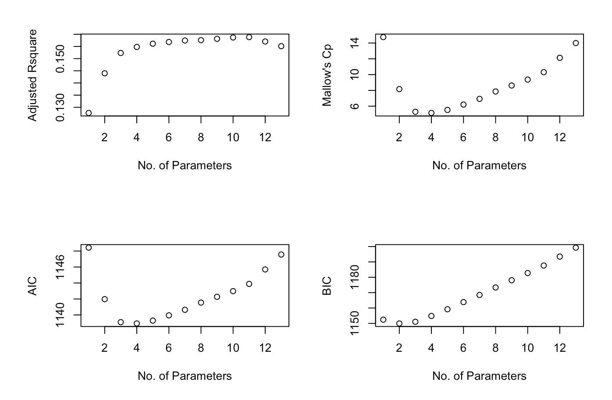
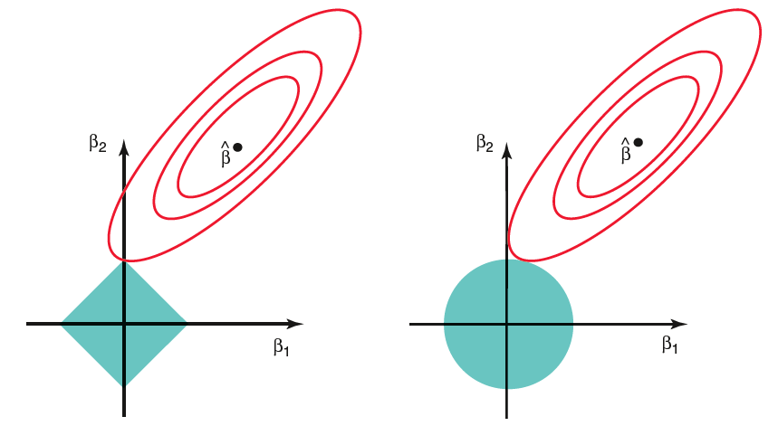

# Variable Selection & Regularization

Consider the multiple linear regression model with $p$ predictors **plus** an intercept:
<font color="darkblue">
\[Y \sim 1+ X_1+X_2+ \ldots+X_p\]
</font>

In many applications the number of explanatory variables $p$ is large; in some cases we even have $p \gg n$. This does not mean that every variable is relevant to the response $Y$. In fact, <font color="blue">_only a small fraction_ of the $p$ variables is typically believed to be relevant</font>.

Our **goal** in this chapter is to develop methods that efficiently identify the predictors that are useful for estimating or predicting the response. Because the least-squares estimator $\hat{\beta}$ is unbiased, the coefficients of irrelevant variables tend to be close to zero. Nevertheless, if our primary objective is good prediction, we must still ask whether it is beneficial to remove those unnecessary variables from the model.

 &nbsp;
 
To understand the consequences of including superfluous predictors, we first examine the **training** and **testing** errors more carefully.


&nbsp;

## Training vs. Testing Errors

Consider that we _split our data in two parts_:

- <font color="darkblue">**Training data**</font> $\{\mathbf{x}_i, y_i \}_{i=1}^n$: used to fit the model

- <font color="darkblue">**Testing data**</font> $\{\mathbf{x}_i, y_i^* \}_{i=1}^n$:   an **independent** data set collected at the same  locations $\mathbf{x}_i$


<font color=orange>**Remark**</font>: In practice we are given a single data set that we randomly partition into a training set and a testing set (typically allocating roughly 80 % of the observations to training).

&nbsp;


We assume that both _testing_ and _training_ observations come from the <font color=blue>same population</font> (or are observed at the same design points $\mathbf{x}_i$). Statistically we may therefore write

<div class="motivationbox">
  \[\mathbf{y}_{n\times 1},\,\,  \mathbf{y}^*_{n\times 1}  \sim^{iid} N_n(\mathbf{\mu},\sigma^2 \mathbf{I}_n) \text{ and } \mathbf{\mu}=\mathbf{X}\mathbf{\beta}\]
</div>

or equivalently,

<div class=motivationbox>
\[ \mathbf{y} = \mathbf{X}\mathbf{\beta} + \mathbf{\varepsilon},\, \mathbf{\varepsilon} \sim^{iid} \mathcal{N}_n(\mathbf{0},\sigma^2 \mathbf{I}_n) \quad \text{ and } \quad \mathbf{y}^* =\mathbf{X}\mathbf{\beta} + \mathbf{\varepsilon}^*,\, \mathbf{\varepsilon}^* \sim^{iid} \mathcal{N}_n(\mathbf{0},\sigma^2 \mathbf{I}_n) \]
\[ \text{ with }\,\, \mathbf{\varepsilon},  \mathbf{\varepsilon}^* \,\,  \text{ independent}.\]
</div>
&nbsp;


Having these models in mind, we compute the <font color="darkblue">**MSE for train and testing data**</font>:&nbsp;

For simplicity we suppress the intercept in the calculations below (so the model dimension is $p$ rather than $p+1$). The expected training and testing mean squared errors are then:


\begin{align*}
{\color{blue} {\mathbb{E}\bigl(\text{Train Error}\bigr)}} & =  \mathbb{E}\Bigl|\Bigl|\mathbf{y}-\hat{\mathbf{y}} \Bigr|\Bigr|^2=\mathbb{E}\Bigl|\Bigl|(\mathbf{I - H})\mathbf{y}\Bigr|\Bigr|^2\\
  &=tr \Bigl((\mathbf{I - H})Cov(\mathbf{y})(\mathbf{I - H})^T \Bigr)\\
  & = \sigma^2 tr\Bigl( (\mathbf{I - H}) \Bigr)=  (n-p) \sigma^2\\
  &= {\color{blue} {n\sigma^2 \mathbf{-} p \sigma^2}}\\
\end{align*}

&nbsp;

\begin{align*}
{\color{blue} {\mathbb{E}\bigl(\text{Test Error} \bigr)}} & = \mathbb{E}\Bigl|\Bigl|\mathbf{y}^*-\mathbf{X}\hat{\mathbf{\beta}}\Bigr|\Bigr|^2\\
&= \mathbb{E}\Bigl|\Bigl|(\mathbf{y}^*- \mathbf{X} \mathbf{\beta})+(\mathbf{X} \mathbf{\beta}-\mathbf{X}\hat{\mathbf{\beta}})\Bigr|\Bigr|^2\\
&= \mathbb{E}\Bigl|\Bigl|\mathbf{y}^* -\mathbf{\mu}\Bigr|\Bigr|^2 + \mathbb{E}\Bigl|\Bigl|\mathbf{X} \mathbf{\beta}-\mathbf{X}\hat{\mathbf{\beta}}\Bigr|\Bigr|^2\\
&= \mathbb{E}||\mathbf{\varepsilon}^*||^2 + tr\Bigl(\mathbf{X}Cov(\hat{\mathbf{\beta}})\mathbf{X}^T \Bigr)\\
&= n \sigma^2 +\sigma^2 tr\mathbf{H}\\
&= {\color{blue} {n \sigma^2 \mathbf{+}  p \sigma^2}}\\
\end{align*}

&nbsp;

From these expressions we see that

- <font color="blue">the _training error  decreases with $p$_ </font>.
    
- <font color="blue">the _testing error increases with $p$_ </font>.

&nbsp;

Consequently, if the sole objective is pure prediction, simply adding more columns to $\mathbf{X}$ is not automatically beneficial. Does this imply that the intercept-only model ($p=0$)—the model with the smallest expected test error under the calculation above—is optimal? **No.**

&nbsp;

The preceding analysis rests on two important <font color="darkblue">**assumptions**</font>:


1. The conditional mean $E(\mathbf{Y}|\mathbf{X})$ lies in the column space of $\mathbf{X}$; that is, there exists a coefficient vector $\beta$ such that $\mathbb{E}(\mathbf{Y}\mid\mathbf{X}) =\mathbf{X}\beta$.  

2. The design matrix $\mathbf{X}$ contains *all* available predictors. When we fit a linear model that uses only a **subset** of the columns of $\mathbf{X}$, an additional **bias** term appears.


&nbsp;

More generally we may face a model of the form
<font color="darkblue"> \[Y = f(X) + \varepsilon\]</font>
 in which $f$ is not linear. 
 
 Approximating $f$ by a linear function $f^*$ introduces bias. Even when the true relationship is linear, omitting relevant predictors likewise produces bias.

In the presence of bias the expected errors become:
<div class="motivationbox">
<font color="darkblue">
\begin{align*}
\mathbb{E}\bigl(\text{Test Error}\bigr)^2 &= n\sigma^2 + \color{blue}{p\sigma^2} + \color{orange}{Bias}\\
\mathbb{E}\bigl(\text{Training Error}\bigr)^2 &= n\sigma^2 - \color{blue}{p\sigma^2} + \color{orange}{Bias}
\end{align*}
</font>
where <font color="blue">$p\sigma^2$</font> is the unavoidable error -- the $\varepsilon$ -- and <font color="orange">Bias</font> is the model error.

- Larger model ($p$ large) $\rightarrow$   small Bias,  large Variance ($p\sigma^2$).

- Smaller model ($p$ small) $\rightarrow$  large Bias,  small Variance ($p\sigma^2$).
</div>

Reducing the test (prediction) error therefore requires finding a good <font color=blue>**trade-off between bias and variance**</font>.   


&nbsp;

## Subset Selection

The basic idea of *subset selection* is to score every candidate model by an information criterion that balances

<div class="motivationbox">
\[\text{Training Error + Complexity Penalty}\]
</div>
and then to search for the model with the best score. For linear regression the complexity of a model increases with the number of predictors $p$.

- **Training Error**: an increasing function of $RSS$.

- **Complexity Penalty**: an increasing function of $p$.

&nbsp;

> Why not simply use $R^2$ or RSS?  Both $R^2$ and RSS improve (or at least never worsen) whenever a new variable is added, so they do not penalize the inclusion of irrelevant predictors.


&nbsp;


###  Information Criteria


<font color=blue>**Akaike Information Criterion & Bayesian Information Criterion** </font>

$AIC$ and $BIC$   are defined as

\begin{align*}
AIC &= -2\cdot loglik  + 2\; p \\
BIC &= -2\cdot loglik  + \log(n)\; p
\end{align*}
where $p$ is the number of predictors in the model under consideration and $\log\text{lik}$ is the maximized log-likelihood. For the normal-error linear model the first term reduces to
\[-2 \cdot  loglik = n\log \frac{RSS}{n} \]
(up to an additive constant that does not affect model comparison). Consequently
<div class=motivationbox>
\begin{align*}
AIC &= n\log \frac{RSS}{n} + 2\; p\\
BIC &= n\log \frac{RSS}{n} + \log(n)\; p
\end{align*}
</div>
**Lower** values of AIC or BIC are preferred. When $n$ is large, the penalty for an extra predictor is substantially heavier under BIC than under AIC; thus AIC tends to select larger models than BIC.

&nbsp;

<font color=blue>**Adjusted-$R^2$ for model with $p$ predictors**</font>

<div class="motivationbox">
\begin{align*}
R^2_a & = 1-\frac{RSS/(n-p-1)}{TSS/(n-1)}\\
& = 1- (1-R^2)\Bigl(\frac{n-1}{n-p-1}\Bigr)\\
& = {\color{blue}{1-\frac{\hat{\sigma}^2}{\hat{\sigma}^2_0}}}
\end{align*}
where $\hat{\sigma}^2$ is the residual variance estimate for the current model and $\hat{\sigma}_0^2$ is the residual variance estimate for the intercept-only model.
</div>

**Higher** values of $R^2_a$ are preferred.
    
&nbsp;
    
<font color=blue>**Mallow's $C_p$**</font>

<div class="motivationbox">
\[C_p = \frac{RSS_{\mathbf{p}}}{\hat{\sigma}_0^2} +2p-n\]
</div>
where $\hat{\sigma}_0^2$ is the residual variance estimate obtained from the *full* model. Mallows’ $C_p$ behaves similarly to AIC; **lower** values are preferred.

&nbsp;

<div class="examplebox">
**Illustration of Complexity Criteria vs. $p$**

&nbsp;

The figure below shows how the adjusted $R^2$, Mallows’ $C_p$, AIC and BIC change with the number of predictors $p$ for the `student-grades` data set introduced in the previous section.

&nbsp;

```{r ,echo=FALSE, message=FALSE, warning=FALSE, fig.align="center", out.width="95%", fig.cap="Subset selection criteria vs. p."}

```
</div>

&nbsp;

### Search Algorithms

With $p$ available predictors there are $2^p$ possible models. When $p$ is modest we can evaluate all of them; when $p$ is large we need systematic search strategies.

&nbsp;

<font color="darkblue">**Level-wise search algorithms**</font>: These procedures return a globally optimal solution among all possible models and are practical for up to roughly 40 variables.
&nbsp;

The idea is that they identify the  $m$ different models (default $m=8$ in `R`) that have the smallest residual sum of squares, then score those models with the chosen information criterion. The algorithm need not examine every subset: if, for example, $RSS(X_1,X_2)<RSS(X_3,X_4,X_5,X_6)$, then every size-2 or size-3 sub-model of ${X_3,X_4,X_5,X_6}$ can be safely skipped ("leaped over").

&nbsp;


<font color="darkblue">**Greedy algorithms**</font>: These algorithms add or remove predictors according to an information criterion (AIC, BIC, ...). Three common variants are:

- <font color=blue>*Backward elimination*</font>: start with the full model and successively delete the predictor whose removal most improves the criterion, until no further improvement is possible;
         
- <font color=blue>*Forward selection*</font>: start with the null model and successively add the predictor that most improves the criterion;
         
- <font color=blue>*Stepwise selection*</font>: at each step consider both adding and deleting a single predictor.

Greedy methods are computationally efficient but return only a _locally optimal_ model; in practice this is usually satisfactory.

&nbsp;
     

#### Some practical considerations {-}
 
When $p\gg n$ it is infeasible to begin with the full model. A common screening strategy is therefore:

- Rank the $p$ predictors by the absolute value of their marginal correlation with $Y$.

- Retain only the top $K$ predictors (e.g., $K=n/3$).

- Apply a stepwise procedure that is still allowed to re-introduce previously discarded variables.


&nbsp;


## Shrinkage Methods

The variable-selection methods discussed earlier work well when the number of predictors is moderate (for example, level-wise algorithms are practical for $p<40$). In this section we study two shrinkage methods that can handle larger $p$ by continuously <font color="darkblue">shrinking</font> coefficient estimates toward zero, thereby _balancing the bias–variance trade-off_.

We can re-frame the earlier approaches as a single penalized least-squares problem:


&nbsp;

<font color="darkblue">**Regression with Penalization**</font>


\begin{align*}
\hat{\beta} &= \arg\min_{\beta} ||\mathbf{y} - \mathbf{X}\beta||^2 + \underbrace{\lambda \sum_{j=1}^{p} \mathbf{1}_{\beta_j \neq 0}}_{\text{penalty}}\\
&=  \arg\min_{\beta} ||\mathbf{y} - \mathbf{X}\beta||^2 + \underbrace{\lambda ||\beta||_0}_{\text{penalty}}
\end{align*}
where $||\beta||_0 = \sum_{j=1}^{p} \mathbf{1}_{\beta_j \neq 0}$ simply counts the number of non-zero coefficients. Different choices of the penalty parameter $\lambda$ recover the information criteria we studied previously.

Replacing the $\ell_0$ “norm” by a convex surrogate yields two of the most widely used _penalized regression_ methods:


- <font color="blue">**Ridge Regression**</font>
\[\hat{\beta} =  \arg\min_{\beta} ||\mathbf{y} - \mathbf{X}\beta||^2 + \underbrace{\lambda ||\beta||^2}_{\text{penalty}}, \text{ where } ||\beta||^2 = \sum_{j=1}^{p} \beta_j^2\]

- <font color="blue">**Lasso Regression**</font>
\[\hat{\beta} =  \arg\min_{\beta} ||\mathbf{y} - \mathbf{X}\beta||^2 + \underbrace{\lambda |\beta|}_{\text{penalty}}, \text{ where }  |\beta| = \sum_{j=1}^{p} |\beta_j|\] 


&nbsp;

Before examining the mathematics and implementation of these methods, we note two important practical considerations.


<div class="learningbox">
**Implementation Considerations**

Neither the $\ell_1$ nor the $\ell_2$ penalty is invariant to location or scale. Consequently the penalized estimators are sensitive to the units in which the predictors are measured. It is therefore standard practice to **center and scale** each column of the design matrix:


\[\tilde{\mathbf{x}}_{j} = \frac{ \mathbf{x}_{j} - \bar{\mathbf{x}}_{j} } { sd_{\mathbf{x}_{j}}} \] 

and to center the response,
 \[\mathbf{\tilde{y}}_i = \mathbf{y}_{i} - \bar{\mathbf{y}}\]

After model fitting the coefficients can be transformed back to the original scale for interpretation and prediction. The intercept is recovered by

\[\hat{\beta}_0 = \bar{y} - \sum_{j=1}^{n} \hat{\beta}_j \bar{\mathbf{x}}_{j} \]

> The R package `glmnet` performs the centering, scaling, and back-transformation automatically.)

> In Python, `scikit-learn`’s Ridge, Lasso, and ElasticNet do not automatically center and scale the predictors. You should do this yourself—most commonly by placing a StandardScaler inside a Pipeline. The fitted coefficients are then returned on the scaled scale; you can transform them back to the original scale if needed. There is also a Python port of the original glmnet Fortran code that mirrors the R package's automatic standardization and back-transformation behavior.


</div>


&nbsp;

### Ridge Regression

Ridge regression shrinks the coefficients of a linear model by adding an $\ell_2$ penalty. It is especially useful when predictors are highly collinear and ordinary least-squares estimates become unstable. The method was originally introduced by Tikhonov as a way to stabilize the normal equations by adding a non-negative constant to the diagonal of $\mathbf{X}^\top\mathbf{X}$.

&nbsp;

<div class="motivationbox">
**Ridge Regression**

Solve
\[\text{minimize}_{\beta}\,  (y-X \beta)^T(y-X \beta) + {\color{blue}{\lambda \sum_j \beta_j^2}}\]
for a fixed $\lambda \ge 0$. 
</div>

After the predictors have been standardized and the response centered, the ridge estimator admits the **closed-form** expression

<font color="darkblue">
\[\hat{\beta}_{\text{Ridge}}=(X^T X+\underbrace{\lambda I}_{\text{ridge}})^{-1} X^T y\]
</font>

When $\lambda=0$ the estimator reduces to ordinary least squares; as $\lambda\to\infty$ the coefficients shrink to zero. In practice $\lambda$ is chosen by cross-validation (or generalized cross-validation). A well-known drawback is that the ridge estimator is biased: $\mathbb{E}(\hat{\beta}_{\text{ridge}})=\beta+\text{bias}$.

&nbsp;
To gain intuition, first suppose the columns of $\mathbf{X}$ are orthonormal, so that $\mathbf{X}^\top\mathbf{X}=\mathbf{I}_p$. Then

\[\hat{\beta}_{ridge} = \bigl(\mathbf{X}^T \mathbf{X} + \lambda I \bigr)^{-1} \mathbf{X}^T \mathbf{y} = \frac{1}{1+\lambda} \mathbf{X}^T \mathbf{y}\]
and the fitted values satisfy
\[\hat{\mathbf{y}}_{ridge} = \mathbf{X} \hat{\beta}_{ridge} = \frac{1}{1+\lambda}\; \hat{\mathbf{y}}_{LS} \]

&nbsp;

When the columns are not orthogonal the same geometric picture can be obtained via the singular-value decomposition (SVD).


&nbsp;

#### Singular Value Decomposition (SVD) {-}

The SVD is a fundamental matrix factorization used throughout applied mathematics, statistics, and machine learning. Principal-component analysis is a special case of the SVD.

<div class="motivationbox">
**SVD of $\mathbf{X}_{n\times p}$**

Any matrix $\mathbf{X}_{n\times p}$ admits the factorization
\[\mathbf{X} = \mathbf{U}_{n\times p} \; \mathbf{D}_{p\times p}\, \mathbf{V}_{p\times p}^T\]

where

- $\mathbf{U}_{n\times p}$ has orthonormal columns that span $\mathcal{C}(\mathbf{X})$,

- $\mathbf{V}_{p\times p}$ is an orthogonal matrix whose columns span $\mathbb{R}^p$,

- $\mathbf{D}_{p\times p}$ contains the singular values $d_1\ge\dots\ge d_p\ge 0$.

If any $d_j=0$, then $\mathbf{X}$ is rank-deficient.

This factorization of the matrix $\mathbf{X}$ is called the **singular value decomposition of** $\mathbf{X}$, and the columns of  $\mathbf{U}$ and  $\mathbf{V}$ are called the left- and right-hand **singular vectors** of $\mathbf{X}$.
</div>

For the remainder of the discussion we assume $n>p$ and $\operatorname{rank}(\mathbf{X})=p$ (so $d_p>0$).

&nbsp;
**Useful Properties of the SVD**

1. The right singular vectors (columns of $\mathbf{V}$) are orthonormal eigenvectors of $\mathbf{X}^\top\mathbf{X}$.  

2. The left singular vectors (columns of $\mathbf{U}$) are orthonormal eigenvectors of $\mathbf{X}\mathbf{X}^\top$.  

3. The columns of $\mathbf{V}$ are the *principal-component directions* of the columns of $\mathbf{X}$. 

4. The first principal-component direction $\mathbf{v}_1$ maximizes the sample variance of the linear combination $\mathbf{z}_1=\mathbf{X}\mathbf{v}_1=\mathbf{u}_1 d_1$ among all unit-norm coefficient vectors.

5. The singular values are the square roots of the eigenvalues of both $\mathbf{X}^\top\mathbf{X}$ and $\mathbf{X}\mathbf{X}^\top$.  

6. The largest singular value satisfies
   \[
   d_1=\max_{\|\mathbf{x}\|=1}\|\mathbf{X}\mathbf{x}\|_2.
   \]

The principal-component *scores* are the columns of the matrix $\mathbf{S}=\mathbf{U}\mathbf{D}$; they give the coordinates of the observations in the principal-component basis:
\[
\mathbf{X}=\mathbf{S}\mathbf{V}^\top.
\]
&nbsp;


#### SVD of Fitted Values: LS vs. Ridge {-}

Using the SVD we can write the ordinary-least-squares fitted values as

\begin{align*}
{\color{blue}{\hat{\mathbf{y}}_{LS}}} &= \mathbf{X} \hat{\beta}_{LS}= \mathbf{X} \bigl(\mathbf{X}^T \mathbf{X} \bigr)^{-1} \mathbf{X}^T \mathbf{y}\\
&= \mathbf{U} \; \mathbf{D}\; \mathbf{V}^T \bigl(\mathbf{V}\; \mathbf{D}^2\; \mathbf{V}^T\bigr)^{-1} \mathbf{V}\; \mathbf{D}\;\mathbf{U}^T \mathbf{y}\\
&= \mathbf{U} \; \mathbf{D}\; \mathbf{V}^T \bigl( \mathbf{V}^T \bigl)^{-1}\; \mathbf{D}^{-2}\; \mathbf{V}^{-1} \mathbf{V}\; \mathbf{D}\;\mathbf{U}^T \mathbf{y}\\
&= \mathbf{U} \; \mathbf{D}\; \mathbf{D}^{-2}\mathbf{D}\;\mathbf{U}^T \mathbf{y}\\
&= {\color{blue}{\mathbf{U} \mathbf{U}^T \mathbf{y}}}\\
&= {\color{blue}{\sum_{j=1}^{p} \bigl(\mathbf{u}_j^T \mathbf{y} \bigr) \mathbf{u}_{j}}}
\end{align*}
(The algebraic steps rely on $\mathbf{X}^\top\mathbf{X}=\mathbf{V}\mathbf{D}^2\mathbf{V}^\top$ and the orthonormality of $\mathbf{U}$ and $\mathbf{V}$.)

&nbsp;


For ridge regression the same calculation yields

\begin{align*}
{\color{blue}{\hat{\mathbf{y}}_{ridge}}} &= \mathbf{X} \hat{\beta}_{ridge}\\
&= \mathbf{X} \bigl(\mathbf{X}^T \mathbf{X} + \lambda \mathbf{I} \bigr)^{-1} \mathbf{X}^T \mathbf{y}\\
&= \mathbf{U}\;\mathbf{D}\;\mathbf{V}^T \bigl(  \mathbf{V}\; \mathbf{D}^2\; \mathbf{V}^T + \lambda \mathbf{I} \bigr)^{-1}\mathbf{V}\;\mathbf{D}\;\mathbf{U}^T  \mathbf{y}\\
&= \mathbf{U}\;\mathbf{D}\;\mathbf{V}^T \bigl(  \mathbf{V}\; \mathbf{D}^2\; \mathbf{V}^T + \lambda \mathbf{V}\mathbf{V}^T \bigr)^{-1}\mathbf{V}\;\mathbf{D}\;\mathbf{U}^T  \mathbf{y}\\
&= \mathbf{U}\;\mathbf{D}\;\mathbf{V}^T \bigl(  \mathbf{V}\; \bigl( \mathbf{D}^2 + \lambda \mathbf{I} \bigr)\;  \mathbf{V}^T \bigr)^{-1}\mathbf{V}\;\mathbf{D}\;\mathbf{U}^T  \mathbf{y}\\
&= \mathbf{U}\;\mathbf{D}\;\mathbf{V}^T (\mathbf{V}^T)^{-1}\; \bigl( \mathbf{D}^2 + \lambda \mathbf{I} \bigr)^{-1}\;  \mathbf{V}^{-1}\mathbf{V}\;\mathbf{D}\;\mathbf{U}^T  \mathbf{y}\\
&= {\color{blue}{\mathbf{U}\mathbf{D}\;\bigl( \mathbf{D}^2 + \lambda \mathbf{I} \bigr)^{-1}\; \mathbf{D}\mathbf{U}^T  \mathbf{y}}}
\end{align*}

Thus ridge regression projects $\mathbf{y}$ onto the principal-component basis and then multiplies the $j$-th coordinate by the shrinkage factor $d_j^2/(d_j^2+\lambda)$. Components associated with small singular values (low-variance directions) are shrunk more aggressively.


In this last expression note that

- $\mathbf{D}(\mathbf{D}^2+\lambda\mathbf{I})^{-1}$ is a diagonal matrix whose $j$-th diagonal entry is $\dfrac{d_j^2}{d_j^2+\lambda}$,

- the vector $\mathbf{U}^\top\mathbf{y}$ contains the coordinates of $\mathbf{y}$ in the orthonormal basis spanned by the columns of $\mathbf{U}$.

Consequently the ridge fitted values simplify to
\[
{\color{blue}{\hat{\mathbf{y}}_{\text{ridge}}
= \sum_{j=1}^{p}\mathbf{u}_j\cdot\frac{d_j^2}{d_j^2+\lambda}\cdot(\mathbf{u}_j^\top\mathbf{y})}}.
\]
In other words, ridge regression first projects $\mathbf{y}$ onto the principal-component basis and then multiplies each coordinate by the shrinkage factor $\dfrac{d_j^2}{d_j^2+\lambda}$. Equivalently, the ridge estimator shrinks the ordinary-least-squares coefficients by these same factors: the smaller the singular value $d_j$ (i.e., the lower the sample variance of the corresponding principal component), the stronger the shrinkage.

&nbsp;


#### Complexity of Ridge Regression {-}


To quantify the complexity of a model, heuristically we need to understand the number of coefficients that need to be estimated. Ordinary least squares with $p$ predictors has $p$ degrees of freedom. Because ridge regression shrinks coefficients, its effective degrees of freedom lie strictly between $0$ and $p$. If $\lambda$ is extremely large, there will be no effective covariates left in the model, meaning that they should all be close to zero. On the other hand, if $\lambda$ is 0, then we go back to linear regression with $p$ covariates and $p$ degrees of freedom. 

A convenient definition of **degrees of freedom** is
\[df = \sum_{i=1}^{n} Cor \bigl(y_i,\; \hat{y}_i \bigr)\]

- For <font color="darkblue">**ordinary least squares**</font> $\hat{\mathbf{y}}=\mathbf{H}\mathbf{y}$ with $\mathbf{H}=\mathbf{X}(\mathbf{X}^\top\mathbf{X})^{-1}\mathbf{X}^\top$, so

\[df = \sum_{i=1}^{n} Cor \bigl(y_i,\; \hat{y}_i \bigr) = \sum_{i=1}^{n} H_{ii} = tr \bigl( \mathbf{H} \bigr) = p\]

- For <font color="darkblue">**ridge regression**</font> $\hat{\mathbf{y}}=\mathbf{S}_\lambda\mathbf{y}$ where
\[
\mathbf{S}_\lambda=\mathbf{X}(\mathbf{X}^\top\mathbf{X}+\lambda\mathbf{I})^{-1}\mathbf{X}^\top.
\]
Hence
\begin{align*}
df(\lambda) &= \sum_{i=1}^{n} Cor \bigl(y_i,\; \hat{y}_i \bigr) = \sum_{i=1}^{n} [S_{\lambda}]_{ii}\\
&= tr(\mathbf{S}_{\lambda}) \\
&=  tr(\mathbf{X} \bigl(\mathbf{X}^T \mathbf{X} + \lambda \mathbf{I} \bigr)^{-1} \mathbf{X}^T)\\
&= tr\Biggl( \sum_{j=1}^{p} \frac{d_j^2}{d_j^2 + \lambda} \mathbf{u}_i \mathbf{u}_i^T\Biggr) =  \sum_{j=1}^{p} \frac{d_j^2}{d_j^2 + \lambda}   
\end{align*}
The effective degrees of freedom decrease monotonically with $\lambda$ and equal $p$ when $\lambda=0$. This expression is often used to choose a grid of $\lambda$ values that correspond to integer degrees of freedom $k=1,\dots,p$.

&nbsp;


### Lasso Regression

Lasso regression replaces the $\ell_2$ penalty by an $\ell_1$ penalty.

&nbsp;

<div class="motivationbox">
**Lasso Regression**

Solve
\[\text{minimize } (y-X \beta)^T (y-X\beta) + \lambda \sum_j |\beta_j|\]
for a fixed $\lambda \ge 0$. 
&nbsp;

In two-dimensions the lasso constraint defines a square, while in higher dimensions it defines a polytope. 
</div>

&nbsp;

Lasso is useful when the response can be explained by _few_ predictors with zero effect on the remaining predictors (Lasso is similar to a variable selection method).  When $\beta_j=0$ the corresponding predictor is eliminated which is not the case for ridge regression. Therefore, we use lasso when the effect of predictors is **sparse**. This means that only few predictors will have an effect on the response (e.g. gene expression data) or when number of predictors is large ($p>n$). 

&nbsp;

Unlike ridge regression, the lasso estimator _does not admit a closed-form expression in general_. When the columns of $\mathbf{X}$ are orthonormal, however, the problem separates coordinate-wise and the solution is given by soft-thresholding.

The lasso solution is defined as
\[\hat{\beta}_{lasso} = \arg \min_{\beta\in \mathbb{R}^{p}} \Bigl((y-X \beta)^\top(y-X\beta) + \lambda \sum_j |\beta_j| \Bigr)\]
and does not have a closed form expression.
&nbsp;

If we assume that $\mathbf{X}^T\mathbf{X} = \mathbf{I}_p$, then
\begin{align*}
||\mathbf{y} - \mathbf{X}\beta||^2 &= ||\mathbf{y} - \mathbf{X}\hat{\beta}_{LS} + \mathbf{X}\hat{\beta}_{LS} - \mathbf{X}\beta||^2\\
&=||\mathbf{y} - \mathbf{X}\hat{\beta}_{LS}||^2 + ||\mathbf{X}\hat{\beta}_{LS} - \mathbf{X}\beta||^2
\end{align*}
where
\[2  \bigl( \mathbf{y} - \mathbf{X}\hat{\beta}_{LS}\bigr)^T \bigl(  \mathbf{X}\hat{\beta}_{LS} - \mathbf{X}\beta \bigr) = 2 \; r^T \; \bigl(  \mathbf{X}\hat{\beta}_{LS} - \mathbf{X} \beta\bigr) =0\]
since the second term is a linear combination of columns of $\mathbf{X}$ no matter what value $\beta$  takes, and thus is in $\mathcal{C}(\mathbf{X})$, therefore orthogonal to the residual vector $\mathbf{r}$.

&nbsp;

#### Obtaining the Lasso Solution {-}

Under the orthonormality assumption $\mathbf{X}^\top\mathbf{X}=\mathbf{I}_p$ the lasso criterion reduces to a sum of $p$ independent one-dimensional problems of the form

<div class="motivationbox">
\[\arg \min_{x} \bigl( x-a \bigr )^2 + \lambda |x|,\,\, \lambda >0\]
</div>


The lasso solution can be expressed as:

\begin{align*}
\hat{\beta}_{lasso} &= \arg \min_{\beta\in \mathbb{R}^{p}} \Bigl( ||\mathbf{y}-\mathbf{X} \beta||^2 + \lambda |\beta| \Bigr)\\
&= \arg \min_{\beta\in \mathbb{R}^{p}} \Bigl( ||\mathbf{X} \hat{\beta}_{LS} -\mathbf{X} \beta||^2 + \lambda |\beta| \Bigr)\\
&= \arg \min_{\beta\in \mathbb{R}^{p}} \Bigl( \bigl(  \hat{\beta}_{LS} - \beta \bigr)^T \mathbf{X}^T \mathbf{X}  \bigl(  \hat{\beta}_{LS} - \beta \bigr) + \lambda |\beta| \Bigr)\\
&= \arg \min_{\beta\in \mathbb{R}^{p}} \Bigl( \bigl(  \hat{\beta}_{LS} - \beta \bigr)^T  \bigl(  \hat{\beta}_{LS} - \beta \bigr) + \lambda |\beta| \Bigr)\\
&= \arg \min_{\beta_1, \ldots, \beta_p} \sum_{i=1}^{p}  \Bigl( \bigl(  \beta_{j} - \hat{\beta}_{(LS)j} \bigr)^2  + \lambda |\beta_j| \Bigr)\\
\end{align*}


Therefore, to solve the one-dim lasso above, define 
\[f(x)  = \bigl( x-a \bigr )^2 + \lambda |x|,\,\, a\in\mathbb{R},\,\,\lambda >0\]


The value $x^*$ that minimizes $f(x)$ must satisfy:
\begin{align*}
\frac{\partial}{\partial x} \bigl(x^* - a \bigr)^2 + \lambda \;\frac{\partial}{\partial x} |x^*| & = 0\\
2\bigl(x^* - a \bigr) +\lambda z^* &= 0
\end{align*}
where $z^*$ is the _sub-gradient_ of the absolute value function evaluated at $x^*$, which equals to $sign(x^*)$ if $x^*\neq 0$ and any number in [-1,1], if $x^*=0$.


The unique minimizer is the **soft-thresholding operator**
<font color="darkblue">
\[
x^*=S_{\lambda/2}(a)
= \operatorname{sign}(a)\bigl(|a|-\lambda/2\bigr)_+
=
\begin{cases}
a-\lambda/2 & \text{if }a>\lambda/2,\\
0 & \text{if }|a|\le\lambda/2,\\
a+\lambda/2 & \text{if }a<-\lambda/2.
\end{cases}
\]
</font>
Consequently the _orthonormal lasso solution_ is simply
\[
\hat{\beta}_j^{\text{lasso}}
= S_{\lambda/2} \Bigl(\hat{\beta}_j^{\text{LS}}\Bigr).
\]
A sufficiently large $\lambda$ forces some coefficients to zero, so the lasso simultaneously selects variables and shrinks the retained coefficients.

&nbsp;

<font color="darkblue">**Remarks**</font>

- Lasso is especially attractive when the underlying signal is _sparse_, since lasso will "make" some of the $\beta$ coefficients zero keeping the coefficients that will have an effect on $\mathbf{y}$. This is the reason why this method also works when the number of predictors is larger than the sample size ($p>n$). These are scenarios often encountered in genomic or proteomic data where the design matrices tend to have a lot of zeros and too many predictors.

- In lasso as in ridge regression, we can select $\lambda$ using Cross-Validation (CV). When $\lambda$ increases, the number of predictors decreases.


&nbsp;


<font color="darkblue">**Comparing Ridge Regression and Lasso**</font>
  
Ridge regression performs proportional shrinkage and tends to work well when many predictors have moderate effects of similar size. Lasso performs both shrinkage and selection and is preferable when only a few predictors have large effects and the rest are essentially zero. Because the true sparsity pattern is rarely known in advance, cross-validation is the practical tool for deciding which method is better for a given data set.

Geometrically, the residual-sum-of-squares contours are ellipses centered at the ordinary-least-squares estimate. Ridge regression finds the first point where these ellipses touch the disk $\beta^\top \beta\le t$; lasso finds the first point where they touch the diamond $\|\beta\|_1\le t$. The corners of the diamond make exact zeros possible.

```{r ,echo=FALSE, message=FALSE, warning=FALSE, fig.align="center", out.width="75%", fig.cap="Contour of the optimization for Lasso (left) and Ridge (right)."}

```
 

In the picture below, we can see the difference in the contours of optimization for lasso (left) and Ridge (right) when there are only two parameters. The residual sum of squares has elliptical contours, centered at the full least squares estimate, $\hat{\beta}_{LS}$. The constraint region for ridge regression is the disk $\beta_1^2 + \beta_2^2 \leq t$, while that for lasso is the diamond $|\beta_1| + |\beta_2| \leq t$. Both methods find the first point where the elliptical contours hit the constraint region. Unlike the disk, the diamond has corners which means that if the solution occurs at a corner, then it has one parameter
$\beta_j$ equal to zero. When $p>2$, the diamond becomes a rhomboid, and has many corners, flat edges and faces; there are many more opportunities for the estimated parameters to be zero.

&nbsp;

#### Lasso with $p>n$ {-}

- When $\mathbf{X}$ has full column rank the lasso criterion is strictly convex, so the minimizer is unique.

- When $\mathbf{X}$ is rank-deficient (in particular when $p>n$) the criterion remains convex but is no longer strictly convex; consequently the solution need not be unique. In the $p>n$ regime the lasso selects at most $n$ variables before saturating—an intrinsic limitation of the convex optimization problem.


&nbsp;


## The `Student Performance` Example

Up to now, we studied two complementary approaches to controlling model complexity in linear regression. Classical subset-selection methods (best-subset, forward, backward, and stepwise) explicitly search over candidate models and penalize complexity via information criteria such as AIC, BIC, adjusted $R^2$, or Mallows' $C_p$. 

When the number of predictors is large, continuous shrinkage methods become preferable. Ridge regression ($\ell_2$ penalty) produces a closed-form estimator that shrinks all coefficients toward zero, with stronger shrinkage applied to low-variance principal-component directions; it is especially useful under multicollinearity but does not perform variable selection. Lasso regression ($\ell_1$ penalty) simultaneously shrinks coefficients and sets some of them exactly to zero, thereby combining estimation and variable selection; it is particularly effective when the underlying signal is sparse or when $p>n$. Both ridge and lasso require the predictors to be centered and scaled, and the tuning parameter $\lambda$ is typically chosen by cross-validation. 

The choice between these methods ultimately depends on the _bias–variance trade-off_ and on whether sparsity is expected in the true model.


&nbsp;

In this final section we illustrate the practical implementation of the variable-selection and shrinkage methods developed earlier, using a real data example.

The analysis is based on the `student-mat.csv` data set, which contains information on student achievement in secondary education at two Portuguese schools. The original study is described in:

> "Using data mining to predict secondary school student performance"
By P. Cortez, A. M. G. Silva. 2008. Published in Proceedings of 5th Annual Future Business Technology Conference.

The data are publicly available from the UCI Machine Learning Repository: <a href="https://archive.ics.uci.edu/dataset/320/student+performance">here</a>


The analysis of this data set  is available in <a href="code/ch3_RCode.html" target="_blank">R</a> and  <a href="code/ch3_PythonCode.html" target="_blank">Python</a>.

