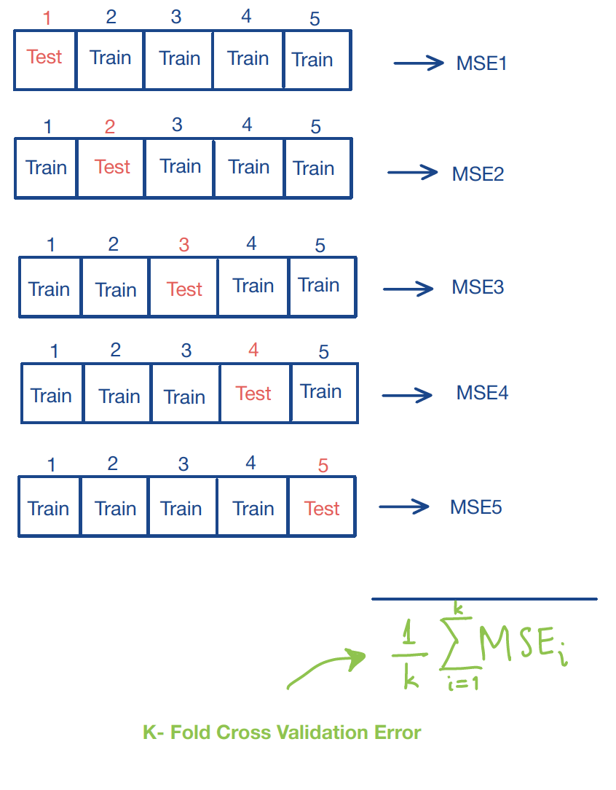

# NonLinear Regression
As we discussed in the previous sections, multiple linear regression relies on a set of assumptions about the error terms (normality, homoscedasticity, and independence) together with the fundamental assumption that the mean response is a linear function of the predictors. When one or more of these assumptions are violated, the applicability of the linear model is limited. In this section we focus on **relaxing the linearity assumption** and introduce three of the most widely used approaches to nonlinear regression:

(i) Polynomial regression
(ii) Regression splines
(iii) Smoothing splines


&nbsp;
&nbsp;

#### A Note on  Nonlinearity {-}

Assume that the true underlying model takes the form

\[Y = f(\mathbf{X}) + \varepsilon\]

where $\varepsilon$ satisfies the usual assumptions. So far we have **approximated** the _unknown_ function $f$ with a multiple linear regression model:

\[Y_i = \beta_0 + \beta_1 X_{i1} +  \beta_2 X_{i2} +\ldots +  \beta_p X_{ip} +\varepsilon_i \]

This model is linear both in the predictors $X_{ij}$ and in the coefficients $\beta_j$.

Now consider the following two models:
\[Y_i = \beta_1 X_{i1} +  \beta_2 X_{i1}^2 +\beta_3 X_{i2} + \beta_4 X_{i2}^2 +  \beta_5 X_{i1} X_{i2} +\varepsilon_i \]
or
\[\log_{10}Y_i = \beta_1 X_{i1} +  \beta_2 \sqrt{X_{i1}} +\beta_3 e^{X_{i3}} +\varepsilon_i\]

Both are nonlinear in the predictors but remain linear in the coefficients $\beta_j$.
In contrast, the model
\[Y_i =  \frac{\gamma_0}{1+ \gamma_1 e^{\gamma_2 X_i}} + \varepsilon_i \]
is nonlinear in both the parameters _and_ the predictors.

In this chapter we approximate the general nonlinear relationship $f$ using models that are nonlinear in the predictors (so that we can capture nonlinear associations between the response and the features) yet linear in the coefficients. Equivalently, these models can be viewed as ordinary linear regressions in which the original predictors have been replaced by nonlinear transformations of those predictors.

The main advantage of this approach is that we can often describe nonlinear relationships effectively while still estimating the parameters easily. Because the models remain linear in the parameters, the coefficients continue to be obtained by ordinary least squares, which again reduces to solving a system of linear equations.


## Polynomial Regression

The simplest form of nonlinear regression is polynomial regression, which extends the linear model by including higher-order powers of the predictor(s). To study this approach we first introduce polynomial basis functions.

&nbsp;

### Polynomial Basis Functions


If $b_j(x)$ denotes the $j$th  basis function, then any function $f$ that lies in the span of these basis functions can be written

\[f(x) = \sum_{j=0}^{d} b_j(x) \beta_j\]
for suitable coefficients  $\beta_j$. Consequently the nonlinear model $y_i = f(x_i) + \varepsilon_i$ becomes a linear model in the coefficients:
\[y_i = \beta_0 + \sum_{j=1}^{d} b_j(x_i) \beta_j + \varepsilon_i\]

Suppose we believe that $f$ is a polynomial of degree at most 4. A natural basis for the space of all such polynomials is

\begin{align*}
b_0(x) &= 1\\
b_1(x) &= x\\
b_2(x) &= x^2\\
b_3(x) &= x^3\\
b_4(x) &= x^4
\end{align*}
The corresponding model is therefore
\[y_i = \underbrace{\beta_0 + \beta_1 x_i+\beta_2 x^2_i+ \beta_3 x^3_i + \beta_4 x^4_i}_{= \beta_0 + \sum_{j=1}^{d} b_j(x_i) \beta_j} +\varepsilon_i\]

&nbsp;

<div class=examplebox>
**Illustration of the Polynomial Basis Functions**

The following code plots the individual polynomial basis functions of degree 0 through 4 and a linear combination of them.

```{r}
x=seq(0, 1, by=0.001)
b0 = rep(1, length(x))
b1 = x
b2 = x^2
b3 = x^3
b4 = x^4

fun1 = 4*b0 -10* b1 + 16*b2 + 2*b3 -10*b4

par(mfrow = c(2,3))
plot(x, b0, type='l', lty=3, ylab=expression("b"[0]*"(x)=1"))
plot(x, b1, type='l',lty=3, ylab=expression("b"[1]*"(x)=x"))
plot(x, b2, type='l',lty=3, ylab=expression("b"[2]*"(x)=x"^2))
plot(x, b3, type='l',lty=3, ylab=expression("b"[3]*"(x)=x"^3))
plot(x, b4, type='l',lty=3, ylab=expression("b"[4]*"(x)=x"^4))
plot(x, fun1, type='l', ylab="f(x)", main=expression("f(x) =  4 - 10 x + 16 x"^2*"+ 2 x"^3*"- 10 x"^4), col="blue", lwd=2)
```

</div>


&nbsp;


### Polynomial Regression

From now on we assume that the predictor $x$ is one-dimensional; the multivariate case will be discussed later. For $x_i\in\mathbb{R}$ the polynomial regression model of degree $d$ is 
\[
y_i = \beta_0 + \beta_1 x_i + \beta_2 x_i^2 + \cdots + \beta_d x_i^d + \varepsilon_i
\]

We simply create the new variables $X_2 = X^2, \ldots, X_d = X^d$ and treat the problem as ordinary multiple linear regression:
\[
\begin{pmatrix}
y_1 \\ y_2 \\ \vdots \\ y_n
\end{pmatrix}_{n \times 1}
=
\begin{pmatrix}
1 & x_1 & x_1^2 & \cdots & x_1^d \\
1 & x_2 & x_2^2 & \cdots & x_2^d \\
\vdots & \vdots & \vdots & \ddots & \vdots \\
1 & x_n & x_n^2 & \cdots & x_n^d
\end{pmatrix}_{n \times (d+1)}
\begin{pmatrix}
\beta_0 \\ \beta_1 \\ \vdots \\ \beta_d
\end{pmatrix}_{(d+1) \times 1}
+ \varepsilon
\]

&nbsp;

<div class=motivationbox>
**Polynomial Regression Model**

A _non-linear_ mean function can be represented with a polynomial basis as

\[y_i = f(x_i) + \varepsilon_i \,\,\, \longrightarrow \,\,\, y_i =\beta_0 + \sum_{j=1}^{d} b_j(x_i) \beta_j + \varepsilon_i\]

where $d$ is the degree of the polynomial.
</div>

&nbsp;

#### <font color=Darkblue>How do we choose $d$? </font> {-}

1. <font color=blue>_Forward Approach_</font>: Begin with a linear model and successively add higher-order terms until the most recently added term is no longer statistically significant.


2. <font color=blue>_Backward Approach_</font>: Start with a high-degree polynomial and successively remove the highest-order term that is not statistically significant.
    

Once a degree $d$ has been selected, we ordinarily do not test the significance of the lower-order terms. In other words, a polynomial of degree $d$ is understood to contain all powers up to $d$.

&nbsp;

<u>Reasoning</u>

In regression we prefer results that are invariant to simple location or scale changes of the predictor. Consider the following illustration. Suppose the data $\{(y_i, x_i)\}_{i=1}^n$ are generated by
\[
y_i = x_i^2 + \varepsilon_i, \quad \varepsilon_i \sim \mathcal{N}(0, \sigma^2).
\]
If the predictor is recorded instead as $z_i = x_i + 2$, the same relationship becomes
\[
y_i = (z_i - 2)^2 + \varepsilon_i = 4 - 4z_i + z_i^2 + \varepsilon_i.
\]
A linear term that was absent in the original scale now appears. Consequently, once we decide that a degree-$d$ polynomial is appropriate we retain every lower-order term.


<font color=orange><u>**Exception**</u></font>: If scientific knowledge dictates a specific functional form (for example, a pure quadratic relationship $Y\approx X^2+C$ arising from a physical law), then it is legitimate to test whether the lower-order terms may be omitted.

&nbsp;

<div class=examplebox>
**The Chicago Pumpkins Example**

The file `pumpkins.csv` contains information regarding the `size` and `price` of pumpkins sold in the <font color=orange>Chicago area</font> (data can be found <a href="data/week4/chicagopumpkins.csv" target="_blank">here</a>.). Our goal  is to _predict_ the pumpkin size from price.

```{r}
pumpkins = read.csv("data/week4/chicagopumpkins.csv",header=TRUE)
plot(pumpkins$price, pumpkins$size, pch=20, xlab="Pumpkin's Price", ylab="Pumpkins' Size")
```
A linear fit is visibly inadequate:
```{r}
lm.pumpkins = lm(size ~ price, data=pumpkins)
summary(lm.pumpkins)
```
Although price is statistically significant, $R^2$ is modest and the scatter plot does not support a straight-line relationship.

```{r}
plot(size ~ price, data=pumpkins)
points(size ~ price, data=pumpkins, pch=8)
abline(lm.pumpkins, col="blue", lwd=2)
```

&nbsp;
We therefore consider higher-order polynomials, first by forward selection and then by backward elimination.

**(1) Forward selection.**
We start with a linear model and add successive powers until the newest term becomes insignificant.

```{r}
# Forward Selection
lm.pumpkins =  lm(size ~ price , data=pumpkins)
summary(lm.pumpkins)

lm.pumpkins2 =  lm(size ~ price + I(price^2), data=pumpkins)
summary(lm.pumpkins2)

lm.pumpkins3 =  lm(size ~ price + I(price^2) + I(price^3), data=pumpkins)
summary(lm.pumpkins3)

lm.pumpkins4 =  lm(size ~ price + I(price^2) + I(price^3) + I(price^4), data=pumpkins)
summary(lm.pumpkins4)

lm.pumpkins5 =  lm(size ~ price + I(price^2) + I(price^3) + I(price^4)+ I(price^5), data=pumpkins)
summary(lm.pumpkins5)
```

The fifth-order term has a $p$-value of 0.0519, which exceeds the conventional 5% threshold. We therefore stop at degree 4. The fitted model is
\[\hat{y}_i = \hat{\beta}_0 + \hat{\beta}_1 x + \hat{\beta}_2 x^2 + \hat{\beta}_3 x^3 + \hat{\beta}_4 x^4 \]


```{r}
newprice = data.frame(price=seq(17, 255, 1))
plot(pumpkins$price, pumpkins$size, pch=20, ylim=c(0,5), xlab="Pumpkin's Price", ylab="Pumpkins' Size", main="Forward Selection Models")
lines(newprice$price, predict(lm.pumpkins, newprice), col="yellow", lty=1, lwd=2);
lines(newprice$price, predict(lm.pumpkins2, newprice), col="blue", lty=1, lwd=2);
lines(newprice$price, predict(lm.pumpkins3, newprice), col="orange", lty=1, lwd=2);
lines(newprice$price, predict(lm.pumpkins4, newprice), col="magenta", lty=1, lwd=2);
lines(newprice$price, predict(lm.pumpkins5, newprice), col="green", lty=1, lwd=2);
legend(230, 1.45, legend=c("d=1", "d=2", "d=3", "d=4", "d=5"),
       col=c("yellow", "blue", "orange", "magenta", "green"), lty=c(1,1,1,1,1), cex=0.8, lwd=c(2,2,2,2,2))
```

The magenta curve corresponds to the selected degree-4 model.

&nbsp;

**(2) Backward elimination.**
We begin with a high-degree polynomial and remove terms until the highest-order coefficient is significant.


```{r}
lm.pumpkins10 =  lm(size ~ price + I(price^2) + I(price^3) + I(price^4)+ I(price^5)+ I(price^6) + I(price^7)+ I(price^8)+ I(price^9)+ I(price^10), data=pumpkins)
summary(lm.pumpkins10)

lm.pumpkins9 =  lm(size ~ price + I(price^2) + I(price^3) + I(price^4)+ I(price^5)+ I(price^6) + I(price^7)+ I(price^8)+ I(price^9), data=pumpkins)
summary(lm.pumpkins9)

lm.pumpkins8 =  lm(size ~ price + I(price^2) + I(price^3)+ I(price^4)+ I(price^5)+ I(price^6) + I(price^7)+ I(price^8), data=pumpkins)
summary(lm.pumpkins8)
```


Starting from degree 10 we arrive at a degree-9 model. The corresponding fits are shown below.

```{r}
newprice = data.frame(price=seq(17, 255, 1))
plot(pumpkins$price, pumpkins$size, ylim=c(0,5), pch=20, xlab="Pumpkin's Price", ylab="Pumpkins' Size", main="Backward Selection Models")
lines(newprice$price, predict(lm.pumpkins10, newprice), col="blue", lty=2, lwd=2);
lines(newprice$price, predict(lm.pumpkins9, newprice), col="orange", lty=2, lwd=2);
lines(newprice$price, predict(lm.pumpkins8, newprice), col="magenta", lty=2, lwd=2);
legend(226, 1, legend=c("d=10", "d=9", "d=8"),
       col=c("blue", "orange", "magenta"), lty=c(2,2,2), cex=0.8, lwd=2)
```

The magenta curve is the degree-9 fit selected by backward elimination.

As always, the final model should be subjected to the usual residual diagnostics.

</div>


&nbsp;

### Orthogonal Polynomials

High-degree polynomials are generally not recommended: they tend to be numerically unstable, hard to interpret, and the successive powers $x,x^2,\dots,x^d$ are highly correlated, producing severe multicollinearity. One remedy is to work with orthogonal polynomials
\[y_i=\beta_0+\beta_1z_1+\ldots+\beta_d z_d+\varepsilon_i\]
where each $  z_j  $ is a polynomial of exact degree $j$ constructed so that
$$z_j^\top z_k = 0 \quad\text{for all }j\neq k.$$  
&nbsp;

<div class=examplebox>
**The Chicago Pumpkins Example**
In R the function poly generates orthogonal polynomial bases. The forward- and backward-selection procedures can be repeated with orthogonal polynomials as follows.


```{r}
# Forward Selection
lm.pumpkinsO2 =  lm(size ~ poly(price,2), data=pumpkins)
summary(lm.pumpkinsO2)
lm.pumpkinsO3 =  lm(size ~ poly(price,3), data=pumpkins)
summary(lm.pumpkinsO3)
lm.pumpkinsO4 =  lm(size ~ poly(price,4), data=pumpkins)
summary(lm.pumpkinsO4)
lm.pumpkinsO5 =  lm(size ~ poly(price,5), data=pumpkins)
summary(lm.pumpkinsO5)

newprice = data.frame(price=seq(17, 255, 1))
plot(pumpkins$price, pumpkins$size, pch=20,  ylim=c(0,5),xlab="Pumpkin's Price", ylab="Pumpkins' Size", main="Forward Selection Models: Orthogonal Polynomials")
lines(newprice$price, predict(lm.pumpkinsO2, newprice), col="blue", lty=1, lwd=2);
lines(newprice$price, predict(lm.pumpkinsO3, newprice), col="orange", lty=1, lwd=2);
lines(newprice$price, predict(lm.pumpkinsO4, newprice), col="magenta", lty=1, lwd=2);
lines(newprice$price, predict(lm.pumpkinsO5, newprice), col="green", lty=1, lwd=2);
legend(230, 1.3, legend=c("d=2", "d=3", "d=4", "d=5"),
       col=c("blue", "orange", "magenta", "green"), lty=c(1,1,1,1), cex=0.8, lwd=c(2,2,2,2))


# Backward Selection
lm.pumpkinsO10 =  lm(size ~ poly(price,10), data=pumpkins)
summary(lm.pumpkinsO10)
lm.pumpkinsO9 =  lm(size ~ poly(price,9), data=pumpkins)
summary(lm.pumpkinsO9)
lm.pumpkinsO8 =  lm(size ~ poly(price,8), data=pumpkins)
summary(lm.pumpkinsO8)

plot(pumpkins$price, pumpkins$size, pch=20, ylim=c(0,5), xlab="Pumpkin's Price", ylab="Pumpkins' Size", main="Backward Selection Models: Orthogonal Polynomials")
lines(newprice$price, predict(lm.pumpkinsO10, newprice), col="blue", lty=2, lwd=2);
lines(newprice$price, predict(lm.pumpkinsO9, newprice), col="orange", lty=2, lwd=2);
lines(newprice$price, predict(lm.pumpkinsO8, newprice), col="magenta", lty=2, lwd=2);
legend(225, 1.2, legend=c("d=10", "d=9", "d=8"),  col=c("blue", "orange", "magenta"), lty=c(2,2,2), cex=0.8, lwd=2)
```


</div>

 &nbsp;
 
### Piece-wise Polynomials

When the true mean function $\mathbb{E}(Y\mid X=x)=f(x)$ is highly oscillatory, a single high-degree polynomial may be required. Such polynomials are often undesirable. An attractive alternative is to use piecewise polynomials:

1. Partition the range of $x$ into contiguous intervals.

2. Inside each interval approximate $f$ by a low-degree polynomial (typically quadratic or cubic) whose coefficients are allowed to differ across intervals.

3. Impose continuity (and possibly continuity of derivatives) at the knots that separate the intervals.

The resulting fit is sometimes called _broken-stick_ regression when the pieces are linear. The principal advantage is that each observation influences the fit only locally; the principal disadvantage is that the overall curve is usually less smooth than a single global polynomial of comparable complexity.

&nbsp;


## Splines Regression


_Splines_ are piecewise polynomials thar are constructed so that thay can be both sensitive and smooth, but also capture local features of the data.

A <font color=Darkblue>**Cubic Spline**</font> is a curve constructed from sections of cubic polynomials, joined together so that the curve is _continuous up to second derivative_.  The points at which the sections join are called the <font color=blue>**knots**</font> of the spline. For a conventional spline, the knots occur wherever there is a datum, but for the regression splines the locations of the knots must be chosen. Typically, the knots would either be _evenly spaced_ through the range of observed $x$ values, or placed at the _quantiles_ of the distribution of unique $x$ values. Each section of cubic has different coefficients, but at the knots _it will match its neighboring sections in value and first two derivatives_.


<div class=motivationbox>
**Cubic Splines (Mathematical) Definition**

A function $g$ defined on $[a,b]$ is a <font color=Darkblue>**cubic spline**</font> with respect to **knots** $\{\xi_i\}_{i=1}^m$ (specifically $a<\xi_1<\xi_2<\ldots<\xi_m<b$) if:

*  <font color=Darkblue>$g$</font> is a cubic polynomial in each of the $m+1$ intervals, i.e.
<font color=blue>
\[g(x) =d_ix^3+c_ix^2+b_ix+a_i,\quad x\in [\xi_i,\xi_{i+1}]\]
</font>
where $i=0,\ldots, m$, $\xi_0=a$ and $\xi_{m+1}=b$.
        
* <font color=Darkblue>$g$ is continuous up to the _2nd_ derivative</font>. Since $g$ is continuous up to the _2nd_ derivative _for any point inside an interval_, it suffices to check the following conditions:
<font color=blue>
\[g^{(0,1,2)} (\xi_i^+)=g^{(0,1,2)}(\xi_i^-),\quad i=1, \ldots, m\]
</font>
This expression indicates that the function and the first and second order derivatives are continuous at the knots.

</div>

&nbsp;

<font color=Darkblue><u>**How many free parameters do we need to represent a cubic spline?**</u> </font> 
        

**(+)** <font color=blue>4</font> parameters $(d_i,c_i,b_i,a_i)$ _for each of the $(m+1)$ intervals_.

**(-)** <font color=blue>3</font> constraints _at each of the $m$ knots_ (continuity constraints).

The total number of free parameters (similar to the number of degrees of freedom) is:
<font color=Darkblue>
\[4(m+1) - 3m = m + 4\]
</font>

&nbsp;

<font color=Darkblue><u>**A property of the cubic splines**</u> </font> 
 
Suppose the knots $\{\xi_i\}_{i=1}^m$ are given.

* If $g_1(x)$ and $g_2(x)$ are cubic splines, the linear combination 
\[a_1g_1(x)+a_2g_2(x)\] 
is also a cubic spline, where $a_1$ and $a_2$ are known constants.&nbsp;

That is, for a set of given knots, the corresponding _cubic splines form a linear space (of functions) with dim $(m + 4)$_.

     
&nbsp;

### Examples of Cubic Splines Basis 

1.   A set of basis functions for cubic splines (w.r.t knots $\{\xi_i\}_{i=1}^m$) is given by:
     \begin{align*}
       h_0(x)&= 1\\
        h_1(x)&=x\\
       h_2(x)&=x^2\\
       h_3(x)&=x^3;\\
       h_{i+3}(x) &= (x-\xi_i)_+^3,\quad i=1,2,\ldots,m\\
     \end{align*}
That is, any cubic spline  can be uniquely expressed as:
\[ \beta_0 +\sum_{j=1}^{m+3}\beta_j h_j(x)\]

&nbsp;

2. Given knot locations, there are many alternative, but equivalent ways of writing down a basis for cubic splines. For example, _another_ basis for cubic splines can be written as:
\begin{align*}
h_0(x) &= 1\\
h_1(x) &= x\\
h_{i+1}(x) &= R(x, \xi_i^*),\,\, i=1, \ldots, q-1
\end{align*}
where
\begin{align*}
R(x,z) &= \left[  (z-1/2)^2 - 1/12\right] \left[  (x-1/2)^2 - 1/12\right]/4\\
& \quad \,- \left[  (|x-z|-1/2)^4 - 1/2   (|x-z|-1/2)^2 + 7/240\right] /24\\
\end{align*}


<div class=examplebox>
**An Example of a Cubic Splines Basis**

We first define the function $R(x,z)$ as above in `R`:
```{r}
R_xz <- function(x,z){
  ((z-0.5)^2-1/12)*((x-0.5)^2-1/12)/4-((abs(x-z)-0.5)^4-(abs(x-z)-0.5)^2/2+7/240)/24
}
```

We then need to define the knots
```{r}
new.knots= c(1/6, 3/6, 5/6)
```

In regression examples the $x$ variable will be the predictor (there is  no need to generate any $x$ values). Here, we need a "generic" $x$  for illustration purposes.

```{r}
x=seq(0, 1, by=0.01)
```

Finally, we defined the splines functions, based on the definition given above:
```{r}
spline1 = rep(1, length(x)) # First basis function
spline2 = x # Second basis function
spline3 = R_xz(x,new.knots[1]) # Third basis function 
spline4 = R_xz(x,new.knots[2]) # Fourth basis function 
spline5 = R_xz(x,new.knots[3]) # Fifth basis function 
```

If we want to represent a function using the basis above, we have:
```{r}
fun1s = 4*spline1 - 0.05*spline2 - 6*spline3 +2*spline4 +10*spline5
```

For illustration purposes, we plot the basis functions defined above as well as the function $f$:
```{r}
par(mfrow = c(2,3))
plot(x, spline1, type='l', lty=3, ylab=expression("h"[0]*"(x)=1"))
plot(x, spline2, type='l',lty=3, ylab=expression("h"[1]*"(x)=x"))
plot(x, spline3, type='l',lty=3, ylab=expression(paste(h[2](x))*"="*paste(R(x,xi[1])))  )
plot(x, spline4, type='l',lty=3, ylab=expression(paste(h[3](x))*"="*paste(R(x,xi[2])))  )
plot(x, spline5, type='l',lty=3, ylab=expression(paste(h[4](x))*"="*paste(R(x,xi[3])))  )
plot(x, fun1s, type='l', ylab="f(x)", main=expression("f(x) =  4 - 0.05 h"[1]*" - 6 h"[2]*"+ 2 h"[3]*"+ 10 h"[4]), col="blue", lwd=2)
```

</div>


&nbsp;

### B-Splines Basis Functions in `R` 

In this course one of the cubic spline bases we will use is the **B-spline** basis.

<div class=motivationbox>
**Cubic B Splines Definition**

The cubic B-spline basis on an interval $  [a,b]  $ with interior knots $  \{\xi_i\}_{i=1}^m  $ satisfies the following properties:

1. Each basis function is nonzero only on an interval spanned by four successive knots (and is zero elsewhere).

2. On every sub-interval between consecutive knots the basis function is a cubic polynomial.

3. The basis function is continuous and has continuous first and second derivatives at every knot.

4. The basis function integrates to 1 over its support.

5. The two boundary basis functions are modified so that the required continuity conditions hold at the endpoints $a$ and $b$.

</div>


These bases are provided by the `splines` library in `R`; the generating function is `bs()`. 

Its **main arguments** are


- `x`: the predictor vector.

- `df`: desired degrees of freedom (number of columns of the returned basis matrix).

- `knots`: vector of interior knot locations.

- `degree`: degree of the piecewise polynomial (default = 3, i.e., cubic).

- `intercept`: if `TRUE` an intercept column is included in the basis; default is `FALSE.`
(This is not the intercept of the eventual regression model.)

- `Boundary.knots`: the two boundary knots at which the basis is anchored; by default they are set to the range of the non-missing values of `x`

(The full documentation is available <a href="https://www.rdocumentation.org/packages/splines/versions/3.6.2/topics/bs" target=blank>here</a>.)


In practice we supply either the vector knots or the integer df, but not both. All other arguments are left at their defaults.


&nbsp;

The value returned by `bs()` is a matrix with `length(x)` rows.

- If df is supplied the matrix has df columns.

- If knots is supplied the number of columns equals
\[\text{length(knots)} + \text{degree} + \text{as.integer(intercept)}.\]
With the default `intercept = FALSE` this reduces to length(knots) + 3.


&nbsp;


<u>Specifying knots versus degrees of freedom**</u>

If the knot locations are known, pass them via the `knots` argument:

<div class=examplebox>
**Defining `knots` location in `bs()`**
&nbsp;

```{r}
library(splines)
x=seq(0, 1, by=0.01) # generic `x` for illustration purposes
new.knots= c(1/6, 3/6, 5/6)  # define three knots at locations 1/6, 3/6, 5/6.
Bsplines.basis1 = bs(x, knots=new.knots)
head(Bsplines.basis1)
```
</div>

In this case, `R` sets
\[\text{df = length(knots) + degree}\]
(or one more if **if `intercept=TRUE`**).

&nbsp;

* If a target degrees of freedom is preferred, pass `df`. Then `bs()` places df - degree interior knots at suitable quantiles of `x` (or `df - degree - 1` knots when `intercept = TRUE`).

<div class=examplebox>
**Specifying degrees of freedom with `bs()`**
&nbsp;

```{r}
x=seq(0, 1, by=0.01) # generic `x` for illustration purposes
Bsplines.basis2 = bs(x, df=4)
head(Bsplines.basis2)
```
</div>

&nbsp;

The following code illustrates the first six B-spline basis functions obtained from the three knots defined above.

<div class=examplebox>
**Illustration of B Splines Basis Function**

```{r}
Bsplines.basis = bs(x, knots=new.knots)
dim(Bsplines.basis)
head(Bsplines.basis)
```

```{r}
par(mfrow = c(2,3))
plot(x, Bsplines.basis[,1], type='l', lty=3, ylab=expression(paste(h[1](x))))
plot(x, Bsplines.basis[,2], type='l',lty=3, ylab=expression(paste(h[2](x))))
plot(x, Bsplines.basis[,3], type='l',lty=3, ylab=expression(paste(h[3](x)) ))
plot(x, Bsplines.basis[,4], type='l',lty=3, ylab=expression(paste(h[4](x))))
plot(x, Bsplines.basis[,5], type='l',lty=3, ylab=expression(paste(h[5](x))))
plot(x, Bsplines.basis[,6], type='l',lty=3, ylab=expression(paste(h[6](x))))
```

</div>


&nbsp;

### Natural Cubic Splines (NCS)


A cubic spline on $[a,b]$ is called a **natural cubic spline** if its second and third derivatives vanish at the endpoints $a$ and $b$. Consequently the spline is linear on the two extreme intervals $[a,\xi_1]$ and $[\xi_m,b]$. The linearity constraints reduce the dimension of the space: a natural cubic spline with $m$ interior knots has only $m$ degrees of freedom (the usual textbook count).

<font color=orange>**<u>Remark</u>**</font>  
If we place a knot at every distinct observation $$   x_i   $$ and use a natural cubic spline, the resulting interpolant is a smooth curve that passes through every data point $$   (x_i,y_i)   $$.


<div class=motivationbox>
**Natural Cubic Spline**

One convenient basis for the space of natural cubic splines with $m$ interior knots is
 \begin{align*}
 N_1(x) &= 1\\
 N_2(x) &= x\\
 N_{k+2} (x) &= d_k(x) - d_{k-1}(x)
 \end{align*}
 where
 \[d_k(x) = \frac{(x-\xi_k)_{+}^{3} - (x-\xi_{m})_{+}^{3}}{\xi_m - \xi_k}\]
Each of these functions has vanishing second and third derivatives for $x\ge\xi_m$. </div>
 &nbsp;
 
In `R` natural cubic splines are generated by the function `ns()` from the same `splines` package:

<font color=blue>
\[ ns(x, df, knots, intercept=FALSE, Boundary.knots) \]
</font>
(Note that the default value of intercept is FALSE, exactly as for bs().)


<div class=examplebox>
**Natural Cubic Splines in `R`**

```{r}
NCS.basis =ns(x, knots=new.knots, Boundary.knots=c(0,1))
dim(NCS.basis)

par(mfrow = c(2,3))
plot(x, NCS.basis[,1], type='l', lty=3, ylab=expression(paste(h[1](x))))
plot(x, NCS.basis[,2], type='l',lty=3, ylab=expression(paste(h[2](x))))
plot(x, NCS.basis[,3], type='l',lty=3, ylab=expression(paste(h[3](x)) ))
plot(x, NCS.basis[,4], type='l',lty=3, ylab=expression(paste(h[4](x))))
```

</div>

&nbsp;
     Because the spline is forced to be linear outside the boundary knots, observations that fall outside those knots do not influence the fit. By default, therefore, R places the boundary knots at the minimum and maximum of the observed $$   x_i   $$.

**Knots versus degrees of freedom for `ns()`**

- If interior knot locations are supplied, the number of columns of the basis matrix is  
  \[ \text{length(knots)} + 1 + \text{as.integer(intercept)}\]
  
- If a target `df` is supplied, R places  
\[  m = \text{df} - 1 - \text{intercept}\]
  interior knots at quantiles of $x$.
  
 &nbsp;
 
 
### Regression Splines

For a fixed set of knots the corresponding cubic splines form a linear space of dimension $$   m+4   $$. **Regression splines** simply expand the mean function in this basis:

  $$g(x)=\beta_1 h_1(x)+\beta_2 h_2(x)+\ldots+\beta_p h_p(x)$$

- Ordinary Cubic Splines: $p=m+4$.

- Natural Cubic Splines (NCS): $p=m$.

On the observed data the model may be written in matrix form
\[
      \begin{pmatrix}
        y_1\\
        y_2\\
        \ldots\\
        y_n
      \end{pmatrix}_{n\times 1} =
      \begin{pmatrix}
         h_1(x_1)& \ldots & h_{p}(x_1)\\
          h_1(x_2)& \ldots & h_{p}(x_2)\\
         \\
           h_1(x_n)& \ldots & h_{p}(x_n)
      \end{pmatrix}_{n\times p}
      \begin{pmatrix}
      \beta_1\\
      \beta_2\\
      \ldots\\
      \beta_p
      \end{pmatrix}_{p\times 1}
\] 
where the $ n\times p$ matrix $\mathbf{F}$ contains the basis functions evaluated at the $x_i$. The coefficient vector is obtained by ordinary least squares:
Therefore, we can estimate the coefficients $\mathbf{\beta}$ by solving the following Least-Squares problem:
$$\hat{\mathbf{\beta}}= \arg\min_{\mathbf{\beta}}||\mathbf{y} - \mathbf{F}{\mathbf{\beta}|}|^2$$


&nbsp;


### K-Fold Cross-Validation

A practical difficulty with regression splines is the choice of the number (and location) of knots, or equivalently the degrees of freedom. One systematic approach is $$   K   $$-fold cross-validation:

1. Fix a candidate number of knots (or degrees of freedom).

2. Randomly partition the data into $K$ roughly equal folds.

3. For each fold $k=1,\dots,K$:

   - hold fold $k$ out as a validation set,
   
   - fit the regression spline on the remaining $K-1$ folds,
   
   - compute the mean squared error $\mathrm{MSE}_k$ on the held-out fold.
   
4. Average the $K$ errors:
  \[\mathrm{CV}(K) = \frac1K\sum_{k=1}^K\mathrm{MSE}_k.\]
  
5. Repeat the whole procedure for every candidate number of knots / degrees of freedom.

6. Select the value that minimises $\mathrm{CV}(K)$.

A schematic illustration of the procedure appears below.

```{r ,echo=FALSE, message=FALSE, warning=FALSE, fig.align="center", out.width="60%"}

```


    
    
    
    
    
    
    
    
    
    
## Smoothing Splines


 
In regression splines we must choose both the number and the locations of the knots (or, equivalently, the degrees of freedom). As we have seen, B-splines and natural cubic splines both construct an $n\times p$ basis matrix $\mathbf{F}$ and then fit a linear model on that basis. Inevitably this requires decisions about the order of the spline, the number of knots (often guided by AIC, BIC or cross-validation), and even the placement of those knots—tasks that can be quite challenging. It is therefore natural to ask whether there exists an alternative approach that selects the effective complexity of the fit automatically.


A smoothing spline is designed precisely to balance fidelity to the data against smoothness of the fitted curve. The construction begins with an extreme idea: place a knot at every distinct observed value $x_1,\dots,x_n$. This produces a natural-cubic-spline basis of dimension $n$,
\[\mathbf{y}_{n\times 1} = \mathbf{F}_{n\times p} \beta_{p\times 1}\]

Such a basis can interpolate the data perfectly and therefore overfits. To control the overfitting we borrow the idea of penalization introduced earlier and minimize a ridge-type objective
\[\min_{\beta} \Bigl\{ ||\mathbf{y}-\mathbf{F} \beta ||^2 + \lambda \beta^T \Omega \beta \Bigr\}\]
where the tuning parameter $\lambda\ge 0$ is typically chosen by cross-validation and the penalty matrix $\Omega$ will be defined shortly.
We now examine whether the solution of this penalized problem possesses attractive statistical properties.


&nbsp;


### The Roughness Penalty Approach

 Let $S[a,b]$ be the space of all ``smooth'' functions defined on $[a,b]$. This is a second order Sobolev space where global polynomial functions and cubic splines functions live ($S[a,b]$ is an infinite-dimensional function space.  Our goal is to find the best function in $S[a,b]$ to approximate $f$.


Let us consider solving the following Penalized Residual Sum of Squares problem:
\[
RSS_\lambda(g) = \sum_{i=1}^n [y_i - g(x_i)]^2  + \lambda \int_a^b [g''(x)]^2 dx.
\]
where $\lambda$ is a smoothing parameter.  The first term measures the closeness of the model to the data, while the second term penalizes the roughness/curvature of the function. We solve this problem on $[a,b]=[\min x_i, \max _i]$ for functions with finite roughness penalty $\int_a^b [g''(x)]^2 dx < \infty$. This is known as a second order Sobolev space.

&nbsp;
Note that $\int_a^b [g''(x)]^2 dx$ is called the <font color="blue">**roughness penalty**</font>. 
&nbsp;

From the expression above, we can see that  $\lambda$ is the smoothing parameter that controls the bias-variance trade-off. Therefore, when $\lambda=0$, we interpolate the data and that leads us to overfitting. When  $\lambda=\infty$, then we return to linear least-squares regression. It turns out that the solution to the penalized residual sum of squares has to be a NCS. Indeed,


<div class=motivationbox>
**Theorem**
\[\min_g RSS_{\lambda}(g) = \min_{\tilde{g}} RSS_{\lambda}(\tilde{g}) \]}
where $\tilde{g}$ is a NCS with knots at the unique $n$ data points.
</div>

Let $g(x)$ be the optimal solution. Since the loss part in $RSS_\lambda(g)$ only involves  $n$ data points, we can find define a natural cubic spline (NCS) fit that we can call $\tilde{g}(x)$ such that it  matches $g(x)$ at the observations $x_i$, $i=1, \ldots, n$, i.e.
\[g(x_i) = \tilde{g}(x_i), i=1, \ldots, n\]
 We can always find such $\tilde{g}$ since our space consists of $n$ basis. Then, we can show that 
\[\int g^{''2} dx \geq \int  \tilde{g}^{''2} dx\]
meaning that we will _always_ prefer the $\tilde{g}$, the NCS ``representation'' of
$g$, since the _penalty_ is smaller, and the _loss_ doesn't change.

### Proof

To establish the Theorem, we essentially need to show that 
\[\int g''^{2} dx \geq \int  \tilde{g}''^{2} dx\]

Thus, we define $h(x) = g(x) - \tilde{g}(x)$ for which we know that  $h(x_i)=0$ for $i=1, \ldots, n$. Then
\[ \int g''^2 \, dx  = \int \tilde{g}''^2 \, dx  + \int h''^2 \, dx  + 2 \int \tilde{g}'' h'' \, dx
\]
and without loss of generality assuming that the $x_i$s are ordered, we obtain:
\begin{align*}
\int \tilde{g}'' h'' \, dx  &= \tilde{g}'' h' \Big|_a^b 
- \int_a^b h' \tilde{g}^{(3)} \, dx\\
&= - \sum_{i=1}^{n-1} \tilde{g}^{(3)}\!\left(x_j^+\right) 
\int_{x_j}^{x_{j+1}} h' \, dx 
\quad (\tilde{g}^{(3)} \text{ constant piecewise})\\
&= - \sum_{i=1}^{n-1} \tilde{g}^{(3)}\!\left(x_j^+\right) 
\left(h(x_{j+1}) - h(x_j)\right)
\end{align*}
The second equation is because $\tilde{g}$ is a NCS and therefore we know that it has zero second derivative on the two boundaries  $a$ and $b$. The third equation is true, because  $\tilde{g}$ is at most a 3rd order polynomial on any region and as a consequence has  constant third derivatives, which we can pull out of the integration. The last equation holds because we said that $h(x)=0$ on all the observation points $x_i$. Therefore, this shows that the roughness penalty of our NCS solution is no larger than the best solution $g$. If we also take into account that $\tilde{g}$ is also in the space $S[a,b]$, then $g$ must be our NCS solution.

&nbsp;
&nbsp;


## Fitting Smoothing Splines 
  
From the preceding discussion we conclude that the minimizer admits a finite-dimensional representation
\[\hat{g}(x) = \sum_i \beta_i N_i(x)\]
where the $N_i$ are a natural-cubic-spline basis with knots placed at the unique observed values of $  x  $. Substituting this expansion into the roughness penalty yields
\begin{align*}
\int_{a}^{b} g^{''2} dx &= \int  \left( \sum_i \beta_i N_i^{''}(x)\right)^2 dx\\
&= \sum_{i,j} \beta_i \beta_j \int N_i^{''}(x) N_j^{''}(x) dx\\
&=\beta^T \Omega \beta
\end{align*}
where the $n\times n$ penalty matrix has entries 
\[\Omega_{ij} = \int N^{''}_{i}(x) N^{''}_{j}(x) dx\]

Consequently the penalized residual sum of squares becomes a function of the coefficient vector alone:

\[RSS_{\lambda}(\beta) = (\mathbf{y} - \mathbf{F}\beta)^T(\mathbf{y} - \mathbf{F}\beta) + \lambda  \beta^T \Omega \beta \]

This is a ridge-type criterion whose minimizer is given in closed form by

\[\hat{\beta} = \arg \min_{\beta} RSS_{\lambda}(\beta)\]
\[=(\mathbf{F}^T \mathbf{F} +\lambda \Omega)^{-1} \mathbf{F}^T \mathbf{y}\]

The smoothing spline version of the ``hat'' matrix is called the **smoother matrix**
\[\mathbf{\hat{y}} = \mathbf{F} (\mathbf{F}^T \mathbf{F} +\lambda \Omega)^{-1} \mathbf{F}^T \mathbf{y} = S_{\lambda} \mathbf{y}\]


&nbsp;

**Remarks**

We have done the analysis of degrees of freedom for ridge type regression. The degrees of freedom of a smoothing spline are
\[df = tr(S_{\lambda})\]
which ranges between $0$ and $n$. Under a special choice of basis (Demmler and Reinsch,
1975), a basis with double orthogonality property, can lead to
\[\mathbf{F}^T \mathbf{F} = \mathbf{I}, \Omega = diag(d_i)\]
where $d_i$s are arranges in an increasing order and in addition $d_2=d_1=0$.  Using this basis we have
\[\hat{\beta} = (\mathbf{F}^T \mathbf{F} +\lambda \Omega)^{-1} \mathbf{F}^T \mathbf{y} = \Bigl(\mathbf{I} + \lambda diag(d_i) \Bigr)^{-1} \mathbf{F}^T \mathbf{y}\]
i.e.
\[\hat{\beta}_i = \frac{1}{1+\lambda d_i} \hat{\beta}_i^{LS}\]


**Choosing $\lambda$**

The smoothing parameter is selected by the same criteria used for ridge regression.

- Leave-one-out CV:
  \[
  \text{CV}(\lambda) = \frac{1}{n} \sum_{i=1}^n \left( \frac{y_i - \hat g(x_i)}{1 - S_\lambda(i,i)} \right)^2.
  \]

  
- Generalized CV:
  \[
  \text{GCV}(\lambda) = \frac{1}{n} \sum_{i=1}^n \left( \frac{y_i - \hat g(x_i)}{1 - \tfrac{1}{n}\text{tr}(S_\lambda)} \right)^2.
  \]
  &nbsp;

  
## The `Birthrates` Example


In this chapter we relaxed the linearity assumption of classical regression by introducing polynomial regression, regression splines, and smoothing splines. All three approaches remain linear in the parameters, so they can still be fit by (penalized) least squares, yet they are flexible enough to capture nonlinear relationships. We now illustrate smoothing splines—the method that requires the least manual tuning of knots—with a classic data set on U.S. birth rates.


The analysis of this data set  is available in <a href="code/ch4_RCode.html" target="_blank">R</a> and  <a href="code/ch4_PythonCode.html" target="_blank">Python</a>.

&nbsp; &nbsp; &nbsp;

**Remark:**

In the following Python file, you will also find the code for all the R examples illustrated in this chapter:
<a href="code/ch4_PythonExamples.html" target="_blank">Examples in Python</a>
