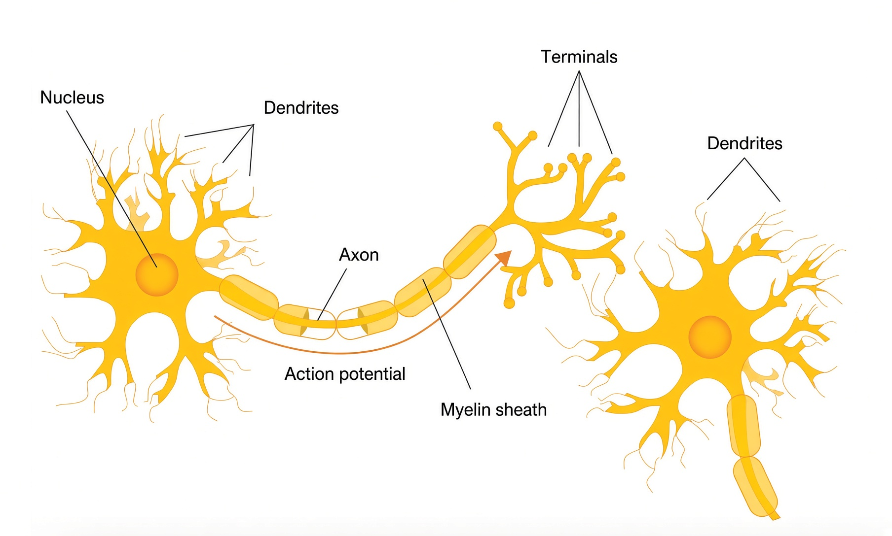
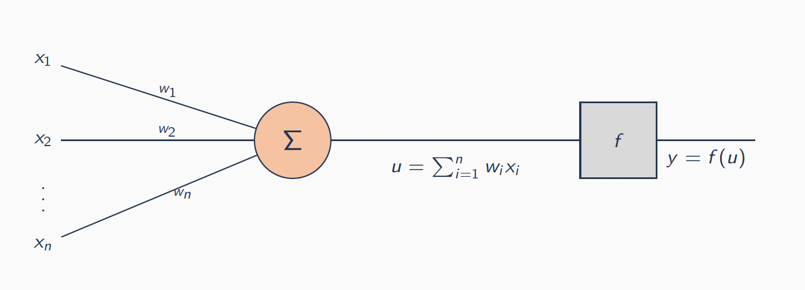

# Introduction to Neural Networks for Regression


In the previous chapter we discussed **nonlinear regression** in the sense that it is a model that is **linear**  in the parameters. We used _bases_, _polynomials_, _splines_, and _kernels_ for example to approximate a nonlinear relationship between the response and the predictors. We called this function $f$ before, let's further describe it as 
<font color="darkblue">
$$
f_\beta(x)=\beta^\top\phi(x)
$$
</font>


for a feature map $\phi$ chosen by us. Obviously, if the feature map $\phi$ is wrong, then  ridge,  OLS or any other function will not be able to cover for the missing transformation. 

&nbsp;

In this chapter, **we focus on $\phi$**. So, we keep _the loss_,  _the linear last layer_, and **learns $\phi$**. The resulting predictor is nonlinear in both $\beta$ and $x$. The algorithm that makes the gradient of $J$ with respect to $\beta$  cheap **backpropagation**.

&nbsp;

In machine learning courses, it is common to introduce neural networks when one talks about classification, e.g., image or text classification. We are going to view it in the **regression setting**. 

 In our case, the response **$y\in\mathbb{R}$ is continuous, and it is scored by the MSE**.


## Learning by Fitting a Model

<div class="motivationbox">
A method uses data $E$ to fit a model $f$. We say it has **learned** if a performance measure $P$ on a task $T$ is better after seeing $E$ than before:

$$
\text{data }E \longrightarrow \text{algorithm} \longrightarrow \text{model }f(\mathbf{x}).
$$
</div>

&nbsp;

Linear regression already satisfies this definition. Assume that the **Task $T$** is to predict a house's price from size; the **Measure $P$** is the MSE, and the **experience $E$** are the past sales. Learning has occurred _if the test MSE becomes smaller_ as more sales are observed. 

&nbsp;

A **neural net** is the same object, i.e. a predictor $f$ fitted from $E$, with a different parameterization of $f$.

&nbsp;


Consider a training set $\{(x_{i},y_{i})\}_{i=1}^n$ with $x_{i}\in\mathbb{R}^d$ and $y_{i}\in\mathbb{R}$. Nonlinear regression means that

<font color="blue">
$$
f_\beta(x)=\beta^\top\phi(x)
$$
</font>
with criterion
<font color="blue">
$$
J(\beta)=\frac1n\sum_{i=1}^n\frac12\bigl(f_\beta(x_{i})-y_{i}\bigr)^2,
$$
</font>

and $\beta$ is obtained by a linear method (OLS, ridge, a kernel solver). The map $\phi$ might be _monomials_, _splines_, a _radial basis_, or an _interaction_.

&nbsp;


**Two important things to keep in mind:**

1. The **loss is a property of $y$**, not of $\phi$. For a real-valued $y$ we use a _squared error_. 

2. Once $\phi(x)$ is computed, the last step is ordinary linear regression of $y$ on those features. 

Every network below is built so that these remain true. If $a=\phi_c(x)$ denotes the last hidden layer, the prediction is $W a+b$:

- Freeze $c$ and you are back in the previous chapter. 

- Train $c$ jointly with $(W,b)$ and you have a neural net.

&nbsp;

The new challenges are statistical as much as algorithmic. The map $\beta\mapsto J(\beta)$ is no longer convex, so two random starts can stop at two different predictors. Adding hidden units (width) or layers (depth) makes the training MSE easier to drive down: the model is larger, and a wide net can always mimic a narrow one. 

If you think of the houses example, the same extra capacity can go either way. It helps if the extra units capture signal the smaller net missed (a corner, an interaction). It hurts if they fit noise instead. 


## A Neuron: Two ways to think about it

There have always been two motivations for artificial neural nets: to understand biological computation, and to build predictors. In a statistical learning course, we focus on  the second. Biology is just for the illustration of how neural nets work: 

```{r ,echo=FALSE, message=FALSE, warning=FALSE, fig.align="center", out.width="60%"}

```

They are many simple units, densely connected, adapting in parallel. 

&nbsp;

The object we train is $a=\sigma(w^\top x+b)$, stacked, to predict a continuous $y$.

&nbsp;

#### A Threshold Gate {-}


**McCulloch and Pitts (1943)** replaced the biology with a **threshold unit**:

```{r ,echo=FALSE, message=FALSE, warning=FALSE, fig.align="center", out.width="60%"}

```

Inputs and output are bits,
$$
y = \mathbf{1}_{\Bigl\{\sum_{i=1}^n w_i x_i \ge \tau\Bigr\}},
\qquad x_i,y\in\{0,1\}.
$$

Networks of these units can compute any Boolean function. That is discrete universality. It does not give a real-valued $y$, and it does not give a way to fit $w$ from data.


&nbsp;

#### The Perceptron {-}

**Rosenblatt (1958)** kept the gate and added a **learning rule**. Predict $\hat y=\mathbf{1}_{\{w^\top x+b\ge 0\}}$ on a labelled bit $y\in\{0,1\}$. If the bit is right, do nothing. If it is wrong, move $w$ parallel or anti-parallel to $x$:

\begin{align*}
&w \leftarrow w + \alpha\,(y-\hat y)\,x\\
&b \leftarrow b + \alpha\,(y-\hat y).
\end{align*}

The scalar $y-\hat y$ is $0$, $+1$, or $-1$. This model introduced the idea of error-driven local change of weights. However, it is not appropriate for a continuous response, since the  output is still in $\{0,1\}$.

&nbsp;

#### The Modern Unit in the Regression Framework {-}

Replace now the bits by _real-valued numbers_ and the hard step by a _rectified linear unit_ (ReLU):

\begin{align*}
z &= w^\top x + b,\\
a &= \sigma(z),\\
\sigma(z)&=\mathrm{ReLU}(z)=\max\{z,0\}.
\end{align*}

Three choices make this a **regression unit** rather than a *perceptron*:

1. The coordinates of $x$, $w$, $b$, and $a$ are real. 

2. The last layer of a network often has **no** $\sigma$: we want $\hat y=w^\top a+b\in\mathbb{R}$, free to be above or below any floor the hidden units have imposed.

3. We train by decreasing the MSE

$$
J=\frac1n\sum_{i=1}^n\frac12\bigl(\hat y_{i}-y_{i}\bigr)^2.
$$

The factor $1/2$ is used for scaling purposes (it will cancel a $2$ later).

&nbsp;


The McCulloch–Pitts step is a classifier and is not usefully differentiable. The identity $f(z)=z$ is differentiable, but a stack of identities is one linear map — last chapter’s model with $\phi(x)=x$. ReLU is zero on $(-\infty,0]$ and the identity on $[0,\infty)$: one corner, differentiable almost everywhere, cheap to stack. At $z=0$ any subgradient in $[0,1]$ is valid; usually software picks $0$ or $1$ by convention.


## Illustration: Predicting House Prices

<div class="examplebox">
Our goal is to predict the selling price $y\in\mathbb{R}$ of a house, in thousands of dollars, from a given set of features: size, bedrooms, zip code, and a neighbourhood wealth index. A snapshot of the data is:

| Size (ft$^2$) | Beds | ZIP | Wealth | Price (\$1000) |
|---|---|---|---|---|
| 850 | 1 | 94305 | 0.4 | 420 |
| 1200 | 2 | 94305 | 0.6 | 610 |
| 2400 | 4 | 94301 | 1.2 | 980 |
| 3100 | 4 | 94022 | 2.1 | 1640 |
| $\vdots$ | $\vdots$ | $\vdots$ | $\vdots$ | $\vdots$ |

Each row corresponds to an observation $(x_{i},y_{i})$, i.e. a house. 

&nbsp;

A linear predictor $f(x)=\beta^\top x$ that uses size has two problems: Nothing stops $\hat y$ from going negative for a small house, and a single slope cannot encode a floor such as "_below $1100$ ft², extra square footage does not change the price_".
</div>


Last chapter’s fix in such a problem was to put that floor into $\phi$ by hand: add the column $\mathrm{ReLU}(\mathrm{size}-1100)$, for example,  and run OLS on the expanded features. This chapter’s fix is to leave the columns raw and **let hidden units grow that floor** .

&nbsp;

It is worth trying to do the following calculation on one toy example:
<div class="examplebox">

- Take $(x,y)=(2,3)$, $w=1$, $b=-1$. 

- Then $z=wx+b=1 \, \Rightarrow \, a=\mathrm{ReLU}(z)=1$, and $J=\tfrac12(1-3)^2=2$. 

- Since $z>0$, $\mathrm{ReLU}'(z)=1$, so
$$
\frac{\partial J}{\partial a}=-2,
\qquad
\frac{\partial J}{\partial z}=-2,
\qquad
\frac{\partial J}{\partial w}=-4,
\qquad
\frac{\partial J}{\partial b}=-2.
$$

A step of size $\alpha=0.1$ yields $w\leftarrow 1.4$ and $b\leftarrow -0.8$. The next $a$ moves toward $3$. That is **backpropagation on one scalar unit**. 
</div>

&nbsp;
&nbsp;

The simulated house prices can be downloaded here <a href="data/houses.csv" download="data/houses.csv">houses.csv</a>. A detailed analysis of the house prices data can be found here:
<a href="code/ch5_RCode.html" target="_blank">R</a> and  <a href="code/ch5_PythonCode.html" target="_blank">Python</a>.


## Same Loss, New $f_\beta$


The training process is the same as before:

1. You pick a loss $J(\beta)$ that is small when $\hat y$ is close to $y$.

2. You compute a gradient.

3. You take a step that decreases $J$. 

**What changed is only how $\hat y=f_\beta(x)$ is computed.**

&nbsp;

For a real-valued price the natural loss is still a squared error. For observation $i$,
$$J_{i}(\beta)=\frac12\bigl(f_\beta(x_{i})-y_{i}\bigr)^2.$$
On the whole training set we average over all the data:
$$J(\beta)=\frac1n\sum_{i=1}^n J^{(i)}(\beta).$$

>The factor $1/2$ is just a scaling to make the "2" from differentiation of the square disappear.

The factor $1/n$ is a convention. Dividing by $n$ does not move the $\beta$ that minimizes $J$. It does change, however, the size of $\nabla J$, so a step size $\alpha$ that worked for the sum will be too small for the average. 

The formula for $J$ is the ordinary least-squares loss. If you freeze the hidden layers and treat the last layer as OLS on features $\phi(x)$, you are minimizing exactly this $J$. A neural net minimizes the same $J$; it just uses a more complicated $f\beta$. 

&nbsp;

To minimize $J$  we still move $\beta$ in the direction of $-\nabla J$. In other words, the solver is no longer "solves the normal equations", but rather "follows $-\nabla J$". Since we do not get a closed form, we have to follow the gradient steps. 

&nbsp;

Three common updates differ only in how many observations (houses in our example) enter the gradient:

-  **Full Gradient Descent** uses every training point at every step:
<font color="blue">
$$\beta\leftarrow\beta-\alpha\,\nabla_\beta J(\beta).$$
</font>
The direction is exact (for this $J$), but each step costs a pass over all $n$ houses.


&nbsp;

- **Stochastic Gradient Descent** picks one index $j$ at random and pretends $J^{(j)}$ is the whole objective:
<font color="blue">
$$\beta\leftarrow\beta-\alpha\,\nabla_\beta J^{(j)}(\beta).$$
</font>
Each step is cheap and noisy. Under standard conditions the noise averages out and $\beta$ still heads toward a stationary point.

&nbsp;

- **Mini-batch SGD** is the compromise used in practice. Draw $B$ indices and average their gradients:
<font color="blue">
$$\beta\leftarrow\beta-\frac{\alpha}{B}\sum_{k=1}^B\nabla_\beta J^{(j_k)}(\beta).$$
</font>
$B=32$ or $B=64$ is typical. 


&nbsp;

**Remark:**

None of these procedures inherits the convexity of ridge. In the previous chapter, $J(\beta)=\|y-\Phi\beta\|^2+\lambda\|\beta\|^2$ had one valley. Here $f_\beta$ is a composition of nonlinear maps, so $J$ can have many valleys. Two random starts can stop at two different predictors with similar training loss and different test loss. That is not a reason to avoid gradient methods. It is a reason to try more than one starts, and decide the "winner" on a test set rather than on training $J$ alone.


## Stacking Units is Learning $\phi$

### Hidden Units

Recall the house prices example, and take one house with 4 features, e.g. 
\[x=(\text{size},\;\#\text{beds},\;\text{zip},\;\text{wealth})\in\mathbb{R}^4\]

In this scenario, *imagine* **three hidden quantities**

$$
\begin{aligned}
a_1&=\mathrm{ReLU}(\beta_1 x_1+\beta_2 x_2+\beta_3)
&&\text{"family size"},\\
a_2&=\mathrm{ReLU}(\beta_4 x_3+\beta_5)
&&\text{"walkable"},\\
a_3&=\mathrm{ReLU}(\beta_6 x_3+\beta_7 x_4+\beta_8)
&&\text{"school quality"},
\end{aligned}
$$

and a linear  $\bar f_\beta(x)=\beta_9 a_1+\beta_{10}a_2+\beta_{11}a_3+\beta_{12}$. 

The labels "family size" and "school quality" are only nicknames to make the picture readable. Fitting the net does not force $a_3$ to mean school quality, and you should not read the hidden units that way.

What is forced is that the last-layer is still a linear model: once $a=(a_1,a_2,a_3)$ is in hand, $\hat y$ is ordinary linear regression of price on $a$. The new piece is that $a$ is not a column in the "design matrix". It is computed from the raw $x$, and the weights inside that computation are part of $\beta$.

&nbsp;

### Fully Connected Layers

In fully connected layers, we stop choosing which inputs feed  the hidden unit. A fully connected layer does the opposite:  every hidden unit is allowed to use every coordinate of $x\in\mathbb{R}^d$, and training decides which connections matter. 

For $j=1,\ldots,m$,

$$
z_j=(w_j^{[1]})^\top x+b_j^{[1]},
\qquad
a_j=\mathrm{ReLU}(z_j),
\qquad
\bar f_\beta(x)=(w^{[2]})^\top a+b^{[2]}.
$$

Superscripts $[1]$ and $[2]$ label layers of parameters. 

&nbsp;

Stack the first-layer weights as rows of $W^{[1]}\in\mathbb{R}^{m\times d}$. Then
$$
a=\mathrm{ReLU}\bigl(W^{[1]}x+b^{[1]}\bigr),
\qquad
\bar f_\beta(x)=W^{[2]}a+b^{[2]}.
$$

That is a *one-hidden-layer net*. A **deeper net** iterates the same pattern: set $a^{[0]}:=x$ and

$$
a^{[k]}=\mathrm{ReLU}\bigl(W^{[k]}a^{[k-1]}+b^{[k]}\bigr),
\qquad k=1,\ldots,r-1,
$$

$$
\bar f_\beta(x)=W^{[r]}a^{[r-1]}+b^{[r]}.
$$

If $a^{[k]}\in\mathbb{R}^{m_k}$ then $W^{[k]}\in\mathbb{R}^{m_k\times m_{k-1}}$ and $b^{[k]}\in\mathbb{R}^{m_k}$, with $m_0=d$. For scalar regression, $m_r=1$. The parameter count, including biases, is

$$
(d+1)m_1+(m_1+1)m_2+\cdots+(m_{r-1}+1)m_r.
$$

The name **multilayer perceptron** is historical, since these are not Rosenblatt perceptrons. They are the previous chapter's linear model on top of a $\phi_c$ that is itself an iterated affine-plus-$\sigma$ map.

If we write $c$ for every parameter except the last layer, then $a^{[r-1]}=\phi_c(x)$ and

$$
\bar f_\beta(x)=W^{[r]}\,\phi_\beta(x)+b^{[r]}.
$$

- Freeze $c$: nonlinear regression with a fixed feature map. 

- Train $c$: the feature map is part of the estimate. 

The **statistical cost** of the second option is that $\phi_c$ can interpolate noise. The **statistical gain** is that $\phi_c$ can discover a corner or an interaction that we omitted.


## Activations, Depth, and Approximation

ReLU is the hidden-unit nonlinearity we use in this chapter. Most other names you will hear are variations on the same idea: take the weighted sum $z=w^\top x+b$, then squash or bend it before passing it on.

Two older choices are the sigmoid $1/(1+e^{-z})$ and $\tanh$. Both flatten out as $z\to\pm\infty$: the unit's output barely changes, and the derivative is almost $0$. Gradients then die as they travel back through the layer. That is what "saturate" means. Those functions are still useful when you want an output in $(0,1)$ or $(-1,1)$, that is a probability, or a gate that turns a signal up or down, but they are a poor default in the middle of a regression net.


Leaky ReLU is ReLU with a small slope on the negative side instead of a hard zero, so a unit that lands below $0$ can still send a little gradient. Swish (also called SiLU), GELU, and softplus are smooth versions of ReLU: same general shape, rounded at the corner so the derivative is defined everywhere. 


A gated linear unit (GLU) is a different object. It is not a function $\sigma:\mathbb{R}\to\mathbb{R}$. It takes a vector $f$, builds two linear maps of $f$, sends one through a sigmoid-like gate $g$, and multiplies the two pieces coordinatewise. Large language models use blocks of this form. You do not need it for a continuous response.

&nbsp;


#### If $\sigma$ is the Identity, Depth does nothing {-}

If $\sigma$ is the identity, then even with two layers

$$
\bar f_\beta(x)=W^{[2]}W^{[1]}x=\widetilde W\,x.
$$

Composition of linear maps is linear in which case Depth adds nothing and $\phi$ is the identity. So, we are back at OLS on raw $x$. Nonlinearity is what makes a hidden layer more than a change of basis that could have been absorbed into $\beta$.


#### Why one ReLU is not enough, and what “enough” means {-}

One ReLU is one **corner**. A target with two corners/bends needs at least two hidden units. In one dimension, a one-hidden-layer ReLU net with $m$ units is piecewise linear with at most $m$ corners. Width adds pieces while depth composes pieces.

A standard universal-approximation result (Cybenko 1989; Hornik 1991) says that one hidden layer with a non-polynomial activation, and enough units, can approximate any continuous function on a compact set of $\mathbb{R}^d$ to arbitrary uniform accuracy.

A polynomial net (last chapter’s bases) builds curves from powers of $x$. A ReLU net builds curves from straight pieces joined at corners: on each region the map is linear, and the regions are cut out by the hyperplanes $w^\top x+b=0$. So,  ReLU networks have the same kind of density, with continuous piecewise-linear maps.

The theorem does **not** give a width, a rate, or a training algorithm. It does not say the SGD minimizer of $J$ on $n$ noisy $y$'s will be close to the true regression function. It plays the same role here that Weierstrass played for polynomials: we already know the model class is rich enough to approximate reasonable functions.  Whether a given $n$ and a given width estimate something useful is a question that needs to be investigated empirically.


## Backpropagation

This section is more technical than the rest of the course and  is presented here for completeness. _There will be no quiz questions associated with it; it is just the explanation of how the method works._


In the previous chapter, we already discussed that $f_\beta(x)=\beta^\top\phi(x)$ was linear in $\beta$, in which case $\nabla J$ was a matrix times a residual. Here, $f_\beta$ is a composition,

$$
x \;\to\; z^{[1]}=W^{[1]}x+b^{[1]} \;\to\; a^{[1]}=\sigma(z^{[1]}) \;\to\; \cdots \;\to\; \hat y,
$$

and $J=\frac12(\hat y-y)^2$. The chain rule still applies, but you take it **from the loss back to the inputs**.

On one observation the last residual is $\hat y-y$. That number is multiplied by the local slope of $\sigma$ and by the previous layer’s weights, layer by layer. Each layer produces two things: 

- the gradient of $J$ with respect to *its* $W,b$ (what you use to take a step) and 

- the gradient with respect to its input (what the previous layer needs). That sweep is **backpropagation**. 

You store the forward values $z^{[k]},a^{[k]}$ because the local slopes depend on them.

&nbsp;

The only complexity fact that matters: if scoring one observation needs $N$ operations, getting every partial of $J$ takes $O(N)$ operations as well, not one derivative per parameter. That is why treating $\phi_c$ as part of $\beta$ is practical.


&nbsp;

### The Theorem Behind 

A neural net is already a finite recipe of additions, multiplications, and maps such as ReLU: you evaluate it from the inputs toward $\hat y$, with no loops.  It is also a **directed acyclic graph** since each node is a number, each arrow is one of those operations. **Backpropagation** is the statement that the same graph yields every partial of $J$ at essentially the cost of one extra forward pass, not at $d$ times the cost. 

<div class="motivationbox">
A **differentiable circuit of size $N$** is a directed acyclic graph of $+$, $-$, $\times$, $/$, and elementary maps ($\mathrm{ReLU}$, $\exp$, $\log$,), each of which can be computed with its local derivative in constant time. The claim that makes this model class practical is that the gradient of such a circuit is essentially as cheap as the circuit.
</div>

&nbsp;

<div class="motivationbox">
**Theorem** (reverse-mode autodiff / cheap gradient)

Let $f:\mathbb{R}^\ell\to\mathbb{R}$ be computed by a differentiable circuit of size $N$, in which every elementary gate and the product of that gate’s local derivative with a scalar can be evaluated in $O(1)$ time. Then $\nabla f$ can be computed by a circuit of size $O(N)$ in time $O(N)$.
</div> 


When every gate is just $+$, $\times$, or multiplication by a constant, the same claim has a precise form: Baur and Strassen (1983) showed that if $f$ can be computed with $S$ such operations, then $f$ and $\nabla f$ can be computed with at most $5S$ operations. Morgenstern (1985) gave a short proof by induction backward through the circuit. Griewank (1989) extended the idea beyond polynomials, to a general list of elementary functions. What follows is that argument written on a computation graph, i.e. a multilayer perceptron.

### Proof {-}

Label nodes $v_1,\ldots,v_N$ in topological order. Each $v_t$ is an input coordinate or $\varphi_t$ applied to $O(1)$ earlier nodes (bounded fan-in). Write $\mathrm{ch}(t)$ for the children of $t$. The output is the scalar $v_N=f(x)$.

The forward pass evaluates $t=1,\ldots,N$ and stores every $v_t$. Time and extra memory are $O(N)$.

Define the adjoint $\bar v_t:=\partial f/\partial v_t$, and set $\bar v_N=1$. The chain rule reads

$$
\bar v_t
=\sum_{s\in\mathrm{ch}(t)}\bar v_s\cdot\frac{\partial\varphi_s}{\partial v_t}(v_{\mathrm{pa}(s)}).
$$

Each local factor depends only on stored parents of $s$ and, by hypothesis, can be multiplied by $\bar v_s$ in constant time. Sweeping $t=N-1,\ldots,1$ therefore fills every adjoint after its children’s adjoints are known.

 Each edge contributes one local derivative and one multiply-add, hence $O(N)$. The input adjoints are the coordinates of $\nabla f(x)$.

Correctness is induction down the reverse order. The base $\bar v_N=1$ is tautological. If every child of $t$ holds a correct adjoint, the displayed sum *is* the chain rule. Nodes off the path to the output stay at their initialized value $0$. Attaching an adjoint node and $O(1)$ extra gates to each original node produces a circuit of size $O(N)$.


#### Why backpropagation? {-}

Forward-mode autodiff pushes one directional derivative from the inputs to the output in $O(N)$ time. The full gradient then costs $O(\ell N)$. Reverse mode costs $O(N)$ because the output is a scalar. For maps $\mathbb{R}^\ell\to\mathbb{R}^m$ the costs swap. Fitting a network is $\ell\gg m=1$: many parameters, one loss. Differentiating coordinate by coordinate is forward mode $d$ times. Reverse mode recycles one forward tape across all coordinates.

If $f$ is cheap, so is any scalar function of $\nabla f$, including a one-step unrolled update $\ell(\beta-\eta\nabla\ell(\beta))$. If $g(x)=\langle\nabla f(x),v\rangle$, then $\nabla g(x)=\nabla^2 f(x)\,v$ costs $O(N+\ell)$: Hessian–vector products without forming the Hessian.

#### Modules, not Jacobians {-}

If a scalar $J$ depends on a tensor $z$, $\partial J/\partial z$ has the same shape as $z$. Differentiate scalars with respect to tensors. Do not materialize the Jacobian of a vector-valued map unless there is no other option.

For $u=g(z)$ and $J=f(u)$,

$$
\frac{\partial J}{\partial z}=(Dg)^\top\frac{\partial J}{\partial u}.
$$

The linear map $v\mapsto(Dg)^\top v$ is the **backward function** $B[g,z]$ of the module $g$ at the stored input $z$. A network is a composition $J=M_k\circ\cdots\circ M_1$. Forward: store each $u^{[i]}=M_i(u^{[i-1]})$. Backward: start from $\partial J/\partial u^{[k]}=1$ and apply $B[M_i,\,\cdot\,]$ to move the adjoint onto the previous activation and onto the parameters inside $M_i$.

For $u=Wz+b$ with incoming adjoint $v=\partial J/\partial u$,

$$
B[\mathrm{MM},z](v)=W^\top v,
\qquad
B[\mathrm{MM},W](v)=vz^\top,
\qquad
B[\mathrm{MM},b](v)=v.
$$

The middle identity is the one people check once. Entrywise, $\partial u_k/\partial W_{ij}$ equals $z_j$ if $k=i$ and equals $0$ otherwise, so $(\partial J/\partial W)_{ij}=v_i z_j$, which is the outer product $vz^\top$. Shapes: $v$ is $n\times 1$, $z^\top$ is $1\times m$, $vz^\top$ is $n\times m$.

For an elementwise $\sigma$, $B[\sigma,z](v)=\sigma'(z)\odot v$ in linear time. For squared error, $\partial J/\partial z=z-y$ at the top of the backward pass (up to the conventional $1/2$).

#### The MLP in two Directions {-}

Forward, storing every $z^{[k]}$ and $a^{[k]}$:

$$
z^{[1]}=W^{[1]}x+b^{[1]},\quad a^{[1]}=\sigma(z^{[1]}),\quad
\ldots,\quad
z^{[r]}=W^{[r]}a^{[r-1]}+b^{[r]},\quad
J=\tfrac12\bigl(z^{[r]}-y\bigr)^2
$$

if the head is linear. Backward, starting from $\partial J/\partial z^{[r]}=z^{[r]}-y$ and writing $a^{[0]}=x$,

$$
\begin{aligned}
\frac{\partial J}{\partial W^{[k+1]}}
&=\frac{\partial J}{\partial z^{[k+1]}}\,(a^{[k]})^\top,\\
\frac{\partial J}{\partial b^{[k+1]}}
&=\frac{\partial J}{\partial z^{[k+1]}},\\
\frac{\partial J}{\partial a^{[k]}}
&=(W^{[k+1]})^\top\frac{\partial J}{\partial z^{[k+1]}},\\
\frac{\partial J}{\partial z^{[k]}}
&=\sigma'(z^{[k]})\odot\frac{\partial J}{\partial a^{[k]}}.
\end{aligned}
$$

From memory, one layer: $z=Wa+b$, $a_{\mathrm{out}}=\sigma(z)$; then $\delta\leftarrow(W^{+})^\top\delta\odot\sigma'(z)$, $\nabla W\leftarrow\delta a^\top$, $\nabla b\leftarrow\delta$.

On a mini-batch, stack examples as columns of $X\in\mathbb{R}^{d\times B}$. Then $Z=WX+b$ with $b$ broadcast, and $\partial J/\partial W=VX^\top$ if $V$ holds the incoming adjoints as columns. Papers use that column convention. NumPy and PyTorch put batch first, so $X\in\mathbb{R}^{B\times d}$ and $Z=XW+b$. Transpose every matrix and flip every product; do not mix conventions.


## Capacity, Nonconvexity, and Penalty

In the previous chapter $J(\beta)$ for OLS or ridge is convex. The $J(\beta)$ of even a shallow net is not! Hidden units can be permuted, signs can flip when $\sigma$ is odd, and entire regions of parameter space implement essentially the same function. SGD from two seeds can stop at two different predictors with similar training loss and different test loss. The practical response is the one already used for bandwidths and penalties: several starts, a holdout, and a simple regularizer.

Width and depth are capacity. A one-hidden-layer net with $m$ units can form up to $m$ corners in one dimension and can interpolate $n$ points once $m$ is large enough relative to $n$. Interpolation is not automatically bad, but it is a reason to look at test MSE as $m$ grows, not only at training $J$.

The regularizer that sits closest to last chapter is **weight decay**. Adding $\lambda\sum_k\|W^{[k]}\|_F^2$ to $J$ is ridge on the weights. In `nnet` this is the `decay` argument and it pulls hidden units toward zero.

This does not replace a test set!  


## When to specify $\phi$ instead of learning it!

A neural net is the wrong choice on a small tabular regression problem with a few smooth effects. If you already know that price is linear in size above $1100$ ft$^2$ and linear in an interaction $\mathrm{beds}\times\mathrm{wealth}$, type those columns and run OLS or ridge. You will get a standard error, an identifiable coefficient, and a model you can interpret. The net will try to rediscover the same $\phi_\beta$, but it will not be clear how.

Nets are useful when $\phi$ is challenging: many inputs, unknown interactions, or a representation you intend to reuse.  The next chapter adds a third option. A regression tree will cut  if the data want that cut, without requiring a gradient through a corner. Trees and nets are two ways to let the data propose $\phi$, while in the previous chapter we (as statisticians) proposed  $\phi$.


