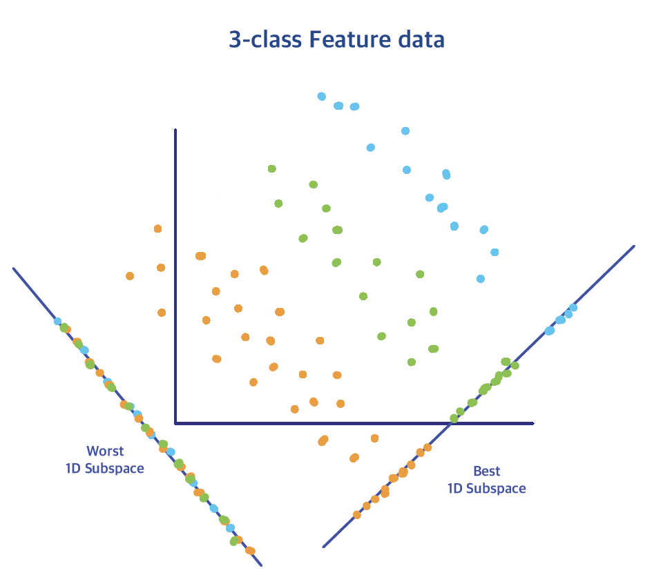
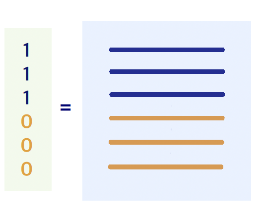

# Introduction to Classification


**Classification problems** are a fundamental supervised learning task in which the goal is to _predict a categorical outcome_ based on a set of input features. Unlike regression, where the response is continuous, classification involves discrete labels—such as "spam" vs. "not spam" or "diseased" vs. "healthy". The challenge lies in learning a function that accurately maps the input variables to the correct _class_, often by estimating probabilities or decision boundaries. Techniques range from simple models like logistic regression to more complex methods such as decision trees, support vector machines, and ensemble approaches. As in all statistical learning, the key is balancing model flexibility with the risk of overfitting, ensuring reliable predictions on new, unseen data.


### Classification Framework {.unnumbered .unlisted}

In the classification framework, we start with **training data** $\mathcal{D}_n = \{x_i, y_i\}_{i=1}^{n}$, where $x_i \in \mathbb{R}^p$ are the $p$ measurements/features. In our discussion here, we are going to focus the **binary** case first in which the _response_  $y_i \in \{0, 1\}$, $1=2, \ldots, n$ observations. The specific class coding is not as important, so it could be "0/1" or "-1/1" etc.

The main purpose in classification probems is to find a **classifier** <font color=blue> $f: \mathbb{R}^p \rightarrow \{0, 1\}$ </font>, that is a **map** between the features' space and the classes. To quantify the performance of the classifier, at any target point $x$ with outcome $y$, we typically use the  $0-1$ loss, that is the <font color=blue> misclassification error</font>
 \[L \Bigl(f(x), y \Bigr) = \begin{cases}
&0, \text{ if } y=f(x)\\
&1, \text{ otherwise }
\end{cases}\]

Ideally, we would like to construct a *prediction rule* that makes small errors not only on the $n$ samples, but also on future observations.  So, to find an  optimal classifier we need to  minimize:
<font color=blue> \[\min_{f} \frac{1}{n} \sum_{i=1}^{n} L\Bigl(f(x_i), y_i\Bigr)\]</font>
 
<br>


 

###  The Optimal Classifier {.unnumbered .unlisted}

Assume we know the  **true** model (how the data were generated), or that we have infinitely many samples, then
 \[\frac{1}{n}\sum_{i=1}^{n} L\Bigl(f(x_i), y_i\Bigr) \longrightarrow E_{X,Y} L\Bigl(f(X), Y\Bigr)\]
where the expectation is taken with respect to the true data generating process $P(x,y)$.  

<br>

<div class=motivationbox>
**Optimal Classifier**

The optimal classifier is obtained by minimizing a risk function. Specifically:
 \[f^* = \arg \min_f Risk[f]\]
where  $Risk[f] = E_{X,Y} L\Bigl(f(X), Y\Bigr)$
</div>

<br>

Suppose we adopt the **0-1 loss**, and are allowed to use any function $f$.  _What is the optimal $f^*$_?
<br><br>

If we denote by  <font color=blue>$p(x)$</font> the  *marginal* distribution function of $X$, <font color=blue>$p(y|x)$</font> is the  *conditional* distribution function of $Y$ given $X=x$, and <font color=blue>$p(x,y)=p(x) p(y|x)$</font> is the  *joint* distribution function of $(X,Y)$, then


\begin{align*}
Risk[f] &=  E_{ X,Y} L\Bigl(f(X), Y\Bigr) \\
&= \int_{\mathcal{X}} \int_{\mathcal{Y}} L\Bigl(f(x), y\Bigr)  p(x,y)\; dy \;dx\\
&= \int_{\mathcal{X}} \int_{\mathcal{Y}} L\Bigl(f(x), y\Bigr)  p(y|x) p(x)\; dy \; dx\\
&=  \int_{\mathcal{X}}  \; \Biggl[  \int_{\mathcal{Y}} L\Bigl(f(x), y\Bigr) p(y|x) dy \Biggr] \;p(x) \; dx
\end{align*}

The problem of finding $f$ that minimizes $Risk[f]$ is reduced to a series of _sub-problems_: 
 
For each given $x$, we need find the optimal value $f(x)$ to *minimize the inside integral*, i.e. 
 \[f^{*}(x) = \arg \min_{f} \int_{\mathcal{Y}} L\bigl(f(x), y \bigr) p(y|x) dy\]
If we  do this for every $x$, then the resulting $f^*$ minimizes $Risk[f]$.
  
The expression above turns out to be not difficult to solve. Note that $Y$ is just a (discrete)  Bernoulli random variable taking two possible values $\{0, 1\}$ with pmf
 \[\begin{cases}
&P\bigl(Y=1|X=x\bigr) = \eta(x)\\
&P\bigl(Y=0|X=x\bigr) = 1-\eta(x)
\end{cases}\]
 
Given $x$, the integral over $y$   is given by
\begin{align*}
\int_{\mathcal{Y}} L\bigl(f(x), y\bigr)\;  p(y|x) \;dy &= L \bigl(f(x), 1 \bigr)\;  P(Y=1|x)  + L\bigl(f(x), 0\bigr)  P(Y=0|x) \\
&= L\bigl(f(x), 1\bigr)\;  \eta(x) + L\bigl(f(x), 0 \bigr)  (1-\eta(x))\\
&=\\
&= \begin{cases}
& 1-\eta(x), \, \text{ if } \;f(x) = 1\\
& \eta(x), \, \text{ if } \; f(x) = 0
\end{cases}
\end{align*}

This leads to 

\[f^*(x) = \arg \min_f R[f] = \begin{cases}
& 1, \, \text{ if } \; \eta(x) := P(Y=1|x) \geq 0.5\\
& 0, \, \text{ if } \; \eta(x) := P(Y=1|x)< 0.5\\
\end{cases}\]

The  optimal classifier $f^*$ is called the <font color=blue>  **Bayes rule** </font>  and the corresponding risk <font color=blue> $R[f^*]$</font> is referred to as the    <font color=blue>  **Bayes risk** </font>  or    <font color=blue>  **Bayes error**</font>.

 <br>

####  How about Multi-class Classification? {-}

 The previous calculation can be easily extended to multi-class classification. In this case, the response will take values in a discrete set  <font color=blue>$y\in \{1, \ldots, K\}$</font> and the  **optimal rule** will be obtained by 
 <font color=blue>
\[f^*(x) = \arg \max_k P(Y=k | X=x)\]
 </font>
 
0/1 classifiers partition the $X$-space into regions, each assigned a label of 0 or 1. In many cases, we often describe the decision boundary rather than the function $f$ itself, which is where the term linear classifiers arises - these are classifiers whose decision boundaries are linear


## Discriminant Analysis


Discriminant analysis is a  <font color=blue>classification technique</font> that models the _difference_ between classes by assuming that the data for each class comes from a specific probability distribution. In other words, it tries to discriminate between classes by estimating the **boundaries** that separate them. We have three main types of discriminant analysis more-or-less based on the decision baoundary that we obtain as a result:


1.  Quadratic Discriminant Analysis (QDA)\

2.  Linear Discriminant Analysis (LDA) and its connection to Fisher Discriminant Analysis (FDA)\\  

3.  Naive Bayes

 
All these variations of discriminant analysis are based on  **Bayes Theorem**. In the calculations above, we discussed that it is crucial to estimate the  <font color=blue>joint distribution</font> $P(x,y) =  P(x|y)  p(y)$ which means that we need to be able to estimate 

* $p(x|y)$ the conditional distribution of $X$ given $Y$ in each class  

* $p(y)$ the marginal frequency of $Y$  in each class. 
 
and then use the Bayes theorem to flip things  and obtain the desired $P(y|x)$, that is the optimal classifier (i.e. the Bayes rule) does classification based on the conditional probability which by the Bayes Theorem takes the following form:

<div class=motivationbox>
**Bayes Theorem for Classification**

\begin{align*}
P(Y=k| X=x) &= \frac{P(X=x, Y=k)}{P(X=x)} = \frac{P(X=x| Y=k) P(Y=k)}{P(X=x)}\\
&= \frac{\pi_k\, f_k(x)}{P(X=x)}\, \propto \, \pi_k\,\,  f_k(x)
\end{align*}

*  <font color=blue>$f_k(x)$</font>: **conditional** density function of $X|Y=k$

*  <font color=blue>$\pi_k = P(Y=k)$</font>: the **marginal** probability or prior probability for class $k$. 

 </div>
 
Using  Bayes theorem, we can express the decision function as
 <font color=blue>\[f(x) = \arg \max_k \;  \pi_k  f_k(x) = \arg \max_k \Bigl[ \log  \pi_k + \log  f_k(x) \Bigr]\]</font>
which implies that in order to construct the optimal classifier, we  need to estimate  $\pi_k$ and  $f_k$.

 
<br>


### Quadratic Discriminant Analysis


 Given $Y=k$,  the $p$-dim feature   <font color=blue>$\mathbf{x}\sim MVN(\mu_k, \Sigma_k)$</font> is modeled by a multivariate normal distribution with mean $\mu_k$ and covariance matrix $\Sigma_k$, that is
\[\mu_k = \left(\begin{array}{c} 
      \mu_{k,1} \\ \mu_{k,2} \\ \vdots \\ \mu_{k,p}
    \end{array}\right)_{p\times 1 } \,\, \text{ and } \,\, \Sigma_k^{-1} =  \left(\begin{array}{cccc}
   \theta_{k,11}& \cdots &\theta_{k,1p} \\
   \theta_{k,21}& \cdots&\theta_{k,2p}   \\
    \vdots & \ddots & \vdots\\
   \theta_{k,p1} & \cdots & \theta_{k,pp}  \\
    \end{array} \right)_{p\times p} \]

Then, the pdf of  $\mathbf{x} \sim MVN(\mu_k, \Sigma_k)$, is given by
\[f_k(\mathbf{x}) = \frac{1}{(\sqrt{2\pi})^p} \frac{1}{|\Sigma_k|^{1/2}} \exp \bigg\{-\frac{1}{2}  (\mathbf{x} - \mu_k)^T \Sigma_k^{-1} (\mathbf{x} - \mu_k)\biggr\} \]
A few calculations on the _exponent_ lead to
\[ (\mathbf{x} - \mu_k)^T \Sigma_k^{-1} (\mathbf{x} - \mu_k) = \sum_{j=1}^{p} \sum_{\ell=1}^{p} \theta_{k, j\ell} (\mathbf{x}_j - \mu_{k,j})^T (\mathbf{x}_j - \mu_{k, \ell})\]


Therefore, we can write that  we have that
 <font color=blue>\[P(Y=k|\mathbf{x}) \propto \pi_k f_k(x) \propto e^{-\frac{d_k(x)}{2}}\]</font>
where 
\begin{align*}
d_k(x) &= 2\Bigl[ -\log f_k(x) - \log(\pi_k) \Bigr]\\
&= (x - \mu_k)^T \Sigma_k^{-1} (x - \mu_k) + \log|\Sigma_k| - 2\log \pi_k
\end{align*}
The first term of the **discriminant function/exponent** is the so-called <font color=blue>  Mahalanobis distance </font> between $\mathbf{x}$ and $\mu_k$.


So, we predict $\mathbf{x}$ to class $k$, if $d_k$ achieves the minimum among $\Bigl(d_1(\mathbf{x}), \ldots, d_K(\mathbf{x}) \Bigr)$. The classification rule  is called   <font color=blue>**Quadratic Discriminant Analysis (QDA)***</font> since it leads to   **quadratic decision boundaries**.  
 
<br>

To apply this method in practice, we need to be able to estimate $\pi_k$, $\mu_k$ and $\Sigma_k$. Indeed,
 
*   _Sample Frequency_ \&  _Sample Mean_ for each class:
\[\hat{\pi}_k = \frac{n_k}{n},\quad  \hat{\mu}_k = \frac{1}{n_k} \sum_{i:y_i=k} \mathbf{x}_i,\,\, k=1:K\]

*  _Sample Covariance matrix_ for each class:
\[\hat{\Sigma}_k = \frac{1}{n_k-1} \sum_{i:y_i=k} (\mathbf{x} - \hat{\mu}_k)_{p\times 1}(\mathbf{x} - \hat{\mu}_k)^T_{1\times p}\]

<br>
**Remark**: In the case that  $\hat{\Sigma}_k^{-1}$ does not exist, we replace it by $(\hat{\Sigma}_k + \eta I_p)^{-1}$ where $\eta$ is a small number e.g. $\eta=0.01$.

 

<br><br>

### Linear Discriminant Analysis

Assume now that the entries of the covariance matrix $\Sigma$ are not dependent on $k$, i.e. $\Sigma_k = \Sigma$. Then, the discriminant function simplifies to
 \[d_k(\mathbf{x}) = (\mathbf{x} - \mu_k)^{T} \Sigma^{-1} (\mathbf{x} - \mu_k) + \log|\Sigma| - 2 \log \pi_k\]
which is a   <font color=blue>**linear function**  of $\mathbf{x}$ </font>:
\[ (\mathbf{x} - \mu_k)^{T} \Sigma^{-1} (\mathbf{x} - \mu_k) = \mathbf{x}^T \Sigma^{-1} \mathbf{x} - 2\mathbf{x}^T \Sigma^{-1} \mu_k + \mu_k^T \Sigma^{-1} \mu_k\]
 
In this case, the covariance matrix  $\Sigma$ can be estimated by the *pooled sample covariance matrix* 
\[\hat{\Sigma} = \frac{1}{n-K} \sum_{i=1}^{K} \sum_{i:y_i=k}  (\mathbf{x}_i - \hat{\mu}_k) (\mathbf{x}_i - \hat{\mu}_k)^T\]

 <br><br>
 
**Remark**: If $\hat{\Sigma}^{-1}$ does not exist, then we can replace it by $(\hat{\Sigma} + \eta I_p)^{-1}$ where $\eta$ is a small number to compute $\hat{\Sigma}^{-1}$. Alternatively, we can  compute a  generalized inverse as follows (assume $p =3$):

\[
\hat{\Sigma} = U_{p\times 3} \left(\begin{array}{ccc}
   d_1& 0 & 0 \\
   0& d_2& 0 \\
   0 & 0 & 0\\
    \end{array} \right)  U^T
\Rightarrow \hat{\Sigma}^{-1} = U \left(\begin{array}{ccc}
   1/d_1& 0 & 0 \\
   0& 1/d_2& 0 \\
   0 & 0 & 0\\
    \end{array} \right)  U^T \]
 

 <br><br>


### Reduced Rank LDA

Let us further simplify the covariance matrix  $\Sigma$ by assuming that it  is an  **identity** matrix $\mathbf{I}_p$.  The  discriminant function for LDA will now become
 <font color=blue>
\[d_k(\mathbf{x}) =  ||\mathbf{x}-\mu_k||^2 - 2\log \pi_k\]
 </font>
 
Note that the feature vector $x$ only appears in the 1st term which is $||\mathbf{x}-\mu_k||^2$ is the _squared distance from $\mathbf{x}$ to $\mu_k$_, the center of the $k$th class. 

Next, we will show that we can replace the squared distance $||\mathbf{x}-\mu_k||^2$ in the original $p$-dim space by a square distance in a $(K-1)$-dim subspace showing that LDA naturally leads to dimension reduction from $p$ to $K-1$.
 

_Without loss of generality_ assume that $\bar{\mu}=0$. Indeed, we care about the _relative_ distance among points so we can always move the origin to $\bar{\mu}$ without affecting the distance.

 In this case  $(\mu_1, \ldots, \mu_K)$ form a $(K-1)$-dim subspace in $\mathbb{R}^p$, denoted by $\mathcal{A}$. For any vector $\mathbf{x}$ in $\mathbb{R}^p$
\[\mathbf{x} = \mathbf{x}_1 + \mathbf{x}_2, \quad \mathbf{x}_1 \in \mathcal{A}, \mathbf{x}_2 \in \mathcal{A}^c\] 
In the expression above
 
*  $\mathbf{x}_1$: projection of $\mathbf{x}$ onto the $(K-1)$-dim subspace $\mathcal{A}$ 

*  $\mathbf{x}_2$: the projection of $\mathbf{x}$ onto the $(p-K+1)$-dim subspace that is *orthogonal* to $\mathcal{A}$.

In practice, we can get this decomposition by running a regression of $\mathbf{x}$ against $B=(\mu_1, \ldots, \mu_{k-1})_{p\times (K-1)}$ and
\begin{align*}
\mathbf{x}_1 &= H \mathbf{x} = \text{ the fitted vector,}\\
\mathbf{x}_2 &= \text{ the residual vector, where } H = B(B^TB)^{-1} B^T
\end{align*}
 
Due to orthogonality of $\mathbf{x}_1$ and $\mathbf{x}_2$, we have
\begin{align*}
||\mathbf{x}||^2 &= ||\mathbf{x}_1 + \mathbf{x}_2||^2 = (\mathbf{x}_1+\mathbf{x}_2)^T(\mathbf{x}_1+\mathbf{x}_2)\\
&= \mathbf{x}_1^T \mathbf{x}_1 + \mathbf{x}_1^T \mathbf{x}_2 + \mathbf{x}_2^T \mathbf{x}_1 + \mathbf{x}_2^T \mathbf{x}_2 =||\mathbf{x}_1||^2 + ||\mathbf{x}_2||^2
\end{align*}

[ norm-square (length-square) of a vector ]  = <br>
[ norm-square of its projection onto $\mathcal{A}$] + [norm-square of its projection onto $\mathcal{A}^c$]  


Square distance from a point $\mathbf{x}$ to the center of the $k$th class:
\begin{align*}
||\mathbf{x} - \mu_k||^2 &= ||(\mathbf{x}_1 - \mu_k) + (\mathbf{x}_2 - 0) ||^2\\
&= ||\mathbf{x}_1 - \mu_k||^2 + C, k=1,\ldots, K
\end{align*}
where the constant $C=||\mathbf{x}_2||^2$ is the same for all $k$.  Note that the projection of $\mu_k$ onto $\mathcal{A}^c$ is zero. For  classification, we *only* want to know the **magnitude** of $d_k(x)$:
\begin{align*}
d_k(x) &= ||\mathbf{x}-\mu_k||^2 - 2\log \pi_k\\
&= ||\mathbf{x}_1-\mu_k||^2 - 2\log \pi_k + \text{ constant}\\
\end{align*}

 Operate LDA on the reduced $(K-1)$-dim space $\mathcal{A}$: replace data $\mathbf{x}$ by $\mathbf{x}_1$ (its projection onto $\mathcal{A}$) and compute
  <font color=blue>
\[d_k(\mathbf{x}) = ||\mathbf{x}_1 - \mu_k||^2 - 2\log \pi_k\]
</font>
which is the same as running LDA in the original $p$-dimensional space.
 

In practice, $\Sigma$ will **not** be the identity matrix. So, we need to consider the SVD (singular value decomposition) of $\Sigma$
 \[\Sigma = U D^2 U^T \]
where
 
* $D$ is diagonal with non-negative entries 

* $U$ is an orthogonal (i.e. rotation) matrix with $UU^T=I_p$
 
Start by transforming $\mathbf{x}$ to $\tilde{\mathbf{x}}$:
\[\mathbf{x}\in \mathbb{R}^p \Rightarrow \tilde{\mathbf{x}} = \Sigma^{-1/2} \mathbf{x} \in \mathbb{R}^p\]
with $\Sigma^{-1/2}:= U D^{-1} U^T$. Then the covariance matrix of $\tilde{\mathbf{x}}$ is  identity. Indeed:
\begin{align*}
Cov(\tilde{\mathbf{x}}) &= Cov\bigl(\Sigma^{-1/2}\mathbf{x} \bigr)\\
&= \Sigma^{-1/2}\; Cov(\mathbf{x})\; (\Sigma^{-1/2})^T\\
&= U D^{-1} U^T \; \Sigma \; U D^{-1} U^T \\
&= U D^{-1} U^T \;  U D^2 U^T\; U D^{-1} U^T = I_p
\end{align*}

**Remark**: This has the same flavor as the re-scaling of an one-dimensional variable to have unit variance. In the one-dim case, we multiply the variable by $\frac{1}{\sqrt{\sigma^2}}$, while here we multiply by $\Sigma^{-1/2}$, i.e. the inverse of the square-root of $\Sigma$ in the multi-dimensional setting. Note that $\Sigma^{-1/2}$ is symmetric and $\Sigma^{-1/2}\Sigma^{-1/2} = \Sigma^{-1}$
 
<br><br>
 

####  Summary of Reduced Rank LDA {-}

 
**Training:** Input $(x_i, y_i)_{i=1}^{n}$/ Output: $(\pi_k, \mu_k)_{k=1}^{K}$ and $\Sigma$
 
**Make Prediction:**
   
  _Input:_ test point $\mathbf{x}^*$ and output from Training  
  
   Compute SVD of $\Sigma = U D^2 U^T$ and $A=U D^{-1}U^T$ 
   
   Compute the projection matrix $H$ based on $(A\mu_1, \ldots, A\mu_k)$

\begin{align*}
B_{p\times (K-1)} &= \biggl[A(\mu_1 - \bar{\mu}), \ldots, A(\mu_{K-1} - \bar{\mu})\biggr]\\
H &= B (B^TB)^{-1}B
\end{align*}

Dimension reduction: $\tilde{\mathbf{x}}^* = H A \mathbf{x}^*$ 

For $k-1:K$, compute
\[d_k(\mathbf{x}^*) = ||\tilde{\mathbf{x}}^* - \mu_k||^2 - 2 \log \pi_k\]
**Output:** $\arg \min_k d_k(\mathbf{x}^*)$.

<br><>br

 When $p \geq K$, this means that for LDA, one can project the data onto a lower-dimensional subspace (dim = $K-1$), e.g. just one dimension for binary classification. 

The same subspace also arises in a dimension reduction method called  Fisher Discriminant Analysis (FDA), though FDA is motivated from a slightly different aspect. </p>

 
<br>

#### Risk of Overfitting {-}


Each of the $(K-1)$ directions are linear combinations of the original $p$ dimensions, and the weights are all learned from the data so overfitting can occur.%good separation on ``just'' the $(K-1)$ (or even less) directions on the training data, but the same good result cannot be reproduced on the test data. 
 


 
<br><br>

## Fisher Discriminant Analysis (FDA)


<font color=blue>**Supervised dimension reduction**</font>

 

We want to find a direction such that the projection of data (of multiple classes) onto this direction is  well separated, that is the group means of $\mu_i$s are far apart from each other, and within each group, the variation/spread is small, i.e., maximize the following ratio
 <font color=blue>
\[\frac{\text{Between group variation}}{\text{Within group variation}} = \frac{a^T B a}{a^T W a}\]
</font>

The matrices $B$ and $W$ are the **within-class** \& **between-class** sample covariance matrices, defined by
\begin{align*}
W_{p\times p} &= \frac{1}{n-K} \sum_{k=1}^{K} \sum_{i:y_i=k} (\mathbf{x}_i - \hat{\mu}_k)  (\mathbf{x}_i - \hat{\mu}_k)^T\\
B_{p\times p} &= \frac{1}{K-1} \sum_{k=1}^{K} n_k (\hat{\mu}_k - \bar{\hat{\mu}}_k)  (\hat{\mu}_k - \bar{\hat{\mu}}_k)^T
\end{align*}
 
 If we re-write $x_i$s as follows
\begin{align*}
x_1 &=  x_1 - \hat{\mu}_{y_1} + \hat{\mu}_{y_1}\\
x_2 &= x_2 - \hat{\mu}_{y_2} + \hat{\mu}_{y_2}\\
\ldots &= \ldots \\
x_n &= x_n - \hat{\mu}_{y_n} + \hat{\mu}_{y_n}
\end{align*}
we can think of $W$ as the sample covariance matrix over $x_i - \hat{\mu}_{y_i}$ (same as the pooled sample covariance matrix $\hat{\Sigma}$ in LDA), and  $B$ as the sample covariance matrix over the $K$ class centers $\hat{\mu}_{y_i}$.
 
<br><br>

### Generalized Eigenvalue Problem {.unlisted .unnumbered}

\[\max_a \frac{a^T B a}{a^T W a} \,\, \Rightarrow \,\,  \max_a \left( a^T B a \right) \,\, \text{ subject to }\,\, a^TW a =1 \]
 

Assume $W=U D^2 U^T$, and define $b= W^{1/2} a$, where $W^{1/2}:= U D U^T$ is symmetric. The inverse of $W^{1/2}$ computes as  $W^{-1/2} = U D^{-1} U^T$. Therefore,

\begin{align*}
a^T B a &= a^T \; W^{1/2} W^{-1/2}\; B\;  W^{-1/2} W^{1/2}\; a\\
&= (W^{1/2} a)^T \; W^{-1/2} B W^{-1/2}\; (W^{1/2} a)\\
&= b^T W^{-1/2} B W^{-1/2} b
\end{align*}
subject  to $||b||^2 = 1$. The optimization above is a classical eigenvalue problem! In this problem, we can solve the directions  _sequentially_ as follows:

$b_1 =$ the 1st eigenvector of matrix $W^{-1/2} B W^{-1/2}$, then solve  $a_1 = W^{-1/2} b_1$.  

$b_2 =$ the 2nd eigenvector of matrix $W^{-1/2} B W^{-1/2}$,  then solve  $a_2 = W^{-1/2} b_2$. 

Although $b_j$s  are  orthonormal, the $a_j$s are **not**:
\begin{align*}
b_j^T b_j &= 1, \quad a_j^T W a_j = 1\\
b_j^T b_{\ell} &= 0, \quad  a_j^T W a_{\ell} = 0
\end{align*}

We can extract at most $(K-1)$ directions, since the rank of $B$ is $(K-1)$. The $(K-1)$ directions span exactly the same space as the one from the reduced rank LDA.

 

<br><br>

#### LDA vs. FDA {-}

Linear Discriminant Analysis (LDA) is primarily a classifier, whereas Fisher Discriminant Analysis (FDA) is a dimension reduction method: it identifies a set of directions rather than providing a classification rule. Although FDA does not explicitly assume that the data are normally distributed, the subspace it produces often resembles the reduced space obtained from LDA. This similarity arises because FDA implicitly assumes that the data in each group are approximately normally distributed with the same covariance matrix. FDA is a supervised dimension reduction technique, in contrast to Principal Component Analysis (PCA), which is unsupervised. Moreover, FDA can be applied to regression problems as well. However, care must be taken to avoid overfitting, particularly in high-dimensional settings.


<br><br>


#### Risk of Overfitting {-}


 

Consider an example where you only have $n=6$: 3 of the observations are from group 1 (blue), and the other 3 from group 2 (orange). In this case, the projection results in a clear separation between the two classes: 
 
 * Class one points project to 1.
 
 * Class zero points project to 0.
 

This separation arises not due to meaningful features but because the feature dimension matches the sample size $n$. 

When the feature dimension equals the sample size, we can generate an $n \times n$ design matrix and find a direction in the $n$-dimensional space that effectively separates the classes, even if the features are random noise.
 
This can be remedied if we use:

* **L1 Penalty**: Add L1 regularization to the optimization problem when estimating covariance matrices or their inverses and mean vectors. This encourages sparsity in the estimated parameters.  

* **Assume Independence**: Assume that the p-dimensional density function is composed of independent components. This implies that the covariance matrix (sigma) becomes diagonal. This approach is known as Naive Bayes and can help address high-dimensional overfitting.
 
 
<br><br>

 


## Naive Bayes Classifiers


For multi-class problems the optimal decision rule is
 \[\arg \max_k P(Y=k|X=\mathbf{x}) = \arg \max_k \; \pi_k \;f_k(\mathbf{x})\]

 We require $f_k(x)$ to be 
 <font color=blue>
 \[f_k(\mathbf{x}) = f_{k1}(\mathbf{x}_1) \times f_{k2}(\mathbf{x}_2) \times \ldots \times f_{kp}(\mathbf{x}_p)\]
 </font>
i.e.  each dim of $\mathbf{x}$ is independent. (You can view independence as regularization for high-dimensional problems.)}

Each density  $f_{kj}$ $(j=1:p, k=1:K)$ is estimated separately within each class, e.g., discrete features via histograms; numerical features via  kernel density estimates (non-parametric NB) or  normal densities (parametric NB). 
 
 

 

#### Summary of Parametric Naive Bayes {-}


Training:
 
Input: $(x_i, y_i)_{i=1}^{n}$ 
Output: $(\pi_k, (\mu_{jk}, \sigma_{kj}^{2})_{j=1:p})_{i=1}^{K}$  
 
Make Prediction:

Input: test point $\mathbf{x}^*$ and output from Training 

For $k=1:K$, compute
\begin{align*}
d_k(\mathbf{x}^*) &= -2\log  \Biggl[ \pi_k \frac{1}{\sqrt{\sigma^2_{k1}}} e^{-\frac{(x_1^* - \mu_{k1})^2}{2\sigma_{k1}^2}} \ldots \frac{1}{\sqrt{\sigma^2_{kp}}} e^{-\frac{(x_p^* - \mu_{kp})^2}{2\sigma_{kp}^2}} \Biggr]\\
&= -2\log \pi_k  + \sum_{j=1}^{p} \Biggl[\log \sigma^2_{kj} + \frac{(x_j^* - \mu_{kj})^2}{\sigma_{kj}^2} \Biggr]
\end{align*}

Output: $\arg \min_k d_k(\mathbf{x}^*)$

 

 

 

####  Summary {-}

 
In Discriminant Analysis (DA), we estimate the  joint distribution}
\begin{align*}
P(X=x, Y=k) &= P(Y=k|X=x ) \;P(X=x)\\
&= P(X=x| Y=k) \; P(Y=k)
\end{align*}
and then obtain $P(Y=k|X=x)$. 

It is conceptually simple and works for some low-dimensional problems, but not an effective way of building classifiers.


## The `Digits` Recognition Example 


### Discriminant Analysis in R {.unnumbered .unlisted}

To illustrate the concepts presented in this section, we are going to work with the handwritten digits data set from the ESL book. The data can be found in the `ElemStatLearn` library (which is not compatible with newer versions of `R`) or in the `tensorBSS` library. The **goal** in this example is to classify the digits correctly. To that end, we are foinf to use QDA, LDA, FDA and Naive Bayes techniques.


```{r}
library(tensorBSS) ## Needed for the ESL data sets (if you have a newer R)
library(MASS) ## Needed for the DA functions
library(e1071)
data(zip.train)
```

In this data set, the response is in the **first** column. If we want (for illustration purposes), we can extract the first six images and plot them:

```{r}
par(mfrow=c(3,3), mai=c(0.25,0.25, 0.25, 0.25))
for (i in 1:6){ 
digit.img = matrix(zip.train[i, -1], nrow = 16, byrow = TRUE)
digit.img = t(digit.img)[,16:1]
image(1:16,1:16,digit.img, axes = FALSE)
}
```

There is no pre-loaded testing data set in this library, hence we split the give data in testing and training:

```{r}
set.seed(598) 
n <- nrow(zip.train)

train.index <- sample(1:n, 800) 
remaining.index = setdiff(1:n, train.index)
test.index = sample(remaining.index, 200)
  
train.zip <- zip.train[train.index, ]
test.zip  <- zip.train[test.index, ]


X.train <- train.zip[, 2:257]
Y.train <- train.zip[, 1]

X.test <- test.zip[, 2:257]
Y.test <- test.zip[, 1]
```


### Linear Discriminant Analysis (LDA) {.unlisted .unnumbered}


We start by running the Linear Discriminant Analysis (LDA):

```{r}
digits.lda = lda(X.train,Y.train)
```

Then, we predict and compute a prediction table. We also compute the accuracy of the method.

```{r}
Y.predicted = predict(digits.lda, X.test)$class
# table(Y.test, Y.predicted) ## Remove comment to see output
1 - sum(Y.test != Y.predicted) / length(Y.test)
```

The accuracy here is approximately 84.5%!


<br>


### Quadratic Discriminant Analysis (QDA) {.unlisted .unnumbered}

If we try to run a Quadratic Discriminant Analysis (QDA), then we obtain an error message due to the rank deficiency of the sigma matrix for each group. Unfortunately, the MASS package is not able to handle this issue.


```{r}
## digits.qda = qda(X.train,Y.train)
```

### Fisher Discriminant Analysis (FDA) {.unlisted .unnumbered}

Let us try to see if FDA works. Project the data onto FDA directions (returned by the `lda` function).

```{r}
FDA.digits.directions = digits.lda$scaling
dim(FDA.digits.directions)
```

These directions turned out to be 9 in our case!

```{r}
F = X.train%*%FDA.digits.directions

par(mfrow=c(1,2))
plot(F[,1],F[,2], type="n", xlab="", ylab="")
text(F[,1], F[,2], Y.train, col=Y.train+7)

F.test = X.test%*%digits.lda$scaling;
plot(F.test[,1], F.test[,2], type="n", xlab="", ylab="")
text(F.test[,1], F.test[,2], Y.test, col=Y.test+7)
```

For illustration purposes, we display the projection of the data onto the first two dimensions. Projecting in other dimensions will give a different result, so feel free to change the dimensions and see the difference.

On the left, you can observe that the training data is well-separated into ten classes when using these two directions. However, replicating the same result with the test data on the right is not possible. This discrepancy arises because of overfitting to the training data.


#### Computational Remarks {-}

Let's discuss how to compute the FDA directions. We start by computing the within group covariance matrix $W$:

```{r}
tmp.lm = lm(X.train ~ as.factor(Y.train) - 1); # each x_i - its group mean
W = cov(tmp.lm$res)
eigenW = eigen(W)
summary(eigenW)

A = eigenW$ve %*% diag(1/sqrt(eigenW$va)) %*% t(eigenW$ve)
```


Then, we compute $B$ the between-group covariance matrix:

```{r}
B = cov(tmp.lm$fitted)
```

So, now we can extract the FDA directions:

```{r}
FDA.eigen = eigen(A %*% B %*% t(A)) 
FDA.eigen.dir = A %*% FDA.eigen$ve[, 1:9]

for(j in 1:9)
  print(cor(FDA.eigen.dir[, j], FDA.digits.directions[, j]))
```

<br>

#### FDA vs PCA {-}

Obtain the top 100 PCs:

```{r}
Sigma = cov(X.train)
dig.eigen=eigen(Sigma);
PCA.dir = dig.eigen$ve[, 1:100]  # pick top 100 PCA directions
dim(PCA.dir)
```

Note that directions from PCA are orthogonal:
```{r}
round(t(PCA.dir[, 1:10]) %*% PCA.dir[, 1:10], dig=2)
```

but directions from FDA are not:

```{r}
round(t(FDA.eigen.dir) %*% FDA.eigen.dir, dig=2)
```

But, FDA directions are orthogonal with respect to the within-class covariance matrix $W$:

```{r}
round(t(FDA.eigen.dir) %*% W %*% FDA.eigen.dir, dig=2)
```

Another approach would be to apply PCA first to reduce the dimensionality of the problem, and then apply FDA. As an example:

```{r}
newX.train = X.train %*% PCA.dir[, 1:100];
new.digits.lda = lda(newX.train, Y.train);
new.X.test = X.test %*% PCA.dir[, 1:100]
Y.test.pred = predict(new.digits.lda, new.X.test)$class
table(Y.test, Y.test.pred)

sum(Y.test != Y.test.pred)
```


```{r}

newF=newX.train%*%new.digits.lda$scaling;
newFtest=X.test%*%dig.eigen$ve[,1:100]%*%new.digits.lda$scaling

par(mfrow=c(1,2))
plot(newF[,1],newF[,2], type="n", xlab="", ylab="")
text(newF[,1], newF[,2], Y.train, col= Y.train+5)
plot(newFtest[,1], newFtest[,2], type="n", xlab="", ylab="")
text(newFtest[,1], newFtest[,2], Y.test, col=Y.test+5)

```

In this case, we observe that there is not as clear a separation observed in training data as before. This reduction in separation is expected due to the substantial dimension reduction from 256 to 100. While the training data’s separation may not be as good as before, this approach produces more consistent results between the training and test datasets, which can help mitigate overfitting issues.


<br><br>


### Naive Bayes Prediction {-}

Implementation of the Naive Bayes predictor. We use the the `naiveBayes` function in the `e1071` library.
<br>

```{r}
zip17 = train.zip[train.zip[,1] %in% c(1,7),]
zip17.test = test.zip[test.zip[,1] %in% c(1,7),]
Y.17 = as.factor(zip17[,1])
X.17 = zip17[,-1]

NBfit = naiveBayes(X.17, Y.17)

y_pred = predict(NBfit, zip17.test)
accuracy = mean(y_pred == zip17.test[,1])

table(Predicted = y_pred, Actual = zip17.test[,1])

```
