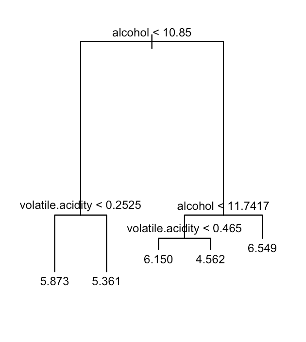
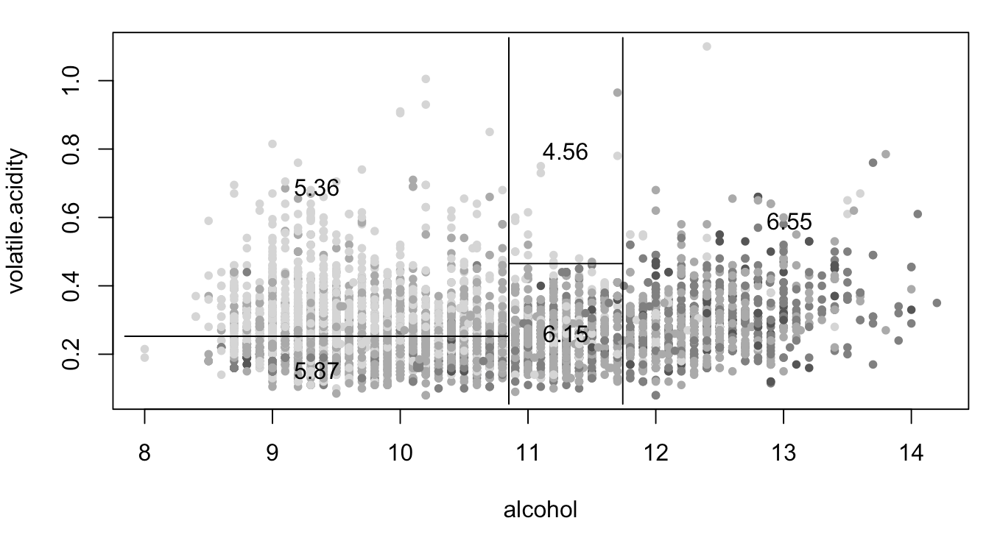
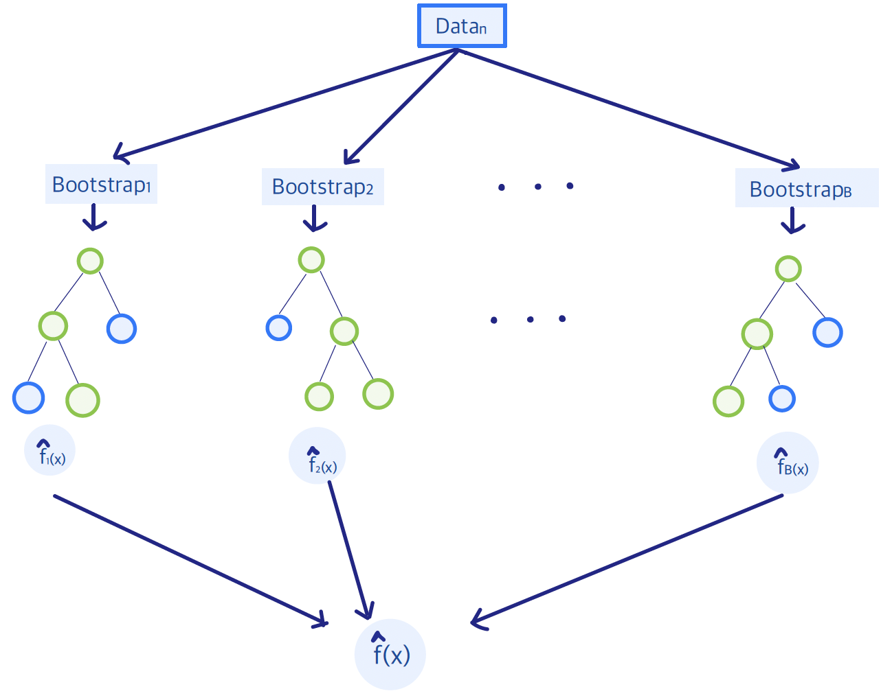

# Regression Trees

In this section, we are going to discuss **tree-based** models for **regression**.


<div class=motivationbox>
**Framework**

* Response Variable: $Y\in \mathbb{R}$ -- continuous &nbsp;
* Features: $X = (X_1, X_2, \ldots, X_p)$&nbsp;
</div>


**Regression trees** are <font color=blue>_non-linear_</font> and <font color=blue>_non-parametric_</font> methods. They recursively partition the feature space into hyper-rectangular subsets and fit a simple prediction in each piece. There is no single global form such as "$Y$ is linear in $X$"; complexity is controlled by tuning parameters (tree size, and later the ensemble size). For this chapter both the split criterion and the leaf prediction use **squared error**. Classification trees (Gini, deviance) will wait.

Below we can see a sketch of a regression tree for a `wines` data set in which we want to predict the _quality_ of the wine (a numerical outcome) versus _wine characteristics_ (a set of predictors):
&nbsp;
&nbsp;
<center>


</center>
&nbsp;

We will restrict our focus to _binary_ partitions of the tree. In the example above, we first split the space into **two** regions and model the response by the mean of $Y$ in each region. _At each step_, we choose the variable and split-point to achieve the best fit. Then one or both regions are split into two more regions, and this process continues until _some_ stopping rule is applied. In the example, the first split is whether `alcohol` is less than or greater than $10.85$. The region with $\text{alcohol}<10.85$ is then split on `volatile.acidity` at $0.2525$, and the region to the right is split on `alcohol` again at $11.7417$, and so on. When we stop, the predicted `quality` is the average of $Y$ in that region.
&nbsp;


<div class=motivationbox>
**Terminology**

* <font color=blue>**Leaf Node**</font>: Each leaf node corresponds to a rectangular-shaped region in the _feature space_.
* <font color=blue>**Internal Node**</font>: These nodes are parent nodes with two children -- left and right nodes.
* A <font color=blue>**split**</font> involves a variable $j$ and a particular split value $s$.
</div>

&nbsp;
A single tree is easy to interpret: a prediction is a short sequence of threshold rules. Splits depend only on the ordering of a predictor, so any monotone transformation of a predictor leaves the tree unchanged. The same splitting algorithm can be used when $p$ is large, interactions appear when different variables are chosen along a path, and predictors that are never selected are effectively ignored.

The usual weakness is accuracy. One tree is often a high-variance fit; that is the reason for the ensemble methods later in this section.


## Single-Tree Building

As we discussed, to build a single tree one recursively partitions the predictor space. Start by **initializing the root** with all of the training data. Then choose a **splitting rule** consisting of a predictor $X_j$ and a constant $c$ that splits the observations in the node:
\[\mathbf{1}_{\{X_j \leq c\}}\]

<center>


</center>
Then apply the same procedure to each child node:
<center>


</center>

We denote a node by $(t)$ and its children by $(t_L, t_R)$. A split is a pair (variable $j$, cutpoint $s$), and the procedure ends at the leaves (terminal nodes).

When we stop, we **predict** in each terminal node using the data in that node. Every leaf (a rectangular region $R_m \subset \mathcal{X}$) is assigned a constant, so a regression tree has the form
\[\hat{f}(X) = \sum_m c_m \mathbf{1}_{\{X \in R_m\}}.\]


The natural questions are:

1. **Where** to split the tree?&nbsp;
2. **When** to stop? &nbsp;
3. **How** to predict the response at each leaf node?

### Prediction at Leaf Nodes

Each leaf corresponds to a region <font color=blue>$R_m$</font> that contains some training points. The **prediction** in that leaf is the <font color=blue>_average of the response $Y$_</font> for the observations in $R_m$, $m=1, \ldots, M$:
\[\hat{f}(X) = \sum_{m=1}^{M} c_m \mathbf{1}_{\{ X \in R_m\}}.\]
The constants $c_m$ are chosen by minimizing squared error in the leaf:
\[\min_{c_m} \sum_{i:\, x_i \in R_m} (y_i - c_m)^2.\]
The minimizer is the average of those $y_i$ with $x_i \in R_m$.
&nbsp;


### Split Criterion


Finding a **global** partition of $\mathcal{X}$ with minimum residual sum of squares is computationally infeasible, so we use a greedy algorithm. This search is not guaranteed to find the piecewise-constant fit with globally smallest RSS; it only chooses the best single split at the current node. Start with all of the data at the root. A split variable $j$ and split point $s$ produce the half-planes
\[R_1 (j,s) = \bigl\{X: X_j \leq s \bigr\} \quad \text{ and } \quad R_2 (j,s) = \bigl\{X: X_j > s \bigr\}.\]
We then choose the pair $(j,s)$ that solves
\[\min_{j,s} \Bigl[ \min_{c_1} \sum_{x_i \in R_1(j,s)} (y_i - c_1)^2 + \min_{c_2} \sum_{x_i \in R_2(j,s)} (y_i - c_2)^2 \Bigr].\]
For any fixed $j$ and $s$, the inner minimization is solved by
\[ \hat{c}_1 = \mathrm{ave} \bigl(y_i : x_i \in R_1(j,s) \bigr) \, \text{ and }  \hat{c}_2 = \mathrm{ave} \bigl(y_i : x_i \in R_2(j,s) \bigr).\]
&nbsp;

For each splitting variable, the best cutpoint $s$ can be found quickly by scanning the ordered unique values, so searching over all pairs $(j,s)$ is feasible.

 &nbsp;
The same idea can be written as a _split criterion_ <font color=blue>$\Phi(j,s)$</font>, here the **reduction in RSS**. Regression trees are grown _top-down_ and _greedily_:


* Start at the _root_ and consider

  **a.** all variables $j=1, \ldots, p$ and

  **b.** all candidate split values,

  **c.** and pick the split with the best $\Phi$.

* The data in the node are then sent to a left child and a right child.

* Repeat the procedure in each child.

&nbsp;


<div class=motivationbox>
**Split Criterion $\Phi(j, s)$**

Reduction in RSS if we split the samples at node $t$ into $t_L$ and $t_R$:
\[ \Phi(j, s) = RSS(t) - \Bigl[RSS(t_R) + RSS(t_L) \Bigr] \]
where
\[RSS(t) = \sum_{x_i \in t} (y_i - c_t)^2, \quad \text{ with } \quad c_t = \mathrm{ave}\{y_i : x_i \in t\}.\]

Note that $\Phi(j, s) \ge 0$, with equality if and only if the two child means are equal.
</div>

&nbsp;

#### Categorical Predictors {-}

A categorical predictor with $m$ levels can be used directly as a split variable. In principle there are $2^{m-1}-1$ ways to assign the $m$ labels to the left and right child. That search is feasible only for small $m$.

For regression with squared error there is a shortcut: order the $m$ levels by their mean response, then treat the variable as if it were ordered. Only the $m-1$ adjacent cuts need to be checked, and the best of those is the best binary partition of the labels.


&nbsp;

#### Missing Predictor Values {-}

Tree algorithms can handle missing predictors without discarding whole rows, which would otherwise shrink the training set quickly.

One approach is to evaluate the split using only the observations with $X_j$ observed. After a split $(j,s)$ is chosen, missing $X_j$ can be filled in by an imputation rule.

A more specifically CART-style option is to build *surrogate* splits: other variables (and a majority rule) that predict the event $\{X_j \le s\}$. An observation missing $X_j$ is sent left or right by the best available surrogate, then the next, and so on.


### Single-Tree Pruning

We have a leaf prediction and a split criterion. What remains is _when to stop_, which determines how large the tree is. &nbsp;

For a binary tree write $|T|$ for the number of **terminal nodes** (leaves). The number of splits is then $|T|-1$. A large tree can overfit, but a small tree may miss structure that only appears after a weak first split. Balancing fit and size is the same "loss + penalty" idea as in penalized regression.

One possible rule is to split a node only if the decrease in RSS exceeds a certain threshold. That rule is short-sighted: a split that looks useless now may be followed by a valuable split below. The standard strategy is therefore to grow a large tree and then **prune**.


<font color=blue>We start by growing a very large tree $T_{\max}$</font>:

* until all terminal nodes are nearly pure, that is, the variability of $Y$ in the node is small;

* or until the number of observations in each terminal node is below a threshold;

* or until the tree reaches a prescribed size.

The exact size of $T_{\max}$ is not critical as long as the tree is _large enough_.


<div class=motivationbox>
**Notation**

Subtree $T' \preceq T$: any tree obtained from $T$ by pruning, i.e. by collapsing some branches.
&nbsp;
Branch at node $(t)$: $T_t$
</div>


For any subtree $T \preceq T_{\max}$ define the <font color=blue>**complexity cost**</font>
\[R_{\alpha}(T) = R(T) + \alpha|T|,\]
where $R(T)$ is the RSS of $T$, $|T|$ is the number of leaves, and $\alpha \ge 0$ is the cost of a leaf. For each fixed $\alpha$ let
\begin{align*}
T(\alpha) &= \arg\min_{T\preceq T_{\max}} R_{\alpha}(T) \\
&= \arg\min_{T\preceq T_{\max}} \Bigl[ R(T) + \alpha|T|\Bigr].
\end{align*}
If several trees attain the minimum, take the smallest; that subtree $T^{*}(\alpha)$ is unique. We do **not** pick $\alpha$ by minimizing $R_{\alpha}$ on the training data. We compute the path $T^{*}(\alpha)$ and choose $\alpha$ by cross-validation.
&nbsp;&nbsp;

For a pair of sister leaves $(t_L, t_R)$ there is a critical value $\alpha^{*}$ such that

* for any $\alpha \ge \alpha^{*}$, we prefer to collapse them back to the parent $t$;

* for any $\alpha \le \alpha^{*}$, we prefer to keep the two leaves.

So $\alpha^{*}$ is _the highest price we are willing to pay to keep that split_. The same calculation extends to a whole **branch** $T_t$. Using only the samples that fall in $t$,

* the cost of keeping the branch is
\[R_{\alpha}(T_t) = R(T_t) + \alpha |T_t|;\]

* the cost of cutting the branch (making $t$ a leaf) is
\[R_{\alpha}(\{t\}) = R(\{t\}) + \alpha.\]

Equating the two costs gives
\[\alpha^{*} = \frac{R(\{t\})  - R(T_t)}{|T_t|-1}.\]
If the working value of $\alpha$ exceeds this $\alpha^{*}$, the branch is too expensive and $t$ becomes a leaf.

Searching every subtree of $T_{\max}$ would be expensive, but it is unnecessary. _Weakest-link pruning_ removes the least valuable branch at each step and produces a nested sequence of trees -- the **cost-complexity path**. That path is what `cptable` and `plotcp` display later in `rpart`.


<div class=motivationbox>
**Weakest Link Pruning Algorithm**

1.  _Start_ with $T_0=T_{\max}$ and $\alpha_0=0$.

2.  For any non-leaf node $t$,
\[\alpha(t) = \text{   the maximal price you would pay to keep } T_t. \]

3.  $\alpha_1 = \min_t \alpha(t)$&nbsp;
The corresponding non-terminal node $t_1$ is called the <font color=blue>**weakest link**</font>.

4. _Cut_ the branch at $t_1$.

5.  _Update_ the maximal price for each non-leaf node (only the ancestors of $t_1$ change).

6. _Find_ $\alpha_2$ and cut the branch at the next weakest link.\medskip

7. _Keep_ doing this until only the root remains.

</div>


The algorithm produces the nested path
\[ T_{\max} = T_0 \succ T^{*}(\alpha_1) \succ T^{*}(\alpha_2) \succ \ldots \succ \{\text{root node}\}\]
\[0=\alpha_0 <\alpha_1 <\alpha_2 < \ldots\]
All $\alpha \ge 0$ fall into $m+1$ intervals
\begin{align*}
I_0 &= [0, \alpha_1)\\
I_1 &= [\alpha_1, \alpha_2)\\
\vdots &\\
I_m &= [\alpha_m, \infty)
\end{align*}
and every $\alpha \in I_i$ shares the same optimal subtree $T^{*}(\alpha_i)$.

&nbsp;&nbsp;

#### Tuning of the hyperparameter $\alpha$ {-}

Use $K$-fold cross-validation to choose $\alpha$. Grow $T_{\max}$ on the full training data and compute the intervals $I_0, I_1, \ldots, I_m$. Representative values in those intervals are
\begin{align*}
\beta_0 &= 0\\
\beta_1 &= \sqrt{\alpha_1 \alpha_2}\\
\vdots &\\
\beta_{m-1} &= \sqrt{\alpha_{m-1} \alpha_m}\\
\beta_m &= \infty,
\end{align*}
so each $\beta_j$ stands for $I_j$.

For $K$-fold CV, partition the data into $K$ folds and repeat $k=1, \ldots, K$. On the data with fold $k$ held out, grow a large tree and extract the path
\[T_0 \succ T^{*}(\beta_1) \succ \ldots  \succ T^{*}(\beta_m) \succ \{\text{root node} \}.\]
Compute the prediction error of each of those trees on fold $k$. Average over folds to obtain a CV curve in $\alpha$, and pick $\alpha_{\min}$ or $\alpha_{1\mathrm{se}}$.


## Regression Forests

Regression forests extend a single tree by combining many trees into an **ensemble**. Two sources of randomness are used. First, each tree is grown on a bootstrap sample of the observations (bagging). Second, in a random forest, each split searches only a random subset of the $p$ predictors. The extra randomness makes the trees less correlated. The ensemble prediction is the average of the individual trees, which typically lowers variance relative to one deep tree and improves accuracy and stability. The simple picture of a single tree is lost.


### Weak and Strong Learners

Single trees have two familiar drawbacks: they are unstable -- small changes in the data can produce very different trees -- and they often lack accuracy. In that sense a single tree is a **weak learner**.

A standard response is to combine many weak learners into a **strong learner**. Ensemble methods of this type include bagging, random forests, and boosting.

Bagging and random forests grow trees under different _random perturbations_ and _average_ their predictions. Boosting is sequential: it _progressively_ fits simple models and _adds_ them together.

&nbsp; Conceptually, an  **ensemble** of trees looks like this:
&nbsp;
&nbsp;
<center>

</center>

&nbsp;&nbsp;


### Bootstrap Aggregation (Bagging)

Bagging (bootstrap aggregation) is an ensemble method designed to reduce the variance of unstable predictors. It repeatedly *resamples* the training data *with replacement*, fits a model on each bootstrap sample, and averages the predictions (regression) or takes a majority vote (classification).


Write the training data as $\mathbf{Z} = \bigl\{(x_i, y_i): i=1,\ldots,n \bigr\}$. Draw **bootstrap samples** $\mathbf{Z}^{*b} = \bigl\{(x_i^{*b}, y_i^{*b}): i=1,\ldots,n \bigr\}$ for $b=1, \ldots, B$,
\begin{align*}
\mathbf{Z}^{*1} &: (x_1^{*1}, y_1^{*1}), (x_2^{*1}, y_2^{*1}), \ldots, (x_n^{*1}, y_n^{*1})\\
\mathbf{Z}^{*2} &: (x_1^{*2}, y_1^{*2}), (x_2^{*2}, y_2^{*2}), \ldots, (x_n^{*2}, y_n^{*2})\\
\vdots &\\
\mathbf{Z}^{*B}   &: (x_1^{*B}, y_1^{*B}), (x_2^{*B}, y_2^{*B}), \ldots, (x_n^{*B}, y_n^{*B}).
\end{align*}


Fit $\hat{f}^{*b}$ on $\mathbf{Z}^{*b}$. The **bagging estimate** is
\[\hat{f}_{\mathrm{bag}}(x) = \frac{1}{B} \sum_{b=1}^{B} \hat{f}^{*b}(x).\]


Averaging many trees can cut variance substantially. Two caveats: the readable structure of one tree is lost, and if the trees stay highly correlated the variance reduction is limited.

&nbsp;&nbsp;

### Random Forests

Random forests grew out of several 1990s ideas. Breiman's bagging showed that averaging unstable predictors such as trees can reduce variance. Ho's random subspace method (1998) showed that further _diversity_ is available by training each tree on a random subset of features. Breiman combined the two in **random forests**: bagging plus a random subset of predictors _at every split_. The result is a large collection of de-correlated trees whose average is typically both more accurate and more stable than a single tree.

&nbsp;


The algorithm has a few moving parts:

1.  <font color=blue> Bootstrap sampling (bagging)</font>: each tree is grown on a bootstrap sample of the training data.

2.  <font color=blue> Random feature selection</font>: at each split, only a random subset of the $p$ features is eligible. That extra randomness decorrelates the trees and improves the variance reduction from averaging.

3.  <font color=blue> Tree growth</font>: forest trees are usually grown deep and not pruned, so that each tree can be highly flexible. Overfitting of any one tree is less of a concern because the average stabilizes the fit.

4.  <font color=blue> Prediction</font>: for regression, average the $B$ tree predictions.

5.  <font color=blue> Out-of-bag (OOB) error</font>:
each bootstrap sample leaves out about one-third of the rows. Those left-out observations give a built-in estimate of prediction error, close in spirit to cross-validation.


&nbsp;&nbsp;


<div class=motivationbox>
**Sketch of the Algorithm**

For $b=1, \ldots, B$

  1. Draw a bootstrap sample of size $n$, $\mathbf{Z}^{*b}$, from the training data.

  2. Grow a large tree $T_b$ by repeating the following steps at each terminal node until a minimum node size is reached:

    1. Select $m$ variables at random from the $p$ variables.

    2. Pick the best variable and split-point among those $m$.

    3. Split the node into two children.

Output the forest $\{T_b\}_{b=1}^{B}$.

Predict at a new point $x$ (regression)
\[ \hat{f}^B (x) = \frac{1}{B} \sum_{b=1}^{B} T_b(x).\]

</div>


&nbsp;

#### Restrictions {-}

At every split, a subset of $m$ features is drawn from the $p$ available features, and the best split is chosen only among those $m$. A common rule of thumb is $m=\sqrt{p}$ for classification and $m=p/3$ for regression.

Restricting the candidate features makes it less likely that every tree leans on the same strong predictors, which lowers correlation among trees and helps the average.

&nbsp;

### Out-of-Bag (OOB) Samples

Out-of-bag samples are the observations that do not appear in $\mathbf{Z}^{*b}$ and so are not used to grow $T_b$. They are a natural test set for that tree. The OOB error aggregates, for each observation $i$, only the trees that did not train on $i$. Packages such as `randomForest` report predictions and error rates from this calculation. The estimate is typically close to $K$-fold cross-validation.

&nbsp;


#### Variable Importance

Two common measures:

1.  <font color=blue>Reduction in RSS (impurity)</font>:
each split records the drop in RSS and attributes that drop to the variable used. Sum those drops over all splits in a tree, then average over trees. This measures how much the variable is used to reduce training error. It tends to favor variables that offer many candidate cutpoints (numeric variables, or factors with many levels).

2. <font color=blue>Permutation of predictors</font>:
for each tree $T_b$, compute the OOB prediction error (MSE for regression). Randomly permute predictor $j$ in the OOB data and recompute the error. The increase is a measure of importance for $j$. Average the increase over trees; `randomForest` can also divide by the standard deviation of those increases (a scaled importance). Permutation importance can be misleading when predictors are highly correlated: the forest may split on one of several substitutes, and permuting a single $j$ then understates the role of the group.

&nbsp;&nbsp;


### Boosting Trees

Boosting also builds an ensemble of trees, but the trees are grown **sequentially**. Each new tree is aimed at the errors of the current fit, rather than at a fresh bootstrap sample.

Write an additive model
\[F(x) = f_1(x) + f_2(x) + \ldots + f_T(x).\]
Fitting all $T$ terms at once is hard. Forward stagewise fitting adds one term at a time. For squared error, tree $t$ is fit to the current residuals and then added with a learning rate $\lambda$:
\[
F_t(x) = F_{t-1}(x) + \lambda\,\hat h_t(x).
\]
Small $\lambda$ and a large $T$, with $T$ chosen by cross-validation, is the usual regularization.

Boosting often predicts better than bagging, and it can capture complex nonlinear structure. It is more sensitive to noise and outliers than bagging, and the hyperparameters (`n.trees`, `shrinkage`, tree depth) need more care.


## Tree-Based Regression Models in R

&nbsp;
&nbsp;

The Python version of this section can  be found here: <a href="code/ch6_PythonExample.html"> <b>Python Code for Regression Trees</b> </a>. It replicates (in spirit) the work that is done in this section. It also comments on differences between the two languages. 

&nbsp;

&nbsp;&nbsp;
```{r}
library(ggplot2)
library(rpart)
library(rpart.plot)
library(tree)
```
&nbsp;&nbsp;

The `whitewines.csv` data set contains information on white variants of the Portuguese "Vinho Verde" wine.
&nbsp;&nbsp;
The columns are:
(a) `fixed acidity`,
(b) `volatile acidity`,
(c) `citric acid`,
(d) `residual sugar`,
(e) `chlorides`,
(f) `free sulfur dioxide`,
(g) `total sulfur dioxide`,
(h) `density`,
(i) `pH`,
(j) `sulphates`,
(k) `alcohol`,
(l) `quality` (score between 0 and 10).
&nbsp;&nbsp;
The data set can be downloaded here: <a href="data/week6/whitewines.csv" download> whitewines.csv </a>
&nbsp;&nbsp;

```{r}
whitewines = read.table("data/week6/whitewines.csv", sep=";", header=TRUE)
head(whitewines)
dim(whitewines)
```
&nbsp;&nbsp;

Two `R` packages fit **tree** models here: `tree` and `rpart`. We use `tree` only for `partition.tree`, which produced the first figures in the notes. The remaining code uses `rpart`.

&nbsp;&nbsp;

### A Simple Regression Tree {-}

&nbsp;
In `R` we use the tree package for this two-predictor illustration.
The syntax for `tree` is similar to that for a linear model. For illustration, predict `quality` from `alcohol` and `volatile.acidity` only.


Fit the tree:
```{r}
quality.tree = tree(quality ~ alcohol + volatile.acidity, data=whitewines)
quality.tree
```

Plot the tree:
```{r}
plot(quality.tree)
text(quality.tree, cex = .75)
```

The corresponding rectangular partition of the two-dimensional feature space is
```{r}
quality.quantiles = cut(whitewines$quality, unique(quantile(whitewines$quality, 0: 5 / 5)),
  include.lowest = TRUE)

plot(whitewines$alcohol, whitewines$volatile.acidity, col = grey(5: 1 / 6)[quality.quantiles],
  pch = 20, ylab = "volatile.acidity", xlab = "alcohol")
partition.tree(quality.tree, ordvars = c("alcohol", "volatile.acidity"), add = TRUE)
```

`prune.tree` shrinks the tree to a chosen number of leaves:

```{r}
smaller.tree = prune.tree(quality.tree, best=4)
smaller.tree
plot(smaller.tree)
text(smaller.tree, cex = .75)
```

Detach `tree` before moving to `rpart` so that the two `plot` methods do not clash.

```{r}
detach("package:tree")
```
&nbsp;&nbsp;


### Fitting and Pruning a Regression Tree {-}
&nbsp;

In `R` we use `rpart`. The syntax for `rpart` is again the usual formula interface. The default `plot` is plain; `rpart.plot` is easier to read.
 
```{r}
set.seed(598)
wine.tree1 = rpart(quality~., data = whitewines)
par(mfrow = c(1, 2))
plot(wine.tree1)
rpart.plot(wine.tree1)
```
Unlike the `tree` example, this fit uses every predictor.
&nbsp;
&nbsp;

#### Reading the Tree {-}

Read the `rpart.plot` from the root down. The root prints the mean of `quality` over the whole sample and $100\%$ of the rows. The first split is on `alcohol`. The left child holds the lower-alcohol rows and a lower mean; the right child holds the rest. Leaves sit at the bottom; their shading tracks the size of the prediction. Exact means and percentages will match the printed tree for this data set and this `rpart` version.
&nbsp;&nbsp;

### Cross-validation and the CP Table

**Cross-validation** is built into `rpart`. Use `printcp` to inspect the pruning table.

_CP_ is the **complexity parameter**, a scaled version of $\alpha$ -- the _price_ of a leaf.

&nbsp;
```{r}
printcp(wine.tree1)
```
&nbsp;

**In the output above:**

&nbsp;

- `nsplit` is the number of splits. The number of leaves is `nsplit + 1`.

- `rel error` is the training RSS of that subtree, divided by the RSS of the root.

- `xerror` is the same quantity estimated by cross-validation (also relative to the root). `xstd` is the standard error of `xerror`.

`cp` is a **scaled** version of the penalty $\alpha$ from cost-complexity pruning. If $T_0$ denotes the root and $R(T)$ is RSS, `rpart` uses

\[R_{\mathrm{cp}}(T) = \frac{R(T)}{R(T_0)} + \mathrm{cp}\,|T|. \]

That is the same criterion as $R_{\alpha}(T)=R(T)+\alpha|T|$ with

\[ \mathrm{cp} = \frac{\alpha}{R(T_0)}. \]

(The constant that distinguishes a penalty on leaves from a penalty on splits does not change which subtree is optimal for a given $\mathrm{cp}$.)

In the `cptable`, when `nsplit` increases by one from row $i$ to row $i+1$,

\[\texttt{rel error}_i - \texttt{rel error}_{i+1}=\texttt{CP}_i.\]

That difference is the drop in *relative* RSS from the extra split. It is the largest $\mathrm{cp}$ for which that split is still worth keeping on the training data. Cross-validation (`xerror`) is what we use to decide whether the split is worth keeping for prediction.

&nbsp;


<font color=blue>**Pruning**</font>

`prune` returns a subtree for a chosen `cp`:

```{r}
prune(wine.tree1, cp = 0.3)
prune(wine.tree1, cp = 0.2)
prune(wine.tree1, cp = 0.156)
```

The CV path:

```{r}
plotcp(wine.tree1)
```

If the default tree looks too small to have reached the CV minimum, grow a larger tree by setting `cp = 0`:

```{r}
wine.tree2 = rpart(quality~., data = whitewines, control = list(cp = 0, xval = 10))
plot(wine.tree2)
```

```{r}
plotcp(wine.tree2)
```

&nbsp;

<font color=blue>**Optimal CP Value**</font>

Choose $\mathrm{cp}$ by the _minimum cross-validation error_ or by the _one-standard-error (1-SE)_ rule.

```{r}
# Index of CP with lowest xerror
optimal.cp = which.min(wine.tree2$cptable[, "xerror"])

# The optimal CP value (column "xerror")
wine.tree2$cptable[optimal.cp, 4]

# upper bound for equivalent optimal xerror
wine.tree2$cptable[optimal.cp, 4] + wine.tree2$cptable[optimal.cp, 5]

# smallest tree whose xerror is within one SE of the minimum
tmp.id = which(wine.tree2$cptable[, 4] <= wine.tree2$cptable[optimal.cp, 4] + wine.tree2$cptable[optimal.cp, 5])
tmp.id = min(tmp.id)

# CP.1se: midpoint of the cp values on either side of that row
CP.1se = (wine.tree2$cptable[tmp.id -1, 1] + wine.tree2$cptable[tmp.id, 1]) / 2

# Prune tree with CP.1se
wine.tree3 = prune(wine.tree2, cp = CP.1se)
```

The identity between column 1 (`CP`) and the adjacent drops in column 3 (`rel error`) is the same one stated after `printcp`. The commented line below checks it numerically.

```{r}
#cbind(wine.tree2$cptable[, 1], c(-diff(wine.tree2$cptable[, 3]), 0))
```
&nbsp;

After the tree is fit, `predict()` (the `predict.rpart` method) produces fitted values on new or existing rows.

&nbsp;&nbsp;

## Random Forests in R {.unlisted .unnumbered}

Load `randomForest` and hold out a test set.
&nbsp;

```{r}
library(randomForest)

n = nrow(whitewines)
ntest = round(n*0.3)
set.seed(598)
test.id = sample(1:n, ntest)
```


#### Model Fitting {-}

Predict `quality` from every other column.

```{r}
rf.wines = randomForest(quality ~ ., data = whitewines[-test.id, ], importance = T, ntree=400);
```

`mtry` is the number of variables eligible at each split.
```{r}
rf.wines$mtry
```


Here `mtry` is 3, which matches the usual regression default $\lfloor p/3 \rfloor$.


Test-set mean squared error:

```{r}
yhat.test = predict(rf.wines, whitewines[test.id, ])

sum((whitewines$quality[test.id] - yhat.test)^2)/length(test.id)
```


There are two training-side errors: the error of `predict()` on the training rows, and the out-of-bag error stored in the forest.

```{r}
yhat.train = predict(rf.wines, whitewines[-test.id, ])
sum((whitewines$quality[-test.id] - yhat.train) ^2)/(n - ntest)
```

The in-sample training error is much smaller than the test error.

```{r}
sum((whitewines$quality[-test.id] - rf.wines$predicted) ^2)/(n - ntest)
```
The OOB error is closer to the test error and is a more reliable estimate of generalization performance.
&nbsp;
How often each observation was left out of a bootstrap sample (first 10 rows):
```{r}
rf.wines$oob.times[1:10]
```

&nbsp;&nbsp;

#### Performance vs. Number of Trees {-}

```{r}
par(mfrow=c(1, 2))
plot(rf.wines)
```

The plot is OOB MSE against the number of trees. Error usually drops quickly and then levels off. Extra trees rarely make the forest worse; they may simply be unnecessary.

#### Variable Importance {-}

Because we set `importance = TRUE`, the forest stores an importance table.

```{r}
rf.wines$importance
```

`%IncMSE` is permutation importance. `IncNodePurity` is the accumulated RSS gain. Scaled and unscaled versions are available, with standard errors for the permutation measure.
```{r}
importance(rf.wines, scale = F)
```

```{r}
par(mfrow = c(1,2))
varImpPlot(rf.wines, type=1)
varImpPlot(rf.wines, type=2)
```


&nbsp;&nbsp;<hr>&nbsp;&nbsp;

## Gradient Boosting Machines in R {.unlisted .unnumbered}

A GBM is a sum of trees built **sequentially**. For squared error (`distribution = "gaussian"`), tree $t$ is fit to the current residuals and then added with a learning rate $\lambda$:

\[
F_t(x) = F_{t-1}(x) + \lambda\,\hat h_t(x).
\]

The arguments that matter for `gbm` are:

* `distribution`: loss. Use `"gaussian"` for squared error.

* `n.trees`: number of trees $T$ (default `100`). Too small underfits; too large can overfit if $\lambda$ is not small.

* `shrinkage`: learning rate $\lambda$ (default `0.1`). Smaller $\lambda$ usually needs a larger `n.trees`.

* `interaction.depth`: size of each tree (default `1`, a stump). Depth $d$ allows interactions up to order $d$.

* `bag.fraction`: fraction of the training rows used to fit each tree (default `0.5`). This is stochastic gradient boosting; `1` uses all rows every time.

* `cv.folds`: folds for choosing `n.trees` (default `0`, no CV error).


```{r}
library(gbm)
```


The first specification uses no shrinkage and no subsampling, so it is close to unregularized stagewise fitting. That is a poor default in practice; we use it only as a baseline.

```{r}
gbm.wines = gbm(quality ~ ., data = whitewines[-test.id, ],
                distribution = "gaussian",
                n.trees = 100, shrinkage = 1, interaction.depth = 3,
                bag.fraction = 1, cv.folds = 5)
gbm.wines
```


&nbsp;
Plot the CV error against the number of trees:

```{r}
opt.size = gbm.perf(gbm.wines)
```

`gbm.perf` picks a number of trees from the CV curve. With $\lambda=1$, that optimum is often early: later trees add little or start to overfit.

Test MSE as a function of the number of trees:

```{r}
size = 1:gbm.wines$n.trees
test.err = rep(0, length(size))
for(i in 1:length(size)){
    y.pred = predict(gbm.wines, whitewines[test.id, ], n.trees = size[i])
    test.err[i] = sum((whitewines$quality[test.id] - y.pred)^2)
}
plot(test.err, type = "n")
lines(size, test.err, lwd = 2)
abline(v = opt.size, lwd = 2, lty = 2, col = "blue")
```

A more standard specification: small learning rate, more trees, and `bag.fraction = 0.5`.

```{r}
gbm.wines.2 = gbm(quality ~ ., data = whitewines[-test.id, ],
                  distribution = "gaussian",
                  n.trees = 1000, shrinkage = 0.1, interaction.depth = 3,
                  bag.fraction = 0.5, cv.folds = 5)

opt.size.2 = gbm.perf(gbm.wines.2)

size.2 = 1:gbm.wines.2$n.trees
test.err.2 = rep(0, length(size.2))
for(i in 1:length(size.2)){
    y.pred.2 = predict(gbm.wines.2, whitewines[test.id, ], n.trees = size.2[i])
    test.err.2[i] = sum((whitewines$quality[test.id] - y.pred.2)^2)
}
plot(test.err.2, type = "n")
lines(size.2, test.err.2, lwd = 2)
abline(v = opt.size.2, lwd = 2, lty = 2, col = "blue")

```


Variable importance from the baseline fit (relative influence and a permutation measure):

```{r}
par(mfrow=c(1, 2))
summary(gbm.wines, cBars = 10, method = relative.influence, las = 2)
summary(gbm.wines, cBars = 10, method = permutation.test.gbm,  las = 2)
```

&nbsp;

## Conclusion


A regression tree approximates a mean function by a piecewise-constant fit on hyper-rectangles. The rectangles are built by greedy binary splits that minimize squared error, and each leaf is the average of \(Y\) in that cell. One tree is easy to read and does not require a global linear form, but it is a high-variance predictor: a small change in the data can change the split sequence. The usual remedy is to grow a large tree and prune it with the cost-complexity criterion \(R_\alpha(T)=R(T)+\alpha|T|\), choosing \(\alpha\) by cross-validation (minimum CV error or the 1-SE rule). Ensembles trade the single-tree picture for accuracy. Bagging averages trees grown on bootstrap samples; a random forest does the same and, at each split, searches only \(m\) of the \(p\) predictors so that the trees are less correlated. Boosting grows trees sequentially, at each step fitting the current residuals and adding the new tree with a learning rate \(\lambda\). In short: use one pruned tree when you need a short list of rules; use a forest or a boosted ensemble when the goal is prediction.


