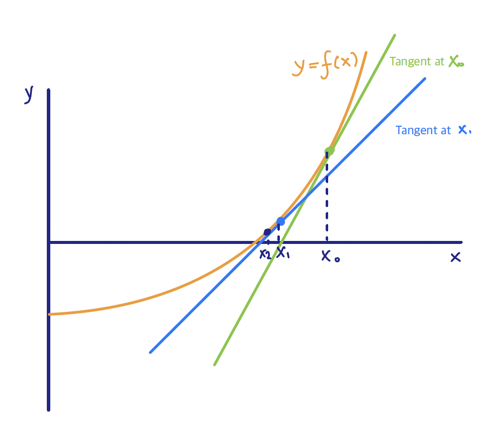
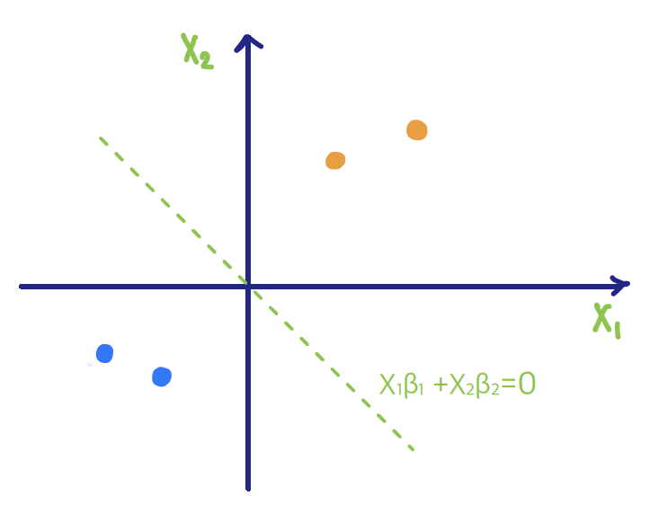

# Logistic Regression

```{r setup, include=FALSE}
knitr::opts_chunk$set(echo = TRUE)
```


In the previous section, we discussed how discriminant analysis models the joint distribution of the predictors and the class variable. In this section, we focus on logistic regression, which takes a different approach: it **directly** models the <font color=blue>conditional probability</font> of class membership as a function of the predictors. For _binary outcomes_, this is achieved through the _logistic function_, which maps a linear combination of predictors to values between 0 and 1.

<font color=blue>**Logistic regression**</font> has the advantage of making fewer assumptions about the distribution of the predictors, provides coefficients that can be interpreted in terms of odds ratios, and can be extended to multiple classes through multinomial formulations. Because of its simplicity, interpretability, and solid probabilistic foundation, logistic regression is one of the most widely used methods for classification.

&nbsp;


## Fitting a Logistic Regression Model
 
Logistic regression starts by directly modeling the _conditional_ probability
\[\eta(x) = P(Y=1 \mid X=x),\]
where $\eta(x)$ is a function bounded in $[0,1]$. 

Specifically, consider a <font color=blue>**link**</font> function $g$ that maps $\eta(x)$ into $(-\infty, \infty)$, i.e.
 \[g\bigl(\eta(x)\bigr) = \mathbf{x}^T \beta.\]
 
Based on this formulation, the response $Y$ conditional on $X$ follows a <font color=blue>Bernoulli distribution</font>:

\[P(Y = y_i \mid X=x_i) = \eta(x_i)^{y_i} \bigl(1- \eta(x_i)\bigr)^{1-y_i},\]
where
\[\eta(x) = P(Y=1 \mid X=x) \quad \text{and} \quad 1-\eta(x) = P(Y=0 \mid X=x).\]


For logistic regression, we use the <font color=blue>**logit link**</font>, defined by
 
\begin{align*}
\log \frac{\eta(x)}{1-\eta(x)} = x^T \beta
\quad\Leftrightarrow\quad
\eta(x) =  \frac{\exp (x^T \beta)}{1 + \exp (x^T \beta)}.
\end{align*}
The quantity  $\log\frac{\eta(x)}{1-\eta(x)}$ is called the <font color=blue>**log-odds**</font>, and we model it as a **linear** function of $x$.

 
 


### Maximum Likelihood Approach

 
At each data point we observe $(x_i, y_i)$, and we want to use these pairs to estimate $\eta(x)$, or equivalently $\beta$. Instead of minimizing a squared-error loss, as we did for a continuous response, we follow a maximum likelihood approach.

<font color=blue>**Maximum likelihood estimation**</font> is a method that provides the _most likely value_ of a parameter, given the data we observed. In a parametric framework, the likelihood is a function of the model parameters and the data, and the <font color=blue>maximum likelihood estimator</font> is obtained by maximizing the likelihood with respect to the parameters.
 
 
Recall that, conditionally on $X$, the response $Y$ follows a Bernoulli distribution with probability $\eta(x)$. Therefore, the likelihood function is
\begin{align*}
\mathcal{L}(\beta \mid \mathbf{y}, \mathbf{x}) &= \prod_{i=1}^{n} p(y_i \mid x_i, \beta)\\
 &= \prod_{i=1}^{n} \eta(x_i)^{y_i} \bigl(1-\eta(x_i)\bigr)^{1-y_i}.
\end{align*}
To fit the logistic regression model, we maximize the likelihood with respect to $\beta$:
\[\max_{\beta} \mathcal{L}(\beta \mid \mathbf{y}, \mathbf{x}). \]

This is equivalent to maximizing the log of the likelihood, the _log-likelihood function_:
\begin{align*}
\ell (\beta \mid \mathbf{y}, \mathbf{x}) &= \sum_{i=1}^{n} \log \Bigl\{\eta(x_i)^{y_i} \bigl(1-\eta(x_i)\bigr)^{1-y_i} \Bigr\}\\
&= \sum_{i=1}^{n} \Biggl\{ y_i \log \frac{\eta(x_i)}{1- \eta(x_i)} + \log \bigl(1-\eta(x_i)\bigr)\Biggr\}.
\end{align*}

Recall that we defined 
\[\log \frac{\eta(x)}{1-\eta(x)} = x^T \beta.\]

Combining the expressions above, after a few lines of algebra, the log-likelihood becomes
\[\ell (\beta \mid \mathbf{y}, \mathbf{x}) = \sum_{i=1}^{n}\Bigl\{ y_i x_i^T \beta - \log \bigl(1+ \exp(x_i^T \beta) \bigr)\Bigr\},\]
 
and the <font color=blue>maximum likelihood estimator (MLE)</font> $\hat{\beta}$ is obtained by _maximizing_
\[\max_{\beta} \ell (\beta \mid \mathbf{y}, \mathbf{x}) = \max_{\beta}  \sum_{i=1}^{n}\Bigl\{ y_i x_i^T \beta - \log \bigl(1+ \exp(x_i^T \beta) \bigr)\Bigr\}.\]

Note that $\beta$ is a vector, so we compute the gradient
$\frac{\partial \ell(\beta \mid \mathbf{y}, \mathbf{x})}{\partial \beta}$, set it equal to $0$, solve for $\beta$, and check the Hessian $\frac{\partial^2 \ell(\beta \mid \mathbf{y}, \mathbf{x})}{\partial \beta \partial \beta^T}$
to confirm that the critical point is a maximum.

 


 


####  Solving for the MLE {-}

Differentiating with respect to $\beta$ and using the chain rule, the gradient is

\begin{align*}
\frac{\partial \ell(\beta \mid \mathbf{y}, \mathbf{x})}{\partial \beta} &= 
\sum_{i=1}^{n} \frac{\partial }{\partial \beta} \bigl( y_i x_i^T \beta \bigr) - \frac{\partial }{\partial \beta} \Bigl(\log \bigl(1+ \exp(x_i^T \beta) \bigr) \Bigr)\\
&= \sum_{i=1}^{n} y_i x_i^T  - \sum_{i=1}^{n} \frac{1}{1+ \exp(x_i^T \beta) } \cdot  \frac{\partial }{\partial \beta} \bigl( 1+ \exp(x_i^T \beta) \bigr)\\
&=  \sum_{i=1}^{n} y_i x_i^T  - \sum_{i=1}^{n} \frac{1}{1+ \exp(x_i^T \beta) } \cdot   \exp(x_i^T \beta)\,  x_i^T\\
&=  \sum_{i=1}^{n} y_i x_i^T  - \sum_{i=1}^{n} \frac{\exp(x_i^T \beta)  \, x_i^T}{1+ \exp(x_i^T \beta) }.
\end{align*}


To obtain the Hessian, we differentiate again with respect to $\beta$, again using the chain rule:

\begin{align*}
\frac{\partial^2 \ell(\beta \mid \mathbf{y}, \mathbf{x})}{\partial \beta \partial \beta^T} &= \sum_{i=1}^{n} \frac{\partial }{\partial \beta}   y_i x_i^T  -  \frac{\partial }{\partial \beta}  \Biggl(\frac{\exp(x_i^T \beta)  \, x_i^T}{1+ \exp(x_i^T \beta)} \Biggr)  \\
&= - \sum_{i=1}^{n} \frac{\partial }{\partial \beta}  \Biggl(\frac{\exp(x_i^T \beta)  \, x_i^T}{1+ \exp(x_i^T \beta)} \Biggr)  \\
&= - \sum_{i=1}^{n} \frac{\partial }{\partial (\exp(x_i^T \beta)) } \Biggl(\frac{\exp(x_i^T \beta)  \, x_i^T}{1+ \exp(x_i^T \beta)} \Biggr) \frac{\partial \bigl(\exp(x_i^T \beta)\bigr) }{\partial \beta}   \\
&= - \sum_{i=1}^{n} x_i   \frac{\exp (x_i^T \beta)}{1 + \exp (x_i^T \beta)}  \frac{1}{1 + \exp (x_i^T \beta)} x_i^T\\
&= - \sum_{i=1}^{n} x_i  \eta(x_i) \bigl( 1- \eta(x_i) \bigr) x_i^T.
\end{align*}

Finally, we have

* <font color=blue>**Gradient vector**</font>

\[\frac{\partial \ell(\beta \mid \mathbf{y}, \mathbf{x})}{\partial \beta} =  \sum_{i=1}^{n} y_i x_i^T  - \sum_{i=1}^{n} \frac{\exp(x_i^T \beta)  \, x_i^T}{1+ \exp(x_i^T \beta) } = \mathbf{X}^T (\mathbf{y} - \mathbf{p}),\]
where
\[p_i = \eta(x_i) = P(Y=1 \mid X=x_i).\]

* <font color=blue>**Hessian matrix**</font>

\[\frac{\partial^2 \ell(\beta \mid \mathbf{y}, \mathbf{x})}{\partial \beta \partial \beta^T} = - \sum_{i=1}^{n} x_i  \eta(x_i) \bigl( 1- \eta(x_i) \bigr)x_i^T  = - \mathbf{X}^T \mathbf{W} \mathbf{X}.\]

The Hessian is _negative semi-definite_, so the log-likelihood is _concave_, and therefore _any local maximum is a global maximum_. 

There is no closed-form expression for the MLE in logistic regression, but it can be obtained with an iterative Newton--Raphson procedure.
 
&nbsp;&nbsp;
 
<div class=motivationbox>
**Newton--Raphson for the Logistic MLE**

 

&nbsp;

\[f(x) \approx f(x_0) + f'(x_0) (x-x_0) \]
\[\Longrightarrow x = x_0 - \frac{f(x_0)}{f'(x_0)}\]

In our case,
\begin{align*}
\beta &= \beta_0 + \bigl(\mathbf{X}^T \mathbf{W} \mathbf{X}\bigr)^{-1} \mathbf{X}^T (\mathbf{y}-\mathbf{p})\\
&=  \bigl(\mathbf{X}^T \mathbf{W} \mathbf{X}\bigr)^{-1} \mathbf{X}^T \mathbf{W}
\Bigl( \mathbf{X} \beta_0 + \mathbf{W}^{-1}(\mathbf{y} - \mathbf{p}) \Bigr).
\end{align*}
</div>

 &nbsp;&nbsp;


We can also obtain the logistic regression MLE via an _iteratively reweighted least squares_ (IRLS) algorithm:

 
1.  Start with some initial values $\beta^0$. 

2.  Calculate the corresponding $p_i^0 = \eta^0 (x_i)$ for $i=1, \ldots, n$. 

3.   Define $\mathbf{W} = \mathrm{diag}\bigl(p_i^0(1-p_i^0)\bigr)_{i=1}^{n}$. 

4.  Calculate
\[\mathbf{z} = \mathbf{X} \beta^0 + \mathbf{W}^{-1}(\mathbf{y} - \mathbf{p}^0).\]
\smallskip

5.  Update $\beta^0 \leftarrow \beta^1$ with
\[\beta^1 = \bigl(\mathbf{X}^T \mathbf{W} \mathbf{X}\bigr)^{-1} \mathbf{X}^T \mathbf{W} \mathbf{z}.\]

6. Iterate the above steps until convergence.

&nbsp;&nbsp;

 
####  Interpreting Parameters {-}

_What is the effect of $\beta$?_
&nbsp;
<font color=blue>A one-unit increase in $X_j$ increases the log-odds of $Y=1$ by $\beta_j$ (holding the other predictors fixed).</font>
 
 
 


## Logistic Regression with Separable Data


Consider the following scenario with two classes, each containing two points. Assume that the intercept is zero for simplicity.

 

In the log-likelihood, the contribution of the **orange points** ($y=1$) involves
\[\frac{e^{\beta_1 x_1 + \beta_2 x_2}}{1 + e^{\beta_1 x_1 + \beta_2 x_2}} = \frac{1}{1+ e^{-(\beta_1 x_1 + \beta_2 x_2)}},\]
while the contribution of the **blue points** ($y=0$) involves
\[\frac{1}{1 + e^{\beta_1 x_1 + \beta_2 x_2}}.\]
The only difference between the two expressions is a minus sign in the exponent.

&nbsp;
In this setting, as the $\beta$s grow in a separating direction, the fitted probabilities approach $0$ or $1$ and the likelihood keeps increasing, so the algorithm does not converge. The decision boundary itself stays the same, so the fitted classifier can still be used for prediction.
 
**Remark**: A natural question is whether regularization helps. An $L_2$ (ridge) penalty with $\lambda>0$, and typically an $L_1$ (lasso) penalty as well, keeps the coefficients finite. The unpenalized MLE is the quantity that diverges: when the classes are perfectly separable, the likelihood increases as $\|\beta\|\to\infty$ along a separating direction, and $(\beta_0,\beta)$ is no longer a well-defined interior maximizer.

 
&nbsp;&nbsp;


## Retrospective Sampling

 
So far we have assumed that the data are i.i.d. draws from a population of interest. **But** in some settings, such as studying a rare disease, sampling the population as it is would require a very large sample---thousands or millions of observations---which is highly inefficient. 

Instead, we draw a balanced sample from patients with the disease and from healthy controls; say $50$ individuals in each group. When we later evaluate the model on a test sample from the original population, the class balance will not match the $50$--$50$ split used in training.
 
&nbsp;
 
To address this in the model, define a random variable $Z$ indicating whether an individual was sampled. The sampling scheme leads us to work with
\[P(Y=1 \mid Z=1, X=x)\]
rather than $P(Y=1 \mid X=x)$. In the logistic regression framework, write
\[r_0 = P(Z=1 \mid Y=0), \qquad r_1 = P(Z=1 \mid Y=1).\]
Then
\begin{align*}
P(Y=1 \mid Z=1, X=x) &= \frac{P(Z=1 \mid Y=1,x)\, P(Y=1 \mid x)}{P(Z=1, Y=0 \mid x) + P(Z=1, Y=1 \mid x)}\\
&= \frac{r_1 \exp(\alpha + x^T \beta)}{r_0 + r_1 \exp(\alpha + x^T \beta)}\\
&= \frac{\exp(\alpha^* + x^T \beta)}{ 1 + \exp(\alpha^* + x^T \beta)},
\end{align*}
where $\alpha^* = \alpha + \log\frac{r_1}{r_0}$. Although the data were sampled retrospectively, the logistic model still applies, with the same slope coefficients $\beta$ and a different intercept.


&nbsp;

## Logistic Regression for the `Heart` Data Set in R

The Python version of the example can be found here: <a href="code/ch8_PythonExample.html"> <b>Python Code for Logistic</b> </a>.&nbsp;


In this example we work with the South African heart data, available <a href="https://web.stanford.edu/~hastie/ElemStatLearn/datasets/SAheart.data">here</a>.

```{r}
SAheart = read.csv("data/week8/SAheart.csv", header=TRUE)
```

The `SAheart` data set comes from a study of heart-disease risk factors among South African men of mixed ancestry. It contains $462$ observations on lifestyle, medical history, and physiological measurements---age, alcohol intake, tobacco use, blood pressure, cholesterol, and family history of heart disease, among others.

Our goal is to estimate the probability that an individual has coronary heart disease (CHD).

The variables are:

* `sbp` - systolic blood pressure

* `tobacco` - cumulative tobacco (kg)

* `ldl` - low-density lipoprotein cholesterol

* `adiposity` - a numeric measure of relative body fat

* `famhist` - family history of heart disease (`Present`, `Absent`)

* `typea` - Type A behavior

* `obesity`

* `alcohol` - current alcohol consumption

* `age` - age at onset

* `chd` - response: coronary heart disease (`1` = yes, `0` = no)


```{r}
heart.logistic = glm(chd ~ ., data = SAheart, family = binomial)
summary(heart.logistic)
```
We obtain fitted values from the model and summarize the classifications at the $0.5$ threshold:

```{r}
yhat = (heart.logistic$fitted.values > 0.5)
table(yhat, SAheart$chd)
```


### Goodness of Fit

In logistic regression we do not have a residual sum of squares (RSS), so we need other metrics to assess fit. Deviance measures, which are also based on the likelihood, are the standard choice. When all of the $x_i$ are unique, the residual deviance is
\[
\mathrm{Deviance} = -2 \Biggl( \sum_{i: y_i=1} \log \hat{p}_i + \sum_{i: y_i=0} \log(1-\hat{p}_i) \Biggr),
\]
where $\hat{p}_i$ is the fitted probability $P(Y=1 \mid X=x_i)$.

At the bottom of the `summary` output in R we see two deviances:

* **Null deviance**: the deviance of a logistic regression with only an intercept. Here the estimated probability $P(Y=1 \mid X=x_i)$ is the sample mean of the observed $y_i$ values and does not depend on $x_i$.

* **Residual deviance**: the deviance of the fitted model under consideration, using the model's fitted probabilities $\hat{p}_i$.

We can also compute them directly:
```{r}
p.hat = heart.logistic$fitted.values

-2 * (sum(log(p.hat[SAheart$chd == 1])) + sum(log(1 - p.hat[SAheart$chd == 0])))
```

```{r}
p0.hat = rep(mean(SAheart$chd), length(SAheart$chd))

-2 * (sum(log(p0.hat[SAheart$chd == 1])) + sum(log(1 - p0.hat[SAheart$chd == 0])))
```


#### Solving this problem using numerical optimization, without `glm` {-}


```{r}
## Log-likelihood (not the negative log-likelihood)
logistic.loglik <- function(b, x, y)
    {
        bm = as.matrix(b)
        xb =  x %*% bm
        # this returns the log-likelihood
        return(sum(y * xb) - sum(log(1 + exp(xb))))
    }

## Gradient
logistic.gradient <- function(b, x, y)
    {
        bm = as.matrix(b) 
        expxb =  exp(x %*% bm)
        return(t(x) %*% (y - expxb / (1 + expxb)))
}

## We can now use the `optim` function to solve the problem:

SAheart$famhist = ifelse(SAheart$famhist == "Present", 1, 0)

x = as.matrix(cbind("intercept" = 1, SAheart[, 2:10]))
y = as.matrix(SAheart[, 11])
b = rep(0, ncol(x))

# The objective above is the log-likelihood, so we maximize
# (equivalently, optim minimizes -ell when fnscale = -1):

optim(b, fn = logistic.loglik, gr = logistic.gradient, method = "BFGS",
      x = x, y = y, control = list(fnscale = -1))
```
The result matches the `glm()` solution. If a general-purpose solver is not available, we can use Newton--Raphson instead; that requires a function for the Hessian.

&nbsp;&nbsp;

### Variable Selection

Variable selection can also be needed in a logistic regression setting. We next ask which of the methods and criteria from linear regression carry over.

#### AIC/BIC {-}

We can still use AIC and BIC because the logistic model has a likelihood. Unlike linear regression, however, we cannot use the leaps-and-bounds algorithm to enumerate all submodels, because the logistic likelihood is not a residual sum of squares. Instead we use a greedy search: stepwise, backward, or forward selection.


As an example:
```{r}
step.logistic = step(heart.logistic, scope = list(upper = ~ ., lower = ~ 1))
```


### Penalized Logistic Regression

As in ordinary regression, we can penalize the logistic log-likelihood to handle collinearity or high-dimensional settings. In R this is again available through the `glmnet` package.

```{r}
library(glmnet)
lasso.fit = cv.glmnet(x = data.matrix(SAheart[, 2:10]), y = SAheart[, 11],
                      nfolds = 10, family = "binomial")

plot(lasso.fit)

coef(lasso.fit, s = "lambda.min")
```


### Illustration of Divergence of the MLE

Consider a very simple case in which
\[y = \begin{cases}
1, & \text{if } x_1 - 2 x_2 > 0,\\
0, & \text{otherwise.}
\end{cases}
\]

Simulate such data:

```{r}
x = matrix(runif(100), 50, 2)
y = ifelse(x[, 1] - 2 * x[, 2] > 0, 1, 0)
plot(x[, 1], x[, 2], type = "n", xlab = "", ylab = "")
text(x[, 1], x[, 2], y)
```
```{r}
logistic.fit = glm(y ~ x, family = binomial)
```

The warning is exactly the phenomenon discussed above: the MLE of the coefficients tends to $\pm\infty$ and the algorithm does not converge.

Even so, the separating line is well defined, so the fitted model can still be used for prediction.
```{r}
round(logistic.fit$fitted.values, 0)
```
