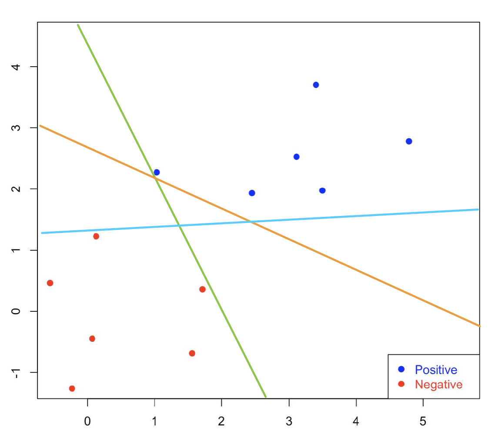
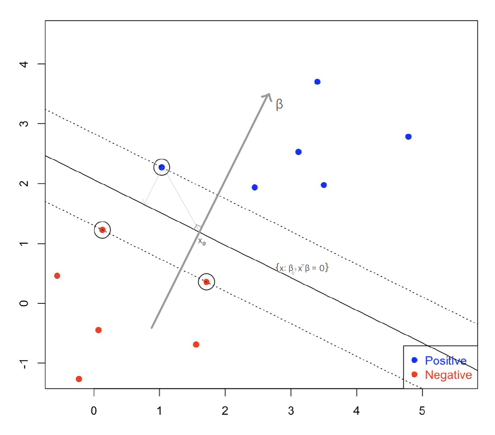
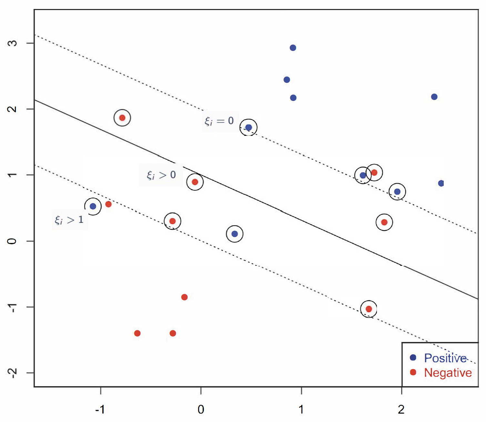

# Support Vector Machines

**Support Vector Machines (SVMs)** are a powerful  approach to *supervised learning*, specifically when it comes to classification tasks. Rather than simply searching for _any_ boundary that separates classes, SVMs seek the boundary that maximizes the **margin**, that is the <font color="blue">distance between the separating hyperplane and the nearest data points from each class</font>. This focus on maximizing the margin not only enhances generalization to _new_ data but also highlights the critical role of the <font color="orange">_support vectors_</font>, i.e., the subset of training points that define the decision boundary.

<br>
The flexibility of SVMs extends far beyond linear settings. Through the use of _kernel functions_, data can be effectively mapped into higher-dimensional spaces, enabling the discovery of complex nonlinear boundaries while avoiding the computational cost of explicit transformations. In this way, SVMs combine geometric intuition, optimization, and statistical regularization into a unified framework. 


<br><br>

## Linear SVM in Separable Case: _Separation Margin_

We start our discussion by presenting the _original_ SVM originally proposed in 1963. Assume that we observe **training data** <font color="blue">$\mathcal{D}_n = \{x_i, y_i\}_{i=1}^{n}$</font>, where $x_i \in \mathbf{R}^p$ are the _features_ and  <font color="blue"> $y_i \in\{-1,1\}$ </font> is the response coded as -1/+1.

<br>
The goal is to  estimate a function $f(x) \in \mathbb{R}$ that *separates the data*, or specifically find a classification rule $C(x) = sign \bigl\{f(x) \bigr\}$ that outputs the _labels_. In this context, the optimal classifier is
\[C^*(x) = sign \Bigl\{ P(Y=1|X=x) - P(Y=-1 |X=x) \Bigr\}\]
In contrast to logistic regression or DA, in Support Vector Machines instead of modeling conditional or joint distributions we  **directly model the decision boundary**.


<br>

### Maximum-Margin Classifier

If we assume that we have two classes $y_i \in\{-1,1\}$, then the **classification rule** based on $f(x)$ should be
<font color="darkblue">
\begin{align*}
&\hat{y} = +1,\, \text{ if }\, f(x)>0\\
&\hat{y} = -1,\, \text{ if }\, f(x)<0\\
\end{align*}
</font>

<font color="darkblue">The classification is  correct  if $y_i f(x_i)>0$</font>. The <font color=orange>$y_i f(x_i)$</font> is a **functional margin**: if its value is _positive_, then it means we are on the correct side, while if its value is _negative_, then we are at the wrong side.

```{r, echo=FALSE, fig.align="center", fig.width=6.6, fig.height=6.6, warning=FALSE}

set.seed(123)
n <- 6
p <- 2

xneg <- matrix(rnorm(n*p,mean=0,sd=1),n,p)
xpos <- matrix(rnorm(n*p,mean=3,sd=1),n,p)
x <- rbind(xpos,xneg)
y <- matrix(as.factor(c(rep(1,n),rep(-1,n))))

plot(x,col=ifelse(y>0,"blue","red"), xlim = c(-0.5, 5.6), ylim = c(-1.2, 4.5), pch = 19, 
     xlab = " ", ylab = " ", cex.lab = 1.5)
legend("bottomright", c("Positive", "Negative"),col=c("blue", "red"),
       pch=c(19, 19), text.col=c("blue", "red"))
```

In the case of **linearly separable classes**, we need to find a linear function $f(x) = x^T \beta + \beta_0$ to separate the two groups of points. But, there are several different options:

```{r ,echo=FALSE, message=FALSE, warning=FALSE, fig.align="center", out.width="75%", fig.cap="Separating Lines: which one is the best?"}

```

<br>
<br>
<font color=blue><i>Among all these lines, which one is the best?</i></font><br>


Although there are many linear lines that can <font color=orange>perfectly separate</font> the two classes,the SVMs define the **best** **line** as <font color=darkblue>the line that maximizes the **separation margin**</font>, that is the width between the two dotted lines:
```{r ,echo=FALSE, message=FALSE, warning=FALSE, fig.align="center", out.width="75%", fig.cap="SVM: Maximum Separation Line"}

```

<br>

#### Mathematical Formulation {-}

In Linear SVMs, we define a linear function representing the linear decision boundary as
\[f(x) = \beta_0 + x^T \beta\]


When $f(x)=0$, the **(linear) separating hyperplane** is given by
\[L= \Bigl\{x: \beta_0 + x^T \beta = 0 \Bigr\}\]
Thus, for the separable case, all observations with $y_i = +1$ are on one side $f(x)>0$, and observations with  $y_i = -1$  are on the other side.


<div class=motivationbox>
The **Signed Distance** of $x$ to the hyperplane is defined as
\[ \left \langle \frac{\beta}{||\beta||}, \, x-x_0 \right \rangle\]
</div>
<br>
<font color=orange>_Remark_</font>: When we define any type of distance, we typically use the "un-signed" version by considering the absolute value, i.e., $|x-x_0|$ ir the square etc. which is always a non-negative quanityt. However, in the SVMs context, we choose to _keep the sign_, since this will encode on which side of the hyperplane the point lies. So, when the signed distance is positive, then this means that the point is on the side of the hyperplane toward which $x$ points; when the signed distance is negative, then this means that the point is on the side of the hyperplane toward which $x$ points
<br>

To find the _signed distance of any point $x$ to the hyperplane_,  we need to identify a point $x_0\in L$ on the hyperplane, such that
<font color=darkblue>
\[f(x_0)=0\,\, \Leftrightarrow \,\, x_0^T \beta = -\beta_0\]
</font>

Then ,if we take the difference $x - x_0$, and project this vector to the direction of $\beta$, then the distance of $x$ to the hyperplane is the projection of $x-x_0$ onto the unit vector (perpendicular) to $L$, i.e., $\frac{\beta}{||\beta||}$:


\begin{align*}
\left \langle \frac{\beta}{||\beta||}, \, x-x_0 \right \rangle 
&=  (x-x_0)^T  \frac{\beta }{||\beta||}\\
&= \frac{1}{||\beta||} (x^T \beta + \beta_0) = \frac{1}{||\beta||} f(x)
\end{align*}
where $\langle \cdot, \cdot \rangle$ denotes the inner product.
From these equations, we can also deduce that  $f(x)$ is proportional to the signed distance from $x$ to $L$.

<br>

The **goal** of SVMs is to  separate the two classes and maximize the distance to the closest points from either class (Vapnik 1996) and construct the <font color=darkblue>**Maximum Margin**</font>:

<div class="motivationbox">
\[ \max_{\beta, \beta_0, ||\beta||=1} M\]
\[\text{subject to }\,\, y_i \bigl(x_i^T \beta + \beta_0 \bigr) \geq M,\,\,i=1, \ldots ,n\]
</div>

In this way, **all the points are at least a signed distance $M$ from the decision boundary**. Recall  that $f(x_i) = (x_i^T \beta + \beta_0)/||\beta||$ is the signed distance which means that if $y_i=+1$, we require $f(x_i) \geq M$, while if  $y_i=-1$, we require $f(x_i) \leq -M$, and _maximizing the minimum distance is equivalent to maximizing the separation margin_.


One important note here is that the problem requires that the constraint is $||\beta||=1$. At the same time, the scale of $\beta$ plays a crucial role in calculating the margin. To avoid these issues, we choose to work with the "normed version" of the constraint:
<font color=darkblue>
\[\frac{1}{||\beta||} y_i (x_i^T \beta + \beta_0) >M\]
</font>

In the normed version of the constraint, the scale of $\beta$ does not play a role, therefore we can arbitrarily set $||\beta||=1/M$ and re-write  the original problem as
<div class=motivationbox>
\[\min_{\beta, \beta_0} \frac{1}{2}\;||\beta||^2 \]
\[\text{subject to }\,\, y_i (x_i^T \beta + \beta_0) \geq 1, \,\,i=1, \ldots ,n\]
</div>

Based on the previous discussion, and the definition of the signed distance,  this constraint practically  requires that all points are at least $1/||\beta||$ away from the separating plane. It also ensures that the points are on the correct side of the dotted lines, i.e.
\[\begin{cases}
& x_i^T \beta + \beta_0 \geq 1, \,\, \text{ for } y_i = +1\\
& x_i^T \beta + \beta_0 \leq 1, \,\, \text{ for } y_i = -1
\end{cases}
\]

If $x_i$ is **on one of the dotted lines**, i.e. $ y_i (x_i^T \beta + \beta_0 ) - 1 =0$, we consider the $i$-th constraint (or $i$-th point) as _active_. If $y_i (x_i^T \beta + \beta_0 ) - 1 >0$, it is _inactive_. There should be at least two points, one from each class, that are active; otherwise we cannot improve the margin.

All this discussion now leads us to the primal form of the SVM optimization problem:
<br>

<div class=motivationbox>
**Primal Form**

\[\text{minimize }\, \frac{1}{2} ||\beta||^2\]
\[\text{subject to }\, y_i (x_i^T \beta+\beta_0) \geq 1, i=1, \ldots, n\]

</div>

_The max-margin problem is a convex optimization problem with a quadratic objective function and linear or affine constraints, making it free from issues related to local optima. This is only possible for perfectly separable case._

<br><br>

### The KKT Conditions: From the Primal to the Dual

 The <font color=darkblue>Karush-Kuhn-Tucker (KKT)</font> conditions are a set of necessary conditions that characterize the solutions to constrained optimization problems. In most cases, when we want to maximize/minimize a function $f(x)$ we focus on its derivative(s). Specifically, we look at the negative derivative at a particular point, $-\frac{\partial f(x)}{\partial x}$, which indicates a direction along which we can make further reductions in the value of $f$.

If there are no constraints, then  at the minimum, the derivative of $f$ evaluated at that point should be zero, i.e. $\frac{\partial f(x)}{\partial x}=0$. This condition signifies that there is no direction left to further reduce the value of $f$, making it a *necessary* condition for optimality.

<br>

#### Investigating the Equality Constrained Optimization Problem {-}

Let's extend to the case where we have an *equality* constraint:
\[\text{ minimize }_{x} f(x)\,\,\,\, \text{ subject to } h(x) = 0\]

Here $f(x)$ is objective function, and  $h(x)$ are the equality constraints defining the feasible region/set <font color=darkblue>$\mathcal{S} = \{x: h(x) = 0\}$</font>. Then, at such a point the negative derivative of $f$, which indicates a direction along which we can further reduce the value of $f$, may not necessarily be zero. However, this non-zero direction must be a "_forbidden_" one in the sense that moving along it would lead us outside the feasible region, violating the equality constraint.  Mathematically, we can express this situation as: 
\[\frac{\partial f(x)}{\partial x} + \lambda \frac{\partial h}{\partial  x} = 0, \,\, \lambda\in \mathbb{R}\]

In a more general framework, we define the _Lagrangian_
\[\mathcal{L} = f(x) + \alpha \; h(x)\]

where $\alpha$ is the so-called the Lagrange multiplier. Intuitively, for every $x$ such that $h(x)=0$, $\nabla h(x)$ is orthogonal to the surface defined by the feasible set. If $x^*$ is a local minimum, then $\nabla f(x)$ is orthogonal to the surface at $x^*$ -- otherwise we would move along that surface and reach a smaller value. This leads to the conclusion that the gradients $\nabla h(x)$ and $\nabla f(x)$ have to be parallel at $x^*$:
\[\nabla f(x^*) = -\alpha\, \nabla h(x^*)\]

<br>

#### Inequality Constrained Optimization Problem {-}

 Consider a inequality constrained optimization problem:
 <div class="motivationbox">
\[\text{minimize }_{x} \, g(x)\,\,\,\, \text{subject to } h_i(x) \leq 0, \text{ for all } i=1, \ldots, n\]
</div>

Define a _generalized_ version of the Lagrangian as
<div class="motivationbox">
\[\mathcal{L}(x, \alpha) = f(x) + \sum_{i=1}^{n} \alpha_i h_i(\theta)\]
</div>
$\mathcal{L}$ now has two arguments: $x$ and $\alpha$. 

If we think about it, there two ways we can maximize the Lagrangian:

* First, we can  maximize first with respect to $\alpha_i$s  (for  fixed $x$), i.e.,
\[\max_{\alpha \geq 0} \mathcal{L}(\theta, x)\]
In this case, if $x$ violates any of the constraints, i.e., $h_i(x)>0$ for some $i$, we can choose an extremely large $\alpha_i$ so that  $\mathcal{L}$ is $\infty$. The solution of this primal form must satisfy the constraint:
<font color=blue>
\[\min_{x} \,\max_{\alpha\geq 0} \mathcal{L}(x, \alpha)\]
</font>

* On the other hand, we can we minimize with respect to $x$ first, and then maximize for $\alpha$. This leads us to  the **dual** problem:
<font color=blue>
\[\max_{\alpha\geq 0} \, \min_{x}  \mathcal{L}(x, \alpha)\]
</font>

The two problems are generally not the same. In fact, 
<font color=blue>
\[\underbrace{\max_{\alpha\geq 0}\, \min_{x}  \mathcal{L}(x, \alpha)}_{dual} \leq \underbrace{\min_{x} \, \max_{\alpha\geq 0} \mathcal{L}(x, \alpha)}_{primal}\]
</font>
However, they are the same if both $g$ and $h_i$s are **convex**,and the constraints $h_i$s are **feasible** (_sufficient condition_).

<br>

This leads us to the following approach into solving the SVM problem: Start with the original primal problem and re-write it as
<div class=motivationbox>
\[\min_{\beta, \beta_0} \frac{1}{2} ||\beta||^2\]
\[\text{subject to }\,\, -\left\{y_i (x_i \beta^T + \beta_0) -1\right \} \leq 0, i=1, \ldots, n\]
</div>

The Lagrangian for this optimization problem is given by
<font color=blue>
\[\mathcal{L}(\beta, \beta_0, \alpha) = \frac{1}{2} ||\beta||^2 - \sum_{i=1}^{n} \alpha_i \left \{y_i (x_i^T \beta + \beta_0) - 1 \right\} \]
</font>

We are going to solve the dual, so we will  first minimize $\mathcal{L}(\beta, \beta_0, \alpha) $ with respect to $\beta$ and $\beta_0$, then we will maximize over $\alpha$.
<br>


### Solving the Dual Problem 

To compute the Find the optimizer with respect to $\beta$ and $\beta_0$:, we take derivatives with respect to $\beta$ and $\beta_0$:
\begin{align*}
\nabla_{\beta} \mathcal{L} = 0\,\, & \Leftrightarrow \,\, \beta - \sum_{i=1}^{n} \alpha_i y_i x_i^T = 0 \\
\nabla_{\beta_0} \mathcal{L} = 0\,\, & \Leftrightarrow \,\, \sum_{i=1}^{n} \alpha_i y_i = 0
\end{align*}
and we plug these solutions back into the Lagrangian to obtain:
\[\mathcal{L}(\beta, \beta_0, \alpha) = \sum_{i=1}^{n} \alpha_i - \frac{1}{2} \sum_{i,j=1}^{n} y_i y_j \alpha_i \alpha_j x_i^T x_j\]

or equivalently,

\[\max_{\alpha} \sum_{i=1}^{n} \alpha_i - \frac{1}{2} \sum_{i,j=1}^{n} y_i y_j \alpha_i \alpha_j x_i^T x_j\]
\[\text{subject to } \, \alpha_i \geq 0, i=1, \ldots, n\]
\[ \sum_{i=1}^{n} \alpha_i y_i = 0\]

This is another **quadratic programming problem**. Note that if a point is _inactive_ (i.e. not on the dotted line), then corresponding $\alpha_i$ must be 0. <font color=darkblue>The points for which $\alpha_i>0$ are called **support vectors**</font>.

<br>
<div class=motivationbox>
**Linear SVM algorithm (dual form)**

Solve dual for $\alpha_i$s.

* Obtain $\hat{\beta} = \sum_{i=1}^{n} \alpha_i y_i x_i^T$.

* Obtain $\beta_0$ by calculating the midpoint of two ``closest'' support vectors to the separating hyperplane

\[\hat{\beta}_0 = -\frac{1}{2} \left( \max_{i:y_i=-1} x_i^T \hat{\beta} + \min_{i:y_i=1} x_i^T \hat{\beta} \right)\]

* For any new observation $x$, the prediction is 
\[sign(x^T \hat{\beta} + \hat{\beta}_0)\]
</div>


#### Remarks {-}


The separability implies that multiple suitable linear functions could exist $\longrightarrow$ find the optimal linear function, or decision boundary, that maximizes the margin between two groups of data points.  The constraints ensure that data points from both groups are correctly positioned on the respective sides of the decision boundary.  However, instead of directly solving this constrained optimization problem, we’ve been addressing the dual problem. In the dual problem, we  find the Lagrange multipliers (lambda values) associated with the original constraints. But, the constraints cannot both be nonzero simultaneously. Therefore, only data points located on the dashed lines exhibit nonzero  values. These special data points are referred to as *support vectors*.

<br><br>


## Linear SVM in non-Separable Case: _Slack Variables_

Non-separable means that the ``zero"-error is not attainable which means that we cannot achieve a perfect separation of the two classes. In this case _the original SVM cannot find a solution_. 

```{r, echo=FALSE, fig.align="center", fig.width=6.6, fig.height=6.6}

set.seed(345)
n <- 10
p <- 2

xneg <- matrix(rnorm(n*p,mean=0,sd=1),n,p)
xpos <- matrix(rnorm(n*p,mean=1.5,sd=1),n,p)
x <- rbind(xpos,xneg)
y <- matrix(as.factor(c(rep(1,n),rep(-1,n))))

library(e1071)
svm.fit <- svm(y ~ ., data = data.frame(x, y), type='C-classification', 
               kernel='linear', scale=FALSE, cost = 1000)

b <- t(svm.fit$coefs) %*% svm.fit$SV
b0 <- -svm.fit$rho

# an alternative of b0 as the lecture note
b0 <- -(max(x[y == -1, ] %*% t(b)) + min(x[y == 1, ] %*% t(b)))/2

# plot on the data 
plot(x,col=ifelse(y>0,"blue","red"), xlim = c(-1.5, 2.6), ylim = c(-2, 3.3), pch = 19,  
     xlab = " ", ylab = " ", cex.lab = 1.5)
legend("bottomright", c("Positive","Negative"),col=c("blue","red"),
       pch=c(19, 19),text.col=c("blue","red"))
abline(a= -b0/b[1,2], b=-b[1,1]/b[1,2], col="black", lty=1, lwd = 1)

# mark the support vectors
points(x[svm.fit$index, ], col="black", cex=3)

# the two margin lines 
abline(a= (-b0-1)/b[1,2], b=-b[1,1]/b[1,2], col="black", lty=3, lwd = 1)
abline(a= (-b0+1)/b[1,2], b=-b[1,1]/b[1,2], col="black", lty=3, lwd = 1)
```


Therefore, we introduce **slack variables** denoted by $\{\xi_i\}_{i=1}^{n}$ to account for the misclassified observations. Therefore, the constraint in the previous optimization problem now becomes
<font color=blue>
\[y_i (x^T \beta + \beta_0) \geq (1-\xi_i)\]
</font>
for a positive $\xi_i$.


```{r ,echo=FALSE, message=FALSE, warning=FALSE, fig.align="center", out.width="75%", fig.cap="Slack Variables in Linearly Non-Separable Case"}

```
So, for the slack variables $\xi_i$, we have that:
* When $\xi=0$, the observation is lying at the correct side, with enough margin. 

* When $1>\xi>0$, the observation is lying at the correct side, but the margin is not sufficiently large.

* When $\xi>1$, the observation is lying on the wrong side of the separation hyperplane.


The new optimization problem can be written as:
<div class=motivationbox>
\[\text{minimize } \,\,\, \frac{1}{2} ||\beta||^2 + C \sum_{i=1}^{n} \xi_i\]
\[\text{subject to } \,\,\, y_i (x^T \beta + \beta_0) \geq (1-\xi_i), \,i=1, \ldots, n\]
\[\xi_i \geq 0, \,i=1, \ldots, n\]
</div>

This optimization reflects the _trade-off_ between the margin $2/||\beta||^2$ (the _gain_) and the sum of all the positive slack variables, $\sum_i \xi$,  (the _cost_ you pay). $C>0$ is a tuning parameter for "_cost_", that is  it _controls the emphasis on the slack variable_. It essentially balances the error and margin width. Large $C$ will be less tolerable on having positive slacks (in the separable case $C=\infty$). In practice, $C$ is usually determined with cross-validation.
<br>


#### Solving SVM with Slack Variables {-}

The new optimization problem adds more constraints, and  the Lagrangian, $\mathcal{L}(\beta, \beta_0, \alpha, \xi)$,  of the primal problem is now written as
<font color=blue>
\[\frac{1}{2} ||\beta||^2 + C \sum_{i=1}^{n} \xi_i - \sum_{i=1}^{n} \alpha_i \biggl \{ y_i (x_i^T \beta + \beta_0) - (1-\xi_i) \biggr \} - \sum_{i=1}^{n} \gamma_i \xi_i\]
</font>
where $\alpha_i$, $\gamma_i \geq 0$. The solution is along the same lines as before. So, we  compute the derivatives with respect to $\beta$, $\beta_0$ and $\xi_i$: 

\begin{align*}
\nabla_{\beta}\mathcal{L} = 0 \,\, &\Leftrightarrow \,\,\,\,   \beta - \sum_{i=1}^{n} \alpha_i y_i x_i =0\\
\nabla_{\beta_0}\mathcal{L} = 0 \,\, &\Leftrightarrow \,\,\,\,   \sum_{i=1}^{n} \alpha_i y_i =0\\
\nabla_{\xi_i}\mathcal{L} = 0 \,\, &\Leftrightarrow \,\,\,\,  C - \alpha_i - \gamma_i =0 
\end{align*}

 Substituting them back into the Lagrangian, we obtain the **dual form**:
 
<div class=motivationbox>
 
\[\max_{\alpha}\sum_{i=1}^{n} \alpha_i - \frac{1}{2} \sum_{i,j=1}^{n} y_i \;y_j \;\alpha_i \;\alpha_j\; \langle x_i, x_j \rangle \]
\[\text{subject to }\, 0 \leq \alpha_i \leq C,\, i=1, \ldots, n\]
\[\sum_{i=1}^n \alpha_i y_i = 0\]
</div>
where here the inner product $\langle x_i, x_j \rangle$ is equal to $x_i^T x_j$.
<br><br>

We can still obtain $\hat{\beta}$ as
<font color=darkblue>
\[\hat{\beta} = \sum_{i=1}^{n} \alpha_i y_i x_i\]
</font>

The observations with $0 < \alpha_i < C$ are the observations that lie *on the margin*. To calculate $\hat{\beta}_0$, we need to obtain the observations that lie *exactly* on the margin. Based on the complementary slackness and dual feasibility of the KKT condition, we need
\begin{align*}
\alpha_i \Bigl \{y_i (x_i^T \beta + \beta_0) - (1-\xi_i) \Bigr\}&=0\\
C \xi_i &=0\\
y_i (x_i^T \beta + \beta_0) - (1-\xi_i) &\geq 0
\end{align*}


Using this approach, we  essentially consider three sets of observations: 

* _Useless_ points: $\alpha_i=0$ and $\xi_i=0$. 

* _Support_ vectors: $0<\alpha_i <C$ and $\xi_i=0$. 

* On _wrong_ side: $\alpha_i=C$ and $\xi_i = 1-y_i(x_i^T \beta - \beta_0)$. 

After obtaining the support vectors, we can extract the ones on the positive side and the negative side. We can calculate $y_i(x_i^T \beta)$ for them separately, and the separating line (with $\hat{\beta}_0$) lies in the middle of them.

In the following plots, we illustrate the results for two different cost parameters ($C=1000$ to the left and $C=0.1$ to the right):


```{r, echo=FALSE}
par(mfrow=c(1,2))
svm.fit <- svm(y ~ ., data = data.frame(x, y), type='C-classification', 
               kernel='linear', scale=FALSE, cost = 1000)

b <- t(svm.fit$coefs) %*% svm.fit$SV
b0 <- -svm.fit$rho

# an alternative of b0 as the lecture note
b0 <- -(max(x[y == -1, ] %*% t(b)) + min(x[y == 1, ] %*% t(b)))/2

# plot on the data 
plot(x,col=ifelse(y>0,"blue","red"), xlim = c(-1.5, 2.6), ylim = c(-2, 3.3), pch = 19,  
     xlab = " ", ylab = " ", cex.lab = 1.5)
legend("bottomright", c("Positive","Negative"),col=c("blue","red"),
       pch=c(19, 19),text.col=c("blue","red"))
abline(a= -b0/b[1,2], b=-b[1,1]/b[1,2], col="black", lty=1, lwd = 1)

# mark the support vectors
points(x[svm.fit$index, ], col="black", cex=3)

# the two margin lines 
abline(a= (-b0-1)/b[1,2], b=-b[1,1]/b[1,2], col="black", lty=3, lwd = 1)
abline(a= (-b0+1)/b[1,2], b=-b[1,1]/b[1,2], col="black", lty=3, lwd = 1)


svm.fit <- svm(y ~ ., data = data.frame(x, y), type='C-classification', 
               kernel='linear', scale=FALSE, cost = 0.1)

b <- t(svm.fit$coefs) %*% svm.fit$SV
b0 <- -svm.fit$rho

# an alternative of b0 as the lecture note
b0 <- -(max(x[y == -1, ] %*% t(b)) + min(x[y == 1, ] %*% t(b)))/2

# plot on the data 
plot(x,col=ifelse(y>0,"blue","red"), xlim = c(-1.5, 2.6), ylim = c(-2, 3.3), pch = 19,  
     xlab = " ", ylab = " ", cex.lab = 1.5)
legend("bottomright", c("Positive","Negative"),col=c("blue","red"),
       pch=c(19, 19),text.col=c("blue","red"))
abline(a= -b0/b[1,2], b=-b[1,1]/b[1,2], col="black", lty=1, lwd = 1)

# mark the support vectors
points(x[svm.fit$index, ], col="black", cex=3)

# the two margin lines 
abline(a= (-b0-1)/b[1,2], b=-b[1,1]/b[1,2], col="black", lty=3, lwd = 1)
abline(a= (-b0+1)/b[1,2], b=-b[1,1]/b[1,2], col="black", lty=3, lwd = 1)
```


Large $C$ puts more weight on misclassification rate than margin width.   Small $C$ puts more attention on data further away from the boundary. 

It is worth noting that this new optimization can also be applied in separable cases, depending on the magnitude of $C$. In some cases, we might also be willing to allow some points to cross the dahsed line if it leads to a significant increase in the margin, and the parameter $C$ controls this trade-off.

<br><br>


## Non-linear SVM: _The Kernel Trick_

In linear SMV, the decision boundaries are linear, represented as hyperplanes in the original input space. However, in many cases, the linear classifiers are not flexible enough. As an example,

```{r, echo=FALSE, warning=FALSE, message=FALSE, fig.align="center", fig.width=6, fig.height=6, warning=FALSE, fig.cap="Non-Linear Classifier (ESL textbook example)"}

library(mda)
data(ESL.mixture)


px1 = ESL.mixture$px1
px2 = ESL.mixture$px2
x = ESL.mixture$x
y = ESL.mixture$y


prob <- ESL.mixture$prob
prob.bayes <- matrix(prob, 
                     length(px1), 
                     length(px2))
contour(px1, px2, prob.bayes, levels=0.5, lty=2, 
        labels="", xlab="x1",ylab="x2",
        main="SVM with linear kernal", col = "red", lwd = 2)
points(x, col=ifelse(y==1, "darkorange", "deepskyblue"), pch = 19)


library(kernlab)
cost = 10
svm.fit <- ksvm(x, y, type="C-svc", kernel='vanilladot', C=cost)

w <- t(cbind(coef(svm.fit)[[1]])) %*% xmatrix(svm.fit)[[1]]
b <- - b(svm.fit)

abline(a= -b/w[1,2], b=-w[1,1]/w[1,2], col="black", lty=1, lwd = 2)
abline(a= (-b-1)/w[1,2], b=-w[1,1]/w[1,2], col="black", lty=3, lwd = 2)
abline(a= (-b+1)/w[1,2], b=-w[1,1]/w[1,2], col="black", lty=3, lwd = 2)
```


To create more flexible classifiers with  nonlinear decision boundaries, we can follow this approach: first, we enlarge the feature space via basis expansions by embedding data points into a higher-dimensional feature space:
\[\Phi: \mathcal{X} \rightarrow \mathcal{F}, \,\,\, \Phi(x) = (\phi_1(x), \phi_2(x), \ldots )\]
where $\mathcal{F}$ has finite or infinite dimensions. Then, we apply the linear SVM in the feature space $\mathcal{F}$. Since a linear function of $\Phi(x)$ in $\mathcal{F}$ may result in a nonlinear function of the original input $x$, we can achieve non-linear classifiers. In this case, the decision function becomes
\[f(x) = \biggl \langle \Phi(x), \beta \biggr \rangle = \Phi(x)^T \beta\]

<div class=motivationbox>
**Kernel Trick**

Skip the explicit calculation of  $\Phi(x)$ by utilizing the property that only the linear product matters
\[K(x, z) = \langle \Phi(x), \Phi(z)\rangle\]
for some kernel function $K(x, z)$.
</div>


#### Naive approach {-}

If we know $\Phi(x)$, we can calculate it for all $x_i$'s, treat them as the new features, and optimize
\[\max_{\alpha_i} \sum_{i=1}^{n} \alpha_i - \frac{1}{2} \sum_{i,j=1}^{n} y_i y_j \alpha_i \alpha_j \; \underbrace{\left\langle\Phi(x_i), \Phi(x_j) \right\rangle}_{=K(x_i, x_j)}\]
\[\text{subject to } 0 \leq \alpha_i \leq C, i=1, \ldots, n\]
\[\sum_{i=1}^{n} \alpha_i y_i = 0\]

_However, this is not necessary_. The kernel trick allows us to compute the inner product as a function in the original input space $\mathcal{X}$ without explicitly calculating the mapping $\Phi(x)$ into the higher-dimensional feature space.

Let's work on a simple example of the _kernel trick_:  
<br><br>
Suppose we want to include all (just) second order terms of all variables. So, we consider a kernel function $K(x,z) = (x^T z)^2$, where both $x$ and $z$ are $p$ dimensional vectors. Alternatively, let $\Phi(x)$  be the basis expansion that consists of all $x_k x_{\ell}$ for $1\leq k, \ell \leq p$. We can show that the kernel distance is essentially the same as the cross-product of basis expansions. It is easy to see that 
\begin{align*}
K(x, z) &= \Bigl( \sum_{i=1}^{p} x_k z_k \Bigr) \Bigl( \sum_{\ell=1}^{p} x_{\ell} z_{\ell} \Bigr)\\
&= \sum_{i=1}^{p} \sum_{\ell=1}^{p} x_k z_k x_{\ell} z_{\ell}\\
&= \sum_{k,\ell=1}^{p} (x_k x_{\ell}) (z_k z_{\ell})\\
&= \langle \Phi(x), \Phi(z) \rangle
\end{align*}
For the last line, we define $\Phi(x)$ as a vector that  consists of all $(x_k x_{\ell})$ for $1\leq k, l \leq p$, which are just the second order terms of all variables. Formally, this property is guaranteed by the **Mercer’s theorem** (Mercer 1909): <font color=darkblue>_The kernel matrix $K$ is positive semi-definite if and only if the function $K(x_i, x_j)$ is equivalent to some inner product   $\langle \Phi(x), \Phi(z)\rangle$_</font>. Although the feature map produced by Mercer’s theorem may not be unique, it guarantees the existence of such a feature map.

<br><br>
Besides making the calculation of nonlinear functions easier, using the kernel trick also implies that if we use a proper kernel function, then it defines a space of functions $\mathcal{H}$ (reproducing kernel Hilbert space, RKHS) that can be represented in the form of $f(x) = \sum_i \alpha_i K(x, x_i)$ for some  $x_i \in \mathcal{X}$ (see the Moore–Aronszajn theorem) with a proper definition of inner product. However, this space is of _infinite dimension_, noticing that $i$ goes from 1 to infinity. 

However, as long as we search for the solution within $\mathcal{H}$, and also apply a proper penalty of the estimated function $\hat{f}(x)$, then the computational job will reduce to solving the $\alpha_i$'s that correspond to the observed $n$ data points, meaning that we only need to solve the solution within a finite space (this is guaranteed by the Representer theorem).

<br>
#### Advantages{-}


* Calculating this kernel distance requires computing $p$ products and square the sum, if the length of $x$ is $p$. So, the computation time is $\mathcal{O}(p)$.

* However, calculating $\langle \Phi(x_i), \Phi(x_j) \rangle$ directly for a subject pair $(i,j)$ would require $p^2$ for either $\Phi(x_i)$ or $\Phi(x_j)$ (because this is a large vector), then again calculating the inner project. The computation time is $\mathcal{O}(p^2)$.\medskip

* This saves a lot of computational time, and it is the reason that we went all the way from the primal form the dual form to solve SVM: the primal form cannot utilize the kernel trick because there is no inner product involved.


So, for any given $\Phi(x)$, what remains is to find a proper kernel function, and use that in the SVM. 


<br>

<div class=motivationbox>
**Popular choices of Kernels**

* $d$th degree polynomial
\[K(x,z) = (1+x^T z)^d\]

* Radial basis
\[K(x,z) = \exp(-||x-z||^2/c)\]

* Sigmoid
\[K(x,z) = tanh(\gamma x^Tz + 1)\]


**Remark**: Be careful that for $\Phi(x)$ to exist, $K(\cdot, \cdot)$ cannot be arbitrary.
</div>

<br><br>

#### Remark on Convexity of SVM {-}


 Is SVM  a convex optimization problem (taking out the negative sign)?
 

\begin{align*}
& \sum_{i,j=1}^{n} y_i y_j \alpha_i \alpha_j K(x_i, x_j)\\
&= \alpha^T diag(Y) K diag(y) \alpha
\end{align*}
\medskip

 Convexity will be guaranteed if the Kernel matrix $K$ is positive semidefinite.Then, according to Mercer’s theorem, the kernel matrix $K$  is positive semidefinite iff the function $K(x_i, x_j)$ is equivalent to some inner product $\langle \Phi(x_i), \Phi(x_j) \rangle$.


<br><br>


## SVM as a Penalization Method


In SVM, we need $y_i f(x_i)$ to be at least $1-\xi_i$. This means that ideally we would prefer  $1- y_i f(x_i)$ to be negative or 0, while the observations corresponding to $1- y_i f(x_i)$ should be penalized. This leads us to re-writting the dual form in SVM with objective function  $\frac{1}{2}||\beta||^2 + C \sum_{i=1}^{n} \xi_i$,  as 
\[\text{minimize } \sum_{i=1}^{n} (1-y_i f(x_i) )_{+} + \lambda ||\beta||^2\]
where we treat $1-y_i(x^T\beta + \beta_0)$ as a certain **loss**. This is written in a form of 
\[\text{Loss }\, L\, + \text{ Penalty }\, P(\beta)\]
 in which the slack variables become the loss, the norm $||\beta||$ the penalty and the regularization parameter is $\lambda = 1/C$. 

 The loss function that we are using is not a squared loss or 0/1 loss, it is called the **Hinge Loss**:
\[L(y, f(x)) = (1-yf(x))_{+} = \max(0, 1-yf(x))\]

Hinge loss is not differentiable, so we often use other loss functions for classification purposes, such as:

*  Logistic Loss:
\[L(y, f(x)) = \log (1+ e^{-y f(x)})\]

* Modified Huber Loss:
\[L(y, f(x)) =
\begin{cases}
& \max(0, 1-yf(x))^2, \text{ for } yf(x) \geq -1\\
& -4yf(x), \text{ otherwise}
\end{cases}
\]

Here is a visualization of several different loss functions:
```{r, echo=FALSE}
 t = seq(-2, 3, 0.01)

  # different loss functions
  hinge = pmax(0, 1 - t) 
  zeroone = (t <= 0)
  logistic = log2(1 + exp(-t))
  modifiedhuber = ifelse(t >= -1, (pmax(0, 1 - t))^2, -4*t)
  
  # plot
  plot(t, zeroone, type = "l", lwd = 2, ylim = c(0, 4),
       main = "Loss Functions")
  points(t, hinge, type = "l", lwd = 2, col = "red", )
  points(t, logistic, type = "l", lty = 2, col = "darkorange", lwd = 2)
  points(t, modifiedhuber, type = "l", lty = 2, col = "deepskyblue", lwd = 2)
  legend("topright", c("Zero-one", "Hinge", "Logistic", "Modified Huber"),
         col = c(1, 2, "darkorange", "deepskyblue"), lty = c(1, 1, 2, 2), 
         lwd = 2, cex = 1.5)
```


Since Hinge Loss is not differentiable, we cannot use gradient methods, but a sub-gradiant exist. Logistic loss, Modified Huber Loss and Squared error loss can be solved using gradient decent.  These methods will be faster and maybe preferred when solving a large system. 0/1 loss is hard to implement since it is not continuous.

<br><br>

 A nonlinear SVM (with hinge loss) solves
\[\min_f \sum_{i=1}^{n} \sum_{i=1}^{n} (1-y_i f(x_i))_{+} + \lambda ||f||^2_{\mathcal{H}_{\mathcal{K}}}\]
where $f$ (nonlinear) belongs to a reproducing kernel Hilbert space $\mathcal{H}_{\mathcal{K}}$, which is determined by the kernel function $K$, and $||f||^2_{\mathcal{H}_{\mathcal{K}}}$ denotes the corresponding norm. This space can be very large, however, the solution to this can be simple taking the following form
\[\hat{f}(x) = \alpha_0 + \alpha_1 K(x, x_i) + \ldots, \alpha_n K(x, x_n)\]


Therefore, the optimization becomes
\[\sum_{i=1}^{n} L(y_i, K_i^T\alpha) + \lambda \alpha^T K \alpha\]
where $K$ is the kernel matrix with $K_{ij} = K(x_i, x_j)$ and $K_i$ is the $i$ the column of $K$. This is an _unconstrained optimization problem_ for which we can use gradient decent, if $L$ is differentiable.

In essence a nonlinear SVM first creates a set of $n$ new predictors each measuring the similarity to the $i$th sample using the kernel function. Then, it solves for a linear function of these $n$ predictors in the Loss+Penalty framework, where the penalty is an $L^2$-type penalty.


However, there are two subtle conditions that SVM imposes but appear more flexible within this new "_kernel machine_" model.

* First, the ridge penalty on the coefficients alpha. Can we explore alternative penalties, such as Lasso? Wouldn’t this potentially lead to a sparser solution?

* Second, the condition on the bivariate function K. In traditional SVM, the kernel function is expected to satisfy the Mercer condition, which implies that the n-by-n design matrix should be semi-positive definite. This requirement seems unique; most other regression or classification models don’t impose such conditions on the design matrix.

From a practical perspective, loosening these conditions is  acceptable. It allows us to construct the "kernel machine" with more flexibility, using the similarity function that best suits the problem and experimenting with different penalty functions. While the resulting model may not fit the traditional definition of a Support Vector Machine (SVM), it can still serve as a valuable supervised learning model.


##  SVM Examples in R


<br>

### Linear Separable Case: Maximal Margin Classifier {.unlisted .unnumbered}

We are going to start the discussion on SVM by exploring the maximal margin classifier on a toy data set (this is an exercise from the ISLR textbook). So, here we have

```{r, echo=FALSE, message=FALSE, warning=FALSE}
library(knitr)
library(kableExtra)

toy.data <- data.frame(
                 X1 = c(3, 2, 4, 1, 2, 4, 4), 
                 X2 = c(4, 2, 4, 4, 1, 3, 1), 
                 Y = as.factor(c("red", "red", "red", "red", "blue", "blue", "blue")))


# Ensure it’s a plain data.frame and remove row names
df <- as.data.frame(toy.data)
rownames(df) <- NULL

# Create the table safely
kable(
  df,
  format = "html",          
  row.names = FALSE,
  col.names = c("X1", "X2", "Y")
) %>%
  kable_styling(
    bootstrap_options = c("striped", "bordered"),
    full_width = FALSE
  )
```


A plot of the data is shown below:

```{r, warning=FALSE, echo=FALSE, message=FALSE}
library(dplyr)
library(tidyverse)
library(ggplot2)
grid <- expand.grid(X1 = seq(0.5, 4.5,length.out = 200), X2 = seq(0.5, 4.5,length.out = 200)) %>% mutate(region = case_when(X2 - X1 + 0.5 < 0 ~ "lt 0", 
                            X2 - X1 + 0.5 > 0 ~ "gt 0"))

ggplot(grid, aes(x = X1, y = X2)) + 
  geom_point(data = toy.data, aes(x = X1, y = X2, col = Y), size = 2) 
  labs(x = "X1", y = "X2") 
```


We start by finding the optimal separating hyperplane for this example. Since we assume it is linear, it should have the form:
\[\beta_0 + \beta_1 X_1 + \beta_2 X_2 = 0\]


We use the `e1071` library in `R` to find the maximal margin hyperplane. For that purpose, we are going to compute it explicitly from a *hard-margin* SVM fit:
:

```{r}
library(e1071)
svm.toy = svm(Y ~ ., data = toy.data, kernel="linear",
              cost=1e5, #very large cost means hard margin
              scale=FALSE)
#summary(svm.toy)
```

The coefficients for the separting hyperplane (line in this case) are given by

```{r}
b = t(svm.toy$coefs) %*% svm.toy$SV
c = -svm.toy$rho

b
c
```


which means that the _optimal separating hyperplane_ is given by
\[1 -  2 X_1 + 2 X_2 = 0\]

```{r}
slope = -b[1]/b[2]
b0 = -c/b[2]
slope
b0
```

and the **decision boundary** is the line
\[X_2 = -0.5 +  X_1\]
and the **maximal margin classifier** will take the form
\[f(X) = [X_2 -  X_1 + 0.5 \]
A new observation $x^*$ will be assigned to the "red" class, if $f(x^*)>0$ and to the "blue" class otherwise. We can also compute the **margin width** as
```{r}
margin = 2/sqrt(sum(b^2))
margin
```

We  plot all these below:

```{r, warning=FALSE, echo=FALSE}

grid <- expand.grid(X1 = seq(0.5, 4.5,length.out = 200), X2 = seq(0.5, 4.5,length.out = 200)) %>%
  mutate(region = case_when(X2 - X1 + 0.5 < 0 ~ "lt 0", 
                            X2 - X1 + 0.5 > 0 ~ "gt 0"))

ggplot(grid, aes(x = X1, y = X2)) + 
  geom_tile(aes(fill = region), alpha = 0.5) + 
  geom_point(data = toy.data, aes(x = X1, y = X2, col = Y), size = 2) + 
  geom_abline(slope = 1, intercept = -0.5) +
  geom_abline(slope = 1, intercept = -1, linetype = 'dotted', col = 'grey40') +
  geom_abline(slope = 1, intercept = 0, linetype = 'dotted', col = 'grey40') +
  scale_x_continuous(expand = c(0.01,0.01), limits = c(0.5, 4.5)) + 
  scale_y_continuous(expand = c(0.01,0.01), limits = c(0.5, 4.5)) + 
  scale_color_manual(values = c("blue", "red")) + 
  scale_fill_manual(values = c("mistyrose", "aliceblue")) +
  theme(legend.position = "none") + 
  labs(x = "X1", y = "X2") + 
  coord_fixed()

# plot(svm.toy, data=toy.data)
```


In the plot above, the black solid line in the optimal separating hyperplane and the dotted lines are the maximal margin hyperplane.

<br>

### Non-Separable Data {.unlisted .unnumbered}

We are now going to add an observation that will make our data non-separable by a hyperplane as before. So, we add a red observation at $(X_1, X_2) = ( 3, 1)$. 


```{r}
toy.data.2 <- data.frame(
                 X1 = c(3, 2, 4, 1, 2, 4, 4, 3), 
                 X2 = c(4, 2, 4, 4, 1, 3, 1, 1), 
                 Y = as.factor(c("red", "red", "red", "red", "blue", "blue", "blue", "red")))

```

In this case, we can no longer use the hard-margin classifier that we had before which means that we need to include slack variables that will handle misclassifications. In this case, we are also going to need to moderate the `cost` to allow misclassifications.

```{r}

svm.toy.2.c10 = svm(Y ~ ., data = toy.data, kernel="linear",
              cost=0.1, # moderatecost means soft margin
              scale=FALSE)
```

The higher the cost, the harder the method will try to classify correctly (less slack). The lower the cost, the method will allow for more violations and for a larger margin.

We can see the difference in the two choices of `cost` below:
```{r}
svm.toy.2.c1 = svm(Y ~ ., data = toy.data.2, kernel="linear", cost=10, # moderatecost means soft margin
              scale=FALSE)

#svm.fit <- svm(y ~ ., data = data.frame(x, y), type='C-classification', 
 #              kernel='linear', scale=FALSE, cost = 1000)

b <- t(svm.toy.2.c1$coefs) %*% svm.toy.2.c1$SV
b0 <- -svm.toy.2.c1$rho

x=toy.data.2[,-3]

plot(x,col=ifelse(toy.data.2$Y=="blue","blue","red"), xlim = c(0,5), ylim = c(0,5), pch = 19,  xlab = " ", ylab = " ", cex.lab = 1.5)
abline(a= -b0/b[1,2], b=-b[1,1]/b[1,2], col="black", lty=1, lwd = 1)

# mark the support vectors
points(x[svm.toy.2.c1$index, ], col="black", cex=3)

# the two margin lines 
abline(a= (-b0-1)/b[1,2], b=-b[1,1]/b[1,2], col="black", lty=3, lwd = 1)
abline(a= (-b0+1)/b[1,2], b=-b[1,1]/b[1,2], col="black", lty=3, lwd = 1)

```

```{r}
svm.toy.2.c10 = svm(Y ~ ., data = toy.data.2, kernel="linear", cost=0.5, # moderate cost means soft margin
              scale=FALSE)

#svm.fit <- svm(y ~ ., data = data.frame(x, y), type='C-classification', 
 #              kernel='linear', scale=FALSE, cost = 1000)

b <- t(svm.toy.2.c10$coefs) %*% svm.toy.2.c10$SV
b0 <- -svm.toy.2.c10$rho

x=toy.data.2[,-3]

plot(x,col=ifelse(toy.data.2$Y=="blue","blue","red"), xlim = c(0, 5), ylim = c(0, 5), pch = 19,  xlab = " ", ylab = " ", cex.lab = 1.5)
abline(a= -b0/b[1,2], b=-b[1,1]/b[1,2], col="black", lty=1, lwd = 1)

# mark the support vectors
points(x[svm.toy.2.c10$index, ], col="black", cex=3)

# the two margin lines 
abline(a= (-b0-1)/b[1,2], b=-b[1,1]/b[1,2], col="black", lty=3, lwd = 1)
abline(a= (-b0+1)/b[1,2], b=-b[1,1]/b[1,2], col="black", lty=3, lwd = 1)

```

<br>

### Non-Linear SVM  {.unlisted .unnumbered}

In the next example, we are going to work with the mixture data from ESL. We are going to  investigate various _kernels_ and their effect in the classification task:
  
```{r, message=FALSE, warning=FALSE}
library(mda)       ## needed to load ESL book data
library(kernlab)  ## for the kernels

data(ESL.mixture)


px1 = ESL.mixture$px1
px2 = ESL.mixture$px2
x = ESL.mixture$x
y = ESL.mixture$y


prob <- ESL.mixture$prob
prob.bayes <- matrix(prob, 
                     length(px1), 
                     length(px2))
contour(px1, px2, prob.bayes, levels=0.5, lty=2,  labels="", xlab="x1",ylab="x2",  main="SVM with linear kernal", col = "red", lwd = 2)
points(x, col=ifelse(y==1, "darkorange", "deepskyblue"), pch = 19)


cost = 10
svm.fit <- ksvm(x, y, type="C-svc", kernel='vanilladot', C=cost)

w <- t(cbind(coef(svm.fit)[[1]])) %*% xmatrix(svm.fit)[[1]]
b <- - b(svm.fit)

abline(a= -b/w[1,2], b=-w[1,1]/w[1,2], col="black", lty=1, lwd = 2)
abline(a= (-b-1)/w[1,2], b=-w[1,1]/w[1,2], col="black", lty=3, lwd = 2)
abline(a= (-b+1)/w[1,2], b=-w[1,1]/w[1,2], col="black", lty=3, lwd = 2)
```

```{r}
## Radial Kernel with cost = 5

dat = data.frame(y = factor(y), x)
svm.fit.radial = svm(y ~ ., data = dat, scale = FALSE, kernel = "radial", cost = 5)

# extract the prediction
xgrid = expand.grid(X1 = px1, X2 = px2)
func = predict(svm.fit.radial, xgrid, decision.values = TRUE)
func = attributes(func)$decision

# visualize the decision rule
ygrid = predict(svm.fit.radial, xgrid)
plot(xgrid, col = ifelse(ygrid == 1, "bisque", "cadetblue1"),  pch = 20, cex = 0.2, main="SVM with radial kernal")
points(x, col=ifelse(y==1, "darkorange", "deepskyblue"), pch = 19)

# our estimated function value, cut at 0
contour(px1, px2, matrix(func, 69, 99), level = 0, add = TRUE, lwd = 2)

# the true probability, cut at 0.5
contour(px1, px2, matrix(prob, 69, 99), level = 0.5, add = TRUE, col = "red", lty=2, lwd = 2)
```

Alternatively, we can use the train function with a radial kernel and we can perform cross validation to properly tune the method:

```{r}
library(caret)     ## needed for randomly splitting data set - useful if you want to do CV

## Using the radial kernel with train() function

svm.radial <- train(y ~ ., data = dat, method = "svmRadial",  preProcess = c("center", "scale"),  tuneGrid = expand.grid(C = c(0.01, 0.1, 0.5, 1), sigma = c(1, 2, 3)), trControl = trainControl(method = "cv", number = 5))

svm.radial

```


