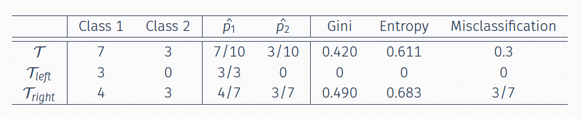

# Classification Trees


In this section, we are going to re-visit <font color=darkblue>**trees**</font> in a different context. In contrast to the regression trees, the response variable is now a **categorical** variable taking values in a <font color=blue>discrete set</font>, i.e.  $Y\in \{1, 2, \ldots, K\}$. Thus, given a set of features $X = (X_1, X_2, \ldots, X_p)$, our goal is to classify the new observation to one of the categories of $Y$.


Tree-based methods, as we discussed before, are *non-parametric methods* that recursively partition the feature space into  hyper-rectangular subsets, and make predictions on each subset. Historically, there are two main streams of tree models: the  _Classification and Regression Trees_ (CART,  Breiman, Friedman, Olshen and Stone; 1984) and  _ID3/C4.5_ algorithms (Quinlan; 1986, 1993).


As an illustration of a classification tree, we can consider the <font color=blue>_Titanic Survivals_ data set</font>. This is a staple data set for classification methods. The data we se in the example below have been downloaded from Kaggle <a href="https://www.kaggle.com/competitions/titanic/data">[here]</a>. We use *passenger class*, *passenger sex*, *passenger age*, *no. siblings/spouses aboard*, *no. of parents/children aboard* to _predict whether a passenger survived (or not)_. Pruning of the tree happens in the same way as for regression trees. 


```{r, echo=FALSE}
library(rpart)
library(rpart.plot)

titanic.train = read.csv("data/week9/train.csv")
titanic.test = read.csv("data/week9/test.csv")

titanic.train =  titanic.train[,c(-1, -4, -9, -10, -11, -12)]
#head(titanic.train) 
 
rpart.titanic = rpart(as.factor(Survived) ~ Pclass + Sex + Age + SibSp + Parch, data = titanic.train)

pruned.titanic = prune(rpart.titanic, cp = 0.02)
 
rpart.plot(pruned.titanic, type = 2, extra = 104, fallen.leaves = TRUE)
```

As you can see in the final nodes, the classification tree model is recursively splitting the feature space such that eventually each region is dominated by *one class*. 
So, the algorithm in the end predicted whether a given passenger survived or not.

<br>

 Previous classification methods that we discussed require either a transformation of the space (_SVM_) or a distance measure (_kNN_, _kernel methods_). The tree solves the prediction problem by directly cutting the feature space (recall the rectangles) using a **binary splitting rule** in the form of $\mathbf{1}_{\{x\leq c\}}$.


## Splitting Rules in Classification Trees


To discuss the splitting rule approach in classification trees, let us start with a toy example. Consider $X_1, X_2 \sim Uniform[-1,1]$ and simulate 90\% of the observations from  Class 1 (blue) points to be within the circle $x^2_1 + x^2_2 <0.75$ while 90\% of the observations from Class 2 (orange) to be outside the circle.

 
```{r}
## Simulation

set.seed(1)

x1 = runif(500, -1, 1)
x2 = runif(500, -1, 1)

y = rbinom(500 , size = 1 , prob = ifelse(x1^2 + x2^2 < 0.6, 0.9, 0.1))

plot(x1, x2, col = ifelse(y == 1, "darkblue", "darkorange"), pch = 16)
symbols(0, 0, circles = sqrt(0.6), add = TRUE, inches = FALSE, cex = 2)

```


A classification tree model is recursively splitting the feature space such that eventually each region is dominated by one class.


```{r}
library(rpart)

rpart.fit = rpart(as.factor(y)~x1+x2, data = data.frame(x1, x2, y))

par(mar=rep(0.5, 4))
plot(rpart.fit)
text(rpart.fit)   
```

We can also extract the details for the splits:

```{r}
rpart.fit$cptable
```

We can also prun the tree (as before) and plot it using `rpart.plot`:

```{r}
pruned.tree = prune(rpart.fit, cp = 0.041)
rpart.plot(pruned.tree, type = 2, extra = 104, fallen.leaves = TRUE)
```


In a tree model, as we discussed before, the splitting mechanism compares all possible splits on all variables.  At the current node, go through each variable to find the **best cut-off point** that splits the node. We then compare all the best cut-off points across all variable and choose the best one to split the current node and then iterate.

Specifically in classification trees, splitting of continuous predictors are in the form of $\mathbf{1}_{\left \{X^{(j)} \leq c \right \}}$. So, in a binary splitting rule for a  node $\mathcal{T}$ will be split into two children nodes. Then, we evaluate the overall <font color=darkblue>**impurity**</font> of $\mathcal{T}$, assuming that there are $K$ different classes of the outcome.We check the gain of the impurity measure and pick the one that leads to a <font color=blue>large (the largest) reduction in the measure</font>.


So, the question that arises is what error criterion should we use to compare different cut-off points? There are at least three of them:

<div class=motivationbox>

* Gini impurity (CART)

* Shannon entropy (C4.5)

* Mis-classification error
</div>

<br><br>


### Impurity Measures

To decide which variable to choose, we need to quantify the **<font color=blue>gain</font>** of an impurity measure. Therefore, the process that we described before (of how we choose the variable and splitting rule) can be formulated as the **gain of an impurity measure** in the following way
<font color=darkblue>\[\Phi(j,s) = i(t) - \Bigl( p_R \cdot i(t_R) +  p_L \cdot i(t_L)  \Bigr)\]</font>
where
\[i(t) = I \Bigl( \hat{p_t}(1), \ldots, \hat{p}_{t}(K) \Bigr),\]
with $I(\ldots)$  an impurity measure and $\hat{p_t}(j)$ the  frequency of class $j$ at node $t$. So, we pick the split $(j, s)$ that leads to the *<font color=blue>largest reduction in the impurity measure</font>*.


Assume we propose a split $\mathbf{1}_{\left \{X^{(j)}\leq c \right \}}$, then this separates all subjects in the node into two _disjoint parts_: $\mathcal{T}_{L}$ and $\mathcal{T}_{R}$.For each child node, we then evaluate the impurities: $I(\mathcal{T}_{L})$} and $I(\mathcal{T}_{L})$}. So, the reduction of impurity using an **Impurity Index**  is measured by

\[\Phi(j,s) = I(\mathcal{T}) - \Biggl(\underbrace{\frac{N_{\mathcal{T}_L}}{N_{\mathcal{T}}}}_{\hat{p}_L} \, I(\mathcal{T}_L) - \underbrace{\frac{N_{\mathcal{T}_R}}{N_{\mathcal{T}}}}_{\hat{p}_R}\,  I(\mathcal{T}_R) \Biggr)\]
where $N_{\mathcal{T}_L}$,  $N_{\mathcal{T}_R}$,  $N_{\mathcal{T}}$ are the sample sizes for the corresponding nodes. The method goes through all variables $j$ and all cutting points $c$ to find the split with the best score.<br><br>

Let us know define _mathematically_ an impurity measure:
<br>


<div class=motivationbox>
**Definition: Impurity Measure**

An impurity measure is a function $I(p_1, \ldots, p_K)$ where $p_j \geq 0$ and $\sum_j p_j =1$, with properties:

 (a) maximum occurs at $(1/K, \ldots, 1/K)$
 (b) minimum occurs at $p_j=1$ (the purest node)
 (c) $I(\ldots)$ is a symmetric function of $p_1, \ldots, p_K$, i.e. permutation of $p_j$ does not affect $I$.
</div>

<br> 

The most popular impurity measures in classification are the following:


* <font color=darkblue>**Gini Index (CART)**</font>
\[\text{Gini}(\mathcal{T}) = \sum_{k=1}^{K} \hat{p_k} (1- \hat{p_k}) = 1 - \sum_{k=1}^{K} \hat{p_k}^2\]
where $\hat{p_k} = \frac{\sum_i \mathbf{1}_{\{y_i=k\}} \cdot \mathbf{1}_{\{x_i \in \mathcal{T}\}}}{\mathbf{1}_{\{x_i \in \mathcal{T}\}}}$ is within node frequency of class $k$, and assuming that there are $K$ different classes of the outcome $1, \ldots, K$.
<br>

* <font color=darkblue>**Shannon Entropy (ID3/C4.5)**</font>
\[\text{Entropy}(\mathcal{T}) = - \sum_{k=1}^{K} \hat{p_k} \log\left( \hat{p_k} \right)\]
<br>

* <font color=darkblue>**Misclassification Rate**</font>
\[\text{Error}(\mathcal{T}) = 1- \max_{k=1,\ldots, K} \hat{p_k}\]

<br>

If we take the special case where we only have two classes in the response, i.e. $K=2$, the impurity measures compute as:

* Gini Index: $2p(1-p)$
* Shannon Entropy: $p\log\frac{1}{p} + (1-p) \log \frac{1}{1-p}$
* Misclassification Error/Rate: $\min(p, 1-p)$


```{r, echo=FALSE}
 gini <- function(y)
 {
   p = table(y)/length(y)
   sum(p*(1-p))
 }
 
 shannon <- function(y)
 {
   p = table(y)/length(y)
   -sum(p*log(p))
 }
 
 error <- function(y)
 {
   p = table(y)/length(y)
   1 - max(p)
 }
 
 score <- function(TL, TR, measure)
 {
   nl = length(TL)
   nr = length(TR)
   n = nl + nr
   f <- get(measure)
   f(c(TL, TR)) - nl/n*f(TL) - nr/n*f(TR)
 }
 
 TL = rep(1, 3)
 TR = c(rep(1, 4), rep(0, 3))
 
#score(TL, TR, "gini")
#score(TL, TR, "shannon")
#score(TL, TR, "error")
```

If we plot the three impurity measures, we have:

```{r, echo=FALSE}
 x = seq(0, 1, 0.01)
 g = 2*x*(1-x)
 s = -x*log(x) - (1-x)*log(1-x)
 e = 1-pmax(x, 1-x)
 
 par(mar=c(4.2,4.2,2,2))
 plot(x, s, type = "l", lty = 1, col = 3, lwd = 2, ylim = c(0, 1), ylab = "Impurity", xlab = "p", cex.lab = 1.5)
 lines(x, g, lty = 1, col = 2, lwd = 2)
 lines(x, e, lty = 1, col = 4, lwd = 2)
 
 legend("topleft", c("Entropy", "Gini", "Error"), col = c(3,2,4), lty =1, cex = 1.2)
```


Smaller value  of the impurity measure means that the node is more "pure", hence there is a higher certainty when we predict a new value.  The idea of splitting a node is that, we want the two resulting children nodes to contain less variation, in other words that they are <font color=blue>as pure as possible</font>. So, we calculate the error criterion both _before_ and _after_ the split and see which cut-off point gives us the best reduction of error. 

Take the Gini impurity index as an example. For an internal node $\mathcal{T}$,
\[\Phi_{Gini}(j,c) = \text{Gini}(\mathcal{T}) - \Biggl(\frac{N_{\mathcal{T}_L}}{N_{\mathcal{T}}}\, \text{Gini}(\mathcal{T}_L) - \frac{N_{\mathcal{T}_R}}{N_{\mathcal{T}}}\,  \text{Gini}(\mathcal{T}_R) \Biggr)\]

The left child node ($\mathcal{T}_{L}$) and the right child node  ($\mathcal{T}_{R}$) denote the two children nodes resulted from a potential split on the $j$th variable at a cut-off point $c$, such that 
\begin{align*}
\mathcal{T}_{R} &= \left\{x: x\in \mathcal{T},\, x_j > c \right\}\\
\mathcal{T}_{L} &= \left\{x: x\in \mathcal{T},\, x_j \leq c \right\}
\end{align*}

$\text{Gini}(\mathcal{T})$ calculates the uncertainty of the entire node $\mathcal{T}$, while the second quantity is a summary of the uncertainty of the two potential children nodes. A larger score indicates a better split, and we may choose the best index $j$ and cut-off point $c$ to proceed
<font color=darkblue>
\[\arg \max_{j,c} \Phi_{Gini}(j,c)\]
</font>

<br><br>


#### A Binary Classification Problem: Toy Example {-}

Consider the following scenario:

```{r ,echo=FALSE, message=FALSE, warning=FALSE, fig.align="center", out.width="100%"}

```


Then, the impurity of the different metrics computes as
\begin{align*}
\Phi_{Gini} &= 0.420 - (\frac{3}{10} \cdot 0 + \frac{7}{10} \cdot 0.490) = 0.077\\
\Phi_{Entropy} &= 0.611 - (\frac{3}{10} \cdot 0 + \frac{7}{10} \cdot 0.683) = 0.133\\
\Phi_{Error} &=  \frac{3}{10} - (\frac{3}{10} \cdot 0 + \frac{7}{10} \cdot \frac{3}{7}) = 0
\end{align*}


Gini Index and Shannon Entropy are more sensitive to  changes in the node probability. They prefer to create more "pure" nodes. Misclassification error can be used for evaluating a tree, but may not be sensitive enough for building the tree. Shannon's Entropy and Gini Index are strictly concave measures, which implies that the corresponding goodness-of-split measure $\Phi$ is always positive (unless the frequencies in both nodes are the same) which makes them very popular in growing trees.

<br><br>

### Splitting Rules: Categorical Predictors {-}

For a categorical predictor $X^{(j)}$ taking values in $\{1, \ldots, M\}$, we search for a subset $\mathcal{A}$ of $\{1, \ldots, M\}$, and evaluate the child nodes created by the splitting rule
\[1_{\bigl \{X^{(j)} \in A \bigr \}}\]

It is easy to see that there is a maximum of $2^{M-1} -1$}  possible splits which means that when $M$ is too large, this can be computationally intense. Some heuristic methods are used, such as randomly sample a subset of categories to one child node, and compare several random splits.


<br><br>


## Random Forests

In the regression framework, we have already discussed the disadvantage of using a single tree for making predictions and how we  can increase the prediction accuracy by aggregating "weak learners" that are unstable and less accurate to construct "strong learners".

_Bagging_, _Boosting_, and _Random Forests_ are all methods that combine weak learners to develop stronger ones. Bagging and Random Forests learn individual trees with some random perturbations, and then average them. Boosting on the other hand progressively learns models with small magnitude, then adds them.


### Bagging Predictors for Classification

We start by bootstrapping samples with replacement which implies that some observations can be repeated multiple times. Then, we fit a CART model to each bootstrap sample (may require tuning using CV) and we combine each learner, using the majority vote for classification problems:
<font color=darkblue>
\[\hat{f}_{bag}(x) = \text{ Majority Vote } \Bigl \{\hat{f}_b(x )\Bigr  \}_{b=1}^{B}\]
</font>
This can dramatically reduce the variance of individual learners. In this example, CART can be replaced by other weak learners. In the toy example below, we can see the difference between _CART_ and _Bagging_:


```{r}
 # Simulate data to use for the example
 set.seed(2)
 n = 1000
 x1 = runif(n, -1, 1)
 x2 = runif(n, -1, 1)
 y = rbinom(n, size = 1, prob = ifelse((x1 + x2 > -0.5) & (x1 + x2 < 0.5) , 0.8, 0.2))
 xgrid = expand.grid(x1 = seq(-1, 1, 0.01), x2 = seq(-1, 1, 0.01))
 
 
 par(mfrow=c(1,2))
 
 # Fit CART using rpart
 library(rpart)
 rpart.fit = rpart(as.factor(y)~x1+x2, data = data.frame(x1, x2, y))
 
 # we could fit a different tree using a bootstrap sample
 # rpart.fit = rpart(as.factor(y)~x1+x2, data = data.frame(x1, x2, y)[sample(1:n, n, replace = TRUE), ])
 
 pred = matrix(predict(rpart.fit, xgrid, type = "class") == 1, 201, 201)
 contour(seq(-1, 1, 0.01), seq(-1, 1, 0.01), pred, levels=0.5, labels="",axes=FALSE)
 points(x1, x2, col = ifelse(y == 1, "darkblue", "orange"), pch = 16, yaxt="n", xaxt = "n")
 points(xgrid, pch=".", cex=1.2, col=ifelse(pred, "darkblue", "orange"))
 box()    
 title("CART")
 
 # fit Bagging
 library(ipred)
 bag.fit = bagging(as.factor(y)~x1+x2, data = data.frame(x1, x2, y), nbagg = 200, ns = 400)
 pred = matrix(predict(prune(bag.fit), xgrid) == 1, 201, 201)
 contour(seq(-1, 1, 0.01), seq(-1, 1, 0.01), pred, levels=0.5, labels="",axes=FALSE)
 points(x1, x2, col = ifelse(y == 1, "darkblue", "orange"), pch = 16, yaxt="n", xaxt = "n")
 points(xgrid, pch=".", cex=1.2, col=ifelse(pred, "darkblue", "orange"))
 box()
 title("Bagging")
```


Bagging can dramatically reduce the variance of unstable "weak learners" like trees, leading to improved prediction. However, the simple structure of trees will be lost due to bagging, hence it is not easy to interpret. The main disadvantage of this approach is the high correlation of the trees (weak learners) which may make averaging not  effective. 


### Random Forests

Random forests are equipped with the same bootstrapping strategy, but also with additional randomness that is controlled by the methods hyperparameters that need to be tuned. For example, to apply a random forest algorithm, we need to know

* the number of trees, many controls the stability. We typically want to fit a large number of trees.

* how many samples to use when fitting each tree. In practice, we often use the training sample size if sampled with replacement.

* the number of randomly sampled variable to consider at each internal node. This need to be tuned for adaptiveness to sparse signal (large mtry) or highly correlated features (small mtry).

We stop  splitting when the node sample size is no larger than node size. This works similar to   k in a KNN model. However, its effect can be greatly affected by other tuning parameters.

```{r}
 # generate some data with larger p
  set.seed(542)
  n = 1000
  p = 10
  X = matrix(runif(n*p, -1, 1), n, p)
  x1 = X[, 1]
  x2 = X[, 2]
  y = rbinom(n, size = 1, prob = ifelse((x1 + x2 > -0.5) & (x1 + x2 < 0.5), 0.8, 0.2))
  xgrid = expand.grid(x1 = seq(-1, 1, 0.01), x2 = seq(-1, 1, 0.01))

  # fit random forests with a selected tuning
  library(randomForest)

  rf.fit = randomForest(X, as.factor(y), ntree = 1000, 
                        mtry = 7, nodesize = 10, sampsize = 800)
```

Instead of generating a set of testing samples labels, let’s directly compare with the "true" decision rule, the Bayes rule.

```{r}
# the testing data 
  Xtest = matrix(runif(n*p, -1, 1), n, p)
  
  # the Bayes rule
  BayesRule = ifelse((Xtest[, 1] + Xtest[, 2] > -0.5) & 
                     (Xtest[, 1] + Xtest[, 2] < 0.5), 1, 0)
  
  mean( (predict(rf.fit, Xtest) == "1") == BayesRule )
```


## Boosting


Consider producing a sequence of learners:
<font color=darkblue>
\[F_T(x) = \sum_{t=1}^{T} f_t(x)\]
</font>

 **How to train each $f_t(x)$?** 
At the $t$-th iteration, given previously estimated $f_1, \ldots, f_{t-1}$, we estimate a new function $h(x)$ to minimize the loss:
<font color=darkblue>
\[\min_h \sum_{i=1}^{n} L \Biggl(y_i, \,\, \sum_{k=1}^{t-1} f_k(x_i) + h(x_i) \Biggr)\]
</font>
When boosting, instead of using the entire $h(x)$, we only use a small fraction of it, and add $\alpha_t h(x)$ to the current model. Then, proceed to the next iteration.

Boosting is an additive model, but its different from generalized additive model, in which each weak learner only involves one variable. In boosting, each $f_t(x)$ can be very flexible, and we may fit a large number of functions. Boosting is also different from random forests, another additive model. In random forests, each tree is generated independently, so they cannot borrow information from each other.

<br><br>

###  AdaBoost

**AdaBoost** is a boosting algorithm due to Freund and Schapire (1997) and is a special case of the above framework with Exponential loss for classification. For this setting, we use labels $y_i\in\{-1, 1\}$.


<div class=learningbox>
**AdaBoost Algorithm**

1. Initiate weights $w_i^{(1)} = 1/n,\, i=1,2, \ldots, n$.

2.  For $t=1:T$, repeat (a)--(d)

  (a) Fit a classifier $f_t(x) \in \{-1, 1\}$ to the training data, with individual weights $w_i^{(t)}$

  (b)  Compute the training error at $t$
\[\varepsilon_t = \sum_i w_i^{(t)} \mathbf{1}_{\{y_i \neq f_t(x_i)\}}\]

  (c)  Compute
\[\alpha_t = \frac{1}{2} \log \frac{1-\varepsilon_t}{\varepsilon_t}\]

  (d) Update weights
\[w_i^{(t+1)} = \frac{w_i^{(t)}}{Z_t} \exp \Bigl\{ -\alpha_t y_i f_t(x_i) \Bigr\}\]
where $Z_t$ is a normalization factor to keep $w_i^{(t+1)}$ a distribution:
\[Z_t = \sum_{i=1}^{n} w_i^{(t)} exp\Bigl\{-\alpha_t y_i f_t(x_i) \Bigr\}\]


3. Output the final model
\[F_T(x) = \sum_{t=1}^{T} \alpha_t f_t(x)\]
The classification rule is $sign(F_T(x))$.
</div>


<br>

In the following example, we build a tree model $f_t(x)$ with just one split at each iteration.  The final model is stacked with all tree models.


```{r, warning=FALSE, message=FALSE}

 x1 = seq(0.1, 1, 0.1)
 x2 = c(0.5, 0.3, 0.1, 0.6, 0.7,
        0.8, 0.5, 0.7, 0.8, 0.2)
 
 y = c(1, 1, -1, -1, 1, 
       1, -1, 1, -1, -1)
 X = cbind("x1" = x1, "x2" = x2)
 xgrid = expand.grid("x1" = seq(0, 1.1, 0.01), "x2" = seq(0, 0.9, 0.01))
 

 plot(X[, 1], X[, 2], col = ifelse(y > 0, "darkblue", "orange"),
      pch = ifelse(y > 0, 4, 1), xlim = c(0, 1.1), lwd = 3,
      ylim = c(0, 0.9), cex = 3)
```


```{r warning=FALSE, message=FALSE}
 # fit gbm with 3 trees
 library(gbm)

  gbm.fit = gbm(y ~., data.frame(x1, x2, y= as.numeric(y == 1)), 
               distribution="adaboost", interaction.depth = 1, 
               n.minobsinnode = 1, n.trees = 3, 
               shrinkage = 1, bag.fraction = 1)
 
 pretty.gbm.tree(gbm.fit, i.tree = 1)

 plot(X[, 1], X[, 2], col = ifelse(y > 0, "darkblue", "orange"),
      pch = ifelse(y > 0, 4, 1), xlim = c(0, 1.1), lwd = 3,
      ylim = c(0, 0.9), cex = 3)
 pred = predict(gbm.fit, xgrid)
 points(xgrid, col = ifelse(pred > 0, "darkblue", "orange"), 
        cex = 0.2)
 
 w1 = rep(1/10, 10)
 f1 <- function(x) ifelse(x[, 1] < 0.25, 1, -1)
 e1 = sum(w1*(f1(X) != y))
 a1 = 0.5*log((1-e1)/e1)
 
 w2 = w1*exp(- a1*y*f1(X))
 w2 = w2/sum(w2)
 
 # the first tree
 plot(X[, 1], X[, 2], col = ifelse(y > 0, "darkblue", "orange"),
      pch = ifelse(y > 0, 4, 1), xlim = c(0, 1.1), lwd = 3,
      ylim = c(0, 0.9), cex = 3)
 
 pred = f1(xgrid)
 points(xgrid, col = ifelse(pred > 0, "darkblue", "orange"), 
        cex = 0.2)
 
 # weights after the first tree
 plot(X[, 1], X[, 2], col = ifelse(y > 0, "darkblue", "orange"),
      pch = ifelse(y > 0, 4, 1), xlim = c(0, 1.1), lwd = 3,
      ylim = c(0, 0.9), cex = 30*w2)
 
 
 f2 <- function(x) ifelse(x[, 2] > 0.65, 1, -1)
 e2 = sum(w2*(f2(X) != y))
 a2 = 0.5*log((1-e2)/e2)
 
 w3 = w2*exp(- a2*y*f2(X))
 w3 = w3/sum(w3)
 
 # the second tree
 plot(X[, 1], X[, 2], col = ifelse(y > 0, "darkblue", "orange"),
      pch = ifelse(y > 0, 4, 1), xlim = c(0, 1.1), lwd = 3,
      ylim = c(0, 0.9), cex = 30*w2)
 
 pred = f2(xgrid)
 points(xgrid, col = ifelse(pred > 0, "darkblue", "orange"), 
        cex = 0.2)
 
 # weights after the second tree
 plot(X[, 1], X[, 2], col = ifelse(y > 0, "darkblue", "orange"),
      pch = ifelse(y > 0, 4, 1), xlim = c(0, 1.1), lwd = 3,
      ylim = c(0, 0.9), cex = 30*w3)
 
 f3 <- function(x) ifelse(x[, 1] < 0.85, 1, -1)
 e3 = sum(w3*(f3(X) != y))
 a3 = 0.5*log((1-e3)/e3)
 
 # the third tree
 plot(X[, 1], X[, 2], col = ifelse(y > 0, "darkblue", "orange"),
      pch = ifelse(y > 0, 4, 1), xlim = c(0, 1.1), lwd = 3,
      ylim = c(0, 0.9), cex = 30*w3)
 
 pred = f3(xgrid)
 points(xgrid, col = ifelse(pred > 0, "darkblue", "orange"), 
        cex = 0.2)
 
 # the final decision rule 
 plot(X[, 1], X[, 2], col = ifelse(y > 0, "darkblue", "orange"),
      pch = ifelse(y > 0, 4, 1), xlim = c(0, 1.1), lwd = 3,
      ylim = c(0, 0.9), cex = 3)
 
 pred = a1*f1(xgrid) + a2*f2(xgrid) + a3*f3(xgrid)
 points(xgrid, col = ifelse(pred > 0, "darkblue", "orange"), 
        cex = 0.2)
 abline(v = 0.25) # f1
 abline(h = 0.65) # f2
 abline(v = 0.85) # f3
 
```
 
 
Although we can get really low training classification error, this is subject to overfitting. The following code demonstrates what overfitting looks like.

```{r}
  # One-dimensional classification example
  n = 1000; set.seed(1)
  x = cbind(seq(0, 1, length.out = n), runif(n))
  py = (sin(4*pi*x[, 1]) + 1)/2
  y = rbinom(n, 1, py)
  
  plot(x[, 1], y + runif(n, -0.05, 0.05), pch = 16, ylim = c(-0.05, 1.05), cex = 0.5,
       col = ifelse(y==1,"orange", "darkblue"), xlab = "x", ylab = "P(Y=1 | X=x)")
  points(x[, 1], py, type = "l", lwd = 3)
```

```{r}
# fit AdaBoost with bootstrapping, I am using a large shrinkage factor
  gbm.fit = gbm(y~., data.frame(x, y), distribution="adaboost", n.minobsinnode = 2, 
                n.trees=200, shrinkage = 1, bag.fraction=0.8, cv.folds = 10)
```

```{r}
par(mfrow=c(3,3))
 # plot the decision function (Fx, not sign(Fx))
  size=c(1, 5, 10, 20, 50, 100)

  for(i in 1:6)
  {
    par(mar=c(2,2,3,1))
    plot(x[, 1], py, type = "l", lwd = 3, ylab = "P(Y=1 | X=x)", col = "gray")
    points(x[, 1], y + runif(n, -0.05, 0.05), pch = 16, cex = 0.5, ylim =c(-0.05, 1.05),
           col = ifelse(y==1, "orange", "darkblue"))
    Fx = predict(gbm.fit, n.trees=size[i]) # this returns the fitted function, but not class
    lines(x[, 1], 1/(1+exp(-2*Fx)), lwd = 1)
    title(paste("# of Iterations = ", size[i]))
  }
```


We can see that with a small number of iterations, the model is underfitting, while with a large number of iterations, the model is overfitting. Hence, selecting trees is necessary. For this purpose, we can use either the out-of-bag error to estimate the exponential upper bound, or simply do cross-validation.

```{r}
  # get the best number of trees from cross-validation (or oob if no cv is used)
  gbm.perf(gbm.fit, method = "cv")
```


At the first iteration, the tree splits at 0.25 for $X_1$.This makes the three positive cases on the right hand side to increase their weights. At the second iteration, the tree splits at 0.65 for $X_2$. This further adjusts the weights, along with calculating $\alpha_t$ at each step. At the third iteration, the tree splits at 0.85 for $X_1$.  This produces the final model:
\[F_3(x) = 0.4236 f_1(x) + 0.6496 f_2(x) + 0.9229 f_3(x)\]


Intuitively, what happens in the AdaBoost algorithm is the following: at the initial step, all subjects are treated with equal weights. We learn a classifier $f_t(x)$ and inspect which subjects got mis-classified. We then put more weights on the mis-classified subjects for the next iteration. We add $\alpha_t f_t(x)$ to the existing model and train the next iteration using the updated weights.

<br>


### Training Error Bound

There is an interesting property about the boosting algorithm that if we can always find a classifier that performs better than random guessing at each iteration, then the training error will eventually converge to zero. This works by analyzing the weight after the last iteration:

\[w_i^{(T+1)} = \frac{1}{Z_T} w_i^{(T)} \exp \Bigl\{  -\alpha_t y_i f_T(x_i) \Bigr\} \]


 Note that for $w_i^{(T)}$, we can also further backtrack it into $T-1$:
\[w_i^{(T)} = \frac{1}{Z_{T-1}} w_i^{(T-1)} \exp \Bigl\{ -\alpha_t y_i f_{T-1}(x_i) \Bigl\} \]

Hence, we can track this all the way back to the first iteration. This gives
\begin{align*}
w_i^{(T+1)}  &= \frac{1}{Z_1 \cdot \cdot \cdot Z_T} w_i^{(1)} \prod_{t=1}^{T} \exp \Bigl\{ -\alpha_t y_i f_t(x_i) \Bigr\}\\
 &= \frac{1}{Z_1 \cdot \cdot \cdot Z_T} \frac{1}{n} \prod_{t=1}^{T} \exp \Bigl\{ -\alpha_t y_i f_t(x_i) \Bigr\} \\
  &= \frac{1}{Z_1 \cdot \cdot \cdot Z_T} \frac{1}{n} \exp \Bigl\{ - y_i \sum_{t=1}^{T} \alpha_t f_t(x_i) \Bigr\}\\
\end{align*}
Note that $\sum_{t=1}^{T} \alpha_t f_t(x_i)$ is the just the final model at the $T$th iteration, i.e., $F_T(x_i)$. Since the weights sum up to 1, we can write
\[1 = \sum_{i=1}^{n} w_i^{(T+1)} = \frac{1}{Z_1 \cdot \cdot \cdot Z_T} \frac{1}{n} \sum_{t=1}^{T}  \exp \Bigl\{ - y_i F_T(x_i) \Bigr\}\]
or equivalently
\[Z_1 \cdot \cdot \cdot Z_T = \frac{1}{n}  \sum_{t=1}^{T} \exp \Bigl\{ - y_i F_T(x_i) \Bigr\} \]
On the right-hand side, we have  the exponential loss. Let's check some facts:

* Correctly classified: $sign(y) = sign(f(x))$ and $exp(-yf(x)) >0$

* Incorrectly classified: $sign(y)=-sign(f(x))$ the $exp(-yf(x))>1$

Hence, the exponential loss is larger than 0/1 loss:
\begin{align*}
& Z_1 \cdot \cdot \cdot Z_T = \frac{1}{n} \sum_{i=1}^{n} \exp \{-y_i F_T(x_i)\}\\
& > \frac{1}{n} \sum_{i=1}^{n} \mathbf{1}_{\{y_i \neq F_T(x_i)\} }
\end{align*}
On the other hand, we can further break down each $Z_t$. Notice that $f_t(x_i)$ is a classification model with output 1 or -1, this either matches or not matches $y_i$:
\begin{align*}
Z_t &= \sum_{i=1}^{n} w_i^{(t)}  \exp \Bigl\{-\alpha_t y_i f_t(x_i) \Bigr\}\\
&= \sum_{y_i= f_t(x_i)}  w_i^{(t)} \exp(-\alpha_t) +  \sum_{y_i \neq f_t(x_i)}  w_i^{(t)} \exp(\alpha_t) \\
&= \exp(-\alpha_t)  \sum_{y_i= f_t(x_i)}  w_i^{(t)} + \exp(\alpha_t)  \sum_{y_i \neq f_t(x_i)}  w_i^{(t)} 
\end{align*}
By our definition,
\[\varepsilon_t = \sum_i w_i^{(t)} \mathbf{1}_{\{y_i \neq f_t(x_i) \}}\]
is the proportion of weights for mis-classified samples. Hence,
\[Z_t = (1-\varepsilon_t) \exp(-\alpha_t) + \varepsilon_t \exp(\alpha_t)\]
Since we want to minimize we can simply minimize $Z_1 \cdot \cdot \cdot Z_t$ by choosing $\alpha_t$. Taking a derivative with respect to $\alpha_t$, we have 
\[-(1-\varepsilon_t) \exp(-\alpha_t) + \varepsilon_t \exp(\alpha_t) = 0\]
Solving with respect to $\alpha_t$, we get
\[\alpha_t = \frac{1}{2} \log \frac{1-\varepsilon_t}{\varepsilon_t}\]
Now, we plug this back into $Z_t$
\[Z_t = 2 \sqrt{\varepsilon_t (1- \varepsilon_t)}\]
Since $\varepsilon_t (1- \varepsilon_t)$ can only attain maximum of 1/4, $Z_t$ must be smaller than 1, and $Z_1 \cdot \cdot \cdot Z_t$ should converge to 0.


#### The Training Error {-}

Alternatively, if we let $\gamma_t = \frac{1}{2} - \varepsilon_t$ as the improvement from a random model
\begin{align*}
Z_t &= 2\sqrt{\varepsilon_t (1- \varepsilon_t)} = \sqrt{1-4\gamma_t^2}\\
&\leq \exp(-2 \gamma_t^2)
\end{align*}

The last equation uses the Taylor expansion that
\[ \exp(-2 \gamma_t^2) = 1- 4 \gamma_t^2 + \ldots\]
Hence, the AdaBoost training error is bounded above by
\begin{align*}
\text{Training Error} &= \sum_{i=1}^{n} \mathbf{1}_{\{y_i \neq sign(F_T(x_i) ) \} }\\
&= \sum_{i=1}^{n}  \exp \Bigl\{ -y_i  F_T(x_i)\Bigr\}\\
&= Z_1 \cdot \cdot \cdot Z_T\\
& \leq \exp \Bigl\{ -2 \sum_{t=1}^{T} \gamma_t^2\Bigr\}  \rightarrow 0
\end{align*}
as long as $f_t(x)$ at each iteration $t$ is better than random guess.

<br>
**Remarks:**

* Does the Adaboost outputs a classifier $F_T(x)$ with small testing error? 
**No**. We need to tune $T$. Careful! You can easily overfit.

*  Does the training error of  $F_T(x)$ decreases w.r.t. $T$? 
**No.** It serves only as the upper bound of 0/1 training error. After each iteration, Adaboost decreases a particular upper-bound of the 0/1 training error. So in a long run, the training error is going to zero, but not necessarily monotonically.

* Can we use a classifier that is worse than random guessing? 
**Yes.** The reverse of that classier can be used ($\alpha_t<0$).


In practice, a classification tree model is used as the weak learner. We may also roughly calculate the estimated probability: consider the (upper bound) exponential loss $E\Bigl[\exp(-yF(x)) \Bigr]$ which is
\[e^{-F(x)} P(Y=1|x) + e^{F(x)} P(Y=-1|x) \]

The best $F(x)$ that minimizes this expectation should be (take derivatives in the function above and set to 0):
\[-e^{-F(x)} P(Y=1|x) + e^{F(x)} P(Y=-1|x) =0\]
Solving wrt $F(x)$, we obtain
\begin{align*}
F(x) &= \frac{1}{2} \log \frac{P(y=1|x)}{P(y=-1|x)},\, \text{ where } P(y=1|x) = \frac{e^{2F(x)}}{1+e^{2F(x)}}
\end{align*}

<br><br>


### Gradient Boosting: Forward Stage-wise Additive Model


 In a more general framework, consider an additive structure:
\[F_T(x) = \sum_{t=1}^{T} \alpha_t f(x; \theta_t)\]
and fit a model, by minimizing the loss function
\[\min_{\{\alpha_t, \theta_t\}_{t=1}^{T}} \sum_{i=1}^{n} L \bigl( y_i, F_T(x_i)\bigr) \]


We may choose a suitable loss function} for the problem; a base learner $f(x;\theta)$ with parameter $\theta$, such as linear, tree. It is difficult to minimize over all $\{\alpha_t, \theta_t\}_{t=1}^{T}$, so we do this in a stage-wise fashion. 


<div class=learningbox>
**Algorithm**

1.  Set $F_0(x)=0$.

2. For $t=1, \ldots, T$

  (a) Choose $\{\alpha_t, \theta_t\}$ to minimize the loss
\[\min_{\alpha, \theta} \sum_{i=1}^{n} L\Bigl(y_i, F_{t-1}(x_i) + \alpha f(x_i; \theta ) \Bigr)\]
  (b) Update $F_t(x) = F_{t-1}(x) + \alpha_t f(x; \theta_t)$.
</div>


AdaBoost is essentially a forward stage-wise approach using exponential loss.  It does not pick an optimal $f(x; \theta)$ at each step: the tree model is not optimized, we just need some model that is better than random. Only the step size $\alpha_t$ is optimized at each $t$ given the fitted $f(x; \theta_t)$


Another example of a forward stage-wise additive model is the **forward stage-wise linear regression**: 

For each step we use a single variable linear model:
\[f(x,j) = sign \bigl(Cor(X_j, r) \bigr) X_j\]
where $r$ is the residual, as $r_i = y_i - F_{t-1}(x_i)$ and $j$ is the index that has the largest absolute correlation with $r$. Then, we give a very small step size $\alpha_t$, say, $\alpha_t = 10^{-5}$ and with sign equal to the correlation between $X_j$. $F_t(x)$ here is almost equivalent to the Lasso solution path (as $t$ changes)


Alternatively, we can think of  $r_i$ as the gradient to the squared-error loss:
\[r_{it} = -\Biggl[ \frac{\partial(y_i - F(x_i))^2 }{\partial F(x_i) } \Biggr]_{F(x_i) = F_{t-1}(x_i)}\]
So, we fit the weak leaner $f_t(x)$ to the residuals, and update the fitted model $F_t$. This, of course, can be generalized into any loss function $L$:


* At each iteration $t$, calculate "pseudo-residuals", i.e., the negative gradient for each observation
\[g_{it} = -\Biggl[ \frac{\partial L(y_i, F(x_i)) }{\partial F(x_i) } \Biggr]_{F(x_i) = F_{t-1}(x_i)}\] 

* Fit $f_t(x, \theta_t)$ to pseudo-residual $g_{it}$.

* Search for a step length
\[\alpha_t = \arg \min_{\alpha} \sum_{i=1}^{n} L\Bigl( y_i, \, F_{t-1}(x_i) + \alpha f(x_i;\theta_t) \Bigr )\]

* Update $F_t(x) = F_{t-1}(x) + \alpha_t f(x; \theta_t)$.

Hence, the only change when modeling different outcomes is to choose the loss function, and derive the pseudo-residuals. For gradient boosting using CART as base classifier, we can make it more sophisticated by optimizing $\alpha_t$ at each terminal node.

<br><br>


###  Boosting in R

The stage-wise view from forward regression suggests a broader principle: model fitting can be framed as functional gradient descent. Rather than updating a single pre-specified coefficient, we iteratively update the fitted function in the direction of the negative gradient of the loss.

The following example shows the result of using a tree learner :

```{r}
  library(gbm)
  
  # a simple regression problem
  x <- seq(0, 1, 0.001)
  fx <- function(x) 2*sin(3*pi*x)
  y <- fx(x) + rnorm(length(x))
  
  plot(x, y, pch = 19, ylab = "y", col = "gray", cex = 0.5)
  # plot the true regression line
  lines(x, fx(x), lwd = 2, col = "deepskyblue")
```

We can see that the fitted model progressively approximates the true function.

```{r}
  # fit regression boosting
  # (Using a large shrinkage here to visualize stagewise fits; in practice use 0.1 or smaller.)
  gbm.fit <- gbm(y ~ x, data = data.frame(x, y), distribution = "gaussian",
                 n.trees = 300, shrinkage = 0.5, bag.fraction = 0.8)
  
  # plot the fitted regression function at several iterations
  par(mfrow=c(2,3))
  size <- c(1, 5, 10, 50, 100, 300)
  
for (i in 1:6) {
    par(mar=c(2,2,3,1))
    plot(x, y, pch = 19, ylab = "y", col = "gray", cex = 0.5)
    lines(x, fx(x), lwd = 2, col = "deepskyblue")
    # additive score F(x)
    Fx <- predict(gbm.fit, n.trees = size[i])
    lines(x, Fx, lwd = 3, col = "darkorange")
    title(paste("# of Iterations = ", size[i]))
}
```


<br><br>

####  xgboost {-}

xgboost (Chen and Guestrin 2016) is a popular and efficient implementation of gradient boosting that supports various loss functions and regularization techniques. It is widely used in machine learning competitions and real-world applications due to its speed and performance.


```{r}
  set.seed(2025)
  n <- 2000
  p <- 15
  X <- matrix(rnorm(n*p), n, p)
  f_true <- function(x) 2*sin(x[,1]) + 0.5*x[,2]^2 - 1.5*(x[,3]>0)
  y <- f_true(X) + rnorm(n, sd = 1)
  
  idx <- sample.int(n, floor(0.7*n))
  dtrain <- xgboost::xgb.DMatrix(X[idx,], label = y[idx])
  dvalid <- xgboost::xgb.DMatrix(X[-idx,], label = y[-idx])
  
  params <- list(
    objective = "reg:squarederror",
    eval_metric = "rmse",
    eta = 0.05,             # shrinkage
    max_depth = 4,          # tree depth
    subsample = 0.8,        # row subsampling
    colsample_bytree = 0.8, # column subsampling
    min_child_weight = 5,   # node min hessian-weighted size
    lambda = 1.0,           # L2 on leaf weights
    alpha = 0               # L1 on leaf weights (optional)
  )
  
  watch <- list(train = dtrain, valid = dvalid)
  fit <- xgboost::xgb.train(
    params = params,
    data = dtrain,
    nrounds = 3000,
    watchlist = watch,
    early_stopping_rounds = 50,
    verbose = 0
  )
  
  cat("Best iteration:", fit$best_iteration, 
      "  Valid RMSE:", fit$best_score, "\n")
  
  # Feature importance (gain-based)
  imp <- xgboost::xgb.importance(model = fit, feature_names = paste0("x",1:p))
  head(imp, 8)

  
  # Predictions and validation RMSE
  pred <- predict(fit, dvalid)
  rmse <- sqrt(mean((pred - y[-idx])^2))
  rmse
```


