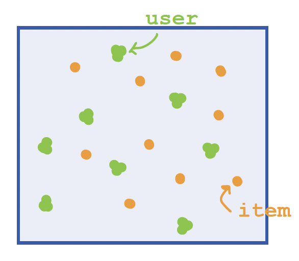
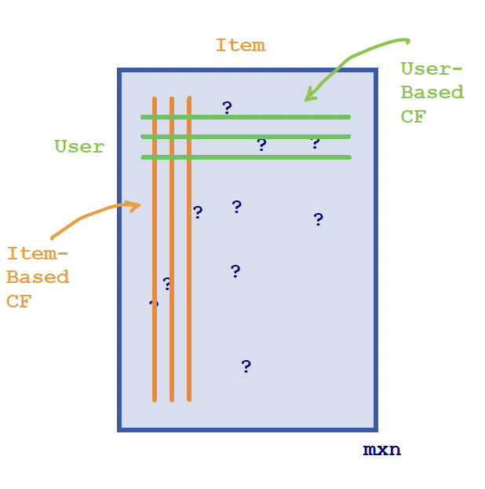
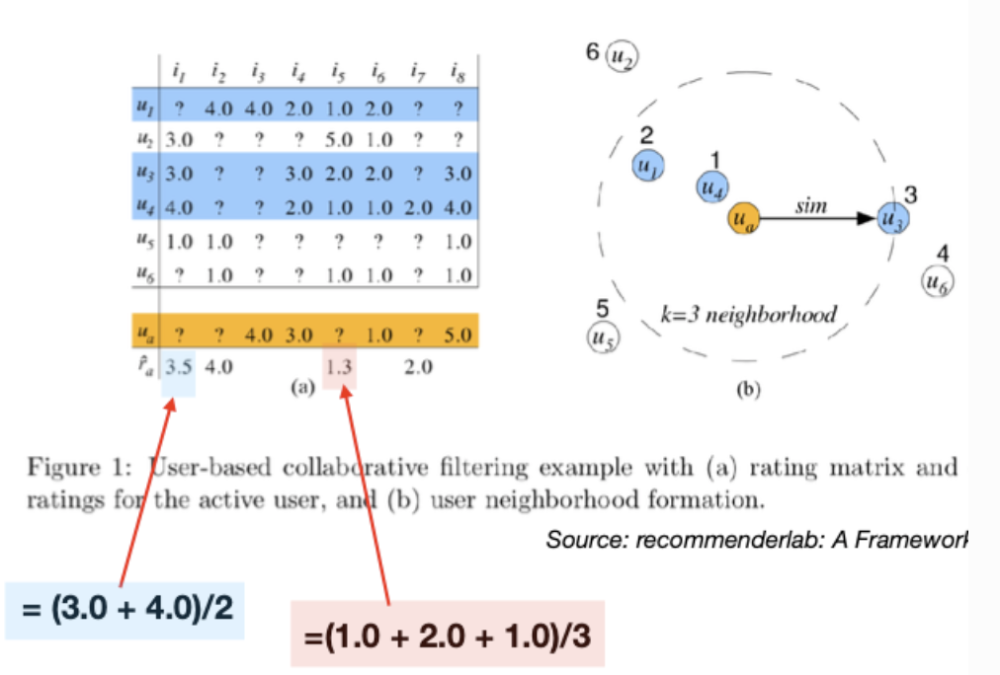
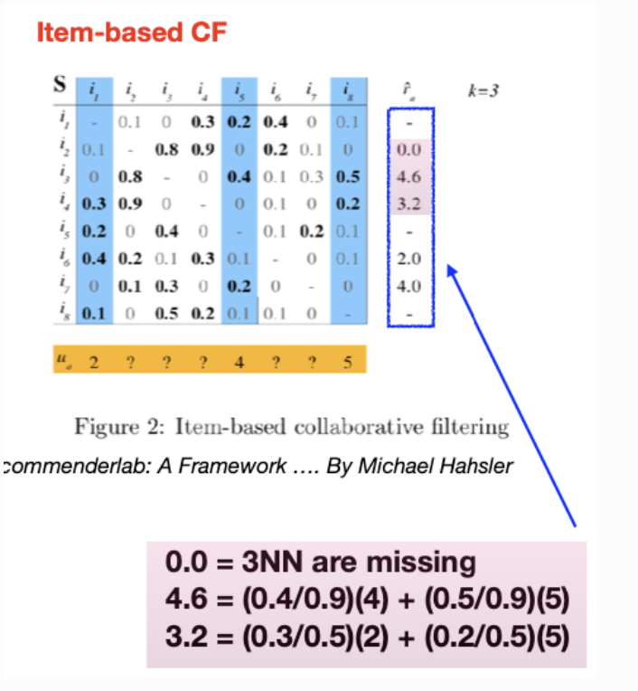
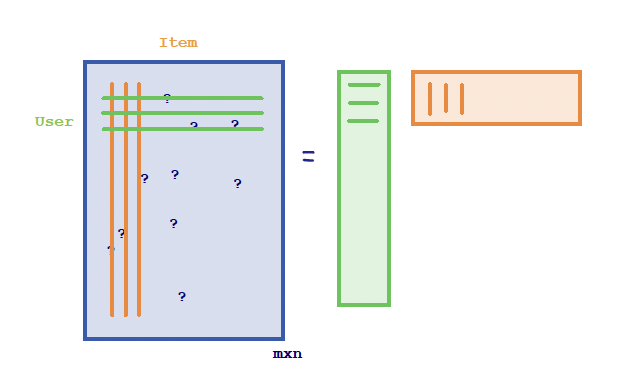

# Recommender Systems


A **recommender** or a **recommendation system** or **recommendation platfor** is a subclass of information filtering system that seeks to predict the rating or preference a use would give to an item.


Recommendation Systems are everywhere: in movie/ series streaming platforms (e.g., Netflix), e-commerce websites (e.g., Amazon), social network platforms (e.g., Facbook, LinkedIn) or dating apps. The recommendation systems typically leverages historical data to automatically recommend items/products that a user is likely to be interested in. 


So, let's consider how those recommender systems are constructed. Historically, everything started with top 5 lists. Few years ago, recommendations you could find were about top 5 destinations for the summer, top 5 Black Friday deals, so on and so forth. However, those recommendations are  based on expert knowledge or aggregate statistics and there is a lack of personalization. This is exactly where the recommender systems come in.

In this section, we are going to explore fundamental recommendation methods, such as content-based methods or collaborative filtering, item-based or user-based, or latent factor models. If we classify the different methods, we notice that they are based on mainly two types of information: (i) characteristics/ information about the items, and/or (ii) user-item interactions. This approach leads to 

* <font color=blue>**Content-based methods**</font>: focusing on attributes of a specific item

* <font color=blue>**Collaborative Filtering**</font> (item-based/ user-based) methods: based on the analysis of user-item interaction data.

* <font color=blue>**Latent Factor Models**</font>: also based on the analysis of user-item interaction data.

* <font color=blue>**Hybrid methods**</font>: combination of content-based methods with collaborative filtering ones depending on the challenge.

* <font color=blue>**Deep Recommender Systems**</font>: more modern techniques based on deep learning algorithms.

In general, several of those systems have been historically developed by Netflix, going back to the Netflix prize competition.


## Content-Based Methods


The content-based method is more intuitive. So, assume that we are an online bookstore and we want to create a comprehensive catalogue of our products, making sure that we know we are able to accurately represent every item/book. So, we need to represent each book as a multidimensional feature vector. The features could include the author, the publisher, the genre, the year; anything that we believe describes the type of book in an effort to construct an item profile. Then, we visualize every item as a distinct point  within a multidimensional feature space (the orange dots in the Figure)

```{r ,echo=FALSE, message=FALSE, warning=FALSE, fig.align="center", out.width="30%", fig.cap="User & Item feature space"}

```

We have a bank of all these item profiles for the various items, but we also construct a user profile within the same dimensional framework (the green dots in the Figure). It is more challenging to construct the user profile. Typically, this is done either _directly_ by asking users direct questions for feedback, or _indirectly_ by monitoring a user's activity on the website (by clicks, iewing times, analysis of previous items the user interacted with). These profiles usually give more weight to recent interactions compared to older ones. So, then the recommendation is based on the items that are **closer** to the user in this multidimensional feature space. In other words, <font color=blue>_closeness equates to preference_</font> giving us the ability to make tailored recommendations.


The main advantage of this approach is that it does not require any other user's data to make a recommendation. Therefore, it's very efficient, and we are able to start making recommendations from day one  without waiting for some expensive and extensive  user-item interaction data. In addition to that, this is a model that it does not discriminate based on item popularity.  In other words, if there is an item that is more or less popular than another, the method does not make any discrimination since the decision is made solely based on closeness.

Therefore, the recommendation is based on the other features, and that's a way that makes the items solely focused on our preferences, and they match our previous choices offering also a higher degree of transparency. It is easy to articulate why an item was recommended based on a specific set of features and how it aligns with the user's interests which means that there is limited discovery. Since every recommendation is based on similar item that the user has previously interacted with, then there is no appropriate discovery resulting in always providing similar recommendations.


## Collaborative Filtering


 The collaborative filtering method relies on an interaction matrix between users and items, known as <font color=darkblue>**the rating matrix**</font>, that is an $m \times n$ grid, where rows represent users and columns represent items.  Within this matrix, some entries are known via _explicit_ or _implicit_ feedback. Explicit feedback might be direct ratings, such as a user’s rating of a movie on Netflix on a scale from one to five, signaling clear preferences.   Implicit feedback could come from user behaviors such as clicking on an item or spending time viewing a particular movie, providing subtle clues about their interests.


"Mathematically", the problem we need to solve is that of _matrix completion_, since we need to fill in the blanks, by predicting user preferences for items a user has not  interacted with yet.


```{r ,echo=FALSE, message=FALSE, warning=FALSE, fig.align="center", out.width="45%"}

```

There are two types of collaborative filtering:

* <font color=blue>**User-based CF**</font>: "_Similar users will like similar items_", e.g.,  if User A liked an item and User B has a similar profile to User A, it is likely that User B will also like that item. The 
Challenge: defining what makes users similar.


* <font color=blue>**Item-based CF**</font>: "_Users will like items similar to those they have already liked._" e.g., if User A liked Item X, and Item Y is similar to Item X, then User A is likely to like Item Y as well.


#### User-based Collaborative Filtering {-}

The challenge in used-based collaborative filtering is to  quantify the resemblance between users or items, even with incomplete data. This means that we need to define the notion of **similarity**.  Some of the most commonly used similarity metrics include:


* <font color=blue>**Jaccard Similarity**</font>: compares users based on the items they have both interacted with, or compare items based on shared users (ideal for binary data):
\[\frac{|A\cap B|}{|A\cup B|}, \text{ where } A, B \text{ are two sets}\]


* <font color=blue>**Cosine Similarity**</font>: measures the cosine of the angle between two vectors in an $n$-dimensional space. Missing values are ignored or equivalently treated as zeros:
\[\frac{u^T v}{||u|| \cdot ||v||}, \text{ where } u,v \text{ are two vectors}\]

* <font color=blue>**Centered Cosine Similarity (Pearson Correlation)**</font>:
A variation of cosine similarity. First, normalizes around a user's (or item's) average rating by subtracting the mean of the observed values:
\[\frac{(u-\bar{u})^T (v-\bar{v})}{||u-\bar{u}|| \cdot ||v-\bar{v}||}, \text{ where } u,v \text{ are two vectors}\]

<br><br>

Cosines (or correlation coefficients) fall within the range [-1, 1], while similarity measures are typically expected to be within the range [0, 1].%Alternatively consider de To bridge this gap, it’s customary to define similarity as (1 + cos)/2.

 The measures are computed based on the shared, non-missing elements between two entities. 
For example, for users u and v, the calculation relies on ratings for items that they have both rated. This implies that in the calculation the length of vector u can vary depending on whether we are computing the similarity between u and v1 or the similarity between u and v2. It’s worth noting that it’s common to obtain a similarity of 1 between two users if they have rated only one shared item.


To address the issue, we can restrict all calculations, including centering, to the shared, non-missing elements between two entities. Alternatively, we can first center each user's ratings to eliminate user bias and then computing the cosine similarity. 
For example, if user u has rated 20 movies, and 5 of those movies are also rated by user v, the calculation during the centering stage takes into account all 20 ratings, whereas the cosine calculation considers only the shared 5 ratings. In contrast, in the centered cosine similarity calculation mentioned above, all computations, including centering, are restricted to the three shared ratings. Last, we need to be mindful of a potential issue related to the denominator: the denominator can become zero when all non-NA (non-missing) elements of $u$ are constant.


```{r echo=FALSE, fig.align="center", message=FALSE, warning=FALSE, out.width="65%"}

```


In the illustration above we used simple averages. We can extend this to **weighted averages**, using weights based on proximity to the user of interest. In practice, to reduce missing ratings among the $k$-nearest neighbors, we can select the nearest neighbors who have rated the specific item in question. Consequently, the selected nearest neighbors of users may vary contingent upon the item under consideration.


<br>


#### Item-Based Collaborative Filtering {-}


In item-based collaborative filtering, we consider similarities between items instead of users. Below, a similarity matrix for items is constructed.

```{r ,echo=FALSE, message=FALSE, warning=FALSE, fig.align="center", out.width="65%"}

```

The top three entries in each row are highlighted in bold, since we consider only 3-nearest neighbors.For a test user, represented in orange, who has provided ratings for items 1, 5, and 8, these respective columns are highlighted in blue. These are the items the test user has rated, and their ratings will serve as the foundation for our predictions.


For the test user in question, the aim is to predict the ratings for the unreviewed items using the known ratings for items 1, 5, and 8. 

The \textbf{predicted rating} $\hat{r}_{ai}$ for item $i$ from user $a$ is calculated using a weighted average, where the weight is the similarity measure between items:

\[\hat{r}_{ai} = \frac{1}{\sum_{j\in S(i)\cap {j:r_{aj}\neq ?}} s_{ij} } \sum_{j\in S(i)\cap {j:r_{aj}\neq ?}} s_{ij} r_{aj} \]

 The prediction is missing if the set $S(i)\cap {j:r_{aj}\neq ?}$  is empty, i.e. when none of the similar items have been rated by the user. To reduce missing ratings among the $k$-nearest neighbors,  we can employ a strategic selection of nearest neighbors based on available item ratings, which might vary per item. As a solution,  we can dynamically adjust the neighbors chosen based on the item in question.


<br>

#### Pros and Cons of Collaborative Filtering {-}


Collaborative Filtering does not rely on pre-defined features since user interactions become the features, potentially recommending items outside the user's typical profile. 
It cannot start from day one since it requires a build-up of user-item interaction data. New items without interaction data cannot be recommended, often referred to as the **cold start** problem. There is also a risk of a popularity bias where popular items are recommended to everyone, negating the personalization aspect.

<br>

#### Item-Based vs User-Based Collaborative Filtering {-}


The choice between user-based and item-based collaborative filtering often depends on the specific context and platform. 

For instance, e-commerce sites and streaming services, such as Amazon and Netflix, have found that IBCF tends to be more effective. This is likely because item similarities are more consistently defined than user similarities, making item similarity a more reliable metric compared to the unpredictability of human preferences.

Both collaborative filtering algorithms are not computationally efficient in identifying the nearest neighbors within a vast data set. Approximation algorithms, clustering techniques, and efficient data structuring are essential to mitigate computational costs.


 Item-based collaborative filtering also offers _computational_ advantages. While both UBCF and IBCF must efficiently pinpoint nearest neighbors, IBCF has the benefit of offloading much of its computational load to the offline phase.  User-based collaborative filtering  has no distinct training phase, and the computational effort is deferred to the prediction stage. At this point, similarities between users are calculated on-the-fly, which can be resource-intensive in real-time.


Item-based collaborative filtering  concentrates the bulk of its computation during the training phase facilitating the prediction phase. It involves creating and sorting a comprehensive item-to-item similarity matrix. While this upfront computation is intensive, it facilitates a more straightforward prediction phase. However, despite the ease of prediction, the pre-computed similarity matrix requires careful memory management during the prediction phase, ensuring they can be stored and accessed efficiently to generate recommendations.


<br>


## Latent Factor Model


The latent factor model offers a sophisticated approach to handling the rating matrix.
The rating matrix is  decomposed using Singular Value Decomposition (SVD)  to two narrower matrices.


 
```{r ,echo=FALSE, message=FALSE, warning=FALSE, fig.align="center", out.width="65%"}

```

The decomposition of the rating matrix is given by
\[R_{m \times m} \approx U_{m\times d} V^T_{d \times n}\]

In this framework, the $d$ columns of $U$ represent user features, while the $d$ columns of $V$ (or $d$ rows of $V^T$ ) correspond to item features. By adopting this decomposition, we effectively embed users and items into a shared d-dimensional space, allowing their preferences to be measured through inner product or similarity metrics.


The classical SVD algorithm is not directly applicable due to the presence of missing entries in the matrix. To address this, we minimize the _quadratic loss_, but only over the **entries that are not missing**. When there are no missing entries, this minimizer would essentially yield the results of an ordinary SVD. However, the adjusted loss function is specifically designed to handle the gaps presented by these missing entries.  To further refine this approach and avoid overfitting, penalty terms are incorporated into the loss function. The convex nature of this function makes gradient descent a suitable solution method:

\[\sum_{R_{ij}\neq ?} (R_{ij} - u_i^T v_j)^2 + \lambda_1 Pen(U) + \lambda_2 Pen(V)\] 

where $u_i$, the $i$-th row of matrix $U$, is the latent vector for user $i$, and $v_j$, the $j$-th row of matrix $V$, is the latent vector for item $j$. After determining these latent vectors, the preference predictions for missing entries are then estimated by computing the inner product of the corresponding d-dimensional vectors for users and items.


Taking this model further, the introduction of a baseline model helps to correct biases. This involves analyzing the rating matrix  and incorporating both the global average effect and specific effects related to users and items. %Similar to the approach used in centered cosine similarity, this baseline model removes user and item effects, refining the latent model’s predictive accuracy.


\[R_{ij} = \underbrace{\mu}_{\text{Overall Average} } + \underbrace{a_i}_{\text{User Effect}} + \underbrace{b_j}_{\text{Item Effect}} + \tilde{R}_{ij}\]


Integrating these bias terms into the loss function, alongside regularization terms for a and b, facilitates gradient descent optimization. This process is straightforward and enhances the model's predictive accuracy.


<br>

## Challenges & Strategies


1. <font color=darkblue> **Computational Efficiency:**</font><br>
To efficiently find similar items or users, a pre-clustering step is often used. By grouping users into clusters beforehand, the search for the most similar user can be restricted to within the same cluster, greatly reducing computational overhead.

2. <font color=darkblue> **Combining Multiple Systems:**</font><br>
In practice, recommender systems often combine multiple approaches. For instance, Amazon may showcase the week’s top deals, popular products within specific categories, and items you’ve previously shown interest in. This hybrid strategy allows the system to accommodate diverse user preferences and behaviors.

3. <font color=darkblue> **Contextual Information:**</font><br>
Modern recommendation systems also take contextual factors into account—such as a user’s location, time of access, and device (e.g., iPhone, computer, or iPad). These elements can shape recommendations, since the browsing context often influences user decisions.

4. <font color=darkblue> **Evaluating Recommender Systems:**</font><br>
Evaluation is often treated as a prediction task. While Root Mean Square Error (RMSE) is a commonly used metric, it has its drawbacks. In many cases, we care more about higher ratings (such as 4 or 5) that signal strong user interest. As a result, metrics like Precision@K—which assess the accuracy of the top K recommendations—tend to provide more meaningful insights.

5. <font color=darkblue> **Balance between accuracy and diversity:**</font> <br>
While accuracy in predictions is important, maintaining diversity in recommendations is equally crucial to expose users to a wider range of items. The idea of serendipity—helping users discover unexpected items they end up enjoying—also adds significant value.

6. <font color=darkblue> **Incorporating User Feedback:**</font><br>
It’s important to differentiate between a user’s lack of interest in an item and their unawareness of it. Tracking clicks on recommended items provides valuable feedback to help make this distinction.

7. <font color=darkblue> **Challenges in Recommendation Systems:**</font><br>
Scalability and data sparsity pose major challenges. The “cold start” problem—how to recommend items for new users or promote newly added content—remains a difficult issue with no universal solution.

