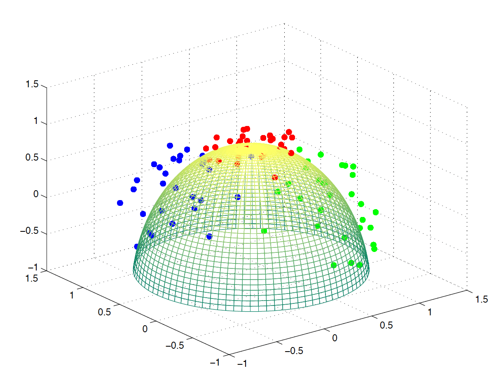
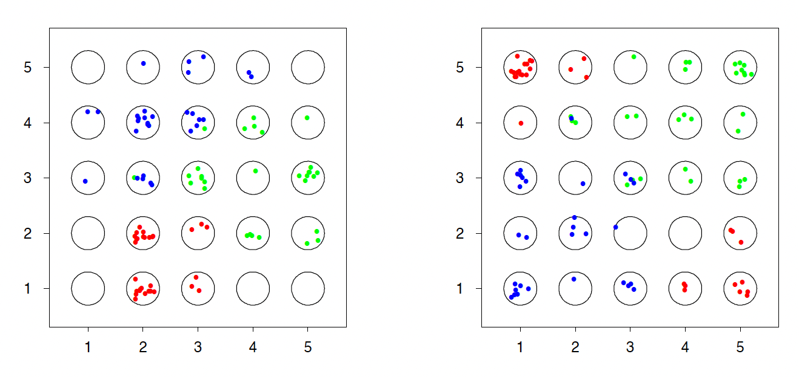
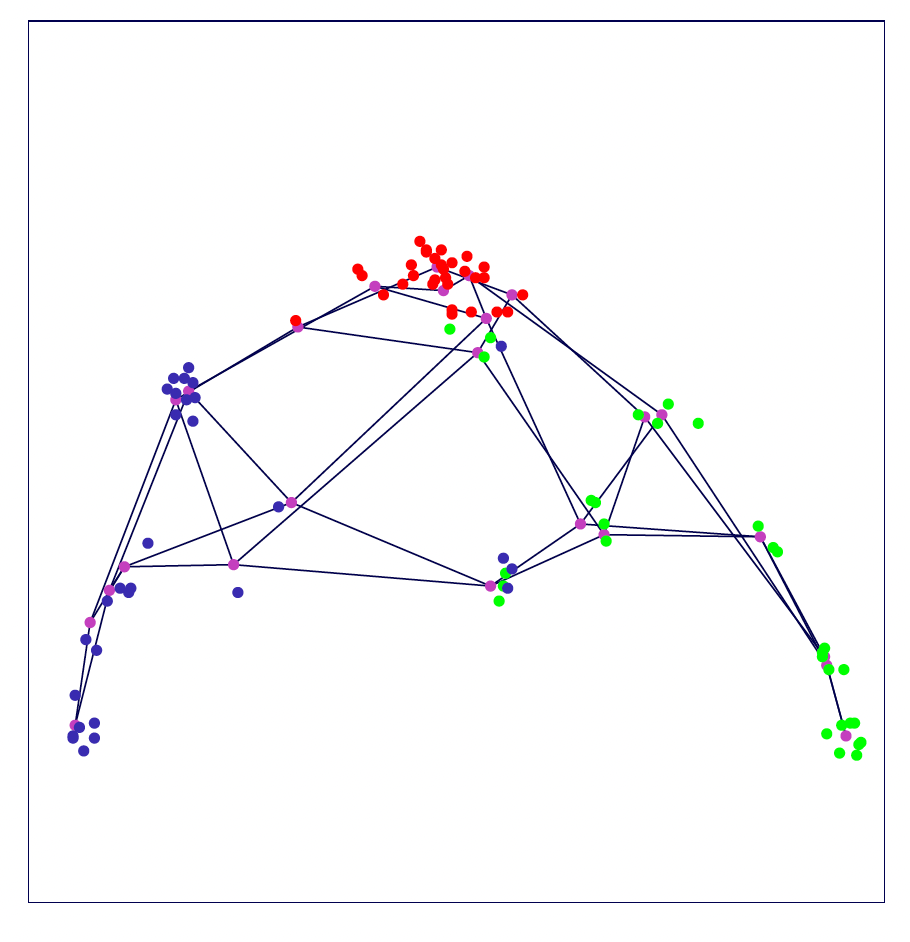

# Clustering Analysis


So far, all the methods we discussed were presented in a supervised learning framework. However, in our discussion of clustering analysis we will focus on **unsupervised learning problems**. 

In the sequel, in our framework we no longer have a response variable $Y$, but we only have access to the features $\{x_i\}_{i=1}^{n}$, and our goal is to learn patterns in $\textbf{X}$.

Some examples of unsupervised learning include estimation of the  density or the covariance or the network structure using a set of features, which can become very  challenging in high-dimensional settings. Clustering analysis is also primarily used in and unsupervised learning framework. 

<font color=darkblue>**Clustering analysis**</font>  is the identification of multiple regions of the feature space that contain modes of density, or in other words, regions of the feature space with some *common similarities*. In some cases, we are also interested in dimension reduction, in which case we want to identify low-dimensional manifolds within the feature space $\mathcal{X}$ that represents high data density. 

#### Clustering{-}

When we cluster, we group the data set into subsets so that those within each subset are more closely related (*similar*) to each other than those objects assigned to other subsets. Each subset is called a **cluster**. We have two main types of clustering: *Flat Clustering* and  *Hierarchical Clustering*. Flat Clustering divides the data into $k$ clusters, while hierarchical clustering arranges the clusters into a natural hierarchy.


Clustering results are  dependent on the **measure of similarity** (or distance) between the "points" to be clustered. A <font color=blue>distance metric</font> or a distance function is a function that defines the similarity of two elements (points, sets, etc.) Mathematically, a distance function is non-negative; it is zero when  two points are the same; it is symmetric and it satisfies the triangle inequality. The most popular examples of distances we will use are:

* The  <font color=blue>**Euclidean Distance**</font> (appropriate for continuous variables):

\[d(u,v) = ||u-v||^2 = \sqrt{\sum_{j=1}^{p} (u_j - v_j)^2}\]


* The  <font color=blue>**Hamming Distance**</font> (suited for categorical variables):

\[d(u,v) = \sum_{j=1}^{p} \mathbf{1}_{u_j \neq v_j} \] 

 
 In general, there is no universally best approach, so distance measures should be defined based on the application.


## Introduction to Clustering


Consider a set of $n$ data points. The **goal** is to form $K \ll n$ clusters, indexed by $k \in \{1, \ldots, K\}$. This implies that we need to search for a function $C: \{1, \ldots, n\} \rightarrow \{1, \ldots, K\}$} that  <font color=blue>minimizes the within cluster distance</font>, i.e.

\[W(C) = \frac{1}{2} \sum_{k=1}^{K} \sum_{C(i), C(i')=k} d(x_i, x_{i'})\]
where $C(\cdot)$  is a cluster index function that assigns the $i$th observation or cluster $C(i)$.

This is equivalent to <font color=blue>maximizing the between cluster distance</font>:
\[B(C) = \frac{1}{2} \sum_{k=1}^{K} \sum_{C(i)=k}\sum_{C(i') \neq k} d_{i i'}\]

Note that the **total distance** can be broke down into
\begin{align*}
T &= \frac{1}{2} \sum_{i=1}^{n} \sum_{i'=1}^{n} d_{ii'} \\
&= \frac{1}{2} \sum_{k=1}^{K} \sum_{C(i)=k} \Biggl\{ \sum_{C(i') = k} d_{i i'} + \sum_{C(i') \neq k} d_{i i'} \Biggr\}\\
&= W(C) + B(C)\\
\end{align*}

Since, the total distance is fixed for a given set of data, we have that

\[\text{Minimize } W(C) \, \Leftrightarrow \, \text{Maximize } B(C)\]


Given a specific distance measure $d(\cdot, \cdot)$}, several algorithms can
be used to find the clusters:

i.  Combinatorial Algorithms

ii. $k$-means Clustering

iii. Hierarchical Clustering


#### Combinatorial Algorithms {-}


For small $n$ and $K$, we could minimize  $W$ by using <font color=blue>brute-force search</font>.  However, the number of ``tries" needed to complete the search is

\[S(n,K) = \frac{1}{K!} \sum_{i=1}^{K} (-1)^{K-k} \binom{K}{n} k^n\]

It is clear that this is not feasible for large $n$ and $K$, since the number of distinct assignments can be extremely large. So, we need to develop more efficient algorithms that may not be optimal but they could be a reasonably good sub-optimal partition.


## $K$-means Clustering

 Consider an enlarged optimization problem

\[\min_{C, \{m_k\}_{k=1}^{K}} \sum_{k=1}^{K} \sum_{C(i)=k} ||x_i - m_k||^2\]

We solve this with respect to both:  *the cluster function* $C(\cdot)$ and  the *cluster centers* $m_k$, $k=1,,\ldots, K$. But, this problem is NP-hard for $\geq 2$ dimensions and a combinatorial algorithm is too expensive.

We could insted consider an algorithm that alternatively updates the two components:

* $C$  the cluster assignments

* $\{m_k\}_{k=1}^{K}$ the cluster means

So, we can achieve this by first fixing $C$, and then finding the best $\{m_k\}_{k=1}^{K}$, and 
second by fixing  $\{m_k\}_{k=1}^{K}$, and then finding the best $C$. Specifically, in
$K$-means Clustering, we need to alternate between the following two steps until convergence:

1. Fix $C$, i.e. the cluster label of each subject is known. Then, for any set
$\{i : C(i) = k\}$, we only need to find the mean
\[m_k = \arg \min_m \sum_{C(i)=k} ||x_i-m||^2\]
which boils down to simply finding the mean within cluster $k$, i.e.
\[m_k = \frac{\sum_{C(i)=k} x_i}{\sum_i \mathbf{1}_{\{C(i)=k\}}} \]


2. Fix the cluster means $\{m_k\}_{k=1}^{K}$. Then, to find the new cluster
assignments, we simply recalculate the distance from an observation to each of the cluster mean:
\[C(i) = \arg \min_{k\in \{1, \ldots, K\}} d(x_i, m_k) \]
Hence each point will be assigned to the closest cluster mean. 

The $K$-means Clustering Algorithm can be summarized as follows:
<br>

<div class=motivationbox>
**$K$-means Clustering Algorithm**

1. Randomly} split the data set into $K$ different subsets.Assign} each subset a cluster label. Then iterate between (2) and (3):

2. Given the cluster assignment $C$, calculate the cluster mean vectors $m_1, \ldots, m_k$. 

3. Given the current set of means $\{m_1, \ldots, m_k\}$, assign each observation to the closest current cluster mean. 

4. Stop the algorithm when $C$ does not change.
</div>
<br>


Below is an illustration of the way the algorithm works in a toy example

<div class=examplebox>
**Illustration of $K$-Means Clustering**

Suppose we have a set of _six_ observations. 

```{r, fig.width=3, fig.height=3, echo = FALSE, fig.align='center'}
    set.seed(3)
    x = replicate(2, rnorm(6))
    par(mar=rep(0.5, 4))
    plot(x[,1], x[, 2], xaxt = 'n', yaxt = 'n', cex = 1.5, xlim = c(-1.35, 0.45), ylim = c(-1.51, 1.61), pch = 16)
```


We first _randomly assign them into two clusters_ (initiate a random $C$ function). Based on this cluster assignment, we can calculate the corresponding cluster mean $m_k$'s:

```{r fig.width=5.5, fig.height=2.7, echo = FALSE, fig.align='center'}
    par(mfrow=c(1,2))
    par(mar=rep(0.5, 4))
    set.seed(3)
    C = sample(1:2, 6, replace = TRUE)
    plot(x[,1], x[, 2], xaxt = 'n', yaxt = 'n', cex = 1.5, xlim = c(-1.35, 0.45), ylim = c(-1.51, 1.61), pch = 16, col = c("orange", "darkblue")[C])
    
    par(mar=rep(0.5, 4))
    plot(x[,1], x[, 2], xaxt = 'n', yaxt = 'n', cex = 1.5, xlim = c(-1.35, 0.45), ylim = c(-1.51, 1.61), pch = 16, col = c("orange", "darkblue")[C])
    m1 = colMeans(x[C==1, ])
    m2 = colMeans(x[C==2, ])
    points(m1[1], m1[2], col = "orange", pch = 4, cex = 1.5, lwd = 2)
    points(m2[1], m2[2], col = "darkblue", pch = 4, cex = 1.5, lwd = 2)
```

Then we will assign each observation to the closest cluster mean. In this example, only the blue point on the top will be moved to a new cluster. Then the cluster means can then be recalculated.

```{r fig.width=5.5, fig.height=2.7, echo = FALSE, fig.align='center'}
    par(mfrow=c(1,2))
    par(mar=rep(0.5, 4))
    plot(x[,1], x[, 2], xaxt = 'n', yaxt = 'n', cex = 1.5, xlim = c(-1.35, 0.45), ylim = c(-1.51, 1.61), pch = 16, col = c("orange", "darkblue")[C])
    points(m1[1], m1[2], col = "orange", pch = 4, cex = 1.5, lwd = 2)
    points(m2[1], m2[2], col = "darkblue", pch = 4, cex = 1.5, lwd = 2)
    arrows(x[2, 1], x[2, 2], -0.9041313, 0.7644366, length = 0.15)
    
    par(mar=rep(0.5, 4))
    C[2] = 1
    plot(x[,1], x[, 2], xaxt = 'n', yaxt = 'n', cex = 1.5, xlim = c(-1.35, 0.45), ylim = c(-1.51, 1.61), pch = 16, col = c("orange", "darkblue")[C])
    m1 = colMeans(x[C==1, ])
    m2 = colMeans(x[C==2, ])
    points(m1[1], m1[2], col = "orange", pch = 4, cex = 1.5, lwd = 2)
    points(m2[1], m2[2], col = "darkblue", pch = 4, cex = 1.5, lwd = 2)
```


When there is nothing to move anymore, the algorithm stops. Keep in mind that we started with a random cluster assignment, and this objective function is not convex which implies that  we may obtain different results if we start with different values. The solution is to try different starting points and use the best final results. This can be tuned using the `nstart` parameter in the `kmeans()` function.

```{r}    
    # some random data
    set.seed(1)
    mat = matrix(rnorm(1000), 50, 20)
    
    # if we use only one starting point
    kmeans(mat, centers = 3, nstart = 1)$tot.withinss
    
    # if we use multiple starting point and pick the best one
    kmeans(mat, centers = 3, nstart = 100)$tot.withinss
```    

</div>


Note that theclusters are typically **initialized randomly**.  However, this algorithm does not guarantee to global minimum, although it  still leads to a local minimizer.


An alternative approach is the  $K$-\textbf{medoids}} method. We need to replace the **second step** by searching for *the one* observation that minimizes the distance to all others in the cluster, i.e. 
\[i^*_k = \arg \min_{i:C(i)=k} \sum_{C(i')=k} D(x_i, x_i')\]
Then, we use $x_{i^*_k}$ and $k$ as the ``\textit{center}'' of cluster $k$.


<br>

### Categorical Variables in Clustering

By design, the $k$-means method cannot handle categorical variables as is unless we change them  to numerical, e.g., using one-hot encoding, or ordinal encoding. Alternatively, we may also use distance metrics that are specifically designed for categorical data, e.g., Hamming distance, or the Jaccard distance.

We can also choose clustering algorithms that support categorical variables, such as $K$-Modes or $K$-prototypes.


<br>


### Tuning $K$-Means: How to Choose  $K$

When using $K$-Means, we need to identify an appropriate value for the number of clusters, $k$. Some of the available methods, include:

* Gap Statistics

* Silhouette Statistics 

* Prediction Strength


When  identifying the appropriate number of clusters, we need to consider a *measure of* *compactness*/*tightness* of clusters. A measure that quantifies the **compactness** or **tightness** of clusters can be computed based on

\[SS(K) = \sum_{k=1}^{K} \sum_{C(i)=k} ||x_i - m_k||^2 \] 

A smaller SS indicates tighter clusters. As the number of clusters ($K$) increases, the SS inherently decreases for the same data set which means that relying only on SS can be misleading when selecting the optimal $K$.


#### Gap Statistic {-}


The <font color=blue>**gap statistic**</font> (Tibshirani, Walther and Hastie, 2001) compares the clustering of actual data against a _random clustering from a reference distribution_.

\begin{align*}
G(K) &= E_0\Bigl( \log SS^*(K) \Bigr) - \log SS_{obs}(K)\\
&\approx \frac{1}{B} \sum_{b=1}^{B} \log SS_b^*(K) - \log SS_{obs}(K)
\end{align*}

This reference set is derived from a distribution that has _no intrinsic clustering_, meaning an ideal number of clusters would be one. As $K$ grows, even though the SS shrinks, the difference (or gap) may not always decrease.  A high gap statistic suggests that the SS for the observed data at a particular $K$ is notably smaller than its reference counterpart, indicating good clustering.

There are two proposed methods for generating data from the reference distribution:

* **Uniform Sampling:** The reference data is uniformly sampled over the range of the observed data. This method may not be effective if the observed data has distinct shapes.

* **Principal Component Based Sampling**: This method samples over the range of the principal components of the observed data, ensuring better alignment with the data structure.


So, to determine the **optimal $K$** with the **gap statistic**, we plot the gap statistic values for different values of $K$. The optimal EKE is determined either by identifying the highest gap statistic or, in a sequential approach, by selecting the first $K$ where its gap statistic exceeds that of $K+1$.

Since the gap statistic is based on random sampling, there is inherent variability:
 One-standard-error principle is used to account for this uncertainty. We compare the gap statistic at $K$ to the lower bound of the gap statistic for $K+1$ (subtracting one standard error). If the former is greater, we consider that $K$ as optimal:
\[K_{opt} = \arg\min_K \{K: G(K) \geq G(K+1) - s_{K+1}\}\]
where
\[s_{K} = sd_0 \log SS(K) \sqrt{1+1/B}\]


<br>

#### Silhouette Statistic {-}

The <font color=blue>**silhouette statistic**</font> of the $i$th observation measures how well this observation fits in its own cluster versus how well it fits in its next closest cluster. Adapted to $K$-means, this is given by:

\[a(i) = ||x_i - m_k||^2,\,\,\,\,\,\,\, b(i) = ||x_i - m_{\ell}||^2\]
where $i\in C_k$ and $C_{\ell}$ is the next-closest cluster to $x_i$. Then, its silhouette is
\[s(i) = \frac{b(i) - a(i)}{\max \{a(i),\, b(i)\} }\]

For well-clustered observations where $a_i$ is significantly smaller than $b_i$,  $s_i$ approaches 1. If the $i$th observation lies on the borderline of two clusters, both $a_i$ and $b_i$ will be similar, rendering $s_i$ close to 0.

In the $K$-means scenario, $b_i$ should be greater than $a_i$; otherwise, the observation would belong to a different cluster. However, using other clustering algorithms, could be smaller than $a_i$, potentially resulting in a negative silhouette statistic. Even then, the value of $s_i$ would remain above $-1$. Extremely negative silhouette statistics indicate poor clustering for the $i$-th observation.


#### Silhouette Coefficient {-}


The  <font color=blue>**Silhouette Coefficient (SC)**</font>, also referred to as the Silhouette Width, is defined as the average silhouette statistic over all samples.

A Rule of Thumb taken from  Anja et al. "_Clustering in an Object-Oriented Environment_" 

* SC $>$ 70\%: A strong structure has been found.
* SC $>$ 50\%: A reasonable structure has been found.
* SC $>$ 26\% : The structure is weak and could be artificial, try additional methods.
* SC $<$ 26\%: No substantial structure has been found.

We can also plot the silhouette coefficient against varying $K$ values. The optimal $K$ can either be the one yielding the largest silhouette coefficient or a $K$ surpassing a specific threshold.


#### Prediction Strength {-}

The  <font color=blue>**Prediction Strength**</font> method is another strategy for choosing the optimal number of clusters $K$. We start by splitting the data set into two subsets: $A$ (training set) and $B$ (test set).

1. Assume there are $m$ observations in test set $B$. Cluster these $m$ samples into $K$ clusters using your chosen clustering algorithm. Label these clusters as $C_1, \ldots, C_K$. Each cluster contains $m_j$ observations. The sum of the sizes of these clusters $m_1, \ldots, m_K$ is equal to $m$. This step determines the true clustering structure for the test data.

2. Then, cluster the training data $A$ into $K$ clusters. Use the resulting clustering rule to allocate the $m$ observations from test set $B$ into these $K$ clusters. This essentially means predicting the cluster membership for the test set based on the cluster centers determined from the training data. Denote these predicted clusters as $C'_1, \ldots, C'_K$.


For each cluster  obtained in _Step 2_, examine every pair of observations within that cluster. Check if those pairs remain in the same cluster in _Step 3_.Calculate the average accuracy for each cluster, indicating how often pairs of observations remain together.


The "prediction strength" (Tibshirani and Walther 2005) for $K$ clusters is the worst (smallest) accuracy among these clusters. Choosing the worst accuracy avoids potential biases. If one were to take the average accuracy, the method might be skewed by predominantly classifying many observations into one cluster, artificially inflating the average.


## Hierarchical Clustering


Choosing the number of clusters $K$ may be difficult. In a <font color="blue">**Hierarchical Representation**</font>  each cluster contains a single observation at the lowest level, and  there is only one cluster containing all observations at the highest level. We then use a dendrogram to display the clustering result.

<div class=examplebox>
**Hierarchical Clustering Example**

Suppose we have a set of six observations: 

```{r, fig.width=3, fig.height=3, echo = FALSE}
    set.seed(3)
    x = replicate(2, rnorm(6))
    par(mar=rep(0.5, 4))
    plot(x[,1], x[, 2], xaxt = 'n', yaxt = 'n', cex = 2.5, xlim = c(-1.35, 0.45), ylim = c(-1.51, 1.61))
    text(x[,1], x[, 2], c(1:6))
```

The goal is to progressively group them together until there is only one group. 

```{r, fig.width=10, fig.height=2.7, echo = FALSE}
    library(plotrix)

    par(mfrow=c(1,4))
    par(mar=rep(0.3, 4))
    plot(x[,1], x[, 2], xaxt = 'n', yaxt = 'n', cex = 2.5, xlim = c(-1.35, 0.45), ylim = c(-1.51, 1.61))
    text(x[,1], x[, 2], c(1:6), lwd =2)
    draw.ellipse(0.1444561, -1.1750380, a = 0.2, b = 0.25, angle = 60, border = "darkorange", lwd = 2)
    
    par(mar=rep(0.3, 4))
    plot(x[,1], x[, 2], xaxt = 'n', yaxt = 'n', cex = 2.5, xlim = c(-1.35, 0.45), ylim = c(-1.51, 1.61))
    text(x[,1], x[, 2], c(1:6), lwd =2)
    draw.ellipse(0.1444561, -1.1750380, a = 0.2, b = 0.25, angle = 60, border = "darkorange", lwd = 2)
    draw.circle(0.161565, -1.031619, 0.3, border = "darkorange", lwd = 2)
    
    par(mar=rep(0.3, 4))
    plot(x[,1], x[, 2], xaxt = 'n', yaxt = 'n', cex = 2.5, xlim = c(-1.35, 0.45), ylim = c(-1.51, 1.61))
    text(x[,1], x[, 2], c(1:6), lwd =2)
    draw.ellipse(0.1444561, -1.1750380, a = 0.2, b = 0.25, angle = 60, border = "darkorange", lwd = 2)
    draw.circle(0.161565, -1.031619, 0.3, border = "darkorange", lwd = 2)    
    draw.ellipse(-0.7223288, 1.1919895, a = 0.5, b = 0.25, angle = 170, border = "darkorange", lwd = 2)

    par(mar=rep(0.3, 4))
    plot(x[,1], x[, 2], xaxt = 'n', yaxt = 'n', cex = 2.5, xlim = c(-1.35, 0.45), ylim = c(-1.51, 1.61))
    text(x[,1], x[, 2], c(1:6), lwd =2)
    draw.ellipse(0.1444561, -1.1750380, a = 0.2, b = 0.25, angle = 60, border = "darkorange", lwd = 2)
    draw.circle(0.161565, -1.031619, 0.3, border = "darkorange", lwd = 2)   
    draw.ellipse(-0.7223288, 1.1919895, a = 0.5, b = 0.25, angle = 170, border = "darkorange", lwd = 2)    
    draw.circle(-0.74, 0.8331322, 0.57, border = "darkorange", lwd = 2)
```

During this entire process, only the pair-wise distances are used to determine which observations are grouped. Hence, the `R` function `hclust()` will take a distance matrix and perform the clustering. A distance matrix is an $n \times n$ matrix. As a default, we can use the Euclidean distance. 

```{r}
    # the Euclidean distance can be computed using dist()
    as.matrix(dist(x))
```


We then use this distance matrix in the hierarchical clustering algorithm. 
```{r fig.width=4, fig.height=4}
    # the Euclidean distance can be computed using dist()
    as.matrix(dist(x))

    # pass the distance matrix to hclust()
    # we use a complete link function
    hcfit <- hclust(dist(x), method = "complete")
    par(mar=c(2, 2, 2, 1))
    plot(hcfit)
```

Hence, the merging process is exactly the same as we demonstrated previous. The height of each split represents how separated the two subsets are. Selecting the number of clusters is still a tricky problem. Usually, we pick a cutoff where the height of the next split is short. Hence, the above example fits well with two clusters.  

</div>

An <font color=blue>**agglomerative algorithm**</font> is a bottom-up approach:


1. Begin with every observation representing a singleton cluster.

2. At each step, merge two closest clusters into one cluster and
reduce the number of clusters by one.

3.  Stop when all observations are in the same cluster.


To choose which two clusters to merge, we need _(i)_ a distance measure between any two observations $d(x_i, x_j)$, and _(ii)_ a distance measure between any two sets of observations $d(G, H)$. 

A <font color=blue>Distance $d(G, H)$ between two clusters $G$ and $H$</font> defined as:

* **Complete Linkage**: the furthest pair
\[d(G, H) = \max_{i\in G,\, i'\in H} d_{ii'}\]


* **Single Linkage**: the closest pair
\[d(G, H) = \min_{i\in G,\, i'\in H} d_{ii'}\]


* **Average Linkage**: average dissimilarity
\[d(G, H) = \frac{1}{n_G n_H} \sum_{i\in G} \sum_{i'\in H} d_{ii'}\]


Different choices may results in different hierarchical structures.


To perform a hierarchical clustering, a matrix of all the pair-wise distances is sufficient, and we do not need to know the values of the original observations. This is an $n \times n$ matrix: the $(i, i')$s element represents the distance between $x_i$ and $x_i'$. This matrix is also called a **dissimilarity matrix**. This is a symmetric matrix with diagonal elements that are zero.


## Self-Organizing Maps


Self-organizing Map (SOM) is another popular clustering method. The main difference between SOM and $K$-means is that the cluster means of a SOM have a geometric relationship preserving the geometry of the underlying data. An SOM starts with **Input Data**: $\{x_i\}_{i=1}^{n}$. We then randomly initialize the **Cluster Means**, i.e. creating a grid of centers: $w_{ij}, i=1, \ldots, p,\; j=1,\ldots, q$. These are similar to the centers in a $k$-means algorithm, but they also preserve some geometric relationship. Then, we pick a **Learning Rate**: $\alpha \in[0,1]$. This controls how fast the $w_{ij}$'s are updated, and it will decrease progressively. We also need to choose the **Radius**: $r$. This controls how many $w_{ij}$'s will be updated at each
iteration, and it will also decrease progressively.


<div class=motivationbox>
**SOM Algorithm**

For $k = 1, \ldots, n$, we will steam-in one new observation $x_k$ and perform the following update:

1. For all $w_{ij}$, calculate the distance between each $w_{ij}$ and $x_k$. \\
Let 
$d_{ij} =||x_k - w_{ij}||$ (use Euclidean distance).

2.  Select the closest $w_{ij}$, denoted as $w_{*}$.

 Update each $w_{ij}$ based on the formula
\[w_{ij} = w_{ij} + \alpha h(w_{*}, w_{ij}, r) ||x_k - w_{ij}||\]

 3. Decrease the value of $\alpha$ and $r$.

</div>


```{r ,echo=FALSE, message=FALSE, warning=FALSE, fig.align="center", out.width="75%", fig.cap="Self-Organizing Map (Ref. ESL textbook)"}

```


```{r ,echo=FALSE, message=FALSE, warning=FALSE, fig.align="center", out.width="85%", fig.cap="Self-Organizing Map (Ref. ESL textbook)"}

```


```{r ,echo=FALSE, message=FALSE, warning=FALSE, fig.align="center", out.width="70%", fig.cap="Self-Organizing Map (Ref. ESL textbook)"}

```


## Spectral Clustering


In some applications, we do not have the value of each data point, instead, we have the similarities between data points. Note that for similarity measures, larger means more similar, while for distance measures, larger is further away. A  way to represent the data is the <font color=darkblue>**Similarity Graph** $G = (V,E)$</font>  (an undirected graph) in which  $V$ is a set of vertices $\{x_1, x_2, \ldots, x_n \}$, and  $E$ is the set of edges $\{(i,j)\}_{ij}$.


 For our case, this graph is weighted by an <font color=darkblue>**adjacency matrix**</font>
\[\mathbf{W}_{n \times n} = \{w_{ij}\}_{ij}\]

We can define $\mathbf{W}$ in many different ways.  Each $w_{ij}$ is the *similarity* between vertices $i$ and $j$ which means that $\mathbf{W}$ is symmetric $w_{ij} = w_{ji}$. 

 We also define the <font color=darkblue>**degree matrix** $D$ </font> as a _diagonal_ matrix
\[diag(d_1, \ldots, d_n)\]
where $d_i$ is the degree of vertex $i$:
\[d_i = \sum_{j=1}^{n} w_{ij}\]


####  Graph Laplacian {-}

There are many different ways to define a graph Laplacian matrix:

* Unnormalized graph Laplacian:
\[\mathbf{L} = \mathbf{D} - \mathbf{W}\]

* Normalized graph Laplacians:

\begin{align*}
\mathbf{L}_{sym} &= \mathbf{D}^{-1/2} \mathbf{L} \mathbf{D} ^{-1/2} = \mathbf{I} - \mathbf{D}^{-1/2} \mathbf{W} \mathbf{D}^{-1/2}\\
\mathbf{L}_{rw} &= \mathbf{D}^{-1} \mathbf{L} = \mathbf{I} - \mathbf{D}^{-1}\mathbf{W}\\
\end{align*}

Each of them have some unique properties:<br>
For the unnormalized graph Laplacian, we have, for any $f$
\begin{align*}
f'\mathbf{L} f &= f'\mathbf{D} f - f'\mathbf{W} f = \sum_{i=1}^{n} d_i f_i^2 - \sum_{ij} f_i f_j w_{ij}\\
&= \frac{1}{2} \Biggl\{ \sum_{i} d_i f_i^2 - 2\sum_{i,j} f_i f_j w_{ij} + \sum_j d_j f_j^2 \Biggr\}\\
&= \frac{1}{2} \sum_{i,j} w_{ij} (f_i - f_j)^2
\end{align*}

$L$ here is positive semi-definite. The smallest eigen-value is 0, with eigen-vector 1. The number of 0 eigen-values depends on the number of connected components.


For the normalized graph Laplacian, we have
\[f' \mathbf{L}_{sym} f = \frac{1}{2} \sum_{i,j} w_{ij} \Bigl( \frac{f_i}{\sqrt{d_i}} - \frac{f_j}{\sqrt{d_i}} \Bigr)^2\]
 The eigenvalue $\lambda$ and eigenvector $\mathbf{v}$ of $\mathbf{L}_{rw}$ can be solved from
\[\mathbf{L}\mathbf{v} = \lambda \mathbf{D}\mathbf{v}\]
 The smallest eigenvalue of both $\mathbf{L}_{sym}$ and $\mathbf{L}_{rw}$ are 0, with eigenvectors $\mathbf{1}$ and $\mathbf{D}^{1/2}\mathbf{1}$ respectively.


The spectral clustering is very simple:

<div class=motivationbox>
**Clustering Algorithm**

1. Construct a weighted adjacency matrix $\mathbf{W}$, using e.g.,
\[w_{ij} = \exp \Biggl( -\frac{1}{2\sigma^2} ||x_i - x_j||^2\Biggr)\]


2. Compute the Laplacian $\mathbf{L}$ (or normalized versions $\mathbf{L}_{sym}$ and $\mathbf{L}_{rw}$ ) 

3. Compute the smallest k eigenvectors, denote  as $\mathbf{V}_{n \times k}$ 

4. Treat $\mathbf{V}_{n \times k}$ as the matrix of the observed data, and perform $k$-means clustering.

5. Output the $k$ cluster labels
</div>


Below is an example from Von Luxburg, Ulrike. "A tutorial on spectral clustering." Statistics and computing 17, no. 4 (2007): 395-416.


<div class=examplebox>
**Spectral Clustering Example**


Spectral clustering essentially consists of two steps. First, we construct the graph Laplacian $\mathbf{L}$ (or normalized version), then we perform eigen-decomposition of the matrix. Lets show an example, replicated from Von Luxburg (2007).

```{r}
  set.seed(1)
  n = 50
  x = c(rnorm(n, 0, 0.2), rnorm(n, 2, 0.2), rnorm(n, 4, 0.2), rnorm(n, 6, 0.2))
  hist(x, breaks = 100)
```

We use the adjacency matrix defined as $$w_{ij} = \exp\bigg\{\frac{- \lVert x_i - x_j\rVert^2 }{2 \sigma^2 } \bigg\},$$ and calculate the Laplacian $$\mathbf{L} = \mathbf{D} - \mathbf{W}.$$ We can then use the eigen decomposition to recover the underlying features. 

```{r fig.width=6, fig.height=6, out.width = '35%'}
  # construct the adjacency matrix
  W = as.matrix(exp(-dist(as.matrix(x))^2) / 4)
  heatmap(W, Rowv = NA, Colv=NA, symm = TRUE, revC = TRUE)
  
  # compute the degree of each vertex
  d = colSums(W)
  
  # the laplacian matrix
  L = diag(d) - W
  
  # eigen decomposition
  f = eigen(L, symmetric = TRUE)
  
  # plot the eigen values 
  # we need the smallest ones
  plot(rev(f$values)[1:20], pch = 19, ylab = "eigen-values", col = c(rep("red", 4), rep("blue", 196)))
  
```
  
```{r fig.width=14, fig.height=4, out.width = '95%'}
  # plot the last four eigen vectors
  par(mfrow=c(1,4))
  plot(f$vectors[, 200], type = "l", ylab = "eigen-values", ylim = c(-0.15, 0.15))
  plot(f$vectors[, 199], type = "l", ylab = "eigen-values", ylim = c(-0.15, 0.15))
  plot(f$vectors[, 198], type = "l", ylab = "eigen-values", ylim = c(-0.15, 0.15))
  plot(f$vectors[, 197], type = "l", ylab = "eigen-values", ylim = c(-0.15, 0.15))
```

On the other hand, if we use an adjacency matrix that contains several non-connected blocks, then we would observe four zero eigen values. For example, using the KNN adjacency index, we may obtain four seperated blocks. 

```{r fig.width=6, fig.height=6, out.width = '35%'}
  library(FNN)
  nn = get.knn(x, k=10)
  W = matrix(0, 200, 200)
  for (i in 1:200)
    W[i, nn$nn.index[i, ]] = 1
  
  # W is not necessary symmetric
  W = pmax(W, t(W))
  
  heatmap(W, Rowv = NA, Colv=NA, symm = TRUE, revC = TRUE)
```

We use a normalized graph Laplacian, defined as $$\mathbf{L}_\text{sym} = \mathbf{I} - \mathbf{D^{-1/2} \mathbf{W} D^{-1/2}}$$
```{r fig.width=6, fig.height=6, out.width = '35%'}
  # compute the degree of each vertex
  d = colSums(W)
  
  # the laplacian matrix
  L = diag(200) - diag(1/sqrt(d)) %*% W %*% diag(1/sqrt(d))
  
  # eigen decomposition
  f = eigen(L, symmetric = TRUE)
  
  # plot the eigen values 
  # we need the smallest ones
  plot(rev(f$values)[1:20], pch = 19, ylab = "eigen-values", col = c(rep("red", 4), rep("blue", 196)))
```

```{r fig.width=14, fig.height=4, out.width = '95%'}
  # plot the last four eigen vectors
  par(mfrow=c(1,4))
  plot(f$vectors[, 200], type = "l", ylab = "eigen-values", ylim = c(-0.15, 0.15))
  plot(f$vectors[, 199], type = "l", ylab = "eigen-values", ylim = c(-0.15, 0.15))
  plot(f$vectors[, 198], type = "l", ylab = "eigen-values", ylim = c(-0.15, 0.15))
  plot(f$vectors[, 197], type = "l", ylab = "eigen-values", ylim = c(-0.15, 0.15))
```

We can then perform k-means clustering using the top eigen vectors as the features.

```{r fig.width=12, fig.height=4, out.width = '95%'}
  cl = kmeans(f$vectors[, 197:200], centers = 4, nstart = 100)
  plot(x, cl$cluster, ylab = "Cluster", col = cl$cluster, pch = 3)
```

</div>
