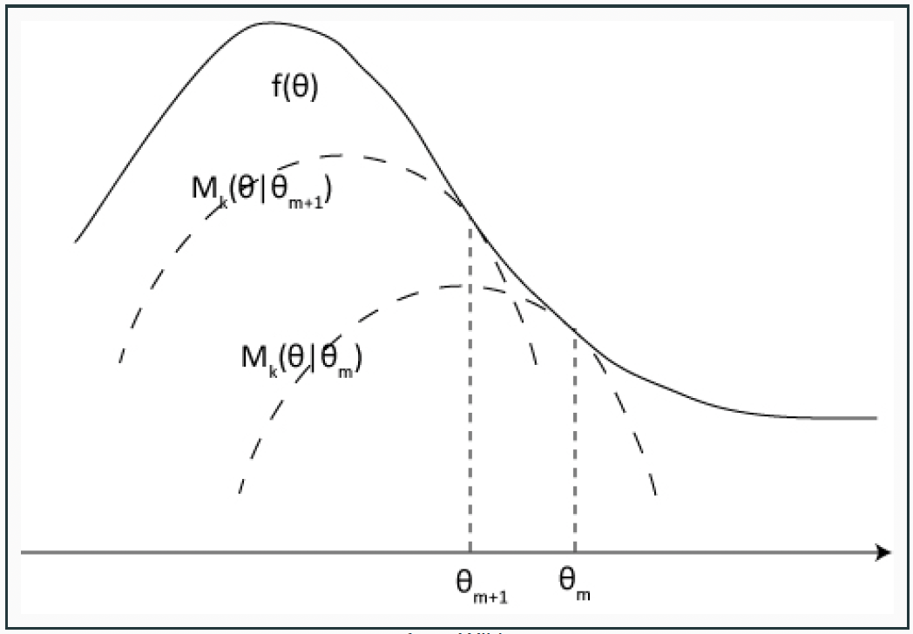
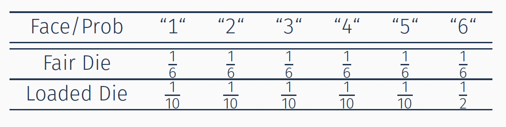
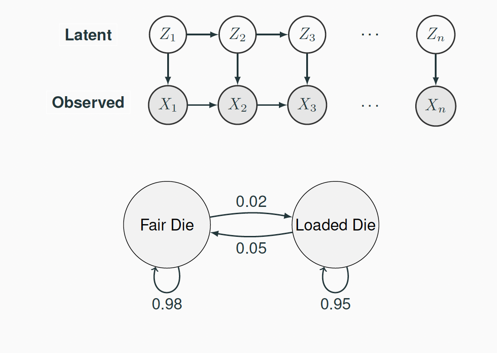

# Model-Based Clustering: Latent Structure Models

This chapter is **model-based clustering**. Last week we partitioned $\mathbf{X}$ with a distance and a criterion such as $W(C)$. Here we treat the cluster labels as missing data, put a probability model on $\mathbf{X}$, and estimate that model. The main example is a Gaussian mixture; a hidden Markov model is the same idea when the labels form a Markov chain in time.

Model-based clustering works by fitting a mixture model to the data, with each cluster represented by one component of that mixture.

In this framework, clustering becomes equivalent to estimating a mixture model that captures the underlying distribution of the variable $X$. Choosing the correct number of clusters, $K$, can be guided by model selection criteria such as AIC or BIC.

A major difficulty in model-based clustering—and in mixture modeling more broadly—is estimating the model parameters. The EM (Expectation–Maximization) algorithm is the standard tool used to obtain maximum likelihood estimates of these parameters.

Although our focus here is on clustering, mixture models belong to the wider family of hierarchical models, and their applications reach well beyond clustering alone.


## Gaussian Mixtures


Consider two *populations* with means $\mu_1$ and $\mu_2$ and the same variance, say $\sigma^2=1$, and let $X$ be the **observed outcome** (from one of the two populations), and $ Z \in \{0, 1\}$ be a  **hidden variable** (not observable) that indicates the <font color=blue>population label</font>, with $P(Z=1)=\pi$.

Using only the observed data, $\{x_i\}_{i=1}^{n}$, we want to estimate the two population means and the mixing probability $\theta=(\mu_1, \mu_2, \pi)$.  The density of $X$ is a _mixture of two Gaussian_ random variables, i.e.

\[p_X(x) = (1-\pi) \;\phi_{\mu_1}(x) + \pi \; \phi_{\mu_2}(x)\]
where $\phi_{\mu}$ is the density function of $\mathcal{N}(\mu,1)$.

The log-likelihood function based on $n$ observed training data computes as
\[\ell(\mathbf{x}|\theta) = \sum_{i=1}^{n} \log \Bigl( (1-\pi)\phi_{\mu_1}(x_i) + \pi \phi_{\mu_2}(x_i)\Bigr)\]

We can solve this by _gradient descent_, but it is often slow. Instead, we can treat the  labels from which distribution each sample comes from (call them $Z$) as **missing** and then we can use the EM algorithm.


## EM Algorithm


Instead of directly optimizing the log-likelihood $\ell(\mathbf{x}|\theta)$, we introduce the **latent variable** $Z$, and write the joint _log-likelihood_ as

\begin{align*}
\ell(\mathbf{x}, \mathbf{z}|\theta) &= \sum_{i=1}^{n}  \Bigl( (1-z_i)\log \phi_{\mu_1}(x_i) + z_i \log \phi_{\mu_2}(x_i)\Bigr)\\
& \quad + \sum_{i=1}^{n} \Bigl( (1-z_i) \log(1-\pi) + z_i \log \pi\Bigr)
\end{align*}


<font color=blue>EM algorithm</font>: We optimize this likelihood function by iteratively updating the unknowns:  $\mathbf{z}$ and $\theta$.

* <font color=darkblue>*E-step (Expectation)*</font>: we treat both $\mathbf{x}$ and $(\mu_1, \mu_2, \pi)$ as known, and calculate the conditional probability of each $z_i$.

* <font color=darkblue>*M-step (Maximization)*</font>: we treat $\mathbf{x}$ and $\mathbf{z}$ as known, and solve the parameters by maximizing the likelihood.


#### EM Algorithm: E-Step {-}


If both $\mathbf{x}$ and $\theta=(\mu_1, \mu_2, \pi)$ are known, then the conditional probability of each $z_i$ can be calculated as:
\begin{align*}
P\left( Z_i=1|\theta^{(k)}, \mathbf{x} \right) &= \frac{P \Bigl(Z_i=1, x_i|\theta^{(k)} \Bigr) }{p\Bigl(x_i|\theta^{(k)}\Bigr)}\\
&= \frac{\pi^{(k)}\,\phi_{\mu_2^{(k)}}(x_i)}{(1-\pi^{(k)})\,\phi_{\mu_1^{(k)}}(x_i) + \pi^{(k)}\,\phi_{\mu_2^{(k)}}(x_i)}
\end{align*}

This is simple since we just need to calculate the density functions of each $x_i$ under the current parameter $\theta^{(k)}$ for each possible label ($z_i=0$ or $1$).

#### EM Algorithm: M-Step {-}

We already have $P\Bigl(\mathbf{Z} = \mathbf{z}|\mathbf{x}, \theta^{(k)}\Bigr)$, we can replace all the $z_i$ values (since they are unknown anyways) in the likelihood function $\ell(\mathbf{x}, \mathbf{z}|\theta)$ by their expectations (from the E-step):
\[\hat{p}_i = P\left(Z_i=1|\mathbf{x}, \theta^{(k)}\right)\]


After this, what remains in the likelihood only involves $\mathbf{x}$ and $\theta$, so we can solve (the M-step) for the MLE of $\theta$ based on this new likelihood function.

It turns out that these estimators are just *weighted means*:

\[\hat{\mu}_1 = \frac{\sum_{i=1}^{n}(1-\hat{p}_i)x_i}{\sum_{i=1}^{n}(1-\hat{p}_i)},\quad
\hat{\mu}_2 = \frac{\sum_{i=1}^{n}\hat{p}_i x_i}{\sum_{i=1}^{n} \hat{p}_i},\quad
\hat{\pi} = \frac{1}{n}\sum_{i=1}^{n} \hat{p}_i \]

We will then <font color=blue>_iterate the E- and M- steps until convergence_</font>.


###  Connection with $k$-Means {-}


Suppose in the E-step, we do not use the "_soft_" label (the probability), instead, we use a "_hard_" label:
\[\mathbf{1}_{\bigl\{P\bigl(Z_i = 1|\mathbf{x}, \theta^{(k)}\bigr) > 0.5\bigr\}}\]

This is essentially comparing the two densities and seeing which one is larger. Notice that, with equal variance, the log density of a Gaussian differs from a constant only by the squared Euclidean norm, so we are just choosing the "closer" cluster mean (of the previous iteration). The M-step is just re-calculating the cluster means based on the new assignments. In that sense, $K$-means is a hard-assignment, equal-covariance version of EM for a Gaussian mixture. If the component variances are allowed to differ, the hard assignment is no longer "nearest mean."

The same EM argument extends immediately to $K$ components in $p$ dimensions,
\[p(x) = \sum_{k=1}^{K} \pi_k\,\phi(x;\,\mu_k, \Sigma_k),\]
with $\sum_k \pi_k = 1$. The E-step produces responsibilities $\hat{p}_{ik} = P(Z_i=k|x_i,\theta^{(k)})$, and the M-step updates each $\pi_k$, $\mu_k$, and $\Sigma_k$ as weighted means and weighted covariances. Constraining $\Sigma_k = \sigma^2 I$ recovers spherical clusters; allowing a common $\Sigma$ or free $\Sigma_k$ lets clusters be elliptical. The observed-data likelihood is then available, so the number of components can be chosen by AIC or BIC, which is the model-based counterpart of the gap and silhouette statistics from the previous chapter. In practice one often initializes EM from a $K$-means run.


### Responsibilities, labels, and choosing $K$ {-}

The numbers $\hat{p}_{ik}$ are the reason to prefer a mixture model over $K$-means when the model is plausible. They are soft cluster memberships: $\hat{p}_{ik}$ is the estimated probability that observation $i$ belongs to component $k$, given the current fit. One can report a hard label $\arg\max_k \hat{p}_{ik}$, but one can also keep the vector $(\hat{p}_{i1},\ldots,\hat{p}_{iK})$ as a measure of uncertainty. Points with two comparable $\hat{p}_{ik}$ sit on the boundary between clusters; $K$-means has no analogue of that statement.

Two caveats come with the likelihood. First, $\ell(\theta|\mathbf{x})$ is unchanged if we permute the component labels, so the maximizer is not unique; this is **label switching**. Second, the observed-data likelihood is not concave, so EM converges to a local maximum. Different $K$-means starts (or several random starts) can yield different fits; one keeps the run with the largest $\ell(\theta|\mathbf{x})$.

Once a fit is in hand, the same observed-data log-likelihood is what we use to choose $K$. With $\ell_K$ the maximized log-likelihood of a $K$-component mixture and $d_K$ the number of free parameters,
\begin{align*}
\mathrm{AIC}(K) &= -2\ell_K + 2d_K,\\
\mathrm{BIC}(K) &= -2\ell_K + d_K\log n.
\end{align*}
For a $p$-dimensional Gaussian mixture with free mixing weights, means, and covariances,
\[d_K = (K-1) + Kp + K\cdot\frac{p(p+1)}{2}.\]
Constraints on $\Sigma_k$ (spherical, diagonal, or shared across $k$) reduce $d_K$. We select the $K$ that minimizes AIC or BIC. BIC penalizes complexity more heavily and is the more common default for mixtures. This is a different answer to "how many clusters?" than gap or silhouette: here $K$ indexes a list of probability models, and we score those models on the observed data.


## EM Algorithm: General Framework


Suppose that we want to maximize the log-likelihood $\log p(\mathbf{x}|\theta)$. Under some scenarios, this likelihood can be difficult to derive. For example, $X$ are generated from a mixture of several models, however, we do not know which is the underlying true model for each observation. Or, $X$ contains missing values, where we have $\mathbf{X} = (\mathbf{X}_{obs}, \mathbf{X}_{mis})$. In such cases, it would be easier if we introduced a latent variable $Z$, such that the joint likelihood of $p(\mathbf{x}, \mathbf{z}| \theta)$ is much easier to derive.


 For example, if $Z$ represents the hidden label, then
\[p(\mathbf{x}, \mathbf{z}|\theta) = p(\mathbf{z}|\theta) \, p(\mathbf{x}|\mathbf{z}, \theta)\]
where both probabilities are easier to write out given the underlying model. In general, for a discrete case of $Z$, we need to maximize the log-likelihood
\[\log p(\mathbf{x}|\theta) = \log \sum_z p(\mathbf{x}, \mathbf{z}|\theta)\]
 For a continuous case, we maximize the log-likelihood
\[\log p(\mathbf{x}|\theta) = \log \int_z p(\mathbf{x}, \mathbf{z}|\theta) d\mathbf{z}\]

This can still be difficult to solve since there is a summation in the $\log$ function. The **Expectation - Maximization (EM) algorithm** is designed to solve this problem (Dempster, Laird, and Rubin, 1977).


<div class=motivationbox>
**General EM Algorithm**

1. <font color=darkblue>**E-Step**</font>: Under the current value of $\theta$, denoted as $\theta^{(k)}$, find $p(\mathbf{z}|\mathbf{x}, \theta^{(k)})$, the distribution of the unobserved variables given the
data and  $\theta^{(k)}$. Then calculate the conditional expectation:
\begin{align*}
g(\theta) &= \mathbf{E}_{\mathbf{Z}|\mathbf{x},  \theta^{(k)}} \log p(\mathbf{x}, \mathbf{Z} |\theta)\\
&= \begin{cases}
& \sum_{\mathbf{z}} P(\mathbf{Z} = \mathbf{z}| \mathbf{x}, \theta^{(k)}) \log p(\mathbf{x}, \mathbf{z}|\theta)\\
& \int_{\mathbf{z}} P(\mathbf{Z} = \mathbf{z}| \mathbf{x}, \theta^{(k)}) \log p(\mathbf{x}, \mathbf{z}|\theta) dz\\
\end{cases}
\end{align*}

2. <font color=darkblue>**M-Step**</font>: Re-estimate the parameter $\theta$ to maximize $g(\theta)$:
\[\theta^{(k+1)} = \arg \max_{\theta} g(\theta)\]

</div>


To summarize, three components are involved in an EM algorithm:
1. The outcome variable $\mathbf{X}$, with observed values $\mathbf{x}$.
2. The distribution parameters $\theta$
3. The latent variables $\mathbf{Z}$ 

The EM algorithm bounces back and forth between two processes:

* E-step: Given the current parameters and the observed data, estimate the (conditional mean of) latent variables.

* M-step: Given the observed data and the latent variables, estimate the parameters.


##  The MM Algorithm


The <font color=darkblue>**MM algorithm**</font> (Minorize-Maximize, or Majorize-Minimize) is a general framework for optimization. The EM algorithm can be treated as a special case of MM. We will show that both MM and EM have the ascend (or descend) property.

<br><br>

<div class=motivationbox>
**General Philosophy**
<br>

Suppose we want to maximize the function $f\left(\theta\right)$. We perform the optimization by _recursively updating_ the $\theta$ value.

* At each iteration $k$:

  * Let $\theta^{(k)}$ represent the current parameter value. 

  * We first find a function $g\left(\theta|\theta^{(k)}\right)$ that *minorizes* $f\left(\theta\right)$ (lies below $f$ and touches it at the current point):

  * For all $\theta$, $g\left(\theta|\theta^{(k)} \right) \leq f\left(\theta\right)$ and $g\left(\theta^{(k)}|\theta^{(k)} \right) = f \left(\theta^{(k)} \right)$.


  * Update $\theta$ with 
  \[\theta^{(k+1)} = \arg \max_{\theta} g\Bigl(\theta|\theta^{(k)} \Bigr) \]

</div>


```{r ,echo=FALSE, message=FALSE, warning=FALSE, fig.align="center", out.width="65%", fig.cap="MM Algorithm (Ref. Wikipedia)"}

```


### Ascend Property 

The MM algorithm is guaranteed to ascend:
\begin{align*}
f\left( \theta^{(k+1)} \right) &= g \left(\theta^{(k+1)} | \theta^{(k)}\right) +
\Bigl(f\left( \theta^{(k+1)}\right) - g\left( \theta^{(k+1)}| \theta^{(k)} \right)\Bigr)\\
&\geq  g\left( \theta^{(k+1)}| \theta^{(k)} \right)\\
&\geq  g\left( \theta^{(k)}| \theta^{(k)} \right) = f(\theta^{(k)})
\end{align*}

If we instead minimize $f$ using a majorizing surrogate $g \geq f$, the same argument shows that the algorithm is guaranteed to descend.


#### Ascend Property: EM Algorithm {-}


The EM algorithm is a special case of MM. We can show that
\[\ell \Bigl(\theta^{(k+1)} | \mathbf{x} \Bigr) = \log p\Bigl(\mathbf{x}|\theta^{(k+1)} \Bigr) \geq 
\log p\Bigl(\mathbf{x}|\theta^{(k)} \Bigr) = \ell\Bigl(\theta^{(k)} | \mathbf{x}\Bigr) \]

 The proof relies on Jensen’s inequality:
\begin{align*}
E\Bigl( f(X) \Bigr) &\geq f\Bigl( E(X) \Bigr), \, \text{ if } \, f\, \text{ is convex}\\
E\Bigl( f(X) \Bigr) &\leq f\Bigl( E(X) \Bigr), \, \text{ if } \, f\, \text{ is concave}\\
\end{align*}

 Since $\mathbf{x}$ is observed and $\mathbf{z}$ is the missing part
\[\ell(\theta|\mathbf{x}) = \log p(\mathbf{x}|\theta) = \log \frac{p(\mathbf{x}, \mathbf{z}|\theta)}{p(\mathbf{z}| \mathbf{x},\theta)}\]
The difference of two likelihood functions under $\theta^{(k)}$ and $\theta^{(k+1)}$

\begin{align*}
\ell(\theta^{(k+1)}|\mathbf{x}) -  \ell(\theta^{(k)}|\mathbf{x}) &= \log p(\mathbf{x}, \mathbf{z}|\theta^{(k+1)}) - \log p(\mathbf{x}, \mathbf{z}|\theta^{(k)}) \\
&\quad - \Bigl( \log p( \mathbf{z}|\mathbf{x},\theta^{(k+1)}) - \log p( \mathbf{z}| \mathbf{x}, \theta^{(k)})\Bigr)
\end{align*}

This identity holds for every $\mathbf{z}$. We take the expectation of both sides with respect to $\mathbf{z}$ given $\mathbf{x}$ and $\theta^{(k)}$. The left-hand side does not depend on $\mathbf{z}$, so it is unchanged.

The right-hand side becomes
\begin{align*}
& \underbrace{E \Bigl( \log p(\mathbf{x}, \mathbf{z}| \theta^{(k+1)}) - \log p(\mathbf{x}, \mathbf{z}| \theta^{(k)} )\,\Big|\, \mathbf{x}, \theta^{(k)} \Bigr)}_{g(\theta^{(k+1)}|\mathbf{x}, \theta^{(k)}) - g(\theta^{(k)}|\mathbf{x}, \theta^{(k)})} \\
& \quad - E \Bigl( \log p( \mathbf{z}| \mathbf{x},\theta^{(k+1)}) - \log p(\mathbf{z}| \mathbf{x}, \theta^{(k)}) \,\Big|\, \mathbf{x}, \theta^{(k)} \Bigr).
\end{align*}

The first term is nonnegative because $\theta^{(k+1)}$ maximizes $g(\cdot|\mathbf{x}, \theta^{(k)})$ in the M-step.

The second term is
\[  E \Biggl( \log \frac{ p( \mathbf{z}| \mathbf{x},\theta^{(k+1)})}{ p(\mathbf{z}| \mathbf{x}, \theta^{(k)} )} \Bigl |\; \mathbf{x}, \theta^{(k)} \Biggr). \]
Since $\log$ is concave, Jensen's inequality gives
\begin{align*}
& E \Biggl( \log \frac{ p( \mathbf{z}| \; \mathbf{x},\theta^{(k+1)})}{ p(\mathbf{z}| \mathbf{x}, \theta^{(k)} ) } \Bigl | \;\mathbf{x}, \theta^{(k)} \Biggr) \\
&\leq \log  E \Biggl(\frac{ p( \mathbf{z}| \; \mathbf{x},\theta^{(k+1)})}{ p(\mathbf{z}| \mathbf{x}, \theta^{(k)}) } \Bigl |\; \mathbf{x}, \theta^{(k)} \Biggr)  \\
&= \log \int \frac{ p( \mathbf{z}|\; \mathbf{x},\theta^{(k+1)})}{ p(\mathbf{z}| \mathbf{x}, \theta^{(k)}) } p(\mathbf{z}| \mathbf{x}, \theta^{(k)})  d\mathbf{z}\\
&= \log(1) = 0.
 \end{align*}
(The same quantity is $-D_{\mathrm{KL}}\bigl(p(\mathbf{z}|\mathbf{x},\theta^{(k)}) \,\|\, p(\mathbf{z}|\mathbf{x},\theta^{(k+1)})\bigr) \leq 0$.)

Hence the difference of observed-data log-likelihoods is a nonnegative term minus a nonpositive term, and we have the ascend property
\[\ell(\theta^{(k+1)}|\mathbf{x}) - \ell(\theta^{(k)}|\mathbf{x}) \geq 0.\]


## Hidden Markov Models

A hidden Markov model is model-based clustering in time: the observations $X_t$ are still generated from component distributions, but the latent labels $Z_t$ are no longer independent. They form a Markov chain, so nearby time points tend to share a cluster.

We will start by discussing an example taken from Durbin et al. (1999). A *dishonest casino* uses two dice, one of them is **fair** and the other one is **biased**:

```{r ,echo=FALSE, message=FALSE, warning=FALSE, fig.align="center", out.width="55%"}

```

The observer does not know which die is actually taken (the state is _hidden_), but the sequence of throws (observations) can be used to infer which die (state) was used.


<div class=motivationbox>
**Hidden Markov Model (HMM)**

A  <font color=myb>**Hidden Markov Model (HMM)**</font> for $(\mathbf{Z}, \mathbf{X}) = (Z_1, \ldots, Z_n, X_1, \ldots, X_n)$ consists of 

* $X_i$s are observed (face of a die)
* $Z_i$s are hidden (fair or biased)

where we assume that both $Z$ and $X$ are _discrete_ random variables, taking $m_z$ and $m_x$ possible values, respectively. 


So the HMM is parametrized by $\theta = (w, A, B)$ where
*  $w_{m_z \times 1}$: Distribution of $Z_1$, an initial state
*  $A_{m_z \times m_z}$: the transition probability matrix from $Z_t$ to $Z_{t+1}$
*  $B_{m_z \times m_x}$: the probability matrix (the emission distribution) for observing $X_t$ under each hidden state $Z_t$.


The behavior of a HMM is fully determined by the three probabilities $w$, $A$, and $B$, and implicitly  by $m_z$ and $m_x$


```{r ,echo=FALSE, message=FALSE, warning=FALSE, fig.align="center", out.width="55%"}

```
</div>

For the _Dishonest Casino example_, we have

* $m_z=2$ and $m_x=6$. 
* $A = \begin{bmatrix} 0.98 & 0.02\\ 0.05 & 0.95\end{bmatrix}$
* $B = \begin{bmatrix} \frac{1}{6} & \frac{1}{6} & \frac{1}{6} & \frac{1}{6} & \frac{1}{6} & \frac{1}{6} \\ 
\frac{1}{10} & \frac{1}{10} & \frac{1}{10} & \frac{1}{10} & \frac{1}{10} & \frac{1}{2}\end{bmatrix}$
* $w=(\frac{1}{2}, \frac{1}{2})$ equal probabilities if no strong prior. 

We can calculate the probabilities of the observed data based on any given parameter value.


<p> How should we model the data and detect the underlying states (which die was used)? 

The underlying states $\{Z_t; t=1, \ldots, n\}$ are a **Markov chain**, that satisfies the following assumptions:

* <font color=darkblue>Memoryless Assumption</font>
\[p(Z_t|Z_{t-1}, \ldots, Z_1) = p(Z_t|Z_{t-1})\]

* <font color=darkblue>Stationarity Assumption</font>
\[p(Z_t|Z_{t-1}) = p(Z_2|Z_{1})\,\,\, \text{ for } \, t=2, \ldots, n\]

 The log-likelihood on the observed data is given by
 \[\log \left( p(\mathbf{x}|\theta) \right) = \log \left(\sum_z p(\mathbf{x}, \mathbf{z} | \theta) \right) = \log \left(\sum_z p(\mathbf{z} | \theta)  p(\mathbf{x}| \mathbf{z}, \theta)\right)\]
which is very hard to optimize due to the summation inside the log (generally not convex). Note that here $\mathbf{x}$ and $\mathbf{z}$ are the observed vectors of the sequences $\mathbf{X}$ and $\mathbf{Z}$, respectively.  The _Baum-Welch Algorithm_ was developed to solve this problem. It uses the EM algorithm and the Forward-Backward algorithm.


<br>

###  EM Algorithm for HMM (discrete case)


<font color=darkblue>**E-step**</font>: Under the current value of $\theta$, denoted as $\theta^{(k)}$, find $p(\mathbf{z}|\mathbf{x}, \theta^{(k)})$, the distribution of the unobserved variables given
the observed data and $\theta^{(k)}$. Then calculate:
\begin{align*}
g(\theta) &= \mathbf{E}_{\mathbf{Z}|\mathbf{x}, \theta^{(k)}} \log p(\mathbf{x}, \mathbf{Z} | \theta) \\
&= \sum_{\mathbf{z}} P(\mathbf{Z}=\mathbf{z} |\mathbf{x}, \theta^{(k)}) \log p(\mathbf{x}, \mathbf{z} |\theta)\\
\end{align*}

<font color=darkblue>**M-step**</font>: Re-estimate the parameter $\theta$ to maximize $g(\theta)$:
\[\theta^{(k+1)} = \arg \max_{\theta} g(\theta)\]


##### How to calculate $p(\mathbf{z}|\mathbf{x}, \theta^{(k)})$ for our HMM problem?{-}


<font color=darkblue>**E-step**</font><br><br>

We first write out the log-likelihood of the **complete data**:

\[\log p(\mathbf{z}, \mathbf{x}|\theta)
= \log \Bigl (p(z_1) \prod_{t=1}^{n-1} p(z_{t+1}|z_t, \ldots, z_1, \theta) \prod_{t=1}^{n} p(x_t|z_t, \ldots, z_1, \theta) \Bigr)\]

Using the memoryless and stationarity assumptions, this can be
simplified to
\[\log p(\mathbf{z}, \mathbf{x}|\theta)
= \log w(z_1) + \sum_{t=1}^{n-1} \log A(z_t, z_{t+1}) + \sum_{t=1}^{n} \log B(z_t, x_t)\]
 Note that $\theta = (w, A, B)$. We then try to integrate it over all possible values of $Z$, based on a current iteration value $\theta^{(k)}$:
\[E_{\mathbf{Z}|\mathbf{x}, \theta^{(k)}}\Biggl( \log p(\mathbf{x}, \mathbf{Z}|\theta ) \Biggr)\]
To calculate this expectation, we need the <font color=darkblue>conditional distribution of $(\mathbf{Z}|\mathbf{x}, \theta^{(k)})$ </font> which is just the following:

\begin{align*}
\gamma_t(i,j) &= P(Z_t=i, Z_{t+1}=j | \mathbf{X}, \theta^{(k)})\\
\gamma_t(i) &= P(Z_t=i | \mathbf{X}, \theta^{(k)})
\end{align*}


 Suppose we already have the $\gamma_t$ values, the E-step is
\begin{align*}
 E_{\mathbf{Z}|\mathbf{x}, \theta^{(k)}}\Bigl( \log p(\mathbf{x}, \mathbf{Z}|\theta) \Bigr) &= E_{\mathbf{Z}|\mathbf{x}, \theta^{(k)}} \Bigl( \log w(Z_1) + \sum_{t=1}^{n-1} \log A(Z_t, Z_{t+1}) + \sum_{t=1}^{n} \log B(Z_t, x_t) \Bigr)\\
=& \sum_{i=1}^{m_z} \gamma_1(i) \log w(i) + \sum_{t=1}^{n-1} \sum_{i,j=1}^{m_z} \gamma_t(i,j) \log A(i,j)\\
&\quad + \sum_{t=1}^{n} \sum_{i=1}^{m_z} \gamma_t(i) \log B(i, x_t)\\
\end{align*}
If we can compute each $\gamma_t(i,j)$ and $\gamma_t(i)$, this step is done.


<font color=darkblue>**M-step**</font>


 At the M-step, we update the parameters $\theta = (w, A, B)$
\begin{align*}
w^{(k+1)}(i) &= \gamma_1(i), \,\,\, i=1, \ldots, m_z\\
A^{(k+1)}(i,j) &= \frac{\sum_{t=1}^{n-1} \gamma_t(i,j)}{\sum_{j'} \sum_{t=1}^{n-1} \gamma_t(i,j')}, \,\,\, i,j=1, \ldots, m_z\\
B^{(k+1)}(i,l) &= \frac{\sum_{t:x_t=l} \gamma_t(i)}{\sum_{t=1}^{n}  \gamma_t(i)}, \,\,\, i=1, \ldots, m_z;\, \, l=1, \ldots, m_x
\end{align*}

They are just the MLE estimators obtained by pooling and
averaging a particular transition/emission event. For example, $B(i, \ell)$ is observing $X = \ell$ if the state is $Z = i$, so we go through all events with $Z = i$ in the entire chain, and average
the events where $X = \ell$ is observed to get the probability.


### Forward-Backward Algorithm for HMM


 In both steps, we need to calculate the conditional probabilities:

\[\gamma_t(i,j) = P(Z_t = i, Z_{t+1} = j|\mathbf{x}, \theta^{(k)})\]
which is the <font color=blue>conditional probability of transitioning from state $i$ to
state $j$ at time point $t$ given all the observed data $x$</font>, and

\[\gamma_t(i) = P(Z_t=i|\mathbf{x}, \theta^{(k)})\]
the <font color=blue>conditional probability of being at state $i$ at time point $t$ given
all the observed data $x$</font>.

 We will use a **forward-backward algorithm** to calculate this.

With no risk of ambiguity, we  omit $\theta^{(k)}$ from the notation, i.e., $p$ is always $p_{\theta^{(k)}}$.


 For $\gamma_t(i,j)$ by Bayes’ theorem, we have:
 
\begin{align*}
\gamma_t(i,j) &= P(Z_t = i, Z_{t+1} = j |x)\\
& \propto P(X_{1:t}, Z_t=i, Z_{t+1}=j, x_{t+1}, x_{(t+2):n})\\
&=  \underbrace{P(X_{1:t}, Z_t=i)}_{\alpha_t(i)} \times  \underbrace{P( Z_{t+1}=j| Z_t=i)}_{A(i,j)}\\
&\quad \times  \underbrace{P(x_{t+1}|Z_{t+1}=j)}_{B(j, x_{t+1})} \times  \underbrace{P(x_{(t+2):n} | Z_{t+1}=j)}_{\beta_{t+1}(j)}\\
&= \alpha_t(i)\, A(i,j)\, B(j, x_{t+1})\, \beta_{t+1}(j)
\end{align*}

 where $\alpha_t(i) = P(x_{1:t}, Z_t=i)$ is the forward probability of observing $x_{1:t}$ and having state $i$ at time $t$ and $\beta_{t+1}(j) = P(x_{(t+2):n} | Z_{t+1}=j)$ is the backward probability of observing $x_{(t+2):n}$ given state $j$ at time $t$. Note that  $\alpha_t(i)$ is a **joint** probability, and $\beta_{t+1}(j) $  is a **conditional** probability.


 How to calculate $\alpha_t(i)$  and $\beta_{t+1}(j)$? We do this recursively starting from the two end points $t = 1$ and $t = n$.


#### Forward Probability {-}


 For the first time point $t=1$:
\[\alpha_1(i) = P(x_1, Z_1=i) = w(i) B(i, x_1)\]


 For each $t$, we can then calculate the next time point $\alpha_{t+1}(i)$ using the information of $\alpha_t(i)$:
\begin{align*}
\alpha_{t+1}(i) &= P(x_1, \ldots, x_{t+1}, Z_{t+1}=i)\\
&= \sum_j P(X_1, \ldots, X_{t+1}, Z_t = j, Z_{t+1}=i)\\
&= \sum_j P(x_{1:t}, Z_t =j) p(Z_{t+1}=i|Z_t=j) P(x_{t+1}|Z_{t+1}=i)\\
&= \sum_j \alpha_t(j) A(j,i) B(i, x_{t+1})
\end{align*}


#### Backward Probability {-}


Define $\beta_t(i) = P(x_{(t+1):n}|Z_t=i)$. For the last time point $t=n$ there is no future observation, so we set
\[\beta_n(i)=1.\]
Then we recurse backward. Using $\beta_{t+1}$ we obtain $\beta_t$:
\begin{align*}
\beta_t(i) &= P(x_{(t+1):n}| Z_t=i)\\
&= \sum_j P(Z_{t+1}=j | Z_t=i)\, P(x_{t+1}|Z_{t+1}=j)\, P(x_{(t+2):n}|Z_{t+1}=j)\\
&= \sum_j  A(i,j)\, B(j, x_{t+1})\, \beta_{t+1}(j).
\end{align*}


 Finally, the conditional probability $\gamma_t(i,j)$ needs to be normalized by the marginal probability to be a _proper_ distribution:

\[\gamma_t(i,j) = \frac{\alpha_t(i) A(i,j) B(j, x_{t+1}) \beta_{t+1}(j)}{\sum_i \sum_j \alpha_t(i) A(i,j) B(j, x_{t+1}) \beta_{t+1}(j)}\]
Note that this is a joint probability, so we divide by the sum of all cases.  This concludes the calculation of $\gamma_t(i,j)$


 Similarly, we can calculate $\gamma_t(i)$ using Bayes' Theorem
\begin{align*}
\gamma_t(i) &= P(Z_t=i|\mathbf{x})\\
&\propto P(Z_t=i,\mathbf{x})\\
&= P(Z_t=i, \mathbf{x}_{1:t}) P(\mathbf{x}_{t+1:n} |Z_t=i, \mathbf{x}_{1:t})\\
&= P(Z_t=i, \mathbf{x}_{1:t}) P(\mathbf{x}_{t+1:n} |Z_t=i)\\
&= \alpha_t(i) \beta_t(i)
\end{align*}

 Hence, after normalization, this is a proper distribution
\[\gamma_t(i) = \frac{\alpha_t(i) \beta_t(i)}{\sum_i \alpha_t(i) \beta_t(i)}\]

 This concludes all the components needed in the EM algorithm!


## Inference on the Hidden States $Z$


 There are several ways to find the **optimal** hidden state sequence $Z$ given an observation sequence $\mathbf{x}$, depending on the definition of _optimality_.


 One criterion is to choose the hidden states $Z_t$s that are **individually most likely at the time point $t$**, that is
\[\hat{Z}_t^* = \arg \max_i P(Z_t=i | \mathbf{x}, \hat{\theta}) = \arg \max_i \gamma_t(i)\]

 Here we can plug in $\hat{\theta}$ from the aforementioned EM algorithm
and simply get the argmax. Such a solution is optimal in the sense that it maximizes the expected number of correct states (by choosing the most likely state for each $t$). However, the resulting sequence may not be the most likely one and it may not even be a valid sequence. 

For example, if $Z$ has three states (instead of 2), and the transition probability $A(1, 3) = 0$ (impossible to transit from 1 to 3), but it is still  possible to have
\[\hat{Z}_t^* = 1\,\, \text{ and } \,\,  \hat{Z}_{t+1}^* = 3\]


 An alternative approach is to find the most likely single sequence, i.e.,
\[\hat{\mathbf{Z}}^* = \arg \max_{z_{1:n}} P(\mathbf{Z}=\mathbf{z}|\mathbf{x}, \hat{\theta})\]


 Note that maximizing this is the same as maximizing
\[P(\mathbf{Z} = \mathbf{z}, \mathbf{x} | \hat{\theta}) \text{ w.r.t. } z_{1:n}\]

Solving this with brute force will cost $m_z^n$ tries, which is almost impossible. Hence, we need some sophisticated algorithm. A dynamic programming method called the Viterbi
algorithm was proposed for this.


 Define a maximizing sequence $z_{1:t}$ up to time $t$, which ends with
$z_t = i$. The associated probability is
\[\mu_t(i) = \max_{z_{1:(t-1)}} P \Bigl(\mathbf{Z}_{1:(t-1)} = \mathbf{z}_{1:(t-1)}, Z_t = i, \mathbf{x}_{1:t} | \hat{\theta} \Bigr)\]

which is the highest probability along a single path from 1 to $t$
that ends up at state $Z_t = i$, given the observed sequence and
the parameter estimation.  Realizing that (with $\hat{\theta}$ omitted)
\begin{align*}
&\mu_{t+1}(i) \\
&= \max_{z_{1:t}} P( z_{1:t}, Z_{t+1} = i, x_{1:(t+1)} | \hat{\theta})\\
&= \max_{z_{1:t}}\Bigl\{ P( z_{1:(t-1)}, Z_{t} = z_t, \mathbf{x}_{1:t} | \hat{\theta}) P(Z_{t+1}|Z_t, \hat{\theta}) P(x_{t+1}|z_{t+1}, \hat{\theta}) \Bigr\}\\
&= \Bigl\{ \max_j \mu_t(j) A(j,i) \Bigr\} B(i, x_{t+1}).
\end{align*}

To recover the sequence we also store the maximizing predecessor
\[\psi_{t+1}(i) = \arg\max_j \bigl\{\mu_t(j) A(j,i)\bigr\}.\]
At time $n$ set $\hat{Z}_n = \arg\max_i \mu_n(i)$, then trace backward $\hat{Z}_t = \psi_{t+1}(\hat{Z}_{t+1})$. This is the Viterbi path.


